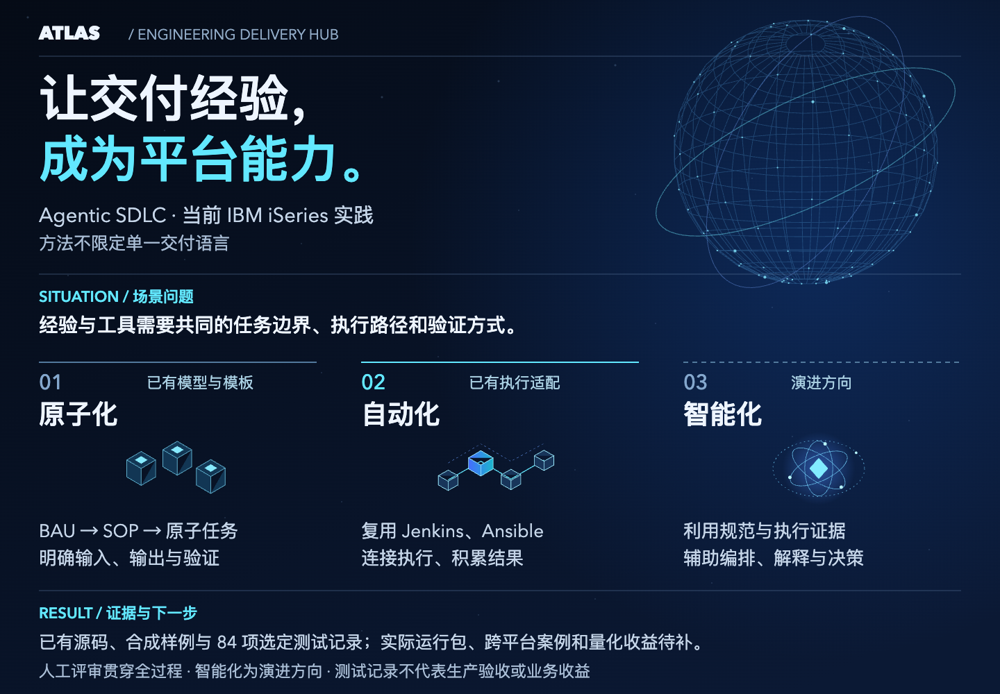
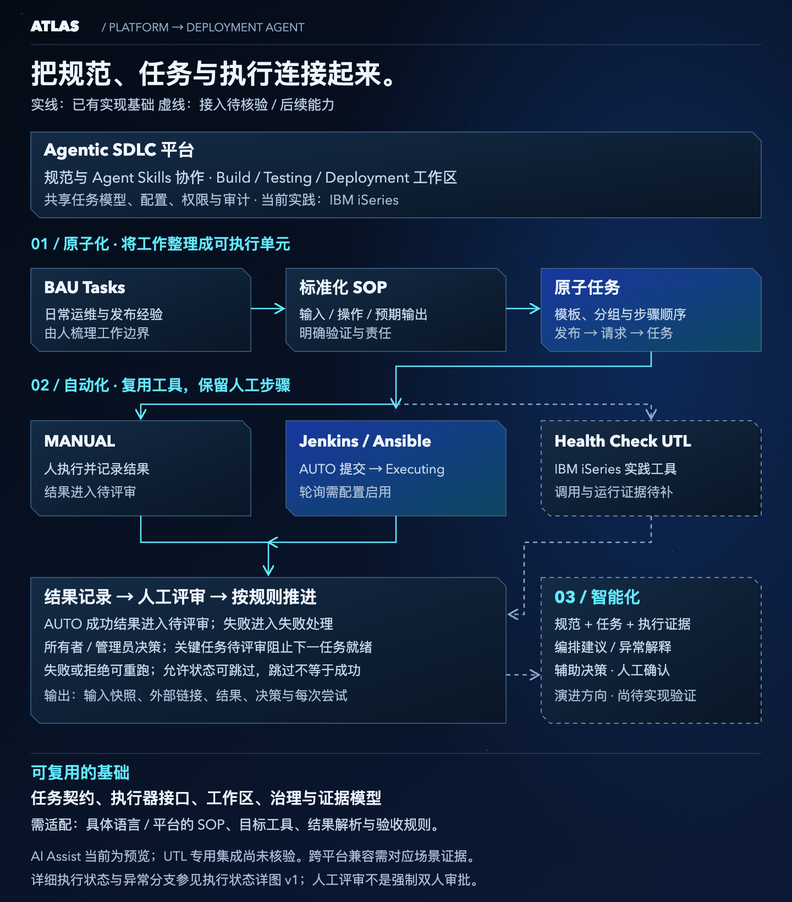

# Atlas Engineering Delivery Hub

[简体中文（默认）](README.md) · English

**A concrete Agentic SDLC practice: from atomization and automation toward intelligent delivery.**

Atlas Engineering Delivery Hub brings specifications, tasks, tool execution, human review and delivery evidence into one platform. It helps teams turn experience-dependent delivery activities into reusable, orchestratable and traceable workflows. **IBM iSeries is the current practice setting; the platform method is not restricted to one delivery language.**

The presentation first introduces the Agentic SDLC platform, then uses **Deployment Agent** to explain the progression from atomization to automation to intelligence. The project owner confirms the IBM iSeries practice background. Repository implementation, tests, examples and missing run evidence are distinguished in the [case index](docs/samples/README.md).



[Editable SVG](docs/assets/atlas-delivery-value-v3.svg) · [Matching HTML style preview (4 slides, Chinese)](docs/prototypes/atlas-immersive-tech-preview-v3.html) · [Full Chinese presentation (18 slides)](docs/atlas-engineering-delivery-hub-presentation-v2.html) · [Full narrative](docs/atlas-engineering-delivery-hub-pitch.md)

## Situation: how do existing experience and tools become an evolving delivery capability?

Teams already have business-as-usual operations (BAU tasks), operational knowledge, Jenkins pipelines and Ansible scripts. Reuse and orchestration require shared task boundaries, inputs, outputs and validation rules. When manual steps, results and approvals are disconnected, handoffs and exception handling require repeated context gathering.

The current entry point is IBM iSeries release practice: organize BAU activities and SOPs, then connect deployment, health checks and result validation into task workflows. Existing requirements and synthetic examples support the problem model; human effort and benefits remain to be measured.

## Solution: the platform supports Agentic SDLC; Deployment demonstrates three steps

In this project, SDD supplies constraints for requirements, specifications, design and acceptance. Agent Skills support development and documentation collaboration. Platform workspaces connect concrete tasks, external execution tools and human governance. Build, Testing, Deployment and shared services provide an implemented foundation, with lifecycle capabilities expanding according to their maturity.

| Step | How Deployment Agent illustrates it | Current foundation and direction |
|---|---|---|
| **Atomization** | BAU tasks → standardized SOPs → atomic tasks with inputs, actions, expected outputs, owners and validation requirements | Excel templates, task grouping/order and Release Flow → Request → Task exist; SOP analysis and decomposition still require human domain judgment |
| **Automation** | Reuse Jenkins pipelines and Ansible scripts for suitable tasks while retaining manual work and review | MANUAL/AUTO paths and Jenkins/AWX adapters exist; the practice narrative references IBM iSeries Health Check UTL, whose specific interface and end-to-end run evidence still need to be supplied |
| **Intelligence** | Use structured tasks and execution evidence to support orchestration recommendations, exception explanation and assisted decisions | Evolution direction; AI Assist is currently a preview, not verified operational intelligent orchestration or model-assisted decisions |

These are **capability-development steps**, not three runtime actions in every release. Atomization defines what tools execute and validate; automation supplies results and history; intelligence then has constraints and evidence to reason from. Human review, access controls and audit span the progression.



[Editable collaboration SVG](docs/assets/atlas-delivery-workflow-v3.svg) · [Current execution-state detail](docs/assets/atlas-delivery-workflow-v1.svg)

## Why is the approach reusable?

The platform models tasks, stages, inputs/outputs, execution targets, results and decisions rather than the syntax of a business programming language. Jenkins/AWX adapters, scoped configuration and human review provide a reuse foundation across technology stacks. The platform's Java/Vue implementation and the languages of the business systems it coordinates are different concerns.

IBM iSeries is the current starting point. Other languages and platforms can reuse the task contracts, workflows and governance, but their SOPs, executors and validation rules still need adaptation and evidence. Compatibility with arbitrary languages or platforms has not been established.

## Result: practice background, implementation and verification

| Level | Current conclusion |
|---|---|
| Practice background | The project owner confirms current IBM iSeries practice and a Deployment Agent presentation focus; a complete environment run package is not yet included here |
| Implemented | Multiple workspaces/shared governance; release intake, atomic task model, MANUAL/AUTO, human decisions, history, access controls and audit |
| Inspectable evidence | Original synthetic release/adoption examples; 84 selected tests passed in the preceding revision, exercising local workflows and mocked external calls; [test record](docs/00-context/atlas-delivery-showcase-verification-2026-09-07.md) |
| Evidence to add | IBM iSeries run packages, Health Check UTL interfaces and validation results, cross-platform reuse cases and repeated deliveries |
| Evolution and benefit | Intelligent orchestration and assisted decisions remain directions; no measured savings percentage is available; use the [measurement definitions](docs/samples/README.md#如何测量收益) |

Execution limits: AUTO submission is not job completion; polling defaults to disabled and requires configuration/enablement. Human-provided results are not independently verified. Owners/admins may decide; two-person approval is not enforced. Critical review blocks readiness of the next task, and skip is not execution success.

## Platform, Deployment and other-project boundaries

The platform serves delivery teams, engineering leads and platform maintainers with specification collaboration, task workspaces, execution connections and governance. Deployment Agent serves release coordinators, operators and reviewers by applying those mechanisms to SIT/UAT/PROD release tasks.

Deployment inputs are workbooks, stage, scope, owner, workflow identifier and execution configuration. Outputs are task states, results, attempts, external links and human decisions. It consumes upstream artifacts and validation evidence to govern release work; the wider platform objective does not imply that all lifecycle stages are already automated.

The existing [Deployment module entry](docs/atlas-engineering-delivery-hub-deployment-index.md) remains. Platform introduction and module deep dive are two levels of the same presentation; shared evidence is not counted twice. Other competition projects were not inspected, so their capabilities or integrations are not assumed.

## Local experience

Use JDK 21, Maven and Node.js/npm capable of running this Vite 5 toolchain. These are the real project commands; a universal Agent CLI is not required.

From the repository root:

```bash
mvn spring-boot:run -Dspring-boot.run.profiles=local
```

In another terminal (use the existing lockfile):

```bash
cd frontend
npm ci
npm run dev
```

Open the [local workspace](http://localhost:5173/wwa/deployment-agent). The local backend uses 8081 and the frontend proxy matches it; H2 data is in memory. The login page's guest entry provides a read-only preview. Mutations require configured local test identities and permissions; do not demonstrate using a real Staff ID.

The local authentication stub accepts a non-empty password for development only; this does not prove enterprise authentication compatibility. The presentation works as a local HTML file without starting the application or using Python. Windows 11 users can open it in a browser; Windows itself was not tested in this revision.

## Documentation and contribution

- [Documentation index](docs/atlas-engineering-delivery-hub-index.md): implementation references, module entry and SDD traceability.
- [Case index and template](docs/samples/README.md): original sources, versions, human involvement, checksums and validation limits.
- [Chinese submission](docs/open-collaboration-submission.zh-CN.md) · [English submission](docs/open-collaboration-submission.md): personal fields left empty.
- [Contribution guide](CONTRIBUTING.md): cases, adapter contributions and verification rules.
- [Historical implementation baseline](docs/wwa-agent-workspace-hub-current-baseline.md): retained for reference; use this README and current configuration for details such as ports.

Next, run an authorized non-production release including failure and rerun, retaining inputs, raw outputs and human records. Measure comparable cases before claiming benefit. Extend the IBM iSeries practice with UTL-specific execution evidence, then expand platform reuse and intelligence.

Developer checks: `mvn test`; `npm run build` from the frontend directory; `node scripts/check-markdown-links.mjs` for documentation. Passing a check establishes only its own scope.
