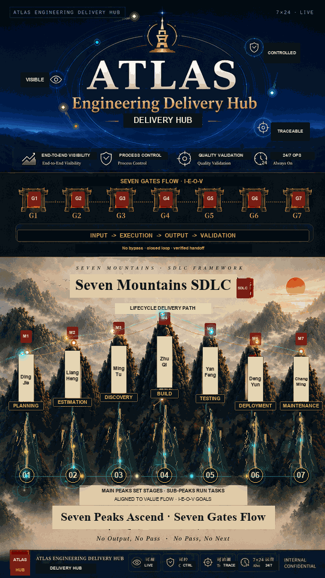

# Atlas Engineering Delivery Hub - Deployment

**Category:** Tool
**Lifecycle stage:** M6 Deployment
**Chinese README:** [README.zh-CN.md](README.zh-CN.md)

Atlas Engineering Delivery Hub - Deployment is the M6 Deployment-stage tool within the Atlas Engineering Delivery Hub. It helps teams convert validated delivery outputs into controlled, traceable release operations.

This repository contains the current WWA Agent Workspace Hub implementation baseline for release orchestration. The Deployment tool is one stage capability inside the larger Atlas Engineering Delivery Hub / Seven Mountains SDLC narrative; it is not the whole framework.





## Lifecycle Positioning

Seven Mountains SDLC:

```text
M1 Planning -> M2 Estimation -> M3 Discovery -> M4 Build -> M5 Testing -> M6 Deployment -> M7 Maintenance
```

This repo is **M6 Deployment**. It consumes upstream build and testing evidence and turns it into controlled SIT / UAT / PROD release operations with explicit human review, auditability, scoped access, and rollback-aware workflow records.

Related stage examples:

| Stage | Role in the Atlas narrative | Relationship to this repo |
|---|---|---|
| M3 Discovery | Turns business intent into requirements and design evidence. Atlas Phoenix Lens / Legacy Spec Factory is an upstream example. | Upstream source of release intent, not implemented here. |
| M4 Build | Produces build-stage work items and delivery artifacts. | Upstream evidence source; this repo also contains a Build Agent workspace in the shared platform baseline. |
| M5 Testing | Produces validation evidence and acceptance feedback. | Immediate upstream gate before release operations. |
| M6 Deployment | Packages, runs, reviews, and audits controlled release operations. | Primary project positioning for this competition entry. |
| M7 Maintenance | Feeds production learning, incidents, and improvements back into the lifecycle. | Downstream feedback target; production maintenance automation is planned/TBD. |

## Current Delivery Scope

Implemented today:

- Spring Boot backend and Vue 3 frontend for a controlled release workspace.
- Deployment Agent workspace under `/wwa/deployment-agent`.
- Deployment APIs under `/api/deployment-agent/*`.
- Excel-based release request onboarding using the fixed `AMH_HCC_task` worksheet.
- Stage-aware release flow tracking for `SIT`, `UAT`, and `PROD`.
- Request and task lifecycle management with manual run, auto submission, result recording, review decisions, rerun, skip, fail, archive, restore, and purge controls.
- Human-in-the-loop decision gates before downstream progression.
- Execution history for task attempts, including external job and log links.
- AUTO submission adapters for Jenkins and Ansible/AWX, with configuration-driven endpoints and credentials.
- Optional external execution polling support in code, disabled by default in current configuration.
- Scoped access governance through local Access Grants.
- Audit logs with release flow, request, task, application, SNOW group, agent, and correlation context.
- Platform shared services for authentication, access management, configuration, audit, template download, and reusable workflow UI.

Not claimed as complete production capability:

- Full autonomous release approval is out of scope; decisions are human-controlled in the current baseline.
- Real enterprise Team Book rollout is future work; local/test flows use the provider abstraction and stub users.
- Template authoring/storage is partially frontend-local today; template-based rundown creation is implemented.
- Callback-based AUTO completion ingestion is not the primary current model.
- Maintenance-stage incident routing and long-running operations feedback loops are planned/TBD.
- This package does not include internal screenshots, customer data, kubeconfigs, real credentials, or production environment names.

## Main Capabilities

| Capability | What it does | Evidence in this repo |
|---|---|---|
| Release onboarding | Accepts an Excel file, explicit stage, release identifier, and optional runtime scope. | Upload controllers, import services, template download, parser tests. |
| Release flow tracking | Groups release work into Release Flow -> Request -> Task records across SIT / UAT / PROD. | Release flow domain, controllers, frontend summary/detail views. |
| Human review gates | Requires explicit Approve / Reject / Rerun / Skip decisions instead of silently advancing after execution. | Decision engine, task state machine, progression service, decision dialogs. |
| Manual execution support | Lets owners/admins start a manual task and record the execution result. | Task service, record-result service, execution history. |
| AUTO execution support | Submits AUTO tasks to Jenkins or Ansible/AWX through configured adapters. | Auto execution service, execution target resolver, Jenkins/Ansible adapters. |
| Release safety controls | Supports archive/restore/purge, mark failed, rerun attempts, status recomputation, and audit records. | Release flow service, audit logger, request/task state tests. |
| Scoped governance | Enforces deny-by-default product access, roles, permissions, and `Application + SNOW Group` visibility. | Access grants, auth service, security filters, access management UI. |
| Traceability | Keeps audit logs, task execution history, import metadata, SDD documents, and sample package artifacts. | Docs, migrations, tests, audit and execution tables. |

## Inputs And Outputs

Primary inputs:

- Upstream release intent and validated delivery evidence from M4 Build and M5 Testing.
- Excel upload based on the downloadable task template.
- Upload-time stage: `SIT`, `UAT`, or `PROD`.
- Optional workflow identifier / release ID for grouping stage attempts.
- Optional `Application`, `SNOW Group`, and agent context.
- Task execution type: `MANUAL` or `AUTO`.
- Human decisions and result notes from task owners or DevOps admins.
- Jenkins / Ansible target metadata stored in task input parameters.

Primary outputs:

- Release Flow summary rows with stage status and current stage.
- Stage-scoped Requests with rundown owner, runtime scope, and archive state.
- Ordered Tasks with status, input parameters, expected output, result summary, and execution history.
- External execution references such as job URL and log URL when AUTO tasks are submitted.
- Audit records for upload, edits, execution, decisions, access changes, and lifecycle actions.
- Outbox event rows for future downstream notification dispatch.
- SDD and competition-package documents for reviewers and contributors.

## Deployment Workflow



1. A release operator uploads the task workbook or creates a rundown from a template.
2. The user explicitly selects `SIT`, `UAT`, or `PROD`; stage is not trusted from the spreadsheet.
3. The backend validates and imports rows into a Release Flow, Request, and Task set.
4. The first eligible task becomes runnable.
5. A task owner or DevOps admin starts manual execution or submits AUTO execution.
6. Manual results are recorded by the user; AUTO submissions store external job metadata and may be polled when monitoring is enabled.
7. A human review decision approves, rejects, reruns, or skips the task.
8. Progression logic promotes the next task or advances/completes the release flow.
9. Audit logs and execution history preserve who did what, when, and under which release context.
10. Failed, rejected, archived, or rollback-needed work stays visible through controlled state and history instead of being silently overwritten.

## Upstream And Downstream Flow



The Deployment tool is intended to sit after build and testing gates:

- **Input:** build artifact references, task manifests, test evidence, release scope, owners, and approval context.
- **Execute:** staged release rundown across SIT / UAT / PROD with manual and AUTO task execution.
- **Output:** release records, task results, external execution links, approvals, audit history, and failed/rollback state.
- **Validate:** human review, traceable decisions, status recomputation, audit inspection, and post-release feedback into M7 Maintenance.

## Quick Start

Backend:

```bash
mvn spring-boot:run -Dspring-boot.run.profiles=local
```

Frontend:

```bash
cd frontend
npm install
npm run dev
```

Open:

```text
http://localhost:5173/wwa/deployment-agent
```

Local/test stub users are documented in [the preserved implementation baseline](docs/wwa-agent-workspace-hub-current-baseline.md). In local mode, any non-empty password works for the configured stub authentication provider.

## Example Release Flow

Synthetic demo story:

1. M4 Build produces a candidate package and build evidence.
2. M5 Testing records validation evidence and known acceptance notes.
3. The release operator opens Deployment Agent and uploads a sanitized task workbook for `SIT`.
4. The tool creates or updates a release flow and promotes the first deployment task.
5. Task owners run manual steps or submit AUTO tasks to configured Jenkins/Ansible targets.
6. A reviewer approves each completed task after checking the result and expected output.
7. The same workflow identifier is reused for `UAT` and `PROD` uploads so stage attempts stay linked.
8. If a task fails, the team records failure, reruns or rejects as needed, and keeps the audit/execution history.
9. After PROD approval, the release record becomes maintenance-ready evidence for downstream operations.

See the sanitized sample package at [docs/samples/atlas-deployment-tool-mini-output](docs/samples/atlas-deployment-tool-mini-output/README.md).

## Directory Overview

| Path | Purpose |
|---|---|
| `src/main/java/com/wwa/agenthub/agents/deployment/` | Deployment Agent stage vocabulary and REST controllers. |
| `src/main/java/com/wwa/agenthub/domain/` | Shared release flow, task, decision, execution, audit, auth, configuration, and import services. |
| `src/main/java/com/wwa/agenthub/platform/` | Shared platform contracts and security boundaries used by all agent workspaces. |
| `src/main/resources/db/migration/` | Oracle migration history and schema evolution. |
| `frontend/src/agents/deployment/` | Deployment workspace entry, API client, summary, and detail views. |
| `frontend/src/platform/` | Shared frontend release-flow workspace factory and platform components. |
| `docs/` | SDD artifacts, architecture/design references, competition materials, diagrams, and samples. |
| `scripts/check-markdown-links.mjs` | Lightweight relative-link validation for Markdown docs. |

## Key Documents

- [Deployment tool documentation index](docs/atlas-engineering-delivery-hub-deployment-index.md)
- [Open collaboration submission](docs/open-collaboration-submission.md)
- [Chinese submission](docs/open-collaboration-submission.zh-CN.md)
- [Deployment pitch](docs/atlas-engineering-delivery-hub-deployment-pitch.md)
- [Contribution guide](CONTRIBUTING.md)
- [Current implementation baseline](docs/wwa-agent-workspace-hub-current-baseline.md)
- [Deployment Agent requirement baseline](docs/01-requirements/requirement.md)
- [Deployment Agent spec baseline](docs/03-spec/spec.md)
- [Platform and Deployment architecture](docs/04-architecture/architecture.md)
- [Detailed design baseline](docs/05-design/design.md)
- [M6 packaging traceability](docs/00-context/atlas-engineering-delivery-hub-deployment-traceability.md)

## Approval, Traceability, Rollback, And Review Notes

- **Approval:** Current task progression requires human decisions. The MVP decision gate is manual by design.
- **Traceability:** Release flows, requests, tasks, execution history, audit logs, correlation IDs, and SDD artifacts form the trace chain.
- **Rollback / recovery posture:** The tool does not claim one-click infrastructure rollback. It supports failed state marking, rerun, reject, archive/restore, purge controls, and history retention so teams can execute documented rollback or remediation procedures.
- **Validation:** Upload validation, state-machine checks, role checks, boundary guards, and tests protect the workflow. Human review remains mandatory for release decisions.
- **Secret safety:** Credentials belong in configuration/secret management, not in docs, samples, screenshots, or committed workbooks.

## Roadmap

- Add clearer upstream evidence ingestion contracts from Build and Testing stages.
- Complete backend-backed template management for reusable deployment runbooks.
- Expand AUTO execution monitoring and callback ingestion after environment-specific verification.
- Add notification dispatchers over the existing transactional outbox seam.
- Add maintenance-stage feedback templates for incident, rollback, and post-release learning.
- Add approved, redacted demo screenshots only after explicit review.
- Continue improving SDD and documentation validation automation.

## Verification

Recommended documentation/package checks:

```bash
git diff --check
node scripts/check-markdown-links.mjs
```

Runtime checks for code changes:

```bash
mvn test
cd frontend && npm run build
```
