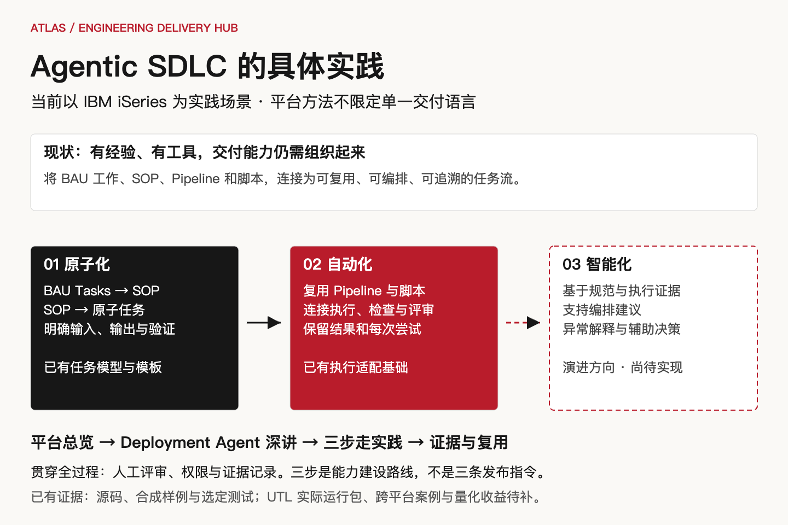
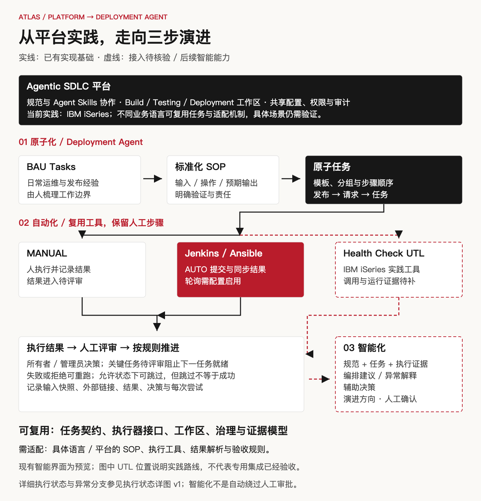

# Atlas Engineering Delivery Hub

简体中文（默认） · [English](README.en.md)

**Agentic SDLC 的具体实践：从原子化、自动化，走向智能化交付。**

Atlas Engineering Delivery Hub 将规范、任务、工具执行、人工评审与交付证据组织在同一个平台中，让团队逐步把依赖经验的交付活动变成可复用、可编排、可追溯的工作流。**当前以 IBM iSeries 为实践场景，平台方法不限定单一交付语言。**

介绍顺序是：先看平台如何承载 Agentic SDLC，再以 **Deployment Agent** 深入说明“原子化 → 自动化 → 智能化”的演进。IBM iSeries 实践背景由项目方确认；仓库中已有的实现、测试和样例，以及尚待补充的运行证据，分别列在[案例与证据索引](docs/samples/README.md)。



[可编辑 SVG](docs/assets/atlas-delivery-value-v2.svg) · [中文路演 v2](docs/atlas-engineering-delivery-hub-presentation-v2.html)（离线打开） · [完整讲稿](docs/atlas-engineering-delivery-hub-pitch.md)

## Situation：已有经验和工具，怎样形成可持续演进的交付能力？

团队已有日常运维与发布任务（BAU Tasks）、操作经验、Jenkins Pipeline 和 Ansible 脚本，但这些资产需要共同的任务边界、输入输出和验证方式，才能被稳定复用和编排。人工步骤、执行结果与审批分散时，交接和异常处理还需要反复补齐上下文。

当前以 IBM iSeries 发布实践切入：先梳理 BAU 工作和 SOP，再把部署、健康检查与结果验证组织成任务流。已有需求和合成样例支撑这一问题模型；具体人工成本及收益尚待测量。

## Solution：平台承载 Agentic SDLC，Deployment 展示三步走

在本项目中，SDD 为需求、规范、设计与验收提供约束；Agent Skills 支持开发和文档协作；平台工作区连接具体任务、外部执行工具与人工治理。Build、Testing、Deployment 和共享服务提供已有实现基础，各阶段按实际成熟度逐步扩展。

| 演进步骤 | Deployment Agent 中怎样体现 | 当前基础与后续方向 |
|---|---|---|
| **原子化** | BAU Tasks → 标准化 SOP → 明确输入、操作、预期输出、所有者与验证要求的原子任务 | 已有 Excel 模板、任务分组/顺序及 Release Flow → Request → Task 模型；SOP 梳理与拆分仍需要人的领域判断 |
| **自动化** | 复用 Jenkins Pipeline、Ansible 脚本，将适合自动执行的任务交给执行器，保留人工步骤与评审 | 已有 MANUAL/AUTO 路径和 Jenkins/AWX 适配；实践介绍涉及 IBM iSeries Health Check UTL，其专用接口与端到端运行证据待补充 |
| **智能化** | 在结构化任务与执行证据之上，逐步支持任务编排建议、异常解释和辅助决策 | 演进方向；现有 AI Assist 是预览占位，尚未证明智能编排或模型辅助决策已运行 |

三步走是**能力建设路线**，不是一次发布只有三个操作步骤。原子化让工具知道要执行和验证什么，自动化产生可积累的结果与历史，智能化才有明确约束和可引用的依据。人工评审、权限与审计贯穿全过程。



[可编辑协作 SVG](docs/assets/atlas-delivery-workflow-v2.svg) · [当前执行状态详图](docs/assets/atlas-delivery-workflow-v1.svg)

## 为什么具有通用性？

平台抽象的是任务、阶段、输入输出、执行目标、结果和决策，而不是某种业务语言的语法。Jenkins/AWX 的任务适配、范围配置和人工评审机制，为不同技术栈复用提供了基础。平台自身使用 Java/Vue，与它所组织交付的业务系统语言是两个层次。

IBM iSeries 是当前落地起点。迁移到其他语言或平台时，可复用任务契约、工作流和治理机制，但仍要适配具体 SOP、执行器及验证规则，并补充对应案例；目前不声称任意语言或平台已经验证兼容。

## Result：实践背景、实现和验证分别说明

| 层次 | 当前结论 |
|---|---|
| 实践背景 | 项目方确认当前基于 IBM iSeries 实践，并以 Deployment Agent 作为重点展示；这不等于仓库已收录完整环境运行包 |
| 已实现 | 多工作区与共享治理；发布清单导入、原子任务模型、MANUAL/AUTO、人工决策、执行历史、访问控制和审计 |
| 可复核证据 | 原有合成发布/采用样例；上一轮 84 项选定测试通过，覆盖局部工作流与模拟外部调用，见[测试记录](docs/00-context/atlas-delivery-showcase-verification-2026-09-07.md) |
| 尚待补充 | IBM iSeries 实际运行包、Health Check UTL 接口与验证结果、跨平台复用案例、重复交付记录 |
| 演进与收益 | 智能编排与辅助决策仍为方向；暂无可引用的实测节省比例，按[测量口径](docs/samples/README.md#如何测量收益)开展对照 |

执行边界：AUTO 提交成功不等于作业完成；轮询默认关闭，正确配置并启用后才同步外部状态。人工结果不自动验真；所有者或管理员可决策，当前没有强制双人审批。关键任务待评审会阻止下一任务就绪，跳过不等于执行成功。

## 平台、Deployment 与其他项目的边界

平台面向组织交付流程的团队、工程负责人和平台维护者，提供规范协作、任务工作区、执行连接与治理基础。Deployment Agent 面向发布负责人、执行者和评审人员，将这些能力落实到 SIT/UAT/PROD 发布任务。

Deployment 的输入是任务工作簿、阶段、范围、所有者、流程标识和执行配置；输出是任务状态、结果、执行尝试、外部链接与人工决策记录。它接收上游产物和验证依据，治理发布过程；平台的更广目标不代表全部阶段已完成自动化交付。

现有 [Deployment 模块入口](docs/atlas-engineering-delivery-hub-deployment-index.md)继续保留。平台介绍与模块深讲是同一展示的两个层次，共用证据不重复计算成果；其他参赛项目未纳入本次检查，不推定其能力或集成关系。

## 本地体验

需要 JDK 21、Maven，以及能运行当前 Vite 5 工具链的 Node.js/npm。以下是实际项目命令，不需要通用 Agent CLI。

在仓库根目录启动后端：

```bash
mvn spring-boot:run -Dspring-boot.run.profiles=local
```

另开终端启动前端（已有锁文件时使用 `npm ci`）：

```bash
cd frontend
npm ci
npm run dev
```

打开 [本地工作台](http://localhost:5173/wwa/deployment-agent)。local 后端为 8081，前端代理与之匹配；H2 为内存数据。首次可使用登录页的访客入口只读浏览。写操作需要本地配置的测试身份与权限，不能用真实 Staff ID 演示。

本地认证桩接受非空密码，仅用于开发；不是企业认证兼容证明。路演无需启动应用，直接打开单文件 HTML 即可，Windows 11 可用浏览器打开；尚未在 Windows 实机验证。

## 文档与参与

- [文档总索引](docs/atlas-engineering-delivery-hub-index.md)：技术参考、模块入口、SDD 追踪。
- [案例索引与模板](docs/samples/README.md)：原始来源、版本、人工介入、校验值和验证边界。
- [中文报名材料](docs/open-collaboration-submission.zh-CN.md) · [English submission](docs/open-collaboration-submission.md)：个人字段留空。
- [贡献指南](CONTRIBUTING.md)：新增案例、执行器适配和验证约定。
- [历史实现基线](docs/wwa-agent-workspace-hub-current-baseline.md)：保留参考，运行端口等旧说明以本页和配置为准。

下一步先在获授权的非生产环境跑通包含失败与重跑的发布流程，保留输入、原始输出和人工记录；再用多个同等复杂度案例测量收益。在 IBM iSeries 实践基础上补全 UTL 专用执行证据，再逐步扩展平台复用和智能化能力。

开发校验：`mvn test`；前端目录执行 `npm run build`；文档执行 `node scripts/check-markdown-links.mjs`。任何检查通过都只代表对应范围。
