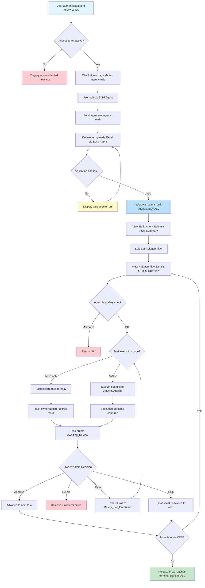

# Feature Specification: Build Agent MVP

> **Source stories:** BA-01 through BA-06
> **Spec status:** Draft (v3, aligned with `build-agent-architecture.md` v3)
> **Last updated:** 2026-04-11
> **Supersedes:** v2 (2026-04-10). v2 proposed "surgical shared-contract changes" (extend `Stage` enum with `DEV`, extend `ReleaseFlowFamilyKey` regex, add `devStatus`/`devPresent` fields to `ReleaseFlowListItemDto`, keep Deployment Agent as the global view). v3 replaces those with a platform-layer refactor that isolates stage vocabulary per Agent Module. See `build-agent-architecture.md` §"Why v3 Exists" and §"Spec Delta" for the rationale and the exhaustive list of reversed statements.

---

## 1. Overview

### 1.1 Feature Summary
Build Agent is the first **Agent Module** delivered under WWA's new multi-agent architecture. It provides the same human-in-the-loop controlled execution workflow as Deployment Agent and Testing Agent, but scoped to **development-phase build activities**. Build Agent reuses the existing release-flow *domain shape* (`ReleaseFlow → Request → Task → TaskExecutionHistory`) via Platform Core services, while owning its own stage vocabulary (`BuildStage { DEV }`), its own `StagePipeline` bean, its own controllers, and its own frontend store/views. Data isolation between agents is enforced by the `Request.agent` column **plus** a Platform-Core-level `AgentBoundaryGuard` invoked by every Agent Module's controllers.

Build Agent is delivered alongside a Platform Core refactor that moves stage vocabulary, stage ordering, and stitching out of shared contracts and into per-agent modules. Deployment Agent and Testing Agent are migrated into the same Agent Module pattern in the same delivery so that the codebase reaches a consistent end state. The refactor and its decisions are documented in `build-agent-architecture.md` §Architecture Decisions (PL-1 through PL-11 and BA-1 through BA-3).

### 1.2 Business Objective
Provide a dedicated build workspace within WWA that enables development teams to manage build workflows in the DEV phase separately from integration testing, UAT, and deployment workflows, while reusing the proven Deployment Agent execution model and establishing a scalable Agent Module pattern for the 4th through 10th agents that will follow.

### 1.3 SDLC Positioning
Build Agent owns the **DEV** stage of the SDLC chain. Together with the existing agents, the SDLC coverage is:

```
DEV (Build Agent) → SIT (Deployment Agent) → UAT (Deployment Agent + Testing Agent) → PROD (Deployment Agent)
```

`DEV` is a **terminal single-stage** scope for Build Agent. A Build Agent release flow never auto-advances out of `DEV`; there is no implicit promotion from `DEV` to `SIT`. If the same release later enters the SIT/UAT/PROD chain, that happens via a separate upload through Deployment Agent. The two resulting persisted flows are **not stitched by Build Agent** — stitching is Deployment Agent's internal business logic (see `build-agent-architecture.md` PL-5) and is not visible to Build Agent users. A user who wants to see the full DEV → SIT → UAT → PROD family either switches to Deployment Agent manually, or waits for the platform-level Global View (a known follow-up, tracked as R-04 in the architecture).

### 1.4 MVP Objective
Deliver a fully functional Build Agent workspace with:

**Same workflow as Deployment/Testing Agent + Agent Module isolation (per-agent stage vocabulary, controllers, store/views, StagePipeline) + Data isolation via `agent` column and `AgentBoundaryGuard` + Single terminal `DEV` stage scope**

### 1.5 In-Scope Outcome
The MVP shall support the following capabilities:

1. Access Build Agent workspace within WWA navigation and home page
2. Upload build requests through the same Excel template with automatic `agent = "build-agent"` tagging and forced `stage = "DEV"`
3. Create or update Release Flow records from imported request data (reused from Platform Core `ImportService`)
4. Monitor Build Agent-scoped Release Flow progress restricted to the `DEV` stage
5. View selected Release Flow details within the Build Agent context
6. View task-level execution details, results, and take actions within Build Agent (with agent boundary enforcement on all task mutations and all ID-bearing reads)
7. Record Build Agent actions in the shared audit log with `agentName = "build-agent"` (derived dynamically from the request scope, not hardcoded)
8. Access Build Agent using existing access grants (shared access model; no agent dimension added to `AccessScope`)

### 1.6 Out of Scope
- Build-specific domain logic (artifact versioning, compile-time analysis, dependency graphs)
- Build-specific Excel template fields
- Build-specific task types or execution adapters
- Build-specific dashboards or metrics
- Integration with external build platforms beyond the existing Jenkins/Ansible adapters
- Agent-specific access grants or role definitions
- Multi-stage build pipelines (compile → package → publish as separate stages in Build Agent)
- Build artifact storage or registry integration
- Platform-level Global View (cross-agent flow listing for DevOps admins / auditors) — acknowledged as a needed capability, deferred to a follow-up delivery (architecture R-04)
- Backfill migration of legacy `Request` rows with `agent IS NULL` — they remain in the database untouched and become visible again only when the Global View ships
- Soft-cutover route aliases between v2 `/api/deployment-agent/*` platform capability routes and v3 `/api/platform/*` — the cutover is hard (architecture §API Boundaries / Cutover Strategy)

---

## 2. Source Stories

| Story ID | Title | Capability |
|---|---|---|
| BA-01 | Access Build Agent workspace within WWA navigation | Workspace navigation |
| BA-02 | Upload build request via Excel file with agent tagging | Request upload with agent + stage isolation |
| BA-03 | View Build Agent release flow summary with agent-scoped data isolation | Agent-scoped monitoring |
| BA-04 | Record Build Agent actions in shared audit log | Audit traceability |
| BA-05 | Access Build Agent with existing access grants | Shared access model |
| BA-06 | View Build Agent release flow details and manage tasks | Task management |

---

## 3. Actors

### 3.1 Primary Actors
Same as Deployment Agent and Testing Agent — all actor definitions apply identically:

- **Developer** — uploads build requests, views Release Flow and task status
- **Tech Lead (TL)** — reviews results, participates in release execution
- **Task Owner** — edits task input, starts tasks, records results, makes decisions
- **DevOps Admin** — maintains configuration, manages access grants, can override owner-based controls
- **Audit / Management User** — views audit logs

### 3.2 Supporting Actors
Same as Deployment Agent:

- **Authentication System** — provides enterprise identity context
- **Access Grant Store** — resolves access status, roles, and metadata
- **Execution Integrations** — Jenkins, Ansible
- **Audit Storage** — persists audit records

---

## 4. Terminology

All terms from the Deployment Agent and Testing Agent specs apply. Additional terms introduced by v3:

- **Agent Module**: A self-contained package owning one agent's controllers, Stage enum, `StagePipeline` bean, and frontend store/views. Backend location: `com.wwa.deploymentagent.agents.<name>/`. Frontend location: `frontend/src/agents/<name>/`. Agent Modules depend only on Platform Core; they do not depend on each other.
- **Platform Core**: The stage-agnostic, agent-agnostic substrate shared by all Agent Modules. Contains `TaskService`, `ReleaseFlowService` (list/get only — stitching is not in platform), `DecisionEngine`, `ReleaseFlowProgressionService`, `ImportService`, `AutoExecutionService`, `AuditLoggerService`, security filters, `AgentBoundaryGuard`, and frontend composables (`createAgentWorkspace`, `UploadDialog`).
- **Agent Identifier**: A String value (`"deployment-agent"`, `"testing-agent"`, `"build-agent"`) stored on the `Request.agent` column that determines which Agent Module owns the row. Defined by `AgentId` constants (backend) and `frontend/src/config/agentId.ts` (frontend).
- **DEV Stage**: The SDLC stage preceding SIT, where developers write, build, and locally validate code. Owned exclusively by Build Agent and defined as `agents/build/domain/BuildStage.DEV`. DEV is terminal because `BuildStagePipeline.next("DEV")` returns `Optional.empty()`.
- **Stage Vocabulary**: The set of stage identifiers an Agent Module recognizes. Each Agent Module declares its own Stage enum (`DeploymentStage`, `TestingStage`, `BuildStage`). Platform Core never binds to a single closed Stage enum and stores `Request.stage` as a `String` at the persistence layer.
- **StagePipeline**: A per-agent `@Component` implementing a common Platform Core interface. Encodes the stage ordering within one agent (e.g. `DeploymentStagePipeline` → `SIT → UAT → PROD`) and reports its `agentId()`. Platform Core resolves the right pipeline at call time via `StagePipelineRegistry`; controllers never pass pipelines as method parameters. Unknown stages throw `IllegalArgumentException` (fail-loud).
- **StagePipelineRegistry**: A Platform Core `@Component` that injects every `StagePipeline` at startup and builds an immutable `agentId → pipeline` map. `ReleaseFlowProgressionService` uses it to resolve the right pipeline from `request.getAgent()`. Missing-agent lookup throws `IllegalStateException`.
- **Agent-Scoped Filtering**: The mechanism by which list and summary operations return only data matching the current agent's identifier. In v3, this applies uniformly to Deployment Agent, Testing Agent, and Build Agent — Deployment Agent is no longer an implicit global view.
- **Agent Boundary Enforcement**: Platform Core component (`AgentBoundaryGuard`) invoked by every Agent Module's controllers on ID-bearing endpoints. Rejects operations when the target task, request, or flow does not belong to the current agent. Returns HTTP 404 (not 403) to avoid leaking IDs across namespaces.
- **Stitched Summary / Stitched Detail** (Deployment Agent only): In-memory grouping of Persisted Release Flows that share a normalized family key. Implemented in `agents/deployment/domain/DeploymentStitchingService`. Testing Agent and Build Agent do not stitch.
- **Release Flow Family Key**: A stage-neutral normalized release identifier computed by `ReleaseFlowFamilyKey`. Recognizes only Deployment Agent's stage tokens (`sit`, `uat`, `prod`) and is invoked only by `DeploymentStitchingService`. It is not a platform concept.
- **Platform API Prefix (`/api/platform/*`)**: New in v3. Hosts the shared capability routes (`/auth/*`, `/audit-logs`, `/config`, `/access-grants`, `/templates/*`) that were historically mounted under `/api/deployment-agent/*`. See §10.1.

---

## 5. Data Model

### 5.1 No New Tables, JPA Attribute Type Changes Only
Build Agent uses the same entity hierarchy as Deployment Agent and Testing Agent (`ReleaseFlow → Request → Task → TaskExecutionHistory`). **No new database tables, no new columns, no Flyway migration.**

The Platform Core refactor changes JPA attribute types on two columns, but the underlying DB column type is already `VARCHAR` on Oracle and H2 so the change is invisible to the database:

| Column | Old JPA type | New JPA type | DB column type | Migration |
|---|---|---|---|---|
| `Request.stage` | `Stage` enum (`@Enumerated(EnumType.STRING)`) | `String` | `VARCHAR` | None |
| `ReleaseFlow.currentStage` | `Stage` enum (`@Enumerated(EnumType.STRING)`) | `String` | `VARCHAR` | None |

Existing persisted values (`"SIT"`, `"UAT"`, `"PROD"`) remain valid and unchanged. Build Agent writes `"DEV"` to the same column alongside them.

### 5.2 Entity Relationships
Entity hierarchy is unchanged. The behavioral rules for Build Agent are:
1. `BuildUploadController` forces `agent = "build-agent"` and `stage = "DEV"` on all write operations, ignoring any client-supplied values.
2. `BuildReleaseFlowController` filters by `agent = "build-agent"` on all list operations.
3. All Build Agent controllers that accept a task, request, or flow ID invoke `AgentBoundaryGuard` before delegating to Platform Core services (§7.8).

### 5.3 Per-Agent Stage Vocabulary (Platform Refactor)
The shared `contracts/enums/Stage` enum is **removed**. Each Agent Module declares its own Stage enum inside its package:

- `agents/deployment/domain/DeploymentStage { SIT, UAT, PROD }`
- `agents/testing/domain/TestingStage { UAT }`
- `agents/build/domain/BuildStage { DEV }`

Platform Core services operate on `String stage` values. Each Agent Module's controller layer converts between the String and the module-local enum at the HTTP boundary. Two Agent Modules may legitimately persist the same stage String (e.g. `"UAT"` is both `DeploymentStage.UAT` and `TestingStage.UAT` as Java types); the `Request.agent` column is the authoritative disambiguator.

`BuildStage.DEV` is the only stage value Build Agent ever writes, and the only stage value it ever reads from the database (its queries are agent-scoped).

### 5.4 StagePipeline + StagePipelineRegistry
Stage ordering is encoded in per-agent `@Component` beans implementing the Platform Core interface:

```java
public interface StagePipeline {
    String agentId();                          // fail-loud routing key
    Optional<String> next(String currentStage); // throws IllegalArgumentException on unknown stage
    boolean isTerminal(String stage);            // throws IllegalArgumentException on unknown stage
    List<String> orderedStages();
}
```

Each Agent Module provides its own implementation:

- `DeploymentStagePipeline`: `agentId() = "deployment-agent"`, `SIT → UAT → PROD` (PROD terminal)
- `TestingStagePipeline`: `agentId() = "testing-agent"`, `UAT` only (UAT terminal)
- `BuildStagePipeline`: `agentId() = "build-agent"`, `DEV` only (DEV terminal)

A new Platform Core component `StagePipelineRegistry` injects every `StagePipeline` `@Component` at startup and builds an immutable `agentId → pipeline` map. It throws at startup on duplicate `agentId()` values and throws `IllegalStateException` from `forAgent(...)` on missing-agent lookup.

**`ReleaseFlowProgressionService.progressAfterDecision(String taskId)` signature is unchanged from v2.** The method gains one new constructor dependency (`StagePipelineRegistry`) and resolves the pipeline internally from `request.getAgent()`. All five existing call sites — `DecisionController`, `TestingAgentTaskController`, `RecordResultService`, `AutoExecutionService`, `ExternalExecutionMonitorService` — continue working without modification. An earlier v3 draft proposed threading `StagePipeline` as a method parameter through `progressAfterDecision` and up through its callers; that approach was rejected because `ExternalExecutionMonitorService` runs on a Jenkins/Ansible callback thread with no HTTP or agent ambient context. See `build-agent-architecture.md` PL-4 for the full rationale.

A Build Agent release flow completing its last task is marked `Completed` by the existing terminal-stage branch, which now uses `pipeline.isTerminal(currentStage)` instead of `currentStage.next() == null`. No other logic changes.

### 5.5 Stitching Is Deployment Agent's Business Logic (Not a Platform Capability)
`ReleaseFlowFamilyKey`, `listStitchedSummaries`, and `getStitchedDetail` move out of Platform Core and into `agents/deployment/domain/DeploymentStitchingService`. The family-key regex recognizes only Deployment Agent's stage tokens (`sit`, `uat`, `prod`); it is not extended to recognize `dev` or any future stage token.

**Consequences for Build Agent:**
- Build Agent does not have a stitched summary view. Its summary lists Persisted Release Flows in a flat, un-grouped manner.
- Build Agent does not have a stitched detail view. Its detail endpoint does not accept the `?linked=<ids>` query parameter used by Deployment Agent.
- A user who wants to see `DEV → SIT → UAT → PROD` for a single underlying release either switches between agent workspaces manually, or waits for the platform-level Global View (R-04 in the architecture).

**Consequences for Testing Agent:**
- Testing Agent today calls `listStitchedSummaries` by accident of code sharing. In v3 it migrates to the platform `listByAgent` method. Because Testing Agent is UAT-only, stitching had no visible effect today — the migration is a pure refactor.

### 5.6 ReleaseFlowListItemDto Uses Generic Stage Maps (Platform Refactor)
`ReleaseFlowListItemDto` replaces its fixed positional fields (`sitStatus`, `uatStatus`, `prodStatus`, `sitPresent`, `uatPresent`, `prodPresent`) with:

```java
Map<String, RequestStatus> stageStatuses   // key = stage String, e.g. "SIT", "UAT", "DEV"
Set<String> stagesPresent
```

Only stages that actually have requests on a given flow appear in the map and set. Each agent's frontend reads `stageStatuses` using its own known stage keys; adding a new stage to any agent in the future never requires touching this DTO again.

### 5.7 Agent Column Usage

| Operation | Deployment Agent | Testing Agent | Build Agent |
|---|---|---|---|
| Upload / Import | Sets `Request.agent = "deployment-agent"` | Sets `Request.agent = "testing-agent"` | Sets `Request.agent = "build-agent"`, forces `stage = "DEV"` |
| List Release Flows | Scoped to `agent = "deployment-agent"`. Legacy null-agent rows are **invisible** until the Global View ships. | Scoped to `agent = "testing-agent"` | Scoped to `agent = "build-agent"` |
| View Detail | Validates flow contains deployment-agent requests via `AgentBoundaryGuard` | Validates flow contains testing-agent requests via `AgentBoundaryGuard` | Validates flow contains build-agent requests via `AgentBoundaryGuard` |
| Task Mutations | **Owner/admin check AND agent boundary check** (PL-9 extends this to all agents in v3) | **Owner/admin check AND agent boundary check** (closes v2 R-08) | **Owner/admin check AND agent boundary check** |
| Audit Logging | `agentName = "deployment-agent"` derived from `scope.agent()` | `agentName = "testing-agent"` derived from `scope.agent()` | `agentName = "build-agent"` derived from `scope.agent()` |

**Change from v2:** Every row of this table now has a symmetric treatment across the three agents. Deployment Agent no longer has an implicit global scope, no longer lacks agent boundary enforcement, and no longer hardcodes its audit `agentName` to `"deployment-agent"` regardless of the actual workspace.

### 5.8 Release Flow Identity Model (Unchanged from Current Code)

The `DA_RELEASE_FLOW` table retains its current uniqueness model:

- Unique key: `(project_id, normalized_release_id)` — **global across all agents**, not agent-scoped
- `ReleaseFlow` does **not** have an `agent` column, and does not gain one in v3
- `ImportService.findOrCreateReleaseFlowByIdentifier` looks up by `(projectId, normalizedReleaseId)` and reuses the existing row when present (upsert semantics)

**Agent partitioning of ReleaseFlow rows is a runtime consequence of stage-prefix generation**, not a schema invariant:

- Deployment Agent generates release IDs like `sit-<project>-0001`, `uat-<project>-0001`, `prod-<project>-0001`
- Testing Agent generates `uat-<project>-0001` (same normalization would collide with Deployment Agent UAT — see below)
- Build Agent generates `dev-<project>-0001`

Under current ImportService behavior, a second Build Agent upload with the same DEV release identifier **updates the existing Build Agent ReleaseFlow row** (appending new Requests as children). It does **not** create a second row. This matches Deployment Agent's current behavior for repeat SIT/UAT/PROD uploads.

**"One Release Flow belongs to one agent" is a runtime invariant**, enforced by three layers:
1. Stage-prefix partitioning in `ReleaseFlowService.create` (each agent's generated release IDs normalize to distinct strings per agent).
2. Controllers forcing the agent on every write path.
3. Each Agent Module's private Stage enum vocabulary — Build Agent controllers cannot accept a `"SIT"` stage because `BuildStage` does not declare it.

The schema does not prevent a ReleaseFlow from having Requests with mixed `agent` values; the runtime mechanisms above ensure it never happens in practice.

**Why not strict agent-scoped uniqueness:** An alternative considered was to add an `agent` column to `ReleaseFlow` and change the unique key to `(project_id, normalized_release_id, agent)`. Rejected because (a) the current stage-prefix mechanism already partitions effectively, (b) a Flyway migration plus 7–10 repository signature changes has a non-trivial cost, and (c) the stricter model's only defense is against a hypothetical future where two agents share a stage prefix. Discipline at the `StagePipeline` declaration layer is a cheaper control. See `build-agent-architecture.md` §Data Architecture for the full rationale.

---

## 6. Functional Scope

### 6.1 Capability Domains

Build Agent introduces functional requirements in these domains:

1. **Workspace Navigation** — Build Agent entry in home page and flyout
2. **Request Upload** — Upload with agent tagging and forced `DEV` stage
3. **Release Flow Summary** — Agent-scoped filtering with `DEV`-only stage dimension
4. **Release Flow Details** — Agent-scoped detail view with single `DEV` stage tab
5. **Task Management** — Full task lifecycle within Build Agent namespace
6. **Audit Logging** — Agent-identified audit entries
7. **Access Authorization** — Shared access model
8. **Agent Boundary Enforcement** — Platform-Core-level guard invoked by every Agent Module's controllers

### 6.2 Platform Refactor (Prerequisite for Build Agent)

Build Agent cannot be delivered as a standalone feature. Its delivery includes a Platform Core refactor that reshapes the substrate all three agents run on. The full refactor scope and the rationale are described in `build-agent-architecture.md` §Architecture Decisions (PL-1 through PL-11). For this spec, the relevant effects are:

- `contracts/enums/Stage` is **removed**. Each Agent Module declares its own Stage enum (§5.3).
- `StagePipeline` is introduced as a platform interface; each Agent Module provides an implementation (§5.4).
- `ReleaseFlowFamilyKey` and stitching move from Platform Core into `agents/deployment/domain/DeploymentStitchingService` (§5.5).
- `ReleaseFlowListItemDto` replaces positional per-stage fields with a generic `Map<String, RequestStatus>` (§5.6).
- Deployment Agent and Testing Agent migrate into the Agent Module package structure (`com.wwa.deploymentagent.agents.<name>/` backend, `frontend/src/agents/<name>/` frontend).
- Platform capability routes (`/auth/*`, `/audit-logs`, `/config`, `/access-grants`, `/templates/*`) move from `/api/deployment-agent/*` to a new `/api/platform/*` prefix (§10.1).
- `AgentBoundaryGuard` is promoted to a Platform Core component used by every Agent Module (not just Build Agent as v2 originally scoped).
- `AuditLoggerService.log` derives `agentName` dynamically from `scope.agent()` (closes a pre-existing defect in Testing Agent).
- A frontend `createAgentWorkspace(config)` factory replaces the per-agent copy-pasted stores, API modules, and views.

### 6.3 Platform Core Services Reused Without Change

The following Platform Core services keep their business logic unchanged (only String vs enum parameter-type changes where applicable):

- `TaskService`, `RecordResultService`, `AutoExecutionService`, `DecisionEngine`, `ImportService`, `TaskExecutionHistoryService`
- `ReleaseFlowService` (reduced: its stitching methods move out; its list/get methods stay)
- `ReleaseFlowProgressionService` (signature UNCHANGED; constructor gains `StagePipelineRegistry` dependency; body at line 72 replaces `currentStage.next() == null` with pipeline-registry lookup)
- `TaskStateMachine` and `ReleaseFlowAggregation` (pure functions)
- `ConfigurationService`, `AuthService`, `AuditLoggerService`

### 6.4 Workflow Boundaries
- **Entry point**: An authenticated and authorized user enters Build Agent from the WWA home page or flyout navigation
- **Exit point**: Release Flow reaches a terminal state (`Completed`, `Rejected`, or `Failed`) within the `DEV` stage. There is no auto-advance out of DEV (because `BuildStagePipeline.isTerminal("DEV")` is `true`)
- **Core control rule**: Same as Deployment Agent — no flow progression without explicit human decision

---

## 7. Functional Requirements

> Requirements prefixed `BFR` are Build Agent-specific. Requirements that reference Deployment Agent `FR-xx` are reused without modification.

### 7.1 Workspace Navigation

- **BFR-01**: The system shall display Build Agent as an agent card on the WWA Home page. *(Source: BA-01)*
- **BFR-02**: The system shall display Build Agent as a level-2 navigation entry in the WWA sidebar flyout alongside Deployment Agent and Testing Agent. *(Source: BA-01)*
- **BFR-03**: When a user selects Build Agent, the system shall load the Build Agent workspace at route `/wwa/build-agent`. *(Source: BA-01)*
- **BFR-04**: The Build Agent workspace shall display "Build Agent" as the page title. *(Source: BA-01)*
- **BFR-05**: The Build Agent workspace shall display the same shared navigation entries (Template Management, Configuration Management, Audit Log, Access Management) as the other agents. *(Source: BA-01)*
- **BFR-06**: Build Agent visibility on the home page and flyout shall be controlled by the agent registry configuration (`agentRegistry.ts`, `enabled: true`). *(Source: BA-01)*

### 7.2 Request Upload with Agent Tagging

- **BFR-07**: The Build Agent workspace shall provide an `Upload Excel` action identical in UI to Deployment/Testing Agent (Stage selector, file picker, Download Template, View Sample, Upload). The UI is driven by the shared `UploadDialog` component in Platform Core. *(Source: BA-02)*
- **BFR-08**: The upload API endpoint shall be `POST /api/build-agent/upload`. *(Source: BA-02)*
- **BFR-09**: On successful import through the Build Agent upload endpoint, the system shall set `Request.agent = "build-agent"` and `Request.stage = "DEV"` on all created Request records. *(Source: BA-02)*
- **BFR-10**: The Build Agent upload shall use the **same Excel template content** as Deployment Agent and Testing Agent — all three agents invoke the shared `TemplateDownloadController` at `GET /api/platform/upload/template` (see §10.1). The shared template download uses the neutral file name `request-template.xlsx`. *(Source: BA-02)*
- **BFR-11**: All validation, import, and Release Flow creation/update logic shall be reused from the existing Platform Core `ImportService`. `ImportService` accepts `String stage` after the Platform refactor (§5.3), so `"DEV"` is a legal value without any ImportService change. *(Source: BA-02)*
- **BFR-12**: The Download Template action shall call the shared platform endpoint (`GET /api/platform/upload/template`). *(Source: BA-02)*
- **BFR-13**: The Stage selector in the Build Agent upload dialog shall be a disabled input showing `DEV` (matching the Testing Agent UAT-only pattern), not a dropdown. The current frontend implements this through `UploadDialog` `allowedStages=['DEV']` plus a dedicated Build summary filter that renders `DEV` as a disabled input. *(Source: BA-02)*
- **BFR-14**: The `BuildUploadController` shall force `stage = "DEV"` and `agent = "build-agent"` server-side, ignoring any client-supplied stage or agent value. *(Source: BA-02)*

### 7.3 Release Flow Summary with Agent-Scoped Filtering

- **BFR-15**: The Build Agent summary shall display only Release Flows that contain at least one Request with `agent = "build-agent"`. *(Source: BA-03)*
- **BFR-16**: The summary API endpoint shall be `GET /api/build-agent/release-flows`. `BuildReleaseFlowController` forces the `agent` filter to `"build-agent"` server-side and ignores any client-supplied agent parameter. The controller delegates to Platform Core `ReleaseFlowService.listByAgent(...)`. *(Source: BA-03)*
- **BFR-17**: Stage summary status values (Done, Running, Pending) shall be derived only from build-agent requests within each Release Flow, rendered as a single `DEV` column by reading `stageStatuses["DEV"]` from the generic `ReleaseFlowListItemDto.stageStatuses` map (§5.6). *(Source: BA-03)*
- **BFR-18**: Legacy data (requests without an `agent` value) shall NOT appear in the Build Agent summary. *(Source: BA-03)*
- **BFR-19**: Deployment Agent and Testing Agent summary views shall also apply agent-scoped filtering in v3. Deployment Agent summary scopes to `agent = "deployment-agent"`; Testing Agent summary scopes to `agent = "testing-agent"`. Deployment Agent no longer has an implicit "global view" behavior. Each agent's frontend reads only its own stage keys from the generic `stageStatuses` map, so there is no column-display leakage between agents. *(Source: BA-03; architecture PL-6)*
- **BFR-20**: The Build Agent summary shall support the same filter fields as Deployment Agent (Project, Release ID, Stage, Status), with Stage being a disabled input showing `DEV`. *(Source: BA-03)*
- **BFR-21**: Filters applied in Build Agent shall remain scoped to build-agent data only. *(Source: BA-03)*
- **BFR-22**: Build Agent does **not** implement stitching. Its summary endpoint returns a flat, un-grouped list of Build Agent Release Flows. Two Build Agent uploads with the same normalized release identifier do not produce two rows — `ImportService` upserts into the existing row per §5.8. Cross-agent "stitching" (grouping `DEV-1234` with `SIT-1234` into a single row) is Deployment Agent's internal feature and is not visible to Build Agent. Users who want a cross-agent family view wait for the platform Global View (R-04 in the architecture). *(Source: BA-03; architecture BA-2, PL-5)*

### 7.4 Release Flow Details

- **BFR-23**: When a user selects a Release Flow in the Build Agent summary, the system shall navigate to `/wwa/build-agent/release-flows/:id`. *(Source: BA-06)*
- **BFR-24**: The Build Agent detail page shall display the same structure as the Deployment Agent detail page: Release Flow details, stage tabs (restricted to a single `DEV` tab), rundown information panel, and task table. *(Source: BA-06)*
- **BFR-25**: The detail page header and breadcrumb shall show "Build Agent" (not "Deployment Agent" or "Testing Agent"). *(Source: BA-06)*
- **BFR-26**: The detail API endpoint shall be `GET /api/build-agent/release-flows/{id}`. *(Source: BA-06)*

### 7.5 Task Management

- **BFR-27**: All task actions (Edit Input, Activity/Executions, View Result, Start Manual, Submit Auto, Record Result, Review Decision) shall be available in the Build Agent detail page with the same state-based behavior as Deployment/Testing Agent. *(Source: BA-06)*
- **BFR-28**: Task API endpoints shall use the prefix `/api/build-agent/tasks/` with the **same path suffixes as Deployment Agent** (see §10.2 for the full list). *(Source: BA-06)*
- **BFR-29**: Task-level permission checks (task owner or DevOps Admin) shall apply identically to Build Agent. *(Source: BA-06)*
- **BFR-30**: The Build Agent task controllers shall delegate to the same backend services (`TaskService`, `DecisionEngine`, `RecordResultService`, `AutoExecutionService`) without modification. *(Source: BA-06)*

### 7.6 Audit Logging

- **BFR-31**: All key actions performed through the Build Agent workspace shall produce audit log entries with `agentName = "build-agent"`. *(Source: BA-04)*
- **BFR-32**: The same action types shall be logged as Deployment/Testing Agent. *(Source: BA-04)*
- **BFR-33**: Build Agent audit entries shall be visible in the shared Audit Log page alongside Deployment Agent and Testing Agent entries. The Audit Log page is served by the platform `AuditLogController` at `/api/platform/audit-logs`. *(Source: BA-04)*
- **BFR-34**: The Audit Log page shall support filtering by agent name to isolate build-agent, testing-agent, or deployment-agent records. *(Source: BA-04)*
- **BFR-34a**: `AuditLoggerService.log` shall derive `agentName` from `scope.agent()` rather than the old hardcoded `"deployment-agent"` literal (ref: `AuditLoggerService.java:61`). The current implementation still keeps a guarded fallback to `agentName = "platform"` for platform-scoped capability events whose scope is not attributable to a single agent module. This change still corrects the pre-existing Testing Agent / Build Agent mis-tagging defect on agent-scoped writes. Historical rows are not backfilled. *(Source: BA-04; architecture PL-11)*

### 7.7 Access Authorization

- **BFR-35**: Build Agent shall use the same deny-by-default access control model as the other agents. *(Source: BA-05)*
- **BFR-36**: An employee with an active Access Grant shall be able to access Deployment Agent, Testing Agent, and Build Agent workspaces. *(Source: BA-05)*
- **BFR-37**: Access grants are NOT agent-specific — the same grant applies across all agent workspaces. *(Source: BA-05)*
- **BFR-38**: Scope grants (`Application + SNOW Group`) shall apply identically within Build Agent. *(Source: BA-05)*
- **BFR-39**: Build Agent controllers shall use the same `SessionAuthFilter` and permission resolution as the other agents. *(Source: BA-05)*

### 7.8 Agent Boundary Enforcement (Platform-Level in v3)

- **BFR-40**: The Build Agent task controller (`PUT /api/build-agent/tasks/{id}/input`, `GET /api/build-agent/tasks/{id}/executions`, `POST /api/build-agent/tasks/{id}/record-result`, `POST /api/build-agent/tasks/{id}/start-manual`, `POST /api/build-agent/tasks/{id}/submit-auto`) and the Build Agent decision controller (`POST /api/build-agent/tasks/{id}/decision`) shall invoke `AgentBoundaryGuard.assertTaskBelongsToAgent(taskId, AgentId.BUILD_AGENT)` before delegating to any Platform Core service. The guard loads the target task's parent request and rejects the operation if `request.agent != "build-agent"`. *(Source: BA-06)*
- **BFR-41**: The rejection response shall be HTTP 404 (Not Found) rather than 403 (Forbidden), to avoid leaking the existence of tasks in other agent namespaces. *(Source: BA-06)*
- **BFR-42**: `AgentBoundaryGuard` is a **Platform Core component** (`com.wwa.deploymentagent.platform.web.security.AgentBoundaryGuard`) invoked by every Agent Module's controllers, not only Build Agent's. No changes to `TaskService`, `RecordResultService`, `DecisionEngine`, or `AutoExecutionService` are required — they remain agent-agnostic. *(Source: BA-06; architecture PL-9)*
- **BFR-43**: Build Agent read endpoints (`GET /api/build-agent/release-flows/{id}`, `GET /api/build-agent/tasks?requestId=X`, `GET /api/build-agent/tasks/{id}`) shall also enforce agent boundary via `assertFlowBelongsToAgent` and `assertRequestBelongsToAgent` respectively. A 404 is returned if the flow or task does not belong to `"build-agent"`. *(Source: BA-06)*
- **BFR-44**: Deployment Agent and Testing Agent controllers shall also invoke `AgentBoundaryGuard` on their ID-bearing endpoints, closing the pre-existing Testing Agent gap (v2 R-08). This is a side-effect of promoting the guard to Platform Core in v3 and is included in this spec because it is part of the same delivery. *(Source: architecture PL-9)*

---

## 8. Workflow / System Flow

### 8.1 User Flow Diagram



### 8.2 Main Flow

1. User authenticates and enters WWA
2. System resolves Access Grant and effective permissions (same as Deployment Agent)
3. If unauthorized, system blocks entry (same as Deployment Agent)
4. WWA Home page displays Build Agent card
5. User selects Build Agent
6. Build Agent workspace loads at `/wwa/build-agent`
7. Developer uploads Excel via Build Agent upload dialog
8. System validates and imports with `agent = "build-agent"`, `stage = "DEV"`
9. User views Build Agent Release Flow Summary (filtered to build-agent data)
10. User selects a Release Flow and views details (single `DEV` stage tab)
11. All task mutation endpoints verify the target task belongs to `agent = "build-agent"` before delegating to shared services
12. Task lifecycle proceeds identically to Deployment Agent (Run → Record/Review → Decision)
13. System records audit entries with `agentName = "build-agent"`
14. Release Flow progresses, repeats, or terminates within DEV (no auto-advance to SIT)

### 8.3 Decision Effects
Same as Deployment Agent spec section 8.4, with one clarification: when the last task in a Build Agent Release Flow is approved, `BuildDecisionController` calls `ReleaseFlowProgressionService.progressAfterDecision(String taskId)` with the unchanged v2 signature. The progression service resolves `BuildStagePipeline` internally via `StagePipelineRegistry` using `request.getAgent() = "build-agent"`, then calls `buildStagePipeline.isTerminal("DEV")`, which returns `true`, so the flow is marked `Completed`. This uses the same terminal-stage code path that terminates Deployment Agent flows at PROD; no new branching is required.

---

## 9. State Model

All state models are reused from the Deployment Agent spec without modification:

- **9.1 Release Flow Model** — same `current_stage`, `flow_status`, `stage_summary_status` values; `current_stage` for Build Agent flows is always `DEV`
- **9.2 Request Status** — same valid values
- **9.3 Task Status** — same valid values
- **9.4 Task State Transitions** — same transition rules
- **9.5 Stage Summary Aggregation Rule** — same logic, applied only to build-agent requests within each flow; aggregation naturally operates over a single `DEV` stage
- **9.6 Reject Handling** — same behavior

---

## 10. API Design

### 10.1 Route Prefix Inventory

v3 introduces four route prefixes, one per Agent Module plus a new Platform Core prefix:

| Prefix | Owner | Contents |
|---|---|---|
| `/api/platform/*` | **Platform Core (new in v3)** | `/auth/{login,logout,me}`, `/audit-logs`, `/config`, `/config/components`, `/access-grants`, `/access-grants/*`, `/upload/template` |
| `/api/deployment-agent/*` | Deployment Agent Module | Release flows, upload, tasks, decisions (scoped to `agent = "deployment-agent"`) |
| `/api/testing-agent/*` | Testing Agent Module | Release flows, upload, tasks, decisions (scoped to `agent = "testing-agent"`) |
| `/api/build-agent/*` | **Build Agent Module (new in v3)** | Release flows, upload, tasks, decisions (scoped to `agent = "build-agent"`) |

**Breaking route migration (v2 → v3):** 16 routes currently mounted under `/api/deployment-agent/*` (auth, audit-logs, config, access-grants, templates) move to `/api/platform/*`. See `build-agent-architecture.md` §API Boundaries → Breaking Route Changes table for the full mapping. The cutover is **hard** — no route aliases, no deprecation window. `SecurityConfig.java:36` `permitAll()` whitelist for the login route must update in the same commit.

Session cookies (`JSESSIONID`) survive the move because `application.properties:15` sets `server.servlet.context-path=/` and the default cookie `Path` is `/`. Users do not need to re-authenticate.

### 10.2 Build Agent Endpoint Specification

All Build Agent endpoints are served by `com.wwa.deploymentagent.agents.build.web.*` controllers. Each endpoint invokes `AgentBoundaryGuard` before delegating to Platform Core services.

| Endpoint | Method | Controller | Behavior |
|---|---|---|---|
| `/api/build-agent/release-flows` | GET | `BuildReleaseFlowController` | Forces `agent = "build-agent"`; delegates to Platform `ReleaseFlowService.listByAgent(...)`; response DTOs use generic `stageStatuses` Map |
| `/api/build-agent/release-flows/{id}` | GET | `BuildReleaseFlowController` | `assertFlowBelongsToAgent(flowId, BUILD_AGENT)`; does not accept `?linked=` (BA-2); delegates to Platform `ReleaseFlowService.getById` + `findRequestsForFlow` |
| `/api/build-agent/upload` | POST | `BuildUploadController` | Forces `agent = "build-agent"` and `stage = "DEV"` server-side; delegates to Platform `ImportService` (agent-agnostic; pipeline resolution happens later inside `progressAfterDecision` via `StagePipelineRegistry`) |
| `/api/platform/upload/template` | GET | `TemplateDownloadController` | Shared upload template download for Build / Testing / Deployment; Content-Disposition file name `request-template.xlsx` |
| `/api/build-agent/tasks?requestId=X` | GET | `BuildTaskController` | `assertRequestBelongsToAgent(requestId, BUILD_AGENT)`; delegates to Platform `TaskService.findByRequestId` |
| `/api/build-agent/tasks/{id}` | GET | `BuildTaskController` | `assertTaskBelongsToAgent(taskId, BUILD_AGENT)`; delegates to Platform `TaskService.findById` |
| `/api/build-agent/tasks/{id}/input` | PUT | `BuildTaskController` | Guard + `TaskService.editInput` |
| `/api/build-agent/tasks/{id}/executions` | GET | `BuildTaskController` | Guard + `TaskExecutionHistoryService.findByTaskId` |
| `/api/build-agent/tasks/{id}/record-result` | POST | `BuildTaskController` | Guard + `RecordResultService.recordResult`; audit tagged `build-agent` via `scope.agent()` |
| `/api/build-agent/tasks/{id}/start-manual` | POST | `BuildTaskController` | Guard + `TaskService.startManualExecution` |
| `/api/build-agent/tasks/{id}/submit-auto` | POST | `BuildTaskController` | Guard + `AutoExecutionService.submitAutoExecution` |
| `/api/build-agent/tasks/{id}/decision` | POST | `BuildDecisionController` | Guard + `DecisionEngine` + `ReleaseFlowProgressionService.progressAfterDecision(taskId)` (unchanged signature; internal pipeline lookup via registry) |

### 10.3 Backend Implementation Strategy

Build Agent controllers are **thin Agent Module wrappers**. Each controller method performs exactly these steps before returning:

1. **Force agent (and stage, for upload)** server-side, ignoring any client-supplied values.
2. **Invoke `AgentBoundaryGuard`** on every ID-bearing path (`assertTaskBelongsToAgent`, `assertRequestBelongsToAgent`, `assertFlowBelongsToAgent`).
3. **Convert the incoming stage String to `BuildStage`** where the endpoint accepts a stage parameter (e.g. upload).
4. **Delegate to a Platform Core service**. Controllers do NOT pass `StagePipeline` anywhere. Pipeline resolution for progression happens inside `ReleaseFlowProgressionService` via `StagePipelineRegistry.forAgent(request.getAgent())`.
5. **Translate the platform response** back into the Build Agent's view shape (no business logic in this step — only DTO mapping).

No business logic in controllers beyond these five responsibilities. Platform Core services remain agent-agnostic.

---

## 11. Frontend Architecture

### 11.1 Agent Module Location

All Build Agent frontend code lives under `frontend/src/agents/build/`. Platform Core code (shell views, shared composables, agent-agnostic components, capability API modules) lives under `frontend/src/platform/`. Deployment Agent and Testing Agent are migrated into the same `frontend/src/agents/<name>/` structure in the same delivery.

### 11.2 Route Structure

| Route | View | Description |
|---|---|---|
| `/wwa/build-agent` | `BuildAgentSummaryView` | Build Agent summary page backed by the shared agent workspace store and Build-specific upload/list wiring |
| `/wwa/build-agent/release-flows/:id` | `BuildAgentDetailView` | Build Agent detail page with DEV-stage request tabs and Build-specific task actions |

Build Agent authors dedicated summary and detail view components (`BuildAgentSummaryView.vue`, `BuildAgentDetailView.vue`) so it can expose upload and task controls while still reusing the shared workspace store, dialogs, and platform capability modules.

### 11.3 Agent Workspace Factory

`frontend/src/agents/build/index.ts` is the Build Agent workspace entry point and exports the shared workspace/store/client. The Build Agent frontend keeps dedicated summary and detail views plus a Build-specific API module:

```typescript
import { createAgentWorkspace } from '../../platform/composables/createAgentWorkspace'
import { AGENT_ID } from '../../config/agentId'

export const buildAgent = createAgentWorkspace({
  agentKey: AGENT_ID.BUILD,
  agentName: 'Build Agent',
  stages: ['DEV'],
  supportsStitching: false,
  defaultStage: 'DEV',
})
```

The factory returns the shared client/store/API plumbing (`{ config, client, api, useStore, routes }`). Build Agent then layers `frontend/src/agents/build/api.ts`, `BuildAgentSummaryView.vue`, and `BuildAgentDetailView.vue` on top so the UI can expose upload and task controls that match the Build backend contract. See `build-agent-architecture.md` PL-8 for the factory's role in scaling shared workspace infrastructure.

### 11.4 Shared Components and Platform Capabilities

Build Agent uses these shared building blocks together with its own views:

- `components/UploadDialog.vue` — agent-agnostic, props-driven upload modal reused by Build / Testing / Deployment
- `components/TaskEditDialog.vue`, `DecisionDialog.vue`, `TaskActivityDialog.vue` — shared task dialogs with injected Build-specific API functions
- `api/platformClient.ts` + `api/{auth,audit,config,accessGrants}.ts` — capability API modules bound to `/api/platform`
- `stores/user.ts` — shared user/session store
- `views/{LoginView,WwaHomeView,WorkspaceLayout,AuditLogView,ConfigAdminView,AccessManagementView,TemplateManagementView}.vue` — shell and capability views
- `platform/composables/{createAgentWorkspace,createReleaseFlowApi,createReleaseFlowStore}.ts` — shared workspace plumbing used by all three agents

### 11.5 Agent Registry Entry

Build Agent registers itself in `frontend/src/config/agentRegistry.ts`:

```typescript
{
  key: 'build-agent',
  name: 'Build Agent',
  description: 'Controlled, human-in-the-loop build workflow for the DEV phase of the SDLC.',
  route: '/wwa/build-agent',
  icon: '🔨',
  enabled: true,
  category: 'build',
}
```

The `AgentCategory` type extends from `'deployment' | 'testing' | 'platform' | 'other'` to `'deployment' | 'testing' | 'build' | 'platform' | 'other'`.

### 11.6 Stitched Linked-Detail Is Backend-Only

Deployment Agent's stitched linked-detail view (`?linked=<ids>` query parameter) is implemented entirely at the backend layer via `DeploymentStitchingService`. Build Agent does not forward or render `?linked=` because its dedicated detail view is DEV-only and consumes the flat Build detail contract from `/api/build-agent/release-flows/{id}`.

### 11.7 Migration Scope for Deployment Agent and Testing Agent

The Build Agent delivery includes migrating Deployment Agent and Testing Agent onto the same shared workspace infrastructure:

- Each agent now has `frontend/src/agents/<name>/index.ts` calling `createAgentWorkspace(...)`
- Deployment Agent and Testing Agent keep their own summary/detail views and agent-specific API wrappers, matching the same pattern now used by Build Agent
- Shared list/detail store plumbing lives in `platform/composables/createAgentWorkspace.ts`, `createReleaseFlowApi.ts`, and `createReleaseFlowStore.ts`

---

## 12. Non-Functional Requirements

All non-functional requirements from the Deployment Agent spec apply without modification:

- **Security** — same access control, scope grants, deny-by-default model, **plus** agent boundary enforcement on Build Agent task mutations (§7.8)
- **Reliability** — same validation, decision protection, atomicity
- **Auditability** — same logging with `agentName` differentiation
- **Observability** — same operational logging expectations
- **Performance** — same working targets

---

## 13. Integrations

Same as Deployment Agent spec section 12. Build Agent reuses the same Jenkins, Ansible, Authentication Provider, and Audit Storage integrations.

---

## 14. Assumptions and Constraints

### 14.1 Assumptions

1. The existing `Request.agent` column, combined with the platform-level `AgentBoundaryGuard` invoked by every Agent Module's controllers, provides sufficient data isolation between agents.
2. No build-specific domain logic is needed for MVP — Build Agent reuses the release-flow workflow verbatim via Platform Core services.
3. Access grants are shared across agents — no agent-specific authorization in Phase 1.
4. The same Excel template works for build workflows on Day 1.
5. Stage summary aggregation for Build Agent is trivial because DEV is the only stage; `ReleaseFlowAggregation` operates on an observed-stage-string Set that naturally collapses to `{"DEV"}` for Build Agent flows.
6. The agent registry pattern (`frontend/src/platform/config/agentRegistry.ts`) is sufficient for adding new agents without shell code changes.
7. `ImportService` operating on `String stage` (after the Platform refactor, §5.3) accepts `"DEV"` as a legal value without any further change. No `Stage.values()` iteration remains in `ReleaseFlowAggregation` after the refactor, so there is no "new enum slot" test risk.
8. JPA attribute type changes (`Stage` enum → `String`) do not require a Flyway migration because the underlying DB column is already `VARCHAR`.
9. `JSESSIONID` cookie `Path` is `/` (derived from `application.properties:15`), so moving auth routes from `/api/deployment-agent/auth/*` to `/api/platform/auth/*` does not invalidate active sessions.
10. OSIV is disabled (`spring.jpa.open-in-view=false`), so the `AgentBoundaryGuard` lookup adds one real database round trip per protected endpoint. Observed single-row indexed lookup latency in the existing codebase is well under 2 ms; this is assumed acceptable and will be validated in design via a controller-level integration benchmark (see architecture §Performance).

### 14.2 Constraints

1. The `agent` string value `"build-agent"` must be consistent across backend controllers, frontend API calls, and audit log entries — use `AgentId.BUILD_AGENT` backend constant and the corresponding `frontend/src/config/agentId.ts` frontend constant.
2. Deployment Agent and Testing Agent runtime behavior must remain product-equivalent after migration into the Agent Module pattern (each user-visible capability continues to work, though file locations and API prefixes for platform capabilities change per §10.1).
3. Legacy `Request` rows with `agent IS NULL` become invisible from every agent workspace under v3. They remain in the database untouched. No backfill migration is part of this delivery. **This is a user-visible behavior change that requires explicit product sign-off before merge; tracked as P-01 (hard precondition) in `build-agent-tasks.md` §10. BA-T27 cannot be marked complete while P-01 is open.**
4. All existing tests must continue to pass after the refactor, accounting for the type-signature changes that accompany `Stage` enum removal (`mvn test`, `cd frontend && npm run build`).
5. `BuildUploadController` must force `stage = "DEV"` and `agent = "build-agent"` server-side and must not trust any client-supplied value.
6. Every Agent Module's controllers must invoke `AgentBoundaryGuard` before delegating any ID-bearing call.
7. No class in Platform Core (`com.wwa.deploymentagent.platform.*`) may import any Stage enum class from any `agents/*` package. Enforced by an ArchUnit test.
8. No class in Platform Core may branch on a specific `AgentId` constant value (e.g. `if (agentId.equals(BUILD_AGENT))` is forbidden outside controllers). Enforced by an ArchUnit test.
9. `SecurityConfig.java:36` whitelist for the login route must update to `/api/platform/auth/login` in the same commit that moves `AuthController`. Verified by an integration test that POSTs to the new route as unauthenticated and expects a 2xx response.
10. Platform capability route cutover (`/api/deployment-agent/*` → `/api/platform/*` for auth/audit/config/access-grants/templates) is a hard cutover — no route aliases, no deprecation window. Frontend migrations ship in the same commit set.

---

## 15. Risks

| ID | Risk | Severity | Mitigation |
|---|---|---|---|
| R-01 | **Platform refactor scope is large.** The refactor touches many files across backend domain, backend web, frontend composables, and frontend views. Mistakes at this layer affect all three agents. | HIGH | Land Platform Core changes on their own commits before any Agent Module migration; keep `mvn test` + `npm run build` green after each step; use ArchUnit fitness functions to catch boundary regressions immediately |
| R-02 | **Breaking route change to platform capabilities.** 16 existing routes under `/api/deployment-agent/*` move to `/api/platform/*`. Any bookmark or external integration pointing at the v2 routes stops working. | MEDIUM | The only known consumers are the frontend and `SecurityConfig.java:36` whitelist, both updated in the same commit. No known external consumers. Any late-discovered external consumer becomes a one-off migration task |
| R-03 | **`SecurityConfig.java:36` whitelist forgot-to-update risk.** If the commit that moves `AuthController` does not also update the `permitAll()` matcher, login becomes unreachable (Spring Security rejects the new login route before it can authenticate). | MEDIUM | Integration test that POSTs to `/api/platform/auth/login` as an unauthenticated user and asserts a 2xx response. Gates the commit |
| R-04 | **Legacy null-agent data becomes invisible** (PL-6 consequence). Users who relied on v2 Deployment Agent's "global view" of pre-agent-column historical rows lose that visibility until the platform Global View ships. | MEDIUM | Document the gap in the release notes. Schedule Global View as a near-term follow-up. No backfill migration in this delivery (§1.6) |
| R-05 | **`StagePipelineRegistry` missing-agent lookup.** A Request row with an `agent` value that has no corresponding `StagePipeline` @Component (configuration drift: new agent without pipeline; data-integrity drift: stale fixture) causes `progressAfterDecision` to throw `IllegalStateException`, rolling back the transaction and blocking progression for that flow. | LOW | ArchUnit rule asserting every `AgentId` constant has a matching pipeline @Component; integration test exercising each agent's progression path; Spring Boot startup fails loudly on duplicate `agentId()`. |
| R-06 | **String-typed stages weaken compile-time safety in Platform Core services.** A typo in a stage String passed from a controller into a platform service will not be caught by `javac`. | LOW | Controllers are the only layer that constructs stage Strings, and they always derive them from the module's Stage enum via `.name()`. An ArchUnit test forbids string literals of stage names (`"SIT"`, `"UAT"`, `"PROD"`, `"DEV"`) in Platform Core code |
| R-07 | **Testing Agent migration merge conflicts.** Testing Agent has no shipping users but the codebase is still under development; any other branch carrying changes to `TestingAgent*Controller` has file-move conflicts. | LOW | Coordinate merge order with active Testing Agent branches (currently only `Testing-Agent/Develop-leo` as of 2026-04-11) |
| R-08 | **`AuditLoggerService` `agentName` historical rows.** Pre-refactor audit rows keep incorrect `agentName` values (`"deployment-agent"` for Testing Agent entries). | LOW | Forward-only fix by design; documented in release notes; no backfill |
| R-09 | **Frontend `createAgentWorkspace` factory coverage gap.** Deployment Agent's current hand-written views contain subtle behaviors (column ordering, filter persistence, detail tab state) the factory must reproduce. | MEDIUM | Migrate simpler agents first (Testing Agent, Build Agent) to validate the factory, then migrate Deployment Agent last and add missing factory config options before removing Deployment Agent's hand-written views |
| R-10 | **Pre-existing cross-agent task mutation gap in Testing Agent** (v2 R-08). | Closed | Closed as a side effect of PL-9 — Testing Agent controllers now invoke `AgentBoundaryGuard` in their migrated form. No separate remediation task |
| R-11 | **`AgentBoundaryGuard` adds a real DB round trip per protected endpoint.** OSIV is disabled and transactions live on service methods, so the guard's lookup does not share a session with the downstream service call. Under load the doubled round trip may become measurable. | LOW | Single-row indexed PK lookups against Oracle are sub-2 ms in the existing codebase. Design phase adds a controller-level integration benchmark to confirm the overhead is acceptable. Two mitigations exist if needed (controller-level `@Transactional` or pre-loaded entity passing) but are not part of this delivery |
| R-12 | **Template download contract drift.** Build / Testing / Deployment all rely on the shared platform template endpoint and any drift in route or filename would break upload UX across all three workspaces. | LOW | Keep the shared endpoint at `/api/platform/upload/template` and the neutral filename `request-template.xlsx`; verify via frontend build smoke and upload dialog testing |

---

## 16. Success Criteria

### Platform refactor
- [ ] `contracts/enums/Stage.java` is deleted; no class in the codebase imports it
- [ ] `DeploymentStage`, `TestingStage`, `BuildStage` enums exist under their respective `agents/*/domain/` packages
- [ ] `DeploymentStagePipeline`, `TestingStagePipeline`, `BuildStagePipeline` `@Component` beans exist and pass unit tests for `next()` / `isTerminal()` / `orderedStages()`
- [ ] `Request.stage` and `ReleaseFlow.currentStage` JPA attribute types are `String`; no `@Enumerated` annotation remains on these fields
- [ ] Deployment-facing stitched list/detail behavior is exposed through `agents/deployment/domain/DeploymentStitchingService`; any remaining delegation from `ReleaseFlowService` is an implementation detail and not visible at the API boundary
- [ ] `ReleaseFlowFamilyKey` lives in `agents/deployment/domain/` and does not recognize `dev` or any non-Deployment stage token
- [ ] `ReleaseFlowListItemDto` uses `Map<String, RequestStatus> stageStatuses` and `Set<String> stagesPresent`; no positional per-stage fields remain
- [ ] `AgentBoundaryGuard` is a Platform Core component used by every Agent Module's controllers
- [ ] `AuditLoggerService.log` derives `agentName` dynamically from `scope.agent()` and falls back to `platform` only for platform-scoped events that do not carry an agent context
- [ ] Platform capability routes are served at `/api/platform/auth/*`, `/api/platform/audit-logs`, `/api/platform/config`, `/api/platform/access-grants`, `/api/platform/upload/template`
- [ ] `SecurityConfig.java:36` whitelists `/api/platform/auth/login` (not the v2 path)
- [ ] `spring.jpa.open-in-view=false` and no controller carries `@Transactional`
- [ ] ArchUnit tests pass: no Platform Core class imports a Stage enum from any `agents/*` package; no Platform Core class branches on a specific `AgentId` constant value

### Build Agent delivery
- [ ] Build Agent card appears on WWA Home page
- [ ] Build Agent appears in sidebar flyout navigation
- [ ] `/wwa/build-agent` shows release flows filtered to `agent = "build-agent"` with a `DEV` column rendered from `stageStatuses["DEV"]`
- [ ] Upload via Build Agent creates requests with `agent = "build-agent"` and `stage = "DEV"`
- [ ] Build Agent upload dialog shows `DEV` as a disabled stage input
- [ ] Build Agent summary shows `DEV` as a disabled stage filter
- [ ] Build Agent detail page shows full task execution workflow restricted to the `DEV` stage
- [ ] Build Agent task mutation endpoints return HTTP 404 when the target task's parent request has `agent != "build-agent"`
- [ ] Build Agent `GET /release-flows/{id}` returns HTTP 404 when the flow has no `build-agent` requests
- [ ] Build Agent detail endpoint silently ignores `?linked=<ids>` (BA-2)
- [ ] A Release Flow completing its last task in DEV transitions to `Completed` without auto-advancing to SIT
- [ ] All Build Agent actions produce audit entries with `agentName = "build-agent"`
- [ ] Duplicate Build Agent upload with the same release identifier upserts into the existing ReleaseFlow row (§5.8)
- [ ] New backend controller and `AgentBoundaryGuard` tests pass with 80%+ coverage on new code

### Deployment Agent + Testing Agent migration
- [ ] Deployment Agent summary is scoped to `agent = "deployment-agent"` only
- [ ] Testing Agent summary is scoped to `agent = "testing-agent"` only
- [ ] Deployment Agent task mutation endpoints invoke `AgentBoundaryGuard` (did not before v3)
- [ ] Testing Agent task mutation endpoints invoke `AgentBoundaryGuard` (closes R-08)
- [ ] Testing Agent's accidental `listStitchedSummaries` call is removed; it uses `listByAgent` instead
- [ ] Legacy `Request` rows with `agent IS NULL` are not visible from any agent workspace
- [ ] Deployment Agent and Testing Agent frontends are migrated to `frontend/src/agents/<name>/index.ts` via `createAgentWorkspace`; the old hand-written files are deleted

### Cross-agent
- [ ] All existing Deployment Agent and Testing Agent tests pass after migration (`mvn test`)
- [ ] Frontend builds without errors (`cd frontend && npm run build`)
- [ ] `JSESSIONID` cookie survives the platform route cutover — integration test: log in at `/api/platform/auth/login`, call a protected endpoint under any agent prefix, receive 2xx

---

## 17. Traceability Matrix

### Build Agent-specific requirements

| Functional Requirement | Source Story | Implementation Component |
|---|---|---|
| BFR-01 to BFR-06 | BA-01 | `frontend/src/platform/config/agentRegistry.ts`, `frontend/src/agents/build/index.ts`, platform router |
| BFR-07 to BFR-14 | BA-02 | `agents/build/web/BuildUploadController`, `agents/build/domain/BuildStage`, `agents/build/domain/BuildStagePipeline`, platform `ImportService` reuse, platform `UploadDialog` + `createAgentWorkspace` factory |
| BFR-15 to BFR-22 | BA-03 | `agents/build/web/BuildReleaseFlowController`, platform `ReleaseFlowService.listByAgent`, `BuildAgentSummaryView.vue`, `ReleaseFlowListItemDto` generic stageStatuses |
| BFR-23 to BFR-26 | BA-06 | `agents/build/web/BuildReleaseFlowController.getById`, `BuildAgentDetailView.vue` |
| BFR-27 to BFR-30 | BA-06 | `agents/build/web/BuildTaskController`, `agents/build/web/BuildDecisionController`, platform `TaskService` / `DecisionEngine` / `RecordResultService` / `AutoExecutionService` |
| BFR-31 to BFR-34a | BA-04 | Platform `AuditLoggerService.log` (dynamic `agentName`), platform `AuditLogController` at `/api/platform/audit-logs` |
| BFR-35 to BFR-39 | BA-05 | Platform `SessionAuthFilter`, platform `AccessGrantController` at `/api/platform/access-grants` |
| BFR-40 to BFR-44 | BA-06, architecture PL-9 | Platform `AgentBoundaryGuard`, invoked by every Agent Module's controllers |

### Platform refactor (shared by all Agent Modules)

| Refactor Item | Architecture Decision | Implementation Component |
|---|---|---|
| Remove shared `Stage` enum | PL-3 | Delete `contracts/enums/Stage.java`; create per-agent enums under `agents/*/domain/` |
| `StagePipeline` interface + per-agent beans + `StagePipelineRegistry` | PL-4 | Create `platform/domain/StagePipeline.java`, `platform/domain/StagePipelineRegistry.java`; create three `@Component` pipeline implementations each reporting their own `agentId()` |
| `Request.stage` / `ReleaseFlow.currentStage` as String | PL-3 | Update `Request.java`, `ReleaseFlow.java`; remove `@Enumerated` annotations |
| Move stitching to Deployment Agent Module | PL-5 | Move `ReleaseFlowFamilyKey.java` and stitching methods into `agents/deployment/domain/DeploymentStitchingService` |
| Deployment Agent peer-scoped summary | PL-6 | Update `DeploymentReleaseFlowController` to force `agent = "deployment-agent"` |
| Generic `ReleaseFlowListItemDto` | PL-7 | Update `ReleaseFlowListItemDto.java` to use `Map<String, RequestStatus>` + `Set<String>` |
| Frontend `createAgentWorkspace` factory | PL-8 | Create `frontend/src/platform/composables/createAgentWorkspace.ts`; migrate all three agents to call it |
| Platform-level `AgentBoundaryGuard` | PL-9 | Promote `AgentBoundaryGuard` to `platform/web/security/`; every Agent Module controller invokes it |
| `AuditLoggerService` dynamic `agentName` | PL-11 | Update `AuditLoggerService.log` to derive `agentName` from `scope.agent()` and retain a guarded `platform` fallback for platform-scoped events |
| Platform capability routes | §10.1, architecture §API Boundaries | Move `AuthController`, `AuditLogController`, `ConfigurationController`, `AccessGrantController`, `TemplateDownloadController` to `/api/platform/*` |
| `SecurityConfig.java:36` whitelist update | Architecture §API Boundaries | Change `/api/deployment-agent/auth/login` → `/api/platform/auth/login` in the same commit as `AuthController` move |
