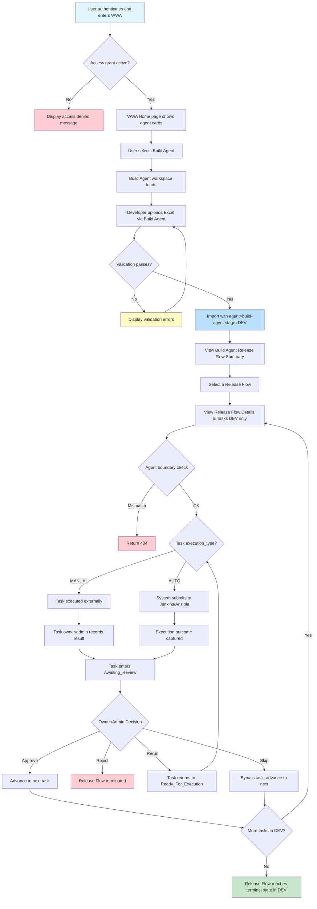

# Feature Specification: Build Agent MVP

> **Source stories:** BA-01 through BA-06
> **Spec status:** Draft (v2, post-review)
> **Last updated:** 2026-04-10

---

## 1. Overview

### 1.1 Feature Summary
Build Agent is the third agent workspace under the WWA Agent Workspace Hub. It provides the same human-in-the-loop controlled execution workflow as Deployment Agent and Testing Agent, but scoped to **development-phase build activities**. Build Agent reuses the existing domain model (Release Flow, Request, Task), shared platform capabilities (Audit Log, Configuration Management, Access Management, Template Management), and most existing backend services. Data isolation between agents is achieved through the `Request.agent` column.

Unlike Testing Agent (which fits inside the existing SIT/UAT/PROD stage chain), Build Agent introduces a **new single-stage `DEV` dimension** that sits before the release chain. This adds a small number of surgical changes to the shared domain layer, documented in §5 and §6.

### 1.2 Business Objective
Provide a dedicated build workspace within WWA that enables development teams to manage build workflows in the DEV phase separately from integration testing, UAT, and deployment workflows, while reusing the proven Deployment Agent execution model and shared platform infrastructure.

### 1.3 SDLC Positioning
Build Agent owns the **DEV** stage of the SDLC chain. Together with the existing agents, the SDLC coverage is:

```
DEV (Build Agent) → SIT (Deployment Agent) → UAT (Deployment Agent + Testing Agent) → PROD (Deployment Agent)
```

`DEV` is a **terminal single-stage** scope for Build Agent. A Build Agent release flow never auto-advances out of `DEV`; there is no implicit promotion from `DEV` to `SIT`. If the same release later enters the SIT/UAT/PROD chain, that happens via a separate upload through Deployment Agent, and the two flows are stitched at the summary layer via `ReleaseFlowFamilyKey`.

### 1.4 MVP Objective
Deliver a fully functional Build Agent workspace with:

**Same workflow as Deployment/Testing Agent + Separate namespace + Data isolation via agent column + Single terminal `DEV` stage scope**

### 1.5 In-Scope Outcome
The MVP shall support the following capabilities:

1. Access Build Agent workspace within WWA navigation and home page
2. Upload build requests through the same fixed Excel template with automatic `agent = "build-agent"` tagging and forced `stage = "DEV"`
3. Create or update Release Flow records from imported request data (reused from Deployment Agent)
4. Monitor Build Agent-scoped Release Flow progress restricted to the `DEV` stage
5. View selected Release Flow details within the Build Agent context
6. View task-level execution details, results, and take actions within Build Agent (with agent boundary enforcement on all task mutations)
7. Record Build Agent actions in the shared audit log with `agentName = "build-agent"`
8. Access Build Agent using existing access grants (shared access model)

### 1.6 Out of Scope
- Build-specific domain logic (artifact versioning, compile-time analysis, dependency graphs)
- Build-specific Excel template fields
- Build-specific task types or execution adapters
- Build-specific dashboards or metrics
- Integration with external build platforms beyond the existing Jenkins/Ansible adapters
- Agent-specific access grants or role definitions
- Multi-stage build pipelines (compile → package → publish as separate stages in Build Agent)
- Build artifact storage or registry integration
- Retroactively patching Testing Agent's agent-boundary gap on task mutations (tracked as R-08 follow-up)
- Extracting shared `AgentSummaryView` / `AgentDetailView` components across the three agents (follow-up refactor)

---

## 2. Source Stories

| Story ID | Title | Capability |
|---|---|---|
| BA-01 | Access Build Agent workspace within WWA navigation | Workspace navigation |
| BA-02 | Upload build request via Excel file with agent tagging | Request upload with agent + stage isolation |
| BA-03 | View Build Agent release flow summary with agent-scoped data isolation | Agent-scoped monitoring |
| BA-04 | Record Build Agent actions in shared audit log | Audit traceability |
| BA-05 | Access Build Agent with existing access grants | Shared access model |
| BA-06 | View Build Agent release flow details and manage tasks | Task management |

---

## 3. Actors

### 3.1 Primary Actors
Same as Deployment Agent and Testing Agent — all actor definitions apply identically:

- **Developer** — uploads build requests, views Release Flow and task status
- **Tech Lead (TL)** — reviews results, participates in release execution
- **Task Owner** — edits task input, starts tasks, records results, makes decisions
- **DevOps Admin** — maintains configuration, manages access grants, can override owner-based controls
- **Audit / Management User** — views audit logs

### 3.2 Supporting Actors
Same as Deployment Agent:

- **Authentication System** — provides enterprise identity context
- **Access Grant Store** — resolves access status, roles, and metadata
- **Execution Integrations** — Jenkins, Ansible
- **Audit Storage** — persists audit records

---

## 4. Terminology

All terms from the Deployment Agent and Testing Agent specs apply. Additional terms:

- **Agent Identifier**: A string value (`"deployment-agent"`, `"testing-agent"`, or `"build-agent"`) stored on the `Request.agent` column that determines which agent workspace owns the request
- **DEV Stage**: The SDLC stage preceding SIT, where developers write, build, and locally validate code. Owned exclusively by Build Agent. `DEV` is terminal — `Stage.next()` returns `null` for `DEV`
- **Agent-Scoped Filtering**: The mechanism by which list and summary operations return only data matching the current agent's identifier
- **Agent Boundary Enforcement**: Controller-layer guard that rejects task-level mutations when the target task's parent request does not belong to the current agent
- **Cross-Agent Release Flow**: A Release Flow that contains requests from more than one agent (same project uploaded through multiple workspaces). Build Agent DEV requests naturally partition from Deployment/Testing SIT/UAT/PROD requests within the same flow
- **Family Key**: A stage-neutral normalized release identifier computed by `ReleaseFlowFamilyKey`, used to stitch together multiple stage-specific uploads that belong to the same logical rollout

---

## 5. Data Model

### 5.1 No New Entities
Build Agent uses the same entity hierarchy as Deployment Agent and Testing Agent. No new database tables are required. The changes are limited to:

1. One new enum value (`Stage.DEV`)
2. Additive DTO fields on `ReleaseFlowListItemDto` (`devStatus`, `devPresent`)
3. Extended regex and stage-token recognition in `ReleaseFlowFamilyKey`

No JPA schema migration is strictly required (the enum is stored as a string, and adding a new value does not affect existing columns).

### 5.2 Entity Relationships
Same as Deployment Agent spec section 5.1. The behavioral differences for Build Agent are:
1. Controllers enforce `agent = "build-agent"` on all write operations
2. Controllers filter by `agent = "build-agent"` on all list operations
3. Upload forces `stage = "DEV"` on all created Request records
4. Task-level mutation endpoints enforce agent boundary (§7.8)

### 5.3 Stage Enum Extension

The existing `Stage` enum (currently `{SIT, UAT, PROD}`) must be extended with a new value and its `next()` implementation must be made explicit rather than relying on `ordinal()` arithmetic.

**Current implementation** (`contracts/enums/Stage.java`):
```java
public enum Stage {
    SIT, UAT, PROD;
    public Stage next() {
        Stage[] values = Stage.values();
        int nextIdx = this.ordinal() + 1;
        return nextIdx < values.length ? values[nextIdx] : null;
    }
}
```

**Required new implementation**:
```java
public enum Stage {
    DEV, SIT, UAT, PROD;
    /**
     * Returns the next stage in the release chain, or null if this stage is terminal.
     * DEV is terminal by design — Build Agent owns only the DEV scope and must not
     * auto-advance into SIT. The release chain SIT → UAT → PROD is unchanged.
     */
    public Stage next() {
        return switch (this) {
            case DEV -> null;
            case SIT -> UAT;
            case UAT -> PROD;
            case PROD -> null;
        };
    }
}
```

**Key properties:**
- `DEV.next() == null` — Build Agent flows terminate at end of DEV; they never auto-advance into SIT
- `SIT.next() == UAT`, `UAT.next() == PROD`, `PROD.next() == null` — existing chain preserved
- `ReleaseFlowProgressionService` at `domain/decision/ReleaseFlowProgressionService.java:72` already treats `currentStage().next() == null` as "flow terminal", so no change is required in the progression service to handle DEV correctly
- `Stage.values()` now returns 4 values. External iterations in `ReleaseFlowService.aggregateFlowStatus` (line 602) and `latestRequestsPerStage` (line 771) are safe because they `flatMap`/`filter` out empty stage buckets

### 5.4 ReleaseFlowFamilyKey Extension

`ReleaseFlowFamilyKey` is the utility that normalizes release identifiers (e.g. `SIT-1234`, `UAT-1234`, `PROD_REL_1234`) into a stage-neutral family key so that same-release uploads across multiple stages are stitched together in summary views. The current implementation hardcodes the stage tokens `sit|uat|prod`.

**Required changes** (`domain/releaseflow/ReleaseFlowFamilyKey.java`):

1. Extend the stage regex:
   - `STAGE_PREFIX_WITH_SEPARATOR` pattern from `^(sit|uat|prod)...` to `^(dev|sit|uat|prod)...`
   - `STAGE_PREFIX_WITH_DIGITS` pattern likewise
2. Extend `isStageToken()` to recognize `"dev"`
3. Extend `stripStagePrefixFromNormalized()` to strip a leading `"dev"` followed by digits (length > 3)

**Behavioral result:** A release identifier like `DEV-1234` will normalize to the same family key as `SIT-1234`, allowing cross-agent stitching at the summary layer. Each agent's summary view continues to render only its own stage columns; stitching is purely a grouping concern.

### 5.5 ReleaseFlowListItemDto Extension

`ReleaseFlowListItemDto` currently exposes one column per stage (`sitStatus`, `uatStatus`, `prodStatus`, `sitPresent`, `uatPresent`, `prodPresent`). Build Agent summary must display the `DEV` stage, so the DTO must be extended additively:

**Required changes** (`contracts/dto/ReleaseFlowListItemDto.java`):

- Add fields: `RequestStatus devStatus`, `boolean devPresent`
- Populate from `requestStatusFor(requests, Stage.DEV, attemptView)` and `hasStage(requests, Stage.DEV)` in the `from()` factory methods

**Why additive:** Existing Deployment Agent and Testing Agent summary views already hardcode which columns to render; they will simply ignore the new `devStatus` / `devPresent` fields. Build Agent summary view renders the new DEV column.

### 5.6 Agent Column Usage

| Operation | Deployment Agent | Testing Agent | Build Agent |
|---|---|---|---|
| Upload/Import | Sets `Request.agent = "deployment-agent"` (or null for legacy) | Sets `Request.agent = "testing-agent"` | Sets `Request.agent = "build-agent"`, forces `stage = "DEV"` |
| List Release Flows | Shows all flows (including legacy null-agent data) | Shows only flows with at least one `agent = "testing-agent"` request | Shows only flows with at least one `agent = "build-agent"` request |
| View Detail | No agent restriction | Validates flow contains testing-agent requests | Validates flow contains build-agent requests |
| Task Mutations | Owner/admin check only (pre-existing) | Owner/admin check only (pre-existing gap, see R-08) | **Owner/admin check AND agent boundary check** (§7.8) |
| Audit Logging | `agentName = "deployment-agent"` | `agentName = "testing-agent"` | `agentName = "build-agent"` |

### 5.7 Cross-Agent Release Flow Behavior

A Release Flow is grouped by `(projectId, normalizedReleaseId)` after normalization via `ReleaseFlowFamilyKey`. With the §5.4 extension in place, Build Agent DEV flows can stitch with Deployment Agent SIT/UAT/PROD flows for the same underlying release:

- The Release Flow is shared — it can contain requests from multiple agents spanning DEV + SIT/UAT/PROD
- Each agent's summary view shows the flow but derives its own stage columns only from its own requests
- Each agent's detail view shows only its own requests within the flow
- Because Build Agent is restricted to `DEV` and Deployment/Testing are restricted to SIT/UAT/PROD, there is zero column overlap across agents

---

## 6. Functional Scope

### 6.1 Capability Domains

Build Agent introduces functional requirements in these domains:

1. **Workspace Navigation** — Build Agent entry in home page and flyout
2. **Request Upload** — Upload with agent tagging and forced `DEV` stage
3. **Release Flow Summary** — Agent-scoped filtering with `DEV`-only stage dimension
4. **Release Flow Details** — Agent-scoped detail view with single `DEV` stage tab
5. **Task Management** — Full task lifecycle within Build Agent namespace
6. **Audit Logging** — Agent-identified audit entries
7. **Access Authorization** — Shared access model
8. **Agent Boundary Enforcement** — Controller-layer guard on task mutations

Shared domain changes required by Build Agent (not "no modifications" as originally claimed in v1):

- **`Stage` enum**: add `DEV`, rewrite `next()` as explicit switch (§5.3)
- **`ReleaseFlowFamilyKey`**: extend stage token recognition to include `dev` (§5.4)
- **`ReleaseFlowListItemDto`**: additive `devStatus` / `devPresent` fields (§5.5)
- **`AgentId`**: add `BUILD_AGENT` constant (`"build-agent"`)

Domains reused without modification from Deployment Agent:
- Release Flow Creation/Update logic in `ReleaseFlowService` (existing `Stage.values()` loops tolerate the new enum value)
- Task State Machine
- Decision Effects
- `ReleaseFlowProgressionService` (existing `next() == null` branch correctly terminates DEV flows)
- `TaskService`, `RecordResultService`, `AutoExecutionService`, `DecisionEngine` (unchanged; agent boundary is enforced at controller layer)
- Configuration Management
- Template Management
- Access Management console

### 6.2 Workflow Boundaries
- **Entry point**: An authenticated and authorized user enters Build Agent from the WWA home page or flyout navigation
- **Exit point**: Release Flow reaches a terminal state (`Completed`, `Rejected`, or `Failed`) within the `DEV` stage. There is no auto-advance out of DEV
- **Core control rule**: Same as Deployment Agent — no flow progression without explicit human decision

---

## 7. Functional Requirements

> Requirements prefixed `BFR` are Build Agent-specific. Requirements that reference Deployment Agent `FR-xx` are reused without modification.

### 7.1 Workspace Navigation

- **BFR-01**: The system shall display Build Agent as an agent card on the WWA Home page. *(Source: BA-01)*
- **BFR-02**: The system shall display Build Agent as a level-2 navigation entry in the WWA sidebar flyout alongside Deployment Agent and Testing Agent. *(Source: BA-01)*
- **BFR-03**: When a user selects Build Agent, the system shall load the Build Agent workspace at route `/wwa/build-agent`. *(Source: BA-01)*
- **BFR-04**: The Build Agent workspace shall display "Build Agent" as the page title. *(Source: BA-01)*
- **BFR-05**: The Build Agent workspace shall display the same shared navigation entries (Template Management, Configuration Management, Audit Log, Access Management) as the other agents. *(Source: BA-01)*
- **BFR-06**: Build Agent visibility on the home page and flyout shall be controlled by the agent registry configuration (`agentRegistry.ts`, `enabled: true`). *(Source: BA-01)*

### 7.2 Request Upload with Agent Tagging

- **BFR-07**: The Build Agent workspace shall provide an `Upload Excel` action identical in UI to Deployment/Testing Agent (Stage selector, file picker, Download Template, View Sample, Upload). *(Source: BA-02)*
- **BFR-08**: The upload API endpoint shall be `POST /api/build-agent/upload`. *(Source: BA-02)*
- **BFR-09**: On successful import through the Build Agent upload endpoint, the system shall set `Request.agent = "build-agent"` and `Request.stage = "DEV"` on all created Request records. *(Source: BA-02)*
- **BFR-10**: The Build Agent upload shall use the **same Excel template content** as Deployment Agent and Testing Agent — all three agents invoke the shared `uploadTemplateService.generateTemplate()` backend generator. Build Agent's `GET /api/build-agent/upload/template` shall return this shared template with Content-Disposition file name `build-request-template.xlsx`, following the per-agent naming pattern already in use (Testing Agent returns `testing-request-template.xlsx`). Unifying file names across all agents is out of scope for MVP. *(Source: BA-02)*
- **BFR-11**: All validation, import, and Release Flow creation/update logic shall be reused from the existing `ImportService` without modification beyond accepting `DEV` as a valid `Stage` value (which comes for free with the enum extension). *(Source: BA-02)*
- **BFR-12**: The Download Template action shall return the same template file as Deployment/Testing Agent (`GET /api/build-agent/upload/template`). *(Source: BA-02)*
- **BFR-13**: The Stage selector in the Build Agent upload dialog shall be a disabled input showing `DEV` (matching the Testing Agent UAT-only pattern), not a dropdown. *(Source: BA-02)*
- **BFR-14**: The Build Agent upload controller shall force `stage = "DEV"` and `agent = "build-agent"` server-side, ignoring any client-supplied stage or agent value. *(Source: BA-02)*

### 7.3 Release Flow Summary with Agent-Scoped Filtering

- **BFR-15**: The Build Agent summary shall display only Release Flows that contain at least one Request with `agent = "build-agent"`. *(Source: BA-03)*
- **BFR-16**: The summary API endpoint shall be `GET /api/build-agent/release-flows`, which defaults the `agent` filter to `"build-agent"`. *(Source: BA-03)*
- **BFR-17**: Stage summary status values (Done, Running, Pending) shall be derived only from build-agent requests within each Release Flow, rendered as a single `DEV` column using the new `devStatus` / `devPresent` DTO fields. *(Source: BA-03)*
- **BFR-18**: Legacy data (requests without an `agent` value) shall NOT appear in the Build Agent summary. *(Source: BA-03)*
- **BFR-19**: Deployment Agent and Testing Agent summary view **rendering** shall continue to show only `SIT` / `UAT` / `PROD` columns and MUST NOT display the new `devStatus` / `devPresent` fields. Deployment Agent summary **visibility** remains "global" — it continues to show all persisted Release Flows regardless of agent, including build-only flows (which will render with empty SIT/UAT/PROD columns). Testing Agent continues to show only flows with testing-agent requests. *(Source: BA-03)*
- **BFR-20**: The Build Agent summary shall support the same filter fields as Deployment Agent (Project, Release ID, Stage, Status), with Stage being a disabled input showing `DEV`. *(Source: BA-03)*
- **BFR-21**: Filters applied in Build Agent shall remain scoped to build-agent data only. *(Source: BA-03)*
- **BFR-22**: `ReleaseFlowFamilyKey` shall recognize `dev` as a stage token for **within-agent** stitching, so that two Build Agent uploads of `DEV-1234` produce a single stitched summary row in Build Agent. Cross-agent stitching (e.g. stitching a Build Agent DEV-1234 with a Deployment Agent SIT-1234 into a single row) is **out of scope** for MVP because `ReleaseFlowService.listStitchedSummaries` pre-filters base flows by agent before grouping. *(Source: BA-03)*
- **BFR-22a**: The `ReleaseFlowFamilyKey` extension shall be conservative for `dev`: it MUST strip `dev` only when the remainder begins with a digit (e.g. `DEV-1234`, `dev1234`) or when `dev` appears as an infix token between other stage-neutral tokens. Plain identifiers such as `dev-tools` or `dev-portal` MUST NOT be stripped, because `dev` is a common project-name prefix unlike `sit`/`uat`/`prod`. *(Source: BA-03)*

### 7.4 Release Flow Details

- **BFR-23**: When a user selects a Release Flow in the Build Agent summary, the system shall navigate to `/wwa/build-agent/release-flows/:id`. *(Source: BA-06)*
- **BFR-24**: The Build Agent detail page shall display the same structure as the Deployment Agent detail page: Release Flow details, stage tabs (restricted to a single `DEV` tab), rundown information panel, and task table. *(Source: BA-06)*
- **BFR-25**: The detail page header and breadcrumb shall show "Build Agent" (not "Deployment Agent" or "Testing Agent"). *(Source: BA-06)*
- **BFR-26**: The detail API endpoint shall be `GET /api/build-agent/release-flows/{id}`. *(Source: BA-06)*

### 7.5 Task Management

- **BFR-27**: All task actions (Edit Input, Activity/Executions, View Result, Start Manual, Submit Auto, Record Result, Review Decision) shall be available in the Build Agent detail page with the same state-based behavior as Deployment/Testing Agent. *(Source: BA-06)*
- **BFR-28**: Task API endpoints shall use the prefix `/api/build-agent/tasks/` with the **same path suffixes as Deployment Agent** (see §10.2 for the full list). *(Source: BA-06)*
- **BFR-29**: Task-level permission checks (task owner or DevOps Admin) shall apply identically to Build Agent. *(Source: BA-06)*
- **BFR-30**: The Build Agent task controllers shall delegate to the same backend services (`TaskService`, `DecisionEngine`, `RecordResultService`, `AutoExecutionService`) without modification. *(Source: BA-06)*

### 7.6 Audit Logging

- **BFR-31**: All key actions performed through the Build Agent workspace shall produce audit log entries with `agentName = "build-agent"`. *(Source: BA-04)*
- **BFR-32**: The same action types shall be logged as Deployment/Testing Agent. *(Source: BA-04)*
- **BFR-33**: Build Agent audit entries shall be visible in the shared Audit Log page alongside Deployment Agent and Testing Agent entries. *(Source: BA-04)*
- **BFR-34**: The Audit Log page shall support filtering by agent name to isolate build-agent, testing-agent, or deployment-agent records. *(Source: BA-04)*
- **BFR-34a**: `AuditLoggerService.log` shall derive `agentName` dynamically from `scope.agent()` rather than the current hardcoded `"deployment-agent"` literal. When `scope.agent()` is null (legacy data), fall back to `"deployment-agent"` for backwards compatibility. This change is a shared-service fix that also corrects a pre-existing defect in Testing Agent (today, Testing Agent audit entries are incorrectly written with `agentName = "deployment-agent"`). See R-12. *(Source: BA-04)*

### 7.7 Access Authorization

- **BFR-35**: Build Agent shall use the same deny-by-default access control model as the other agents. *(Source: BA-05)*
- **BFR-36**: An employee with an active Access Grant shall be able to access Deployment Agent, Testing Agent, and Build Agent workspaces. *(Source: BA-05)*
- **BFR-37**: Access grants are NOT agent-specific — the same grant applies across all agent workspaces. *(Source: BA-05)*
- **BFR-38**: Scope grants (`Application + SNOW Group`) shall apply identically within Build Agent. *(Source: BA-05)*
- **BFR-39**: Build Agent controllers shall use the same `SessionAuthFilter` and permission resolution as the other agents. *(Source: BA-05)*

### 7.8 Agent Boundary Enforcement (New)

- **BFR-40**: The Build Agent task controller (`PUT /api/build-agent/tasks/{id}/input`, `GET /api/build-agent/tasks/{id}/executions`, `POST /api/build-agent/tasks/{id}/record-result`, `POST /api/build-agent/tasks/{id}/start-manual`, `POST /api/build-agent/tasks/{id}/submit-auto`) and the Build Agent decision controller (`POST /api/build-agent/tasks/{id}/decision`) shall load the target task's parent request and reject the operation if `request.agent != "build-agent"`. *(Source: BA-06)*
- **BFR-41**: The rejection response shall be HTTP 404 (Not Found) rather than 403 (Forbidden), to avoid leaking the existence of tasks in other agent namespaces. *(Source: BA-06)*
- **BFR-42**: The agent boundary check shall be implemented as a controller-layer helper (e.g. `AgentBoundaryGuard.assertTaskBelongsToAgent(taskId, expectedAgent)`); no changes to `TaskService`, `RecordResultService`, `DecisionEngine`, or `AutoExecutionService` are required. *(Source: BA-06)*
- **BFR-43**: Build Agent read endpoints (`GET /api/build-agent/release-flows/{id}`, `GET /api/build-agent/tasks?requestId=X`, `GET /api/build-agent/tasks/{id}`) shall also enforce agent boundary: a 404 is returned if the flow or task does not belong to `"build-agent"`. *(Source: BA-06)*

> **Note:** The equivalent gap exists today in Testing Agent (see R-08). Retroactively patching Testing Agent is a follow-up, not part of Build Agent MVP.

---

## 8. Workflow / System Flow

### 8.1 User Flow Diagram



### 8.2 Main Flow

1. User authenticates and enters WWA
2. System resolves Access Grant and effective permissions (same as Deployment Agent)
3. If unauthorized, system blocks entry (same as Deployment Agent)
4. WWA Home page displays Build Agent card
5. User selects Build Agent
6. Build Agent workspace loads at `/wwa/build-agent`
7. Developer uploads Excel via Build Agent upload dialog
8. System validates and imports with `agent = "build-agent"`, `stage = "DEV"`
9. User views Build Agent Release Flow Summary (filtered to build-agent data)
10. User selects a Release Flow and views details (single `DEV` stage tab)
11. All task mutation endpoints verify the target task belongs to `agent = "build-agent"` before delegating to shared services
12. Task lifecycle proceeds identically to Deployment Agent (Run → Record/Review → Decision)
13. System records audit entries with `agentName = "build-agent"`
14. Release Flow progresses, repeats, or terminates within DEV (no auto-advance to SIT)

### 8.3 Decision Effects
Same as Deployment Agent spec section 8.4, with one clarification: when the last task in a Build Agent Release Flow is approved, `ReleaseFlowProgressionService` sees `currentStage = DEV` and `DEV.next() == null`, so the flow is marked `Completed`. This is the same code path used when `PROD` completes; no new branching is required.

---

## 9. State Model

All state models are reused from the Deployment Agent spec without modification:

- **9.1 Release Flow Model** — same `current_stage`, `flow_status`, `stage_summary_status` values; `current_stage` for Build Agent flows is always `DEV`
- **9.2 Request Status** — same valid values
- **9.3 Task Status** — same valid values
- **9.4 Task State Transitions** — same transition rules
- **9.5 Stage Summary Aggregation Rule** — same logic, applied only to build-agent requests within each flow; aggregation naturally operates over a single `DEV` stage
- **9.6 Reject Handling** — same behavior

---

## 10. API Design

### 10.1 API Prefix

All Build Agent API endpoints use the prefix `/api/build-agent/`.

### 10.2 Endpoint Specification

All paths mirror the actual Deployment Agent routes (`TaskController.java`, `DecisionController.java`, `UploadController`, `ReleaseFlowController`). Endpoint list corrected against source of truth.

| Endpoint | Method | Mirrors | Build Agent Behavior |
|---|---|---|---|
| `/api/build-agent/release-flows` | GET | `/api/deployment-agent/release-flows` | Defaults `agent` filter to `"build-agent"`; response DTOs include `devStatus` / `devPresent` |
| `/api/build-agent/release-flows/{id}` | GET | `/api/deployment-agent/release-flows/{id}` | 404 if flow has no `build-agent` requests; stage status derived from build-agent requests only |
| `/api/build-agent/upload` | POST | `/api/deployment-agent/upload` | Forces `Request.agent = "build-agent"` and `Request.stage = "DEV"` server-side |
| `/api/build-agent/upload/template` | GET | `/api/deployment-agent/upload/template` | Same template content via shared `uploadTemplateService.generateTemplate()`; Content-Disposition file name `build-request-template.xlsx` (per-agent naming, matching Testing Agent's existing convention) |
| `/api/build-agent/tasks?requestId=X` | GET | `/api/deployment-agent/tasks` | Agent boundary guard on parent request |
| `/api/build-agent/tasks/{id}` | GET | `/api/deployment-agent/tasks/{id}` | Agent boundary guard |
| `/api/build-agent/tasks/{id}/input` | PUT | `/api/deployment-agent/tasks/{id}/input` | Agent boundary guard; delegates to `TaskService.editInput` |
| `/api/build-agent/tasks/{id}/executions` | GET | `/api/deployment-agent/tasks/{id}/executions` | Agent boundary guard; delegates to `TaskExecutionHistoryService` |
| `/api/build-agent/tasks/{id}/record-result` | POST | `/api/deployment-agent/tasks/{id}/record-result` | Agent boundary guard; delegates to `RecordResultService`; audit tagged `build-agent` |
| `/api/build-agent/tasks/{id}/start-manual` | POST | `/api/deployment-agent/tasks/{id}/start-manual` | Agent boundary guard; delegates to `TaskService.startManualExecution` |
| `/api/build-agent/tasks/{id}/submit-auto` | POST | `/api/deployment-agent/tasks/{id}/submit-auto` | Agent boundary guard; delegates to `AutoExecutionService.submitAutoExecution` |
| `/api/build-agent/tasks/{id}/decision` | POST | `/api/deployment-agent/tasks/{id}/decision` | Agent boundary guard; delegates to `DecisionEngine` + `ReleaseFlowProgressionService`; audit tagged `build-agent` |

> **Note:** Endpoints from v1 of this spec incorrectly listed `PUT /tasks/{id}` and `POST /tasks/{id}/execute`. Those paths do not exist in the codebase. v2 reflects actual `TaskController` and `DecisionController` routes.

### 10.3 Backend Implementation Strategy

Build Agent controllers are **thin delegation wrappers** with an **agent boundary guard at the entry point**:

- Each controller delegates to the same existing service (`ReleaseFlowService`, `TaskService`, `ImportService`, `DecisionEngine`, `RecordResultService`, `AutoExecutionService`, `TaskExecutionHistoryService`)
- The controller layer injects `agent = "build-agent"` as a forced parameter (ignoring client-supplied agent values per CLAUDE.md multi-agent rules)
- The upload controller additionally forces `stage = "DEV"` server-side
- Task / decision / executions / result / record endpoints call a shared helper `AgentBoundaryGuard.assertTaskBelongsToAgent(taskId, AgentId.BUILD_AGENT)` before delegating
- `ReleaseFlow` detail endpoint calls `AgentBoundaryGuard.assertFlowHasAgent(flowId, AgentId.BUILD_AGENT)` before delegating
- Domain service modifications are limited to the enumerated items in §6.1: `Stage.next()` rewrite, `ReleaseFlowFamilyKey` stage token extension, `ReleaseFlowListItemDto` field addition, `AgentId.BUILD_AGENT` constant

---

## 11. Frontend Architecture

### 11.1 Route Structure

| Route | View | Description |
|---|---|---|
| `/wwa/build-agent` | `BuildAgentSummaryView` | Build Agent summary page |
| `/wwa/build-agent/release-flows/:id` | `BuildAgentDetailView` | Build Agent detail page |

### 11.2 Pinia Store

A dedicated `useBuildAgentReleaseFlowStore` shall be created to avoid state collision with the deployment agent and testing agent stores. It is structurally identical to `useReleaseFlowStore` but uses the build-agent API client.

### 11.3 API Client

A separate axios instance shall be created with `baseURL: '/api/build-agent'` and the same interceptor configuration as the other agent clients.

### 11.4 Agent Registry Entry

```typescript
{
  key: 'build-agent',
  name: 'Build Agent',
  description: 'Controlled, human-in-the-loop build workflow for the DEV phase of the SDLC.',
  route: '/wwa/build-agent',
  icon: '🔨',
  enabled: true,
  category: 'build',  // requires extending AgentCategory type
}
```

The `AgentCategory` type shall be extended from `'deployment' | 'testing' | 'platform' | 'other'` to `'deployment' | 'testing' | 'build' | 'platform' | 'other'`.

### 11.5 Stage-Aware Components

- `BuildAgentSummaryView` defines `const stages = ['DEV']`
- `UploadDialog` receives `:allowed-stages="['DEV']"` from `BuildAgentSummaryView`
- Stage filter in the summary is rendered as a disabled input when only one stage is allowed
- Page subtitle and WWA Today description reference only the `DEV` stage
- Summary row renderer consumes `devStatus` / `devPresent` from the DTO for the single stage column
- Deployment Agent and Testing Agent summary row renderers are NOT changed — they continue to read only `sitStatus` / `uatStatus` / `prodStatus`

### 11.6 Duplication Reduction

Consistent with the Testing Agent spec recommendation, view files continue to follow the established pattern (parallel per-agent summary/detail views passing their own API functions to shared components like `UploadDialog`). Extraction of a common `AgentSummaryView` / `AgentDetailView` remains a cross-cutting follow-up refactor not scoped to this MVP.

---

## 12. Non-Functional Requirements

All non-functional requirements from the Deployment Agent spec apply without modification:

- **Security** — same access control, scope grants, deny-by-default model, **plus** agent boundary enforcement on Build Agent task mutations (§7.8)
- **Reliability** — same validation, decision protection, atomicity
- **Auditability** — same logging with `agentName` differentiation
- **Observability** — same operational logging expectations
- **Performance** — same working targets

---

## 13. Integrations

Same as Deployment Agent spec section 12. Build Agent reuses the same Jenkins, Ansible, Authentication Provider, and Audit Storage integrations.

---

## 14. Assumptions and Constraints

### 14.1 Assumptions

1. The existing `Request.agent` column provides sufficient data isolation between agents when combined with the new controller-layer boundary guard
2. No build-specific domain logic is needed for MVP — the same workflow applies
3. Access grants are shared across agents — no agent-specific authorization in Phase 1
4. The same Excel template works for build workflows in Day 1
5. Stage summary aggregation can be computed per-agent within a shared Release Flow
6. The agent registry pattern is sufficient for adding new agents without shell code changes
7. Adding `DEV` to the `Stage` enum and rewriting `Stage.next()` as an explicit switch does not break any existing tests (no external code depends on `Stage.ordinal()` math; `ReleaseFlowService` uses `Stage.values()` iteration which is safe for additive enum changes)
8. `DEV` is a meaningful stage value in the import template, and existing `ImportService` validation accepts it via the enum extension
9. The additive `devStatus` / `devPresent` DTO fields are ignored by existing Deployment/Testing Agent summary views (they hardcode their stage columns)

### 14.2 Constraints

1. The `agent` string value `"build-agent"` must be consistent across backend controllers, frontend API calls, and audit log entries — use `AgentId.BUILD_AGENT` backend constant and `AGENT_ID_BUILD` frontend constant
2. Build Agent must not modify any existing Deployment Agent or Testing Agent behavior — this is verified by the unchanged existing test suite
3. Legacy data (null agent) must remain visible only in Deployment Agent
4. All existing tests must continue to pass after Build Agent is added (`mvn test`, `cd frontend && npm run build`)
5. The Build Agent upload controller must force `stage = "DEV"` and `agent = "build-agent"` server-side and must not trust any client-supplied value
6. Build Agent task mutation controllers must enforce agent boundary before delegating to shared services
7. The Deployment Agent and Testing Agent summary views must NOT start displaying the new `devStatus` / `devPresent` fields

---

## 15. Risks

| ID | Risk | Severity | Mitigation |
|---|---|---|---|
| R-01 | Adding `DEV` to the `Stage` enum breaks tests that assume the enum is exactly `{SIT, UAT, PROD}` or rely on `Stage.ordinal()` math | MEDIUM | Full `mvn test` run required; grep confirms only `Stage.next()` itself uses ordinal math. The rewrite replaces ordinal logic with an explicit switch, making the change safe |
| R-02 | `Stage.values()` iterations in `ReleaseFlowService` (lines 602, 771) pick up the new DEV slot and produce unexpected empty-stage behavior for Deployment/Testing flows | LOW | Both call sites already use `flatMap` / `filter` to skip empty stage buckets; adding DEV simply results in a skipped bucket for flows with no DEV requests. Covered by existing tests |
| R-03 | View duplication across three agents leads to maintenance drift | MEDIUM | Explicitly out of scope; follow-up refactor to extract shared summary/detail components |
| R-04 | Agent identity string hardcoded in multiple places | LOW | Define constants: backend `AgentId.BUILD_AGENT`, frontend `AGENT_ID_BUILD` |
| R-05 | Client sends a non-`DEV` stage or wrong agent to the upload endpoint expecting it to be respected | LOW | Server-side forced override; documented in BFR-14 and CLAUDE.md multi-agent rules |
| R-06 | `DEV` as a new stage enum surfaces in unrelated Deployment Agent or Testing Agent filter dropdowns | LOW | Deployment Agent and Testing Agent summary views hardcode their own `stages` constants. Regression test: verify dropdowns still show only `['SIT', 'UAT', 'PROD']` and `['UAT']` respectively |
| R-07 | `ReleaseFlowFamilyKey` extension incorrectly strips `dev` from legitimate non-stage tokens (e.g. a project literally named `dev-tools` or `dev-portal`) | LOW | Per BFR-22a, `dev` uses a **conservative** rule: stripped only when followed by digits (`DEV-1234`, `dev1234`) or when appearing as an infix between other tokens. `dev-tools`, `dev-kit`, `dev-portal` and similar identifiers are preserved. This is asymmetric with the existing `sit`/`uat`/`prod` aggressive rule, by design, because `dev` is a far more common project-name prefix. Regression test: `dev-tools` must normalize to `devtools`, not `tools` |
| R-08 | Testing Agent's pre-existing agent-boundary gap (task mutations do not check agent) remains unfixed | MEDIUM | Documented as follow-up; Build Agent does not inherit the gap because of §7.8 controller guard. File a tracking item to back-patch Testing Agent |
| R-09 | Additive DTO fields (`devStatus`, `devPresent`) inadvertently appear in Deployment/Testing summary UI if a shared renderer is later introduced | LOW | Explicit BFR-19 constraint; follow-up refactor (R-03) must honor the constraint |
| R-10 | Cross-agent release flows show confusing stage status | LOW | Each agent derives stage status only from its own requests; Build Agent stage is always `DEV` and Deployment/Testing are always `SIT`/`UAT`/`PROD`, so column partitioning is clean |
| R-12 | `AuditLoggerService` `agentName` fix retroactively changes the value written for Testing Agent audit entries from `"deployment-agent"` to `"testing-agent"`. Historical Testing Agent audit rows in production remain wrong; only new rows are corrected | MEDIUM | Accept as an intentional, forward-only fix. Document in release notes. No data backfill for historical rows in MVP |
| R-13 | Deployment Agent summary now visibly includes build-only and testing-only flows as rows with empty stage columns. A DA user sees new "empty" rows for flows that conceptually belong to other agents | LOW | Accept as "Deployment Agent is the global view" per the product decision. UI can be refined in a follow-up; MVP matches the existing service pre-filter architecture |
| R-14 | Build Agent summary cannot stitch with downstream Deployment Agent SIT/UAT/PROD uploads of the same release into a single row because `listStitchedSummaries` pre-filters by agent. Users who want the full DEV→SIT→UAT→PROD family view must switch to Deployment Agent | LOW | Accept as MVP scope. A future "cross-agent family view" feature would require refactoring `listStitchedSummaries` and is tracked as a follow-up |
| R-15 | Template download file names are per-agent (`testing-request-template.xlsx`, `build-request-template.xlsx`) even though the template content is shared. This diverges from the CLAUDE.md "neutral file name" rule, which Testing Agent already violates today. Unifying all three agents to a single neutral name would change Testing Agent's user-visible download name | LOW | Accept existing Testing Agent convention; Build Agent matches the per-agent pattern. Tracked as a future cleanup (FU-008) to unify to `request-template.xlsx` across all three agents and revisit the CLAUDE.md rule |

---

## 16. Success Criteria

- [ ] Build Agent card appears on WWA Home page
- [ ] Build Agent appears in sidebar flyout navigation
- [ ] `/wwa/build-agent` shows a summary of release flows filtered to `agent = "build-agent"` with a `DEV` column
- [ ] Upload via Build Agent creates requests with `agent = "build-agent"` and `stage = "DEV"`
- [ ] Build Agent upload dialog shows `DEV` as a disabled stage input
- [ ] Build Agent summary shows `DEV` as a disabled stage filter
- [ ] Build Agent detail page shows full task execution workflow restricted to the `DEV` stage
- [ ] Deployment Agent summary visibility is unchanged (it continues to show all flows; build-only flows appear with empty SIT/UAT/PROD columns)
- [ ] Testing Agent summary continues to show only flows with testing-agent requests (pre-existing behavior)
- [ ] Deployment Agent and Testing Agent stage filter dropdowns do NOT include `DEV`
- [ ] Deployment Agent and Testing Agent summary **renderers** do NOT display the new `devStatus` / `devPresent` columns
- [ ] `AuditLoggerService` writes `agentName` dynamically from `scope.agent()`: Build Agent actions → `"build-agent"`, Testing Agent actions → `"testing-agent"` (forward-only fix for Testing Agent existing defect), Deployment Agent / legacy → `"deployment-agent"`
- [ ] All actions in Build Agent produce audit entries with `agentName = "build-agent"`
- [ ] Access grants work identically for all three agents
- [ ] Build Agent task mutation endpoints return 404 when the target task's parent request has `agent != "build-agent"`
- [ ] Build Agent `GET /release-flows/{id}` returns 404 when the flow has no `build-agent` requests
- [ ] A Release Flow completing its last task in DEV transitions to `Completed` without auto-advancing to SIT
- [ ] `ReleaseFlowFamilyKey` stitches `DEV-1234` and `SIT-1234` into the same family key
- [ ] All existing Deployment Agent and Testing Agent tests pass (`mvn test`)
- [ ] Frontend builds without errors (`cd frontend && npm run build`)
- [ ] New backend controller and `AgentBoundaryGuard` tests pass with 80%+ coverage on new code
- [ ] New unit tests exist for `Stage.next()` rewrite covering all four values and `ReleaseFlowFamilyKey` DEV extension

---

## 17. Traceability Matrix

| Functional Requirement | Source Story | Implementation Component |
|---|---|---|
| BFR-01 to BFR-06 | BA-01 | `agentRegistry.ts`, router, views |
| BFR-07 to BFR-14 | BA-02 | `BuildAgentUploadController`, upload API client, `UploadDialog :allowed-stages`, `Stage.DEV` enum, `ImportService` reuse |
| BFR-15 to BFR-22 | BA-03 | `BuildAgentReleaseFlowController`, summary store/view, `ReleaseFlowFamilyKey` extension, `ReleaseFlowListItemDto` extension |
| BFR-23 to BFR-26 | BA-06 | `BuildAgentDetailView`, detail API, `BuildAgentReleaseFlowController.getById` |
| BFR-27 to BFR-30 | BA-06 | `BuildAgentTaskController`, `BuildAgentDecisionController`, task API client (path list per §10.2) |
| BFR-31 to BFR-34 | BA-04 | Audit logging with agent name |
| BFR-35 to BFR-39 | BA-05 | Shared auth filters, access grant model |
| BFR-40 to BFR-43 | BA-06 | `AgentBoundaryGuard` helper, used by `BuildAgentTaskController`, `BuildAgentDecisionController`, `BuildAgentReleaseFlowController` |
| Stage enum extension (`DEV`) + `Stage.next()` rewrite | BA-02, BA-03, BA-06 | `contracts/enums/Stage.java` |
| `ReleaseFlowFamilyKey` conservative DEV stage token (BFR-22, BFR-22a) | BA-03 | `domain/releaseflow/ReleaseFlowFamilyKey.java` |
| `ReleaseFlowListItemDto` DEV fields (appended) | BA-03 | `contracts/dto/ReleaseFlowListItemDto.java` |
| `AgentId.BUILD_AGENT` constant | All | `contracts/AgentId.java` |
| `AuditLoggerService` dynamic `agentName` (BFR-34a) | BA-04 | `domain/audit/AuditLoggerService.java` |
