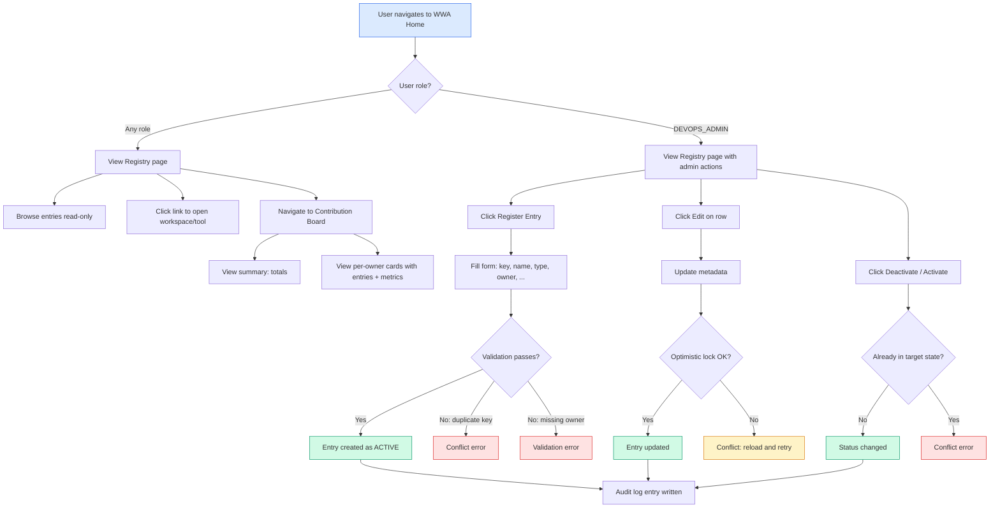

# Feature Specification: Agent/Tool Registry & Contribution Board

> **Source stories:** REG-1, REG-2, REG-3, REG-4, REG-5
> **Source requirement:** docs/01-requirements/registration-requirement.md
> **Spec status:** Draft
> **Last updated:** 2026-04-09

---

## 1. Overview

### 1.1 Feature Summary

The Agent/Tool Registry is a platform-level directory that tracks every agent and tool on the WWA platform with clear ownership and BAU support information. The Contribution Board is a companion read-only page that groups registry entries by owner and shows lightweight activity metrics for agent entries. Together they answer two questions: "who owns this?" and "who contributes what?"

### 1.2 Business Objective

As the platform grows beyond two agent workspaces, ownership information is scattered and team contribution is invisible. This feature centralizes ownership visibility and provides lightweight recognition signals, making it easier for users to find the right contact and for the team to see who is building and supporting which capabilities.

### 1.3 In-Scope Outcome

At delivery, the platform will support:

1. A registry page at `/wwa/registry` where DEVOPS_ADMIN users can register, update, and deactivate agents and tools with mandatory owner information
2. A read-only registry view accessible to all authenticated users showing who owns each capability
3. A contribution board page at `/wwa/contribution-board` showing entries grouped by owner with request/task activity signals for agent entries
4. Audit trail entries for all registry mutations
5. Initial population of the two existing agent workspaces (`deployment-agent`, `testing-agent`)
6. Navigation entry points from the home page and sidebar flyout to both new pages

### 1.4 Scope Boundary

The registry is a **metadata directory**. It does not:

- Create backend controllers, frontend routes, Pinia stores, or navigation entries for registered capabilities
- Replace the existing static agent routing model
- Provide runtime execution configuration (allowed stages, execution adapters)
- Replace or modify `AgentId.java` constants or `agentRegistry.ts` static array

Existing per-agent workspace infrastructure remains unchanged.

---

## 2. Source Stories

| Story | Title | Capability |
|-------|-------|------------|
| REG-1 | Register an agent or tool with clear ownership | Create registry entries with required owner |
| REG-2 | View the ownership registry | Read-only registry browsing, initial population, nav entry points |
| REG-3 | Maintain ownership information as capabilities change | Update metadata, activate/deactivate lifecycle |
| REG-4 | View the contribution board by owner | Owner-grouped contribution display with activity metrics |
| REG-5 | Record registry changes in the shared audit log | Audit trail for all mutations |

---

## 3. Actors

### 3.1 Primary Actors

- **DevOps Admin**: Creates, updates, and deactivates registry entries. The only role authorized for write operations on the registry.
- **Authenticated User** (Developer, TL, DevOps Admin, Audit, Management): Views the registry and contribution board in read-only mode. All platform roles have read access.

### 3.2 Supporting Actors

- **Authentication System**: Provides session-based identity context (`UserContext`) including role information used for authorization gates.
- **Audit Log System**: Receives and persists audit entries for registry mutations via the existing `AuditLoggerService`.

---

## 4. Terminology

| Term | Definition |
|------|-----------|
| Registry entry | A record in `DA_CAPABILITY_REGISTRATION` representing a platform agent or tool |
| Registry key | A unique, stable identifier for an entry (e.g. `deployment-agent`, `jenkins-pipeline-tool`) |
| Entry type | Classification of the registry entry: `AGENT` (has associated runtime request/task data) or `TOOL` (metadata-only, no runtime data) |
| Owner | The team member responsible for building and maintaining a registered capability, identified by employee ID and display name |
| Support contact | Optional BAU support contact information (email, team name, or group) |
| Active / Inactive | Lifecycle status of a registry entry. Active entries are current; inactive entries are retained for historical transparency but may be visually de-emphasized |
| Contribution board | A read-only aggregation view grouping registry entries by owner and showing activity metrics |
| Activity metrics | Request count and task count derived from existing `Request.agent` data, applicable to `AGENT` entries only |

---

## 5. Functional Scope

### 5.1 Core Capability Domains

- **Registry Management**: CRUD operations on registry entries with mandatory ownership tracking
- **Registry Browsing**: Read-only access for all users to discover capabilities and owners
- **Contribution Aggregation**: Owner-grouped view with per-agent activity signals
- **Audit Trail**: Immutable record of all registry mutations

### 5.2 Lifecycle Stages

1. **Registration** — DevOps Admin creates a new entry with metadata and owner
2. **Active use** — Entry is visible in the registry and contribution board; all users can browse
3. **Maintenance** — DevOps Admin updates metadata as ownership or descriptions change
4. **Deactivation** — DevOps Admin marks an entry inactive; entry remains visible but de-emphasized
5. **Reactivation** — DevOps Admin restores a previously deactivated entry to active status

### 5.3 Workflow Boundaries

- **Entry point**: DevOps Admin navigates to `/wwa/registry` and clicks "Register Entry"
- **Exit point**: Entry exists in the registry with status `ACTIVE` or `INACTIVE`
- **Out-of-band transitions**: Concurrent edit conflict (optimistic locking), validation rejection

---

## 6. Functional Requirements

### 6.1 Registry Entry Creation

- **FR-01**: The system must allow a DevOps Admin to create a new registry entry by providing: registry key, name, entry type (`AGENT` or `TOOL`), description, owner employee ID, owner display name, and optionally: support contact, link, and note. *(Source: REG-1 AC2)*
- **FR-02**: Owner employee ID and owner display name must be required for all new entries. The system must reject creation if either is missing. *(Source: REG-1 AC5)*
- **FR-03**: The registry key must be unique across all entries. The system must reject creation with a conflict error if the key already exists. *(Source: REG-1 AC4)*
- **FR-04**: A newly created entry must have status `ACTIVE`. *(Source: REG-1 AC3)*
- **FR-05**: The system must record `created_by` (current user ID) and `created_at` (current timestamp) on creation. `[INFERRED]`
- **FR-06**: The registry key must be validated against a defined format: lowercase alphanumeric characters and hyphens only, no leading or trailing hyphens, minimum 3 characters, maximum 100 characters. `[INFERRED]` — *The stories require uniqueness and use hyphenated keys in examples but do not explicitly state format rules. This inference follows the existing `AgentId` constant naming convention.*
- **FR-07**: The link field, when provided, must be accepted as a plain string. Both internal routes (starting with `/`) and external URLs (starting with `http://` or `https://`) are permitted. No reachability validation is performed. `[INFERRED]` — *Resolves OQ from REG-1: "Should link validation allow both internal routes and external URLs?" The recommendation is to accept both since tools may be external systems.*

### 6.2 Registry Browsing

- **FR-08**: The system must provide a list endpoint that returns all registry entries (both active and inactive), sorted by name ascending. All authenticated users can access this endpoint. *(Source: REG-2 AC1, AC2)*
- **FR-09**: The system must provide a single-entry endpoint that returns one registry entry by its registry key. All authenticated users can access this endpoint. *(Source: REG-2, requirement section 4.1.B)*
- **FR-10**: The registry page must display a table with columns: name, type, owner, support contact, status, link (when present), and last updated date. *(Source: REG-2 AC1)*
- **FR-11**: The registry page must show both active and inactive entries by default. Inactive entries must be visually distinguishable (e.g., a status badge). `[INFERRED]` — *Resolves OQ from REG-3: "Should the UI show inactive entries by default?" The recommendation is to show all entries by default for transparency, since the total entry count is expected to be small. A future iteration may add a status filter.*
- **FR-12**: When an entry contains a link, the registry page must render it as a clickable element that navigates to the linked page. *(Source: REG-2 AC4)*
- **FR-13**: For non-DEVOPS_ADMIN users, the registry page must be read-only with no admin action buttons (Register, Edit, Activate/Deactivate). *(Source: REG-1 AC6, REG-2 AC3, REG-3 AC5)*
- **FR-14**: The registry page must display a clear empty state message when no entries exist. *(Source: REG-2 AC7)*

### 6.3 Registry Maintenance

- **FR-15**: The system must allow a DevOps Admin to update an existing entry's editable fields: name, description, owner employee ID, owner display name, support contact, link, and note. *(Source: REG-3 AC1, AC2)*
- **FR-16**: The registry key and entry type must be immutable after creation. Neither can be changed via update. `[INFERRED]` — *Registry keys serve as stable identifiers and join keys for contribution metrics. Entry type (`AGENT` vs `TOOL`) determines whether the entry participates in request/task aggregation on the contribution board; allowing type changes after creation would silently alter the meaning of historical contribution data.*
- **FR-17**: The system must allow a DevOps Admin to deactivate an active entry. The entry status changes to `INACTIVE` but the record is retained. *(Source: REG-3 AC3)*
- **FR-18**: The system must allow a DevOps Admin to reactivate an inactive entry. The entry status changes back to `ACTIVE`. *(Source: REG-3 AC4)*
- **FR-19**: The system must reject a deactivation request if the entry is already `INACTIVE`, and reject an activation request if the entry is already `ACTIVE`, returning a conflict error. `[INFERRED]` — *Prevents redundant state transitions. Follows the same pattern as existing task state machine validation.*
- **FR-20**: The system must record `updated_by` (current user ID) and `updated_at` (current timestamp) on every update, activation, or deactivation. `[INFERRED]`
- **FR-21**: The system must use optimistic locking (`version` field) to prevent lost updates when concurrent edits occur. When a conflict is detected, the system must return an error indicating the entry was modified by another user. `[INFERRED]` — *Follows the existing `@Version` pattern used by ReleaseFlow, Request, and Task entities.*

### 6.4 Initial Population

- **FR-22**: At feature launch, the registry must contain entries for the two existing agent workspaces: `deployment-agent` (type `AGENT`, name "Deployment Agent") and `testing-agent` (type `AGENT`, name "Testing Agent"), both with status `ACTIVE`. Each seeded entry must include owner information. The owner values are deployment-time configuration: the team must confirm the real owner employee ID and display name for each seeded agent before the feature goes live. If the team has not confirmed owners by launch, the entries must still be seeded with `ownerEmployeeId = "unassigned"` and `ownerDisplayName = "Unassigned – update required"` so that the contribution board immediately surfaces them as needing attention. *(Source: REG-2 AC6, requirement section 4.1.D)*
- **FR-23**: The initial population mechanism must be idempotent — it must not overwrite existing records if the entries already exist. `[INFERRED]` — *Prevents data loss on application restart.*
- **FR-24A**: Seeded entries that still carry the `"unassigned"` placeholder owner must appear under the "Unassigned" section of the contribution board (per FR-31), creating immediate visibility pressure for the DevOps Admin to assign real owners. `[INFERRED]`

### 6.5 Navigation Integration

- **FR-24**: The Registry page must be accessible as a shared platform capability from the WWA Home page "Shared Controls" section and the sidebar flyout navigation "Platform" section. *(Source: REG-2 AC5)*
- **FR-25**: The Contribution Board page must be accessible as a shared platform capability from the same locations as FR-24. *(Source: REG-4 AC6)*

### 6.6 Contribution Board

- **FR-26**: The system must provide a contributions endpoint that returns registry entries grouped by owner, with aggregate activity metrics. All authenticated users can access this endpoint. *(Source: REG-4 AC1, AC2)*
- **FR-27**: The contribution response must include summary statistics: total registered entries, total active entries, and total distinct owners. *(Source: REG-4 AC1)*
- **FR-28**: For each owner, the response must include: owner display name, owner employee ID, list of entries owned (with name, type, and status), and total count of owned entries. *(Source: REG-4 AC2)*
- **FR-29**: For owners who have one or more `AGENT` entries, the response must also include total request count and total task count aggregated across those agent entries. The aggregation joins `CapabilityRegistration.registryKey` with `Request.agent` where the entry type is `AGENT`. *(Source: REG-4 AC3)*
- **FR-30**: For `TOOL` entries or `AGENT` entries with no associated request data, activity metrics must be displayed as zero or a no-data indicator — not omitted. *(Source: REG-4 AC4)*
- **FR-31**: Registry entries that have no owner (null or blank `owner_employee_id`) must be grouped under a distinct "Unassigned" section in the contribution board, separate from named owners. *(Source: REG-4 AC5)*
- **FR-32**: The default ordering of owners on the contribution board must be by owned-entry count descending, with alphabetical name as the secondary sort. `[INFERRED]` — *Resolves OQ from REG-4: "Should the default owner ordering be alphabetical, or by owned-entry count first?" The recommendation is count-first because it surfaces top contributors immediately, which aligns with the recognition intent.*

### 6.7 Audit Trail

- **FR-33**: The system must write an audit log entry when a registry entry is created. The entry must include the action type, acting user ID, registry key, and timestamp. *(Source: REG-5 AC1)*
- **FR-34**: The system must write an audit log entry when a registry entry is updated. *(Source: REG-5 AC2)*
- **FR-35**: The system must write an audit log entry when a registry entry is activated or deactivated. *(Source: REG-5 AC3)*
- **FR-36**: The system must not write a success audit entry when a registry mutation fails (validation error, conflict, etc.). *(Source: REG-5 AC4)*
- **FR-37**: Registry audit entries must be visible in the existing shared Audit Log page alongside other platform events. *(Source: REG-5 AC5)*
- **FR-38**: Registry audit entries must use `agentName = "platform"` (not an agent-specific value like `"deployment-agent"`). The existing `AuditLoggerService.log()` currently hardcodes `agentName` to `"deployment-agent"` (line 61). Registry events are platform-level, not agent-scoped, so the caller must set `agentName` explicitly to `"platform"`. Additionally, `targetType` must be set to `"CapabilityRegistration"` and `targetId` must be set to the registry key of the affected entry. `[INFERRED]` — *The current implementation hardcodes `agentName = "deployment-agent"` in `AuditLoggerService`. Without this fix, platform-level registry events would be mislabeled as deployment-agent actions in audit records.*

---

## 7. Non-Functional Requirements

### Security

- **NFR-01**: All write operations (create, update, activate, deactivate) must be gated to users with the DEVOPS_ADMIN role. Unauthorized attempts must return HTTP 403. *(Source: REG-1 AC6, REG-2 AC3, REG-3 AC5)*
- **NFR-02**: All read operations must require authentication. Unauthenticated requests must return HTTP 401. `[INFERRED]` — *Follows existing platform security model.*
- **NFR-03**: The new `/api/platform/` path prefix must be recognized by the Spring Security filter chain. `[INFERRED]` — *No existing controller uses this prefix; the security configuration must be updated.*

### Reliability

- **NFR-04**: The initial population mechanism must be idempotent across restarts and redeployments. `[INFERRED]`
- **NFR-05**: Optimistic locking must prevent silent data loss from concurrent writes. *(Source: FR-21)*

### Auditability

- **NFR-06**: All registry mutations must produce an audit trail entry. Audit logging must use `Propagation.REQUIRES_NEW` so that audit failures do not abort the business operation. `[INFERRED]` — *Follows existing `AuditLoggerService` pattern.*

### Performance

- **NFR-07**: The registry list endpoint must respond within 500ms under normal load. The expected data set is small (tens of entries, not thousands). `[INFERRED]`
- **NFR-08**: The contribution board endpoint must respond within 2 seconds under normal load. Aggregate queries join registry data with request/task counts. `[INFERRED]`

### Environment Support

- **NFR-09**: The feature must work in all three Spring profiles: `default` (Oracle), `local` (H2), and `test` (H2). `[INFERRED]` — *Follows existing project conventions.*
- **NFR-10**: The initial population mechanism must not run during the `test` profile to avoid interfering with isolated test scenarios. `[INFERRED]`

### Observability

- None identified. The registry is a low-traffic metadata feature. Standard application logging is sufficient for MVP.

---

## 8. Workflow / System Flow

### 8.1 User Flow Diagram

### 8.2 Registry Management Flow

1. DevOps Admin navigates to `/wwa/registry` via the home page or sidebar flyout
2. The page loads all registry entries from `GET /api/platform/registry`
3. To register a new entry, the admin clicks "Register Entry" and fills in the form
4. On submit, the system validates: registry key format and uniqueness, required fields (owner), entry type
5. If validation passes, the entry is created with status `ACTIVE`; an audit log entry is written
6. If validation fails (duplicate key, missing owner, bad key format), the form shows the error
7. To update, the admin clicks "Edit" on a row, modifies fields, and submits
8. If another user modified the entry concurrently (version mismatch), the system returns a conflict
9. To deactivate, the admin clicks "Deactivate"; the entry status changes to `INACTIVE`
10. To reactivate, the admin clicks "Activate" on an inactive entry; the status returns to `ACTIVE`

### 8.3 Contribution Board Flow

1. Any authenticated user navigates to `/wwa/contribution-board`
2. The page loads data from `GET /api/platform/contributions`
3. The server groups registry entries by `owner_employee_id`
4. For each owner group, the server counts total entries and, for `AGENT` entries, counts requests and tasks from existing data
5. Entries with no owner are placed in an "Unassigned" group
6. The response is rendered as per-owner cards with summary statistics at the top

---

## 9. Data / Configuration Requirements

### 9.1 Key Entities

| Entity | Description | Key Attributes |
|--------|-------------|----------------|
| CapabilityRegistration | Platform agent or tool with ownership metadata | registry_key (unique), name, entry_type, description, owner_employee_id, owner_display_name, support_contact, status, link, note, created_by, created_at, updated_by, updated_at, version |

### 9.2 Statuses / State Machine

**Valid states:** `ACTIVE`, `INACTIVE`

**Valid transitions:**

| From | To | Trigger | Actor |
|------|----|---------|-------|
| (new) | ACTIVE | Create entry | DevOps Admin |
| ACTIVE | INACTIVE | Deactivate | DevOps Admin |
| INACTIVE | ACTIVE | Activate | DevOps Admin |

Invalid transitions (same-state) must return a conflict error.

### 9.3 Validation Rules

| Rule | Field(s) | When Applied |
|------|----------|--------------|
| Required, non-blank | registry_key, name, entry_type, owner_employee_id, owner_display_name | Create |
| Required, non-blank | name, entry_type, owner_employee_id, owner_display_name | Update (when provided) |
| Format: lowercase alphanumeric + hyphens, no leading/trailing hyphen, 3-100 chars | registry_key | Create |
| Unique across all entries | registry_key | Create |
| Must be `AGENT` or `TOOL` | entry_type | Create, Update |
| Max length 100 | registry_key | Create |
| Max length 255 | name, owner_employee_id, owner_display_name | Create, Update |
| Max length 500 | support_contact, link | Create, Update |
| Max length 1000 | description, note | Create, Update |
| Immutable after creation | registry_key, entry_type | Update |

### 9.4 Contribution Metrics Derivation

| Metric | Source | Join Condition |
|--------|--------|----------------|
| Request count per agent | `Request` table | `Request.agent = CapabilityRegistration.registryKey` where `entry_type = AGENT` |
| Task count per agent | `Task` table via `Request` | Tasks belonging to requests matching the join condition above |

- `TOOL` entries have no join path to runtime data. Their activity metrics are zero.
- Contribution counts include all requests and tasks regardless of archived status. This is a committed design rule, not an open question. The contribution board measures total historical throughput per agent. If the team later needs to distinguish active-only vs all-time counts, a filter can be added as an enhancement.

---

## 10. Integrations

### 10.1 Internal Systems

| System | Purpose | Direction |
|--------|---------|-----------|
| Existing Audit Log (`AuditLoggerService`) | Persist registry mutation audit entries | Outbound (service writes to audit) |
| Existing Request/Task data | Source for contribution activity metrics | Inbound (read-only aggregate queries) |
| Existing Authentication (`SessionAuthFilter`) | Provides `UserContext` with role for authorization | Inbound |

### 10.2 External Systems

None. This feature has no external integrations.

### 10.3 API Summary

| Method | Path | Role Gate | Purpose |
|--------|------|-----------|---------|
| GET | `/api/platform/registry` | All authenticated | List all entries |
| GET | `/api/platform/registry/{registryKey}` | All authenticated | Get single entry |
| POST | `/api/platform/registry` | DEVOPS_ADMIN | Create entry |
| PATCH | `/api/platform/registry/{registryKey}` | DEVOPS_ADMIN | Update entry |
| POST | `/api/platform/registry/{registryKey}/deactivate` | DEVOPS_ADMIN | Deactivate entry |
| POST | `/api/platform/registry/{registryKey}/activate` | DEVOPS_ADMIN | Activate entry |
| GET | `/api/platform/contributions` | All authenticated | Contribution board data |

---

## 11. Dependencies

### 11.1 Upstream Dependencies

| Dependency | Why |
|------------|-----|
| Spring Security configuration | Must permit the new `/api/platform/**` path prefix for authenticated users |
| Existing `AuditLoggerService` and `AuditActionType` enum | Must be extended with new action types for registry mutations |
| Existing `Request` entity with `agent` column | Required for contribution metrics join |
| Existing `platformCapabilities` array in `agentRegistry.ts` | Must be extended with entries for Registry and Contribution Board pages |
| Existing frontend router (`router/index.ts`) | Must add routes for `/wwa/registry` and `/wwa/contribution-board` |

### 11.2 Downstream Dependencies

| Dependency | What they rely on |
|------------|-------------------|
| WWA Home page ("Shared Controls" section) | Renders nav links to the new pages |
| Sidebar flyout ("Platform" section) | Renders nav links to the new pages |

---

## 12. Risks / Ambiguities

| # | Description | Type | Impact | Recommendation |
|---|-------------|------|--------|----------------|
| R-01 | Owner employee ID is a free-text field. If a user enters a non-existent employee ID, the registry will display it without validation against an employee directory. | Gap | Low | Accept free-text in MVP. If Team Book API becomes available, add optional validation in a future iteration. |
| R-02 | The existing `AuditLoggerService.log()` hardcodes `agentName = "deployment-agent"` (line 61 of `AuditLoggerService.java`). Platform-level registry events must not inherit this default. | Gap | High | FR-38 requires that registry audit entries explicitly set `agentName = "platform"`. The implementation must either pass `agentName` as a parameter to the audit service or use a new overload that accepts platform-level context without the agent default. |
| R-03 | The `/api/platform/` path prefix is new to the application. If Spring Security configuration uses an allowlist approach, the new prefix must be explicitly added. | Assumption | High | Verify the security configuration early in implementation. |
| R-04 | The `description` field is defined in the data model but not listed in the registry table columns (REG-2 AC1). It is unclear whether description should be visible in the table view. | Unclear | Low | Show description in the table. The data model says "Short summary shown in the registry," which implies table-level visibility. |

---

## 13. Out of Scope

| Item | Rationale |
|------|-----------|
| Dynamic creation of backend controllers, frontend routes, stores, or navigation entries from registry data | Registry is metadata-only; workspace implementation remains a separate engineering effort |
| Replacing the existing static workspace routing model | Home page and nav continue to use `agentRegistry.ts` for workspace routing; registry adds only nav entry points for the two new pages |
| Allowed-stage management or runtime execution configuration | Execution config is managed per-agent in the existing Configuration Management capability |
| Real-time contribution updates, time-series analytics, or trend charts | MVP shows point-in-time aggregates; analytics can be added later if there is demand |
| Gamification (badges, scores, streaks, rewards) | The board is for visibility, not competition |
| Agent-level access control | Access is governed by the existing `(application, snowGroup)` scope model, not by agent |
| Hard deletion of registry entries | Deactivation provides a reversible alternative; hard delete adds complexity with no MVP benefit |
| Complex filtering, search, export, or reporting on the registry | The entry count is expected to be small (tens); full search/filter can be added later |

---

## 14. Open Questions

| # | Question | Raised from | Owner |
|---|----------|-------------|-------|
| OQ-01 | Should the `description` field be shown in the registry table, or only in the edit form? The data model describes it as "shown in the registry" but the table column list omits it. | R-04 / REG-2 AC1 | Product |
| OQ-02 | Should there be a maximum number of registry entries the platform supports, or is it assumed to remain small (tens of entries)? | Inferred | Eng / Product |

**Resolved questions (decisions made in this spec):**

| Question | Decision | FR |
|----------|----------|-----|
| Should seeded entries have real owners at launch? | Yes. Seeded entries require owner info. If not confirmed by launch, use a visible placeholder that surfaces in the "Unassigned" section. | FR-22, FR-24A |
| Should contribution counts include archived data? | Yes. Counts include all historical requests/tasks regardless of archived status. | Section 9.4 |
| Should `entry_type` be mutable after creation? | No. Entry type is immutable because it determines contribution metric semantics. | FR-16 |
| Should registry audit entries use `agentName = "deployment-agent"`? | No. Registry events must use `agentName = "platform"`. | FR-38 |

---

## 15. Traceability Matrix

| FR | Source Story AC | Covered |
|----|----------------|---------|
| FR-01 | REG-1 AC2 | Form fields |
| FR-02 | REG-1 AC5 | Owner required |
| FR-03 | REG-1 AC4 | Duplicate key rejection |
| FR-04 | REG-1 AC3 | Default ACTIVE status |
| FR-05 | Inferred | created_by/created_at |
| FR-06 | Inferred | Key format validation |
| FR-07 | Inferred (REG-1 OQ) | Link accepts both internal and external |
| FR-08 | REG-2 AC1, AC2 | List all entries |
| FR-09 | REG-2 (requirement) | Get single entry |
| FR-10 | REG-2 AC1 | Table columns |
| FR-11 | Inferred (REG-3 OQ) | Show inactive by default |
| FR-12 | REG-2 AC4 | Clickable link |
| FR-13 | REG-1 AC6, REG-2 AC3, REG-3 AC5 | Read-only for non-admin |
| FR-14 | REG-2 AC7 | Empty state |
| FR-15 | REG-3 AC1, AC2 | Update editable fields |
| FR-16 | Inferred | Immutable registry key |
| FR-17 | REG-3 AC3 | Deactivate |
| FR-18 | REG-3 AC4 | Reactivate |
| FR-19 | Inferred | Reject redundant state transition |
| FR-20 | Inferred | updated_by/updated_at |
| FR-21 | Inferred | Optimistic locking |
| FR-22 | REG-2 AC6 | Initial population |
| FR-23 | Inferred | Idempotent seeding |
| FR-24 | REG-2 AC5 | Registry nav entry |
| FR-25 | REG-4 AC6 | Contribution Board nav entry |
| FR-26 | REG-4 AC1, AC2 | Contributions endpoint |
| FR-27 | REG-4 AC1 | Summary statistics |
| FR-28 | REG-4 AC2 | Per-owner entry list |
| FR-29 | REG-4 AC3 | Agent activity metrics |
| FR-30 | REG-4 AC4 | Tool entries show zero |
| FR-31 | REG-4 AC5 | Unassigned section |
| FR-32 | Inferred (REG-4 OQ) | Owner sort order |
| FR-33 | REG-5 AC1 | Audit: create |
| FR-34 | REG-5 AC2 | Audit: update |
| FR-35 | REG-5 AC3 | Audit: activate/deactivate |
| FR-36 | REG-5 AC4 | No audit on failure |
| FR-37 | REG-5 AC5 | Visible in shared audit page |
| FR-38 | Inferred | Platform-neutral audit label |
| FR-24A | Inferred | Unassigned placeholder seed visibility |
