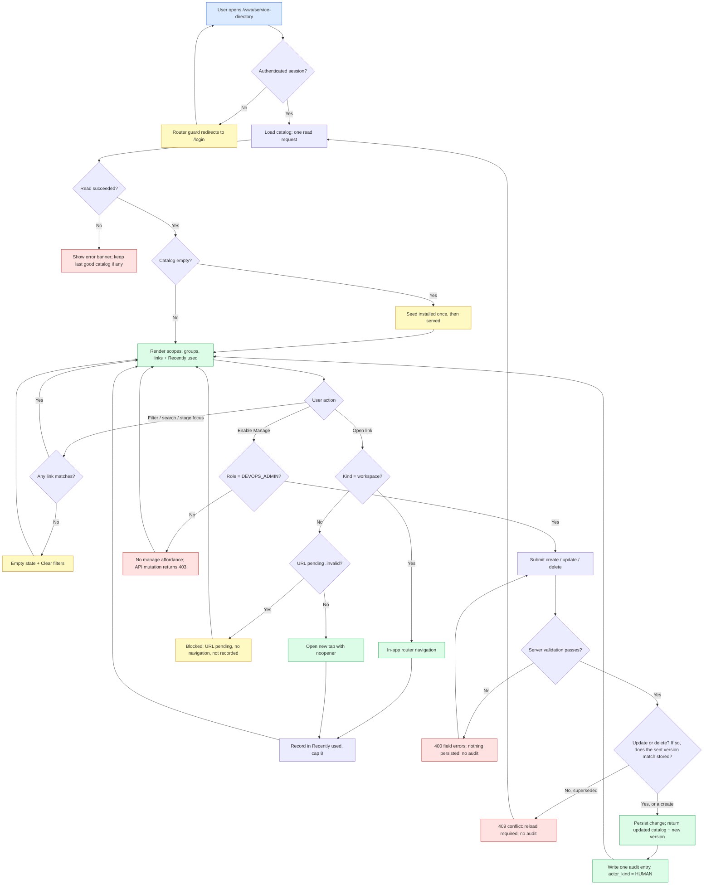

# Feature Specification: Service Directory

> **Slice:** `service-directory`
> **Source stories:** SD-US-01 … SD-US-08 (`docs/02-user-stories/service-directory-user-stories.md`)
> **Source requirements:** SD-REQ-01 … SD-REQ-14 (`docs/01-requirements/service-directory-requirement.md`)
> **Spec status:** Regenerated via `user-story-to-spec` — awaiting user acceptance
> **Last updated:** 2026-07-25
> **UX baseline:** `docs/prototypes/wwa-service-directory.html`

This document is the **behavior source of truth** for the slice. Code, tests, and tasks trace back here.

**Corrections applied during the grounding pass** (the earlier draft asserted these incorrectly):

1. Free-text search does **not** match link URLs; it matches display text only (§7.3).
2. Audit reuse of `config_update` / `config_delete` is rejected; the slice introduces dedicated action types (§7.6).
3. `openInNewTab` is not stored; open behavior is derived from link kind (§6.1).
4. Guest read access is stated as a committed default rather than "policy TBD" (§5, SD-OQ-01).

---

## Overview

**Feature summary:**
Service Directory is a Platform-shared Hub page that renders an administrator-maintained catalog of
destinations — documentation, tools, in-Hub workspaces, and source repositories — organised as
`scopes → groups → links`, with filtering, a personal Recently used strip, and audited `DEVOPS_ADMIN`
maintenance.

**Business objective:**
Cut the time delivery teams and new joiners spend locating tools, guidelines, and agent source code,
and remove the code-deploy dependency for adding a new destination category.

**In-scope outcome:**
At delivery, any authenticated user can open `/wwa/service-directory` from the flyout or Home, filter
a seeded catalog covering the seven SDLC stages plus Common and External destinations, open links with
correct in-app or new-tab behavior, and see their own Recently used list. A `DEVOPS_ADMIN` can perform
full CRUD on the catalog, every mutation is audited with `actor_kind = HUMAN`, and no catalog data is
stored in Configuration Management.

---

## Source Stories

| Story | Title / Summary | Key Capability |
|---|---|---|
| SD-US-01 | Reach Service Directory from Hub navigation | Route, flyout entry, Home Shared Controls entry, auth guard |
| SD-US-02 | Browse and filter the destination catalog | Scope / kind filters, search, empty state, `/` shortcut |
| SD-US-03 | Navigate SDLC stages and open each agent's source | Stage strip, stage focus, kind sub-headings, open behavior |
| SD-US-04 | Find shared platform and engineering systems | Seed content, Common / External scopes, pending-URL handling |
| SD-US-05 | Re-open frequently used destinations quickly | Recently used (browser-local, max 8, clearable, self-healing) |
| SD-US-06 | Maintain the catalog as DEVOPS_ADMIN | CRUD, validation, cascade delete, system-scope protection, conflict handling |
| SD-US-07 | Review who changed the catalog | Audit on mutations only, identifiable entity, resilient audit write |
| SD-US-08 | Keep the catalog out of Configuration Management | Dedicated store, Platform API, boundary decision |

---

## Actors / Users

**Primary actors** (directly interact with the feature):

- **Authenticated Hub user** (`DEVELOPER`, `TL`, `AUDIT`, `MANAGEMENT`): reads the catalog, filters, opens links, owns a browser-local Recently used list.
- **DEVOPS_ADMIN**: everything above, plus catalog create / update / delete.
- **Guest viewer** (`GUEST`): read-only catalog access; all mutations blocked. `[DEFAULT — revisit if wrong; SD-OQ-01]`

**Supporting actors** (indirectly involved):

- **Auditor / platform owner**: consumes catalog mutation records through the existing Audit Log page.
- **Platform operations**: supplies production URLs for seeded placeholder links (SD-OQ-02).
- **Agent Contribute Dashboard owner**: keeps SDLC guideline / feedback link content aligned (SD-REQ-14).

---

## Functional Scope

**Core capability domains:**

- **Navigation placement** — route, flyout entry, Home Shared Controls entry, shell integration.
- **Catalog read** — load the persisted catalog, hide disabled entries, order deterministically, render scope → group → link.
- **Discovery** — scope filter, kind filter, SDLC stage focus, free-text search, empty states.
- **Link activation** — in-app navigation for `workspace`, protected new tab for other kinds, pending-URL suppression.
- **Personal shortcuts** — Recently used capture, capping, clearing, and self-healing against deleted links.
- **Administration** — manage mode, create / update / delete for scopes, groups, links, validation, cascade delete, system-scope protection, conflict handling.
- **Audit** — one entry per successful mutation, identifying the affected entity.
- **Boundary enforcement** — dedicated store, Platform-shared API with no agent parameter.

**Lifecycle stages:**

1. **Provision** — on first read of an empty store, the seed catalog is installed once.
2. **Read** — every page load fetches the whole catalog in one request.
3. **Discover** — the user narrows results client-side.
4. **Activate** — the user opens a link; the client records it as recently used.
5. **Maintain** — an administrator mutates the catalog; the change is validated, persisted, and audited.
6. **Re-read** — other users see the change on their next load. There is no push or live refresh.

**Workflow boundaries:**

- Entry point: navigating to `/wwa/service-directory` (from flyout, Home, or a direct URL).
- Exit point: the user opens a destination, or leaves the page. The feature has no terminal business state — the catalog is long-lived reference data.
- Out-of-band transitions: an administrator mutation invalidates other users' loaded copies (resolved by reload); a stale administrator write is rejected as a conflict; a link deleted while present in someone's Recently used list is dropped on their next load.

---

## Functional Requirements

> Requirements marked `[INFERRED]` are not explicitly stated in the source stories but are logically
> required. Confirm before treating as committed scope.
> Requirements marked `[DEFAULT]` are decisions committed by this spec that the user should ratify.

### FR Group 1 — Navigation And Placement

- **SD-FR-01**: The application exposes route `/wwa/service-directory`, rendered inside the existing Hub workspace shell, with the section title "Service Directory". *(Source: SD-US-01)*
- **SD-FR-02**: The Platform flyout lists a Service Directory entry, unlocked for all roles (no access permission gate). *(Source: SD-US-01)*
- **SD-FR-03**: The Home page Shared Controls section lists a Service Directory card pointing at the same route. *(Source: SD-US-01)*
- **SD-FR-04**: Unauthenticated access to the route follows the existing router guard: session restore is attempted, then redirect to login. *(Source: SD-US-01)*
- **SD-FR-05**: Flyout and Home entries are driven by the single existing Platform capability registry, so one registration serves both surfaces. `[INFERRED]`

### FR Group 2 — Catalog Read And Rendering

- **SD-FR-06**: The page loads the entire catalog with one read request and renders without further server calls. *(Source: SD-US-02)*
- **SD-FR-07**: Catalog structure is `scope → group → link`; no scope, group, or link is enumerated in application code. *(Source: SD-US-02, SD-REQ-02)*
- **SD-FR-08**: Non-admin readers receive only enabled scopes, enabled groups, and enabled links. Disabled entries are omitted from their payload, not merely hidden client-side. *(Source: SD-US-02, SD-US-06)*
- **SD-FR-09**: A `DEVOPS_ADMIN` may request the catalog including disabled entries in order to manage them; disabled entries are visually marked when shown. *(Source: SD-US-06)*
- **SD-FR-10**: Ordering is by `sortOrder` ascending at each level. Ties break by `key` ascending for scopes and groups, and — because links have no key — by `title` ascending then `id` ascending for links, so rendering is fully deterministic at every level. *(Source: SD-US-02)* `[INFERRED — tie-break rule]`
- **SD-FR-11**: Each scope declares a layout of either `stage-strip` (SDLC-style, with a stage rail) or `buckets` (plain grouped sections). *(Source: SD-US-03, prototype)*
- **SD-FR-12**: Each group declares a type of either `stage` (carries stage order and owning agent name) or `bucket`. *(Source: SD-US-03, prototype)*
- **SD-FR-13**: Within a group, links are presented under fixed kind sub-headings in this order: Docs / Confluence, Tools, WWA workspaces, GitHub / source (for newcomers). Empty sub-headings are omitted for readers. *(Source: SD-US-03)*

### FR Group 3 — Filtering And Search

- **SD-FR-14**: Scope filter offers **All** plus one option per enabled scope; selection is single-value. *(Source: SD-US-02)*
- **SD-FR-15**: Kind filter offers **All links**, **Docs / Confluence**, **Tools**, **WWA workspaces**, **GitHub / source**; selection is single-value. *(Source: SD-US-02)*
- **SD-FR-16**: Free-text search is case-insensitive and matches against: link title, link description, link kind label, link kind, parent group name, parent group description, parent group owning agent, and scope label. It does **not** match link URLs. *(Source: SD-US-02, corrected from draft)*
- **SD-FR-17**: The stage rail is shown when the SDLC scope is enabled and the active scope is **All** or SDLC; it is de-emphasised when another scope is active. *(Source: SD-US-03)*
- **SD-FR-18**: Selecting a stage focuses that stage's group, sets the active scope to SDLC, and hides other scopes for the duration of the focus. *(Source: SD-US-03)*
- **SD-FR-19**: Selecting the already-focused stage clears the stage focus. *(Source: SD-US-03)*
- **SD-FR-20**: Selecting a scope other than SDLC or All clears any stage focus. *(Source: SD-US-03)*
- **SD-FR-21**: Groups with zero links after filtering are hidden from readers. *(Source: SD-US-02)*
- **SD-FR-22**: When no link matches, the page shows an empty state naming the active filters plus a single clear-filters action. *(Source: SD-US-02)*
- **SD-FR-23**: Pressing `/` moves focus to search when focus is not already in a text input and no dialog is open. *(Source: SD-US-02, prototype)*

### FR Group 4 — Link Activation

- **SD-FR-24**: A `workspace` link navigates within the Hub using client-side routing; the page is not reloaded and no new tab is opened. *(Source: SD-US-03)*
- **SD-FR-25**: `docs`, `tool`, and `repo` links open in a new browser tab with `noopener` protection. *(Source: SD-US-03)*
- **SD-FR-26**: Open behavior is derived from the link kind; it is not a separately stored per-link flag. *(Source: SD-US-03, corrected from draft)*
- **SD-FR-27**: A link whose URL host ends in the reserved suffix `.invalid` is rendered as "URL pending", is not activatable, and is not recorded in Recently used. *(Source: SD-US-04)* `[DEFAULT]`

### FR Group 5 — Recently Used

- **SD-FR-28**: Activating a link records it as the most recent entry for the current browser. *(Source: SD-US-05)*
- **SD-FR-29**: The list holds at most 8 entries, most recent first. *(Source: SD-US-05, prototype `MAX_RECENT = 8`)*
- **SD-FR-30**: Re-activating a listed link moves it to the front without duplicating it. *(Source: SD-US-05)*
- **SD-FR-31**: The list is stored per browser, not per server-side user account. *(Source: SD-US-05)*
- **SD-FR-32**: With no entries, the region shows an empty message; no entries are pre-populated. *(Source: SD-US-05)*
- **SD-FR-33**: A clear action empties the list and removes the stored value from that browser only. *(Source: SD-US-05)*
- **SD-FR-34**: Entries that no longer resolve against the current catalog are dropped silently on load. *(Source: SD-US-05)*
- **SD-FR-35**: Recently used activity produces no audit entries and no server writes. *(Source: SD-US-05, SD-US-07)*

### FR Group 6 — Administration

- **SD-FR-36**: Manage affordances render only for users holding `DEVOPS_ADMIN`. *(Source: SD-US-06)*
- **SD-FR-37**: Every catalog mutation endpoint verifies `DEVOPS_ADMIN` server-side from the session-derived user context and returns HTTP 403 otherwise; a client-supplied role is never trusted. *(Source: SD-US-06, SD-NFR-01)*
- **SD-FR-38**: An administrator can create, update, and delete a scope, a group, and a link. *(Source: SD-US-06)*
- **SD-FR-39**: In manage mode, groups with no links remain visible with per-kind add affordances. *(Source: SD-US-06, prototype)*
- **SD-FR-40**: Scope keys are unique across the catalog; group keys are unique within their scope. Violations are rejected with a field-level validation error. *(Source: SD-US-06)*
- **SD-FR-41**: Deleting a scope removes its groups and their links in the same operation; the confirmation states how many groups and links will be removed. *(Source: SD-US-06)*
- **SD-FR-42**: Deleting a group removes its links in the same operation. `[INFERRED — symmetric with SD-FR-41]`
- **SD-FR-43**: The seeded system scopes `sdlc`, `common`, and `external` cannot be deleted. Their **`key` is immutable**; their title, description, `sortOrder`, and `enabled` flag remain editable. *(Source: SD-US-06, SD-REQ-12)* `[DEFAULT]`
  > "Renamed" means the displayed title changes, not the key. The key is an identifier that behavior depends on — the stage rail is selected by the `stage-strip` layout and the SDLC scope's key, so a renamed key would silently break stage focus. Editing a non-system scope's key is likewise rejected; a key is chosen once at create time.
- **SD-FR-44**: Every **update and delete** request carries the catalog `version` the client last read. If it does not match the stored version, the request is rejected with HTTP 409 and a reload instruction, and nothing is applied. This is what makes a stale-page edit detectable: without a client-supplied version, a save issued minutes after another administrator's save would be applied silently as a last-write-wins overwrite. See also SD-FR-67 (creates are exempt) and SD-FR-68 (the second, storage-level layer). *(Source: SD-US-06, SD-NFR-06)* `[DEFAULT]`
- **SD-FR-45**: A successful mutation returns the updated catalog, including its new `version`, so the client's view converges without a second request. `[DEFAULT]`

### FR Group 7 — Validation

- **SD-FR-46**: `kind` must be one of `docs`, `tool`, `workspace`, `repo`. *(Source: SD-US-06)*
- **SD-FR-47**: For `workspace` links, the URL must be an in-Hub absolute path matching exactly `^/wwa/[A-Za-z0-9._~\-/]*$` — so no query string, no fragment, no host, and no percent-encoding. For `docs`, `tool`, and `repo` links, the URL must use the `http` or `https` scheme (scheme comparison is case-insensitive). *(Source: SD-US-06, SD-REQ-11)* `[DEFAULT]`
  > The `workspace` pattern is deliberately narrow. Every in-Hub destination today is a plain path, and admitting `?` or `#` would mean the catalog could store router state that the target view does not honour — a broken link that validates. If a future destination genuinely needs a query string, widen this one pattern rather than adding a second URL rule.
- **SD-FR-48**: URLs using `javascript:`, `data:`, or `vbscript:` schemes, protocol-relative URLs (`//host`), and blank URLs are rejected. *(Source: SD-REQ-11)*
- **SD-FR-49**: Scope and group keys match `^[a-z0-9][a-z0-9_-]{1,31}$` after trimming and lower-casing the submitted value. *(Source: SD-US-06)* `[DEFAULT]`
- **SD-FR-50**: Titles are required, trimmed, and at most 120 characters. Descriptions are optional and at most 240 characters. `sortOrder` is an integer between 0 and 9999. When `sortOrder` is omitted on create it defaults to the highest sibling value plus 10, **clamped to 9999** so the default can never itself violate the range; a clamped collision is resolved by the SD-FR-10 tie-break rather than rejected. *(Source: SD-US-06)* `[DEFAULT]`
- **SD-FR-51**: `stageKey`, when present on a group, must be one of the seven SDLC stage keys: `planning`, `estimation`, `discovery`, `build`, `testing`, `deployment`, `maintenance`. For a group with `type = stage`, **`key` and `stageKey` must be equal**, so a stage has exactly one identity. *(Source: SD-US-03)* `[DEFAULT]`
  > Without this rule a group could carry `key = deploy` and `stageKey = deployment`, and the stage rail would have two candidate identifiers with no stated winner. Requiring equality also means group-key uniqueness within the scope (SD-FR-40) automatically guarantees stage uniqueness — no second rule is needed.
  See also SD-FR-70, which limits the catalog to one stage-strip scope.
- **SD-FR-52**: Validation is enforced server-side; client-side validation is a convenience that must mirror the same rules. *(Source: SD-US-06)* `[INFERRED]`

### FR Group 8 — Audit

- **SD-FR-53**: Each successful create / update / delete writes exactly one audit entry attributed to the acting operator with `actor_kind = HUMAN`. *(Source: SD-US-07)*
- **SD-FR-54**: Catalog mutations use dedicated audit action types distinct from Configuration Management's `config_update` / `config_delete`. Deletions use the delete action type; creates and updates use the update action type. *(Source: SD-US-07, corrected from draft)*
- **SD-FR-55**: The audit entry identifies the affected entity type (`scope` / `group` / `link`), its identifier and key or title, and the operation performed. This detail travels in the audit entry's context payload, which the existing audit read model already exposes. *(Source: SD-US-07)*
- **SD-FR-56**: A cascade delete records the parent operation and a summary count of removed descendants in one entry, not one entry per descendant. *(Source: SD-US-07)* `[DEFAULT]`
- **SD-FR-57**: A failed mutation (validation, authorization, or conflict) writes no audit entry. *(Source: SD-US-07)*
- **SD-FR-58**: An audit write failure must not fail or roll back the catalog mutation; it is logged server-side. *(Source: SD-US-07, SD-NFR-05)*
- **SD-FR-59**: Reads, filtering, and Recently used are never audited. *(Source: SD-US-07)*

### FR Group 9 — Provisioning And Boundary

- **SD-FR-60**: When the catalog store is empty, a seed catalog is installed once, covering the seven SDLC stage groups, Common (Platform and Engineering tools including ARCAD and GitHub Enterprise), and External. *(Source: SD-US-04, SD-REQ-06)*
- **SD-FR-61**: Seeding must be idempotent — it runs only against an empty store and never overwrites administrator edits, including a deliberately emptied catalog. *(Source: SD-US-04)* `[INFERRED]`
- **SD-FR-62**: Seed links whose production URL is unknown use the reserved `.invalid` suffix so they render as pending rather than as dead links. *(Source: SD-US-04, SD-OQ-02)* `[DEFAULT]`
- **SD-FR-63**: The catalog is stored in its own dedicated persistence; no Service Directory data is written to `DA_CONFIGURATION_COMPONENT`, `DA_CONFIGURATION_ITEM`, or `DA_SCOPE_DIRECTORY`, and no configuration key is added for it. *(Source: SD-US-08, SD-REQ-10)*
- **SD-FR-64**: All endpoints are Platform-shared under `/api/platform/` and accept no agent parameter; no agent boundary forcing applies. *(Source: SD-US-08)*
- **SD-FR-65**: Guest sessions may read the catalog. All non-read requests from a guest session remain blocked by the existing guest read-only enforcement, and this slice adds no exemption. *(Source: SD-US-01, SD-US-06)* `[DEFAULT — SD-OQ-01]`
- **SD-FR-66**: SDLC guideline and feedback link content is aligned with the Agent Contribute Dashboard manually for MVP; no automated dual-write is introduced. *(Source: SD-US-08, SD-REQ-14)*

### FR Group 10 — Concurrency And Structural Detail

These were added after review found that storage-level optimistic locking alone cannot detect a stale
page, and that two rules had more than one possible reading. They are numbered at the end so the
existing ids stay stable.

- **SD-FR-67**: **Create** requests do not carry a version and are never rejected as stale. A create only appends to the current document, so it cannot overwrite another administrator's work; requiring a version there would generate conflicts that protect nothing. *(Source: SD-US-06)* `[DEFAULT]`
- **SD-FR-68**: Independently of SD-FR-44, the store enforces its own optimistic locking, so two mutations overlapping in flight still cannot interleave — the loser receives the same 409 with the same error code. The two mechanisms cover different windows and neither replaces the other: SD-FR-44 covers "stale page", storage-level locking covers "same instant". *(Source: SD-NFR-06)* `[INFERRED]`
- **SD-FR-69**: A 409 is not a validation error and carries no field-level detail. The client's only correct response is to reload the catalog and ask the administrator to reapply the edit; merging is never attempted, because a merge could resurrect an entry another administrator deleted. *(Source: SD-US-06)* `[DEFAULT]`
- **SD-FR-70**: At most one scope may declare `layout = stage-strip`; a second one is rejected on create and on update. Stage focus selects "the stage-strip scope" (SD-FR-18), and with two such scopes that phrase has no single referent. *(Source: SD-US-03)* `[DEFAULT]`

---

## Non-Functional Requirements

Ids `SD-NFR-01` … `SD-NFR-10` are defined in
`docs/01-requirements/service-directory-requirement.md` §5 and restated here with the behavior each one
implies. `SD-NFR-11` is introduced by this spec.

| # | Category | Requirement | Verified by |
|---|---|---|---|
| **SD-NFR-01** | Security | Read requires an authenticated session (including guest sessions per SD-FR-65). Every write requires `DEVOPS_ADMIN` resolved from the server-side user context; a client-supplied role is never trusted (SD-FR-37) | Contract test: each mutation returns 403 for `DEVELOPER` |
| **SD-NFR-02** | Security | Guest write attempts remain blocked by the existing guest read-only enforcement; this slice adds no exemption path | Contract test: guest mutation rejected |
| **SD-NFR-03** | Security | Stored URLs are validated on write and escaped on render; unsafe schemes are rejected (SD-FR-48); `docs` / `tool` / `repo` targets open with `noopener` so the opened page cannot reach back into the Hub window | Contract test per URL rule; manual check of the rendered anchor |
| **SD-NFR-04** | Auditability | Mutations only: exactly one entry per successful request, `actor_kind = HUMAN`, affected entity identifiable (SD-FR-53 … SD-FR-59) | Contract test: entry present on success, absent on failure and on reads |
| **SD-NFR-05** | Reliability | An audit write failure never fails or rolls back the catalog mutation | Existing `REQUIRES_NEW` audit propagation; asserted by inspection |
| **SD-NFR-06** | Reliability | Concurrent administrator writes never silently lose data. Two layers: the client-supplied version on updates and deletes (SD-FR-44) catches a stale page, and storage-level optimistic locking (SD-FR-68) catches an in-flight overlap. Both return HTTP 409; a rejected mutation leaves the catalog byte-for-byte unchanged | Contract test: an update and a delete carrying a superseded version each return 409 and change nothing; a create carrying no version still succeeds against a moved-on catalog (SD-FR-67) |
| **SD-NFR-07** | Performance | One read request serves the whole page with no N+1 fan-out; filtering and search run client-side with no round trip. MVP ceiling: ≤ 20 scopes, ≤ 100 groups, ≤ 600 links | Single-request assertion; manual timing at seed size |
| **SD-NFR-08** | Environment | Works on Oracle (`default`) and H2 (`local`, `test`) using the repository's existing CLOB-backed JSON conversion; no vendor-specific JSON SQL | `mvn test` on H2 plus the regenerated Oracle greenfield schema |
| **SD-NFR-09** | Privacy | Recently used never leaves the browser; no per-user browsing history is persisted server-side (SD-FR-31) | Manual walkthrough with the network panel open: activating a link issues no request. No contract test applies, because there is no endpoint to call |
| **SD-NFR-10** | UX consistency | Existing Hub design tokens and component patterns only; chips and cards are keyboard reachable; the `/` shortcut must not hijack typing in inputs (SD-FR-23) | `npm run build` plus the manual walkthrough |
| **SD-NFR-11** | Observability | Mutation endpoints participate in the existing request correlation mechanism; this slice introduces no bespoke metrics | Inspection `[INFERRED]` |

The catalog holds no secrets and no credentials. The seed must contain no real internal hostname that
would itself be sensitive; unknown URLs stay as `.invalid` placeholders (SD-FR-62).

---

## Workflow / System Flow

### User Flow Diagram

### Main Flow

1. **Trigger.** The user navigates to `/wwa/service-directory` from the Platform flyout, the Home Shared Controls grid, or a direct URL. An unauthenticated visitor is sent to login first and returns afterwards.
2. **Read.** The page issues one catalog read. A non-admin receives enabled entries only; an administrator may request disabled entries too.
3. **Provision (first run only).** If the store is empty, the seed catalog is installed once and then served. A catalog that an administrator has deliberately emptied is not re-seeded.
4. **Render.** Scopes render in `sortOrder`, then groups, then links under fixed kind sub-headings. The SDLC scope renders with a stage rail; other scopes render as bucket sections. The Recently used strip renders above the filters when it has resolvable entries.
5. **Discover.** The user applies a scope filter, a kind filter, a stage focus, or search text. All narrowing happens client-side. Groups emptied by filtering disappear; if nothing matches, an empty state with a clear action is shown.
6. **Activate.** Opening a `workspace` link navigates inside the Hub. Opening a `docs`, `tool`, or `repo` link opens a protected new tab. A pending (`.invalid`) URL is not activatable. Any successful activation records the link at the front of Recently used, capped at 8.
7. **Maintain.** A `DEVOPS_ADMIN` enables manage mode and submits a create, update, or delete. The server re-checks the role, validates the payload, checks the supplied catalog version on updates and deletes (SD-FR-44), applies the change atomically, returns the updated catalog with its new version, and writes one audit entry.
8. **Terminal states.** There is no business terminal state. Per-request terminal outcomes are: rendered catalog, opened destination, persisted-and-audited mutation, or a rejected request (401 / 403 / 400 / 404 / 409 / 5xx) that leaves the catalog untouched. This slice never returns 422 — that status belongs to the spreadsheet import flow, which this capability does not use.

### Error And Exception Paths

| Path | Behavior |
|---|---|
| Read fails on first load | Error banner with retry; no catalog rendered |
| Read fails on refresh | Error banner; the previously loaded catalog stays on screen |
| Non-admin calls a mutation endpoint | 403; nothing persisted; no audit |
| Guest attempts any mutation | Blocked by existing guest read-only enforcement before reaching the controller |
| Invalid payload | Field-level errors; nothing persisted; no audit |
| Duplicate key | Field-level error naming the conflicting key |
| Delete of a system scope | Rejected with an explanatory validation error |
| Attempt to change any scope's or group's `key` | Rejected: a key is set once at create time (SD-FR-43) |
| Mutation target not found | 404; nothing persisted |
| Update or delete carrying a superseded catalog version | 409 with a reload instruction; nothing persisted; no audit (SD-FR-44) |
| Update or delete carrying no version at all | 400 — the version is required, and defaulting it would silently disable stale detection |
| Create carrying no version | Accepted; creates are exempt by design (SD-FR-67) |
| Audit write fails after a valid mutation | Mutation stands; failure logged server-side; user sees success |
| Recently used storage unavailable or corrupt | Feature degrades to empty and keeps working; catalog is unaffected |

---

## Data / Configuration Requirements

**Key entities:**

| Entity | Description | Key Attributes |
|---|---|---|
| Catalog | The single versioned container for all directory content | version, updatedBy, updatedAt, scopes |
| Scope | Top-level category and filter chip (for example SDLC, Common, External) | key, title, description, layout, system, enabled, sortOrder |
| Group | A section within a scope — an SDLC stage or a plain bucket | key, title, description, type, stageOrder, agentName, stageKey, enabled, sortOrder |
| Link | A single destination card | id, title, description, url, kind, kindLabel, enabled, sortOrder |

Detailed field-level definitions live in `docs/04-architecture/service-directory-data-model.md`.

**Configuration objects / parameters:**

- **Seed catalog** — a versioned, environment-independent definition of the initial catalog content, installed only into an empty store.
- **Recently used storage key** — a versioned browser storage key; the version suffix is bumped when the stored shape changes incompatibly.
- **Recently used cap** — fixed at 8 for MVP.

**Statuses / state machine:**

The catalog is reference data, not a workflow entity. The only lifecycle state is per-entity availability:

- Valid states: `enabled`, `disabled`.
- Valid transitions: `enabled → disabled` and `disabled → enabled`, both by administrator update. Deletion removes the entity (and its descendants) outright; there is no soft-delete state.
- Readers only ever see `enabled` entities (SD-FR-08); administrators may view both (SD-FR-09).

**Validation rules:** see FR Group 7 (SD-FR-46 … SD-FR-52).

**Rule traces** (each new rule checked against at least three cases, including one where it must not fire):

| Rule | Traced cases |
|---|---|
| Pending-URL suffix (SD-FR-27) | `https://arcad.example.invalid/` → host ends `.invalid` → pending ✓ · `https://invalid-tool.acme.com/` → host does not end `.invalid` → normal link ✓ (rule must not fire) · `/wwa/build-agent` → no host → normal workspace link ✓ |
| Workspace URL restriction (SD-FR-47) | `/wwa/audit-log` on a `workspace` link → accepted ✓ · `https://example.com` on a `workspace` link → rejected ✓ · `/wwa/audit-log` on a `tool` link → rejected (needs http/https) ✓ · `//evil.example` on any kind → rejected as protocol-relative ✓ · `/wwa/audit-log?tab=all` → **rejected**, query strings are outside the pattern ✓ · `/dashboard` → rejected, must start `/wwa/` ✓ |
| Stale-write precondition (SD-FR-44, SD-FR-67) | client read version 7, no one else wrote, sends 7 on an update → applied, catalog becomes version 8 ✓ · client read version 7, another admin saved (stored is now 8), client sends 7 on an update → 409, nothing applied ✓ · same stale client sends a **create** with no version → applied, because a create cannot overwrite anything (rule must not fire) ✓ · update sent with no version at all → 400, not a silent pass ✓ |
| Stage identity (SD-FR-51) | group `key = deployment`, `stageKey = deployment`, `type = stage` → accepted ✓ · group `key = deploy`, `stageKey = deployment`, `type = stage` → rejected, they must be equal ✓ · group `key = engineering-tools`, no `stageKey`, `type = bucket` → accepted, the rule does not apply to buckets (must not fire) ✓ |
| One stage strip (SD-FR-70) | seeded catalog with only `sdlc` as `stage-strip` → accepted ✓ · creating a second `stage-strip` scope → rejected ✓ · creating a second `buckets` scope → accepted, no limit on bucket scopes (must not fire) ✓ |
| Key immutability (SD-FR-43) | update `sdlc`'s title to "Delivery Lifecycle" → accepted, key untouched ✓ · update `sdlc`'s key to `delivery` → rejected ✓ · update an admin-created scope's key → also rejected, keys are set once ✓ · disable `sdlc` → accepted (must not fire) ✓ |
| Key pattern (SD-FR-49) | `sdlc` → accepted ✓ · `SDLC ` → trimmed and lower-cased to `sdlc`, accepted ✓ · `-security` → rejected (must start alphanumeric) ✓ · `a` → rejected (minimum two characters) ✓ |
| Deterministic order (SD-FR-10) | two scopes with `sortOrder` 10 and 20 → 10 first ✓ · two scopes both `sortOrder` 20 with keys `common` / `external` → `common` first ✓ · a scope with `sortOrder` 0 → sorts before 10 ✓ · two links in one group both `sortOrder` 10 → `title` decides, since links have no key ✓ · two links with the same `sortOrder` **and** the same title → `id` decides, so order is still stable across reloads ✓ |
| Search field scope (SD-FR-16) | searching a word present only in a link title → matches that link ✓ · searching a path segment that appears only inside URLs → matches nothing, because URLs are not searched ✓ · searching "github" → **does** match every `repo` link, because the kind label "GitHub / source" is searched even though the URL is not (rule must not be mistaken for "the word github matches nothing") ✓ |
| Recently used cap (SD-FR-29, SD-FR-30) | 9 distinct opens → oldest dropped, 8 kept ✓ · re-open of entry 5 → moves to front, count unchanged ✓ · open of a link later deleted → dropped on next load, count shrinks ✓ |
| System-scope protection (SD-FR-43) | delete `sdlc` → rejected ✓ · delete an admin-created `security` scope → allowed ✓ · disable `sdlc` → allowed, page renders remaining scopes ✓ |
| Link tie-break (SD-FR-10) | two links, `sortOrder` 10 and 20 → 10 first ✓ · both `sortOrder` 10, titles "Argo" / "Bamboo" → "Argo" first ✓ · both `sortOrder` 10 and both titled "Runbook" → lower `id` first, so order is stable across reloads ✓ |

---

## Integrations

**External systems:**

- None called by this feature. Catalog links point at external systems (Confluence, Jira, Jenkins, ARCAD, GitHub Enterprise, ServiceNow, Grafana, and similar), but the Hub never calls them — it only renders navigable URLs. No health probe, no metadata fetch, no credential exchange.

**APIs / interfaces:**

- **Catalog read API** (inbound, consumed by the Service Directory page): returns the whole catalog.
- **Catalog mutation API** (inbound, `DEVOPS_ADMIN` only): create / update / delete for scope, group, and link, each returning the updated catalog.
- **Audit write** (internal, outbound from the catalog service to the existing audit component).
- Concrete paths, payloads, and status codes: `docs/05-design/contracts/service-directory-API_IMPLEMENTATION_GUIDE.md`.

**Credentials / secrets:**

- None. The catalog stores public-within-the-enterprise URLs only.

**Dependency assumptions:**

- The existing session auth chain populates a server-side user context carrying roles for every request.
- The existing guest read-only enforcement blocks non-read HTTP methods for guest sessions before controller logic runs.
- The existing audit component writes in its own transaction so an audit failure cannot roll back the caller.
- The existing global exception handling maps optimistic-lock failures to HTTP 409 and validation failures to a standard error envelope.

---

## Dependencies

**Upstream dependencies** (must exist before this feature works — all verified present in the repository):

- Session-based authentication with header fallback for `local` / `test`, and the guest read-only filter.
- Server-side role checking through the request's user context.
- The audit write component and its action-type enumeration.
- Oracle/H2-compatible CLOB JSON storage support.
- The Flyway migration chain (for the new table) and the greenfield Oracle schema document.
- The Hub shell, router, and single Platform capability registry that feeds both the flyout and Home.

**Downstream dependencies** (things that depend on this feature once delivered):

- The Audit Log page must display the new action types intelligibly to auditors.
- SDLC guideline / feedback content ownership becomes shared with the Agent Contribute Dashboard (manual alignment, SD-FR-66).
- Future agent onboarding expects a `repo` link to be registered for each published agent tool.

---

## Risks / Ambiguities

| # | Description | Type | Impact | Recommendation |
|---|---|---|---|---|
| SD-R-01 | Guest read access is a security-posture decision that the user has not ratified; this spec commits a default of "allow read". | Assumption | Med | Ratify SD-OQ-01 during acceptance. Reversal is cheap (a route guard plus a read-side role check), but only before implementation. |
| SD-R-02 | Production ARCAD and GitHub Enterprise URLs are unknown, so the seed ships pending placeholders and the page is not fully useful at first deploy. | Gap | Med | Close SD-T02 before release; the pending-URL rendering rule keeps the page honest in the meantime. |
| SD-R-03 | Storing the catalog as a single versioned document means two administrators editing unrelated links can collide and one receives a conflict. | Assumption | Low | Accept for MVP: writes are rare and the conflict is explicit rather than a silent lost update. Revisit only if administrator concurrency becomes real. |
| SD-R-04 | "Scope" already means access scoping in this codebase (`ScopeDirectoryEntry`, `AccessScope`); a second meaning invites confusion in code and conversation. | Conflict | Med | Keep the qualified names "directory scope" / "catalog scope" in code and docs, and never reuse the existing scope types for this slice. |
| SD-R-05 | Adding audit action types changes a shared backend enumeration consumed by the Audit Log page and API filter. | Assumption | Low | Verified: the frontend audit model types `actionType` as a plain string, so no frontend union needs updating. Add the constants additively and confirm the Audit Log filter still binds correctly. |
| SD-R-06 | Recently used introduces the first browser-storage usage in this frontend, so there is no existing convention to inherit. | Gap | Low | This spec fixes the key name and shape; treat it as the convention for future slices. |
| SD-R-07 | Seed content overlaps the Agent Contribute Dashboard's static guideline / feedback links, so the two can drift. | Assumption | Med | MVP accepts manual alignment (SD-FR-66); a shared source is explicitly a later slice (SD-OQ-03). |
| SD-R-08 | Disabling the `sdlc` scope removes the stage rail and a large part of the page's value in one click. | Unclear | Low | Allowed but the manage UI must warn when disabling a system scope. |

---

## Out of Scope

The following are explicitly excluded:

- **Storage inside Configuration Management** — violates the boundary this slice exists to protect (SD-FR-63).
- **Link health checks or status probes** — the Hub does not call linked systems; ownership and uptime live elsewhere.
- **Automatic discovery or sync from GitHub / Confluence** — no crawler, bot, or scheduled import in this slice.
- **Server-side Recently used or cross-device sync** — personal data with privacy implications; not needed for the MVP outcome.
- **Per-user favourites, pinning, or popularity ranking** — future enhancement, no current requirement.
- **Embedding third-party UIs in iframes** — security and licensing risk; links open externally.
- **A dedicated Service Directory audit UI** — the shared Audit Log page is the review surface.
- **Draft / approval workflow for catalog edits** — `DEVOPS_ADMIN` writes take effect immediately.
- **Bulk import / export of links** — manual entry only in MVP.
- **Drag-and-drop reordering** — order is a numeric field in MVP.
- **New roles or permissions** — the slice reuses `DEVOPS_ADMIN` only.
- **Changing the Agent Contribute Dashboard's existing status storage** — out of slice.
- **The prototype's mock role switch, client-side catalog store, and seeded fake recents** — see requirement §8.

---

## Open Questions

| # | Question | Raised from | Owner |
|---|---|---|---|
| **SD-OQ-01** | May guest sessions read the Service Directory, or should they be redirected away? Spec default: read allowed (SD-FR-65). | SD-US-01, SD-REQ-13 | Product / Security |
| **SD-OQ-02** | What are the production ARCAD and GitHub Enterprise URLs? Spec default: pending `.invalid` placeholders until supplied (SD-FR-62). | SD-US-04 | Ops / Platform |
| **SD-OQ-03** | Should SDLC guideline / feedback links become a single shared source with the Agent Contribute Dashboard? Spec default: manual alignment for MVP (SD-FR-66). | SD-US-08 | Product |
| **SD-OQ-04** | Must the store-boundary ADR be accepted before implementation starts? Spec default: yes — `ADR-0010` accompanies this set as Proposed. | SD-US-08 | Architecture |

---

## Acceptance Criteria Matrix

| Story | Requirements | Functional requirements | Observable acceptance check |
|---|---|---|---|
| SD-US-01 | SD-REQ-01 | SD-FR-01 … SD-FR-05 | Flyout entry and Home card both open `/wwa/service-directory` inside the shell; unauthenticated access redirects to login |
| SD-US-02 | SD-REQ-02, SD-REQ-05 | SD-FR-06 … SD-FR-10, SD-FR-14 … SD-FR-16, SD-FR-21 … SD-FR-23 | Scope, kind, and search filters narrow results as specified; URLs are not searched; empty state offers Clear filters; `/` focuses search |
| SD-US-03 | SD-REQ-03, SD-REQ-04 | SD-FR-11 … SD-FR-13, SD-FR-17 … SD-FR-20, SD-FR-24 … SD-FR-26 | Seven ordered stages in the rail; stage focus hides other scopes and toggles off; `workspace` navigates in-app, other kinds open a protected new tab |
| SD-US-04 | SD-REQ-06 | SD-FR-27, SD-FR-60 … SD-FR-62 | Seeded Common groups include ARCAD and GitHub Enterprise; pending `.invalid` links render as "URL pending" and do not navigate |
| SD-US-05 | SD-REQ-09 | SD-FR-28 … SD-FR-35 | Opening links fills Recently used, capped at 8, no duplicates, clearable, self-healing, empty by default, never audited |
| SD-US-06 | SD-REQ-07, SD-REQ-08, SD-REQ-11, SD-REQ-12 | SD-FR-36 … SD-FR-52, SD-FR-67 … SD-FR-70 | Admin CRUD works; non-admin sees nothing and gets 403; duplicate keys, key edits, bad URLs, and system-scope deletes are rejected; cascade delete is confirmed and complete; a stale update or delete returns 409 while a stale create still succeeds |
| SD-US-07 | SD-REQ-08 | SD-FR-53 … SD-FR-59 | One audit entry per successful mutation with `actor_kind = HUMAN` and an identifiable entity; failures and reads produce none; audit failure does not break the mutation |
| SD-US-08 | SD-REQ-10, SD-REQ-14 | SD-FR-63, SD-FR-64, SD-FR-66 | Catalog lives in its own table; no Configuration Management rows or config keys added; endpoints are Platform-shared with no agent parameter |
| Guest posture | SD-REQ-13 | SD-FR-65 | A guest session can read the catalog; every guest mutation attempt is blocked |

---

## Prototype Mapping

| Prototype behavior | Spec requirement |
|---|---|
| In-shell glass layout with sticky filter bar | SD-FR-01, SD-NFR-10 |
| Config-driven `scopes` / `groups` / `links` with layout and group type | SD-FR-07, SD-FR-11, SD-FR-12 |
| Scope chips, kind chips, stage rail, search, `/` shortcut | SD-FR-14 … SD-FR-23 |
| Fixed kind sub-heading order within a group | SD-FR-13 |
| New tab for external kinds, in-app for `workspace` | SD-FR-24 … SD-FR-26 |
| Recently used, cap 8, clear action | SD-FR-28 … SD-FR-33 |
| Manage mode: add scope / group / link, per-link edit and delete, empty-slot add affordances | SD-FR-36 … SD-FR-42 |
| Deleting a link also removes it from Recently used | SD-FR-34 (achieved by resolve-and-drop on load rather than an explicit purge) |
| Role `<select>` switch | **Not shipped.** Replaced by real session roles (SD-FR-36, SD-FR-37) |
| Browser-stored catalog | **Not shipped.** Replaced by server persistence (SD-FR-63) |
| Pre-seeded fake recent entries | **Not shipped.** Empty by default (SD-FR-32) |
| Example `security` scope | **Not shipped.** Admin-created after go-live if wanted |
| `confirm()` dialogs and toast notifications | **Not shipped.** Existing dialog and inline alert patterns are used instead |

---

## Traceability

| Artifact | Path |
|---|---|
| Requirements | `docs/01-requirements/service-directory-requirement.md` |
| User stories | `docs/02-user-stories/service-directory-user-stories.md` |
| Architecture | `docs/04-architecture/service-directory-architecture.md` |
| Data flow | `docs/04-architecture/service-directory-data-flow.md` |
| Data model | `docs/04-architecture/service-directory-data-model.md` |
| Design | `docs/05-design/service-directory-design.md` |
| API guide | `docs/05-design/contracts/service-directory-API_IMPLEMENTATION_GUIDE.md` |
| Tasks | `docs/06-tasks/service-directory-tasks.md` |
| Traceability | `docs/00-context/service-directory-traceability.md` |
| Store boundary ADR | `docs/00-context/decisions/ADR-0010-service-directory-owns-its-catalog-store.md` (Proposed) |
| Prototype | `docs/prototypes/wwa-service-directory.html` |
