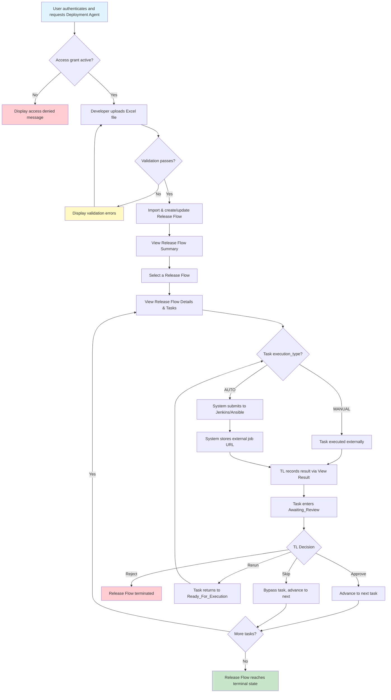

# Feature Specification: Deployment Agent MVP

> **Source stories:** US-01 through US-11, US-21 through US-25
> **Spec status:** Draft – Ready for Architecture with tracked open decisions
> **Last updated:** 2026-03-24

---

## 1. Overview

### 1.1 Feature Summary
Deployment Agent is a controlled, human-in-the-loop deployment workflow system embedded within the WWA platform. It enables users to upload deployment requests via a fixed Excel template, create and monitor Release Flows across SIT / UAT / PROD stages, inspect task execution results, make explicit human decisions (Approve / Reject / Rerun / Skip), maintain key integration configuration, review audit records, and control product access through admin-managed access grants.

### 1.2 Business Objective
Provide a unified and traceable deployment workspace that makes deployment execution visible, reviewable, auditable, explicitly controlled by humans before progression, and protected by product-level access governance.

### 1.3 MVP Objective
Ensure the core workflow can successfully run through:

**request → process → verification → decision**

### 1.4 In-Scope Outcome
The MVP shall support the following end-to-end capabilities:

1. Access Deployment Agent workspace within WWA
2. Upload deployment requests through a fixed Excel template
3. Create or update Release Flow records from imported request data
4. Monitor Release Flow progress across SIT / UAT / PROD
5. View selected Release Flow details
6. View task-level execution details and results
7. Edit task input before execution in supported statuses
8. Make task-level decisions: Approve / Reject / Rerun / Skip
9. Record key operator actions in audit logs
10. Maintain core integration configuration in UI
11. View minimal read-only audit log list in MVP
12. Enforce deny-by-default product entry using Deployment Agent access grants
13. Allow DevOps Admin to manage access grants, roles, and access status
14. Record access-governance changes in audit logs

---

## 2. Source Stories

| Story ID | Title | Capability |
|---|---|---|
| US-01 | Access Deployment Agent workspace within WWA platform navigation | Workspace navigation |
| US-02 | Upload deployment request via Excel file | Request upload |
| US-03 | Create or update Release Flow from imported deployment request | Release Flow creation/update |
| US-04 | View Release Flow summary with stage progress | Release monitoring |
| US-05 | View selected Release Flow details | Release context |
| US-06 | View task-level details and execution results | Task inspection |
| US-07 | Edit task input parameters before execution | Task input editing |
| US-08 | Execute task-level decisions to control Release Flow progression | Human decision gate |
| US-09 | Record operator actions for audit traceability | Audit logging |
| US-10 | Maintain integration configuration in UI | Configuration management |
| US-11 | View audit logs for compliance review | Audit log viewing |
| US-21 | Manage Deployment Agent access grants | Access grant lifecycle |
| US-22 | Authorize product entry with deny-by-default access control | Product access authorization |
| US-23 | Use an Access Management console for authorization operations | Access management console |
| US-24 | Enforce effective permissions consistently across UI and API | Permission enforcement |
| US-25 | Audit access grant changes | Access governance auditability |

---

## 3. Actors

### 3.1 Primary Actors
- **Developer**
  - Uploads deployment requests
  - Views Release Flow and task status
- **Tech Lead (TL)**
  - Reviews Release Flow context and task results
  - Edits task input where allowed
  - Makes Approve / Reject / Rerun / Skip decisions
- **DevOps Admin**
  - Maintains integration configuration
  - Manages Deployment Agent access grants and roles
  - Views operational status as needed
- **Audit / Management User**
  - Views audit logs for compliance and accountability

### 3.2 Supporting Actors
- **Authentication System**
  - Provides enterprise identity context
- **Access Grant Store**
  - Resolves Deployment Agent access status, assigned roles, and last-login metadata
- **Execution Integrations**
  - External systems such as Jenkins and Ansible that execute or orchestrate tasks
- **Audit Storage**
  - Persists audit records for retrieval

---

## 4. Terminology

- **Workspace**: The Deployment Agent application area inside WWA
- **Dashboard**: The main Deployment Agent view that includes summary, details, and task sections
- **Release Flow**: Top-level business object representing a deployment journey across multiple stages
- **Request**: A stage-scoped unit within a Release Flow
- **Task**: An executable unit within a Request
- **Current Stage**: The current stage of a Release Flow, such as SIT, UAT, or PROD
- **Review Gate**: The point after execution where TL must explicitly decide how to proceed
- **Access Grant**: A product-level authorization record that determines whether an enterprise user may enter Deployment Agent
- **Effective Permissions**: The combined permissions derived from a user's assigned Deployment Agent roles
- **Suspended Access**: An access state in which the employee identity still exists but product entry is blocked

---

## 5. Data Model Hierarchy

A Release Flow contains one or more Requests.  
Each Request contains one or more Tasks.  
Task operations such as View Result, Edit, Approve, Reject, Rerun, and Skip occur at the Task level within the selected Request context.

### 5.1 Entity Relationships

| Entity | Relationship | Cardinality | Notes |
|---|---|---:|---|
| Release Flow | contains Requests | 1:N | A Release Flow may span multiple stages |
| Request | belongs to Release Flow | N:1 | Each Request is associated with one Release Flow |
| Request | contains Tasks | 1:N | Tasks are executed within Request context |
| Task | belongs to Request | N:1 | Task operations occur at this level |
| Audit Log Entry | may reference Release Flow | N:1 | Optional context |
| Audit Log Entry | may reference Request | N:1 | Optional context |
| Audit Log Entry | may reference Task | N:1 | Optional context |
| Configuration Item | independent managed record | N/A | Shared platform capability |
| Access Grant | independent managed record | 1:1 per employee in product scope | Controls product entry and effective roles |

### 5.2 Core Entities

#### Release Flow
Represents a deployment journey across one or more stages.

Minimum attributes:
- `release_flow_id`
- `project_id` — from template `Project ID`
- `project_name` — from template `Project Name`
- `release_id` — source TBD (not explicitly in AMH_HCC_task data rows; see OQ-25)
- `current_stage` — SIT | UAT | PROD (source TBD; see OQ-25)
- `flow_status`
- `review_status`
- `review_owner`
- `created_at`
- `updated_at`

#### Request
Represents a stage-scoped unit inside a Release Flow.

Minimum attributes:
- `request_id`
- `release_flow_id`
- `stage`
- `request_status`
- `created_at`
- `updated_at`

#### Task
Represents one atomic executable step within a Request.
One row in the AMH_HCC_task template = one system Task.

Core workflow attributes:
- `task_id` — system-generated primary key
- `request_id` — FK to parent Request
- `task_group_id` — from template `Task ID`; groups related steps for display and ordering
- `task_group_name` — from template `Task Name`; display label for the group
- `step_seq` — from template `Step seq#`; execution ordering within the task group
- `task_name` — from template `Step`; name of this atomic step
- `execution_type` — from template `Execution Type`; enum: `MANUAL` | `AUTO`; determines execution path (MANUAL = human-executed externally with system reference display; AUTO = system submits to execution pipeline)
- `input_parameters` — JSON `{ "script": "...", "parameters": "..." }` from template fields
- `expected_output` — from template `Parameter (Expected Output)`; shown during result review
- `task_status`
- `current_result_summary`
- `start_time` — actual execution start (system-generated; not from template)
- `end_time` — actual execution end (system-generated from callback; not from template)
- `latest_execution_id`
- `last_updated_at`

Display-only attributes (stored as explicit columns; do not control workflow):
- `owner` — from template `Owner`
- `planned_start_time` — from template `Planned Start date/time`
- `planned_end_time` — from template `Planned End date/time`

Raw import metadata (stored as JSON blob; no workflow behavior in MVP):
- `import_metadata` — JSON containing `activity_category`, `common`, `dependencies`, `validation` from the template; preserved for reference but not processed by any business logic

#### Audit Log Entry
Represents an immutable record of an operator action.

Minimum attributes:
- `audit_log_id`
- `operator_id`
- `operator_role`
- `action_type`
- `timestamp`
- `release_flow_id` (nullable)
- `request_id` (nullable)
- `task_id` (nullable)
- `context_payload`

#### Configuration Item
Represents a managed configuration item.

Minimum attributes:
- `config_key`
- `config_value`
- `description`
- `updated_by`
- `updated_at`

#### Access Grant
Represents product-level authorization for one enterprise employee within Deployment Agent.

Minimum attributes:
- `employee_id`
- `display_name_snapshot`
- `grant_status` — `ACTIVE` | `SUSPENDED`
- `assigned_roles` — one or more Deployment Agent roles
- `note`
- `last_login_at`
- `created_by`
- `created_at`
- `updated_by`
- `updated_at`

---

## 6. Functional Scope

### 6.1 Capability Domains
1. Workspace Navigation
2. Request Upload and Validation
3. Release Flow Creation / Update
4. Release Flow Summary Monitoring
5. Selected Release Flow Details
6. Task Details and Result Viewing
7. Task Input Editing
8. Task-Level Human Decision Gate
9. Configuration Management
10. Audit Logging
11. Audit Log Viewing
12. Product Access Authorization
13. Access Management

### 6.2 Workflow Boundaries
- **Entry point**: An authenticated and authorized user enters Deployment Agent; the deployment workflow begins when a Developer uploads a deployment request
- **Exit point**: Release Flow reaches a terminal state (`Completed`, `Rejected`, or `Failed`)
- **Out-of-band transitions**: Access can be denied for users without a Deployment Agent access grant or with a suspended access grant
- **Core control rule**: No flow progression after execution completion is allowed without explicit human decision

---

## 7. Functional Requirements

> Requirements marked `[ASSUMPTION]` are accepted working assumptions for MVP and must be validated during architecture/design if implementation impact is significant.

### 7.1 Workspace Navigation

- **FR-01**: The system shall display WWA as a level-1 navigation entry.
- **FR-02**: The system shall display Deployment Agent as a level-2 navigation entry under WWA.
- **FR-03**: When a user selects Deployment Agent, the system shall load the Deployment Agent workspace.
- **FR-04**: The left-side navigation shall display the shared entries Template Management, Configuration Management, and Audit Log.
- **FR-05**: Access to the Deployment Agent workspace shall be restricted by authenticated role context.

### 7.2 Request Upload and Validation

- **FR-06**: The system shall provide an `Upload Excel` action in the Deployment Agent workspace.
- **FR-07**: Selecting `Upload Excel` shall open a dialog containing a Stage selector (SIT / UAT / PROD), a file picker, `Download Template`, `View Sample`, and `Upload`.
- **FR-07a**: The upload dialog Stage selector shall be a required input. The user must select Stage before submitting the file.
- **FR-07b**: Stage is not read from the Excel file; it is always provided explicitly by the user at upload time.
- **FR-08**: The system shall accept Excel files conforming to the fixed MVP template (AMH_HCC_task sheet).
- **FR-09**: The system shall validate uploaded Excel data against the fixed template schema. Stage-related columns are not validated from row data (Stage comes from the upload dialog Stage selector).
- **FR-10**: On successful validation, the system shall start import processing using the user-selected Stage as the target stage for the imported data.
- **FR-11**: On successful import completion, the system shall display a success message and provide access to the related import log.
- **FR-12**: On validation failure, the system shall reject the upload and display actionable validation errors.
- **FR-13**: Validation errors shall identify the relevant field or row when such context is available.
- **FR-14**: Import behavior shall be atomic at the uploaded file level unless explicitly revised in a future version. `[ASSUMPTION]`

### 7.3 Release Flow Creation and Update

- **FR-15**: After successful import, the system shall create or update exactly one Release Flow record per uploaded file.
- **FR-15a**: A single uploaded Excel file produces one Release Flow (for the `Project ID` in the file), one Request (for the selected Stage), and one Task per data row.
- **FR-16**: The system shall group uploaded data into a Release Flow by `Project ID` (from the Excel `Project ID` column).
- **FR-17**: The system shall transform imported Excel data into a Release Flow / Request / Task hierarchy:
  - Release Flow: grouped by `project_id`; created if no active Release Flow exists for the project
  - Request: created for the user-selected Stage within the Release Flow
  - Task: one per Excel data row, in `step_seq` order
- **FR-18**: If an active Release Flow already exists for the project, the system shall attach a new Request for the selected Stage to that Release Flow rather than creating a new Release Flow.
- **FR-19**: Release ID shall be system-generated when a new Release Flow is created. The format shall be `{stage}-{normalized_project_name}-{seq}` where `{seq}` is a zero-padded sequential counter per project.
- **FR-20**: Release ID shall remain fixed for the lifetime of the Release Flow. It shall not change when additional stages (UAT, PROD) are uploaded to the same Release Flow.

### 7.4 Release Flow Summary

- **FR-21**: The system shall display a Release Flow Summary list in the Deployment Agent dashboard.
- **FR-22**: Each Release Flow row shall display the Release Flow identifier and stage summary status for SIT, UAT, and PROD.
- **FR-23**: Stage summary statuses shown in the summary list shall use only `Done`, `Running`, or `Pending`.
- **FR-24**: The system shall support filtering of Release Flows by supported criteria.
- **FR-25**: Applying filters shall update the summary list to show only matching records.
- **FR-26**: The Release Flow Summary depends on Release Flow records already existing in the system.

### 7.5 Selected Release Flow Details

- **FR-27**: When a user selects a Release Flow, the system shall update the Selected Release Flow Details section.
- **FR-28**: The details section shall display `Project`, `Release ID`, `Current Stage`, `Current Request ID`, `Review Status`, and `Review Owner`.
- **FR-29**: When a different Release Flow is selected, the details section shall refresh accordingly.

### 7.6 Task Details and Result Viewing

- **FR-30**: When a Release Flow is selected, the system shall display tasks in the selected Request context.
- **FR-31**: Each task row shall display `Task Name`, `Status`, `Result Summary`, `Start Time`, `End Time`, and `Available Actions`.
- **FR-32**: The system shall provide a `View Result` action for tasks with available result output.
- **FR-33**: The result view shall display at least:
  - execution outcome summary
  - raw execution logs
  - start and end timestamps
- **FR-34**: The system shall display supported task actions through an `Available Actions` menu.
- **FR-35**: Supported actions may include `Edit`, `View Result`, and `Decision`.
- **FR-36**: When applicable, `Decision` actions shall include `Approve`, `Reject`, `Rerun`, and `Skip`.

### 7.7 Task Input Editing

- **FR-37**: The system shall provide an `Edit` action only for tasks in explicitly supported editable statuses.
- **FR-38**: For MVP, editable task statuses shall be `Pending` and `Ready_For_Execution`. `[ASSUMPTION]`
- **FR-39**: Selecting `Edit` shall display editable task input parameters.
- **FR-40**: The system shall validate edited input using the task input schema.
- **FR-41**: On validation failure, the system shall reject the change and display validation errors.
- **FR-42**: On validation success, the system shall persist the updated task input.
- **FR-43**: Subsequent execution or rerun of that task shall use the latest saved task input.
- **FR-44**: The system shall create an audit log entry for each successful task input edit.
- **FR-45**: Editing after a task enters `Executing` or later statuses is out of scope for MVP.

### 7.8 Task-Level Human Decision Gate

- **FR-46**: After execution completes, a task shall enter a review-required state before the flow can proceed.
- **FR-47**: The system shall display `Approve`, `Reject`, `Rerun`, and `Skip` as supported decision options when the task is waiting for review.
- **FR-48**: `Approve` shall allow the Release Flow to continue to the next available step.
- **FR-49**: `Reject` shall stop the current Release Flow and prevent further step execution.
- **FR-50**: `Rerun` shall re-execute the current step using the latest saved task input.
- **FR-51**: `Skip` shall bypass the current step and continue to the next available step.
- **FR-52**: The system shall record an audit log entry for each decision action.
- **FR-53**: The system shall not auto-progress a Release Flow after execution without explicit human decision.
- **FR-54**: For MVP, rerun history shall be preserved as execution history associated with the same logical task. `[ASSUMPTION]`

### 7.9 Audit Logging

- **FR-55**: The system shall log key operator actions for audit traceability.
- **FR-56**: Audit-logged actions shall include at least: `upload`, `edit`, `view_result`, `approve`, `reject`, `rerun`, and `skip`.
- **FR-57**: Each audit log entry shall include operator identity, action type, timestamp, and related context.
- **FR-58**: Audit log entries shall be immutable from the end-user perspective.

### 7.10 Configuration Management

- **FR-59**: DevOps Admin shall be able to access Configuration Management from the shared WWA navigation.
- **FR-60**: The MVP shall support the following configuration items:
  - `Jenkins URL`
  - `Ansible URL`
  - `Execution Callback Endpoint` `[ASSUMPTION]`
- **FR-61**: The system shall validate configuration input on save.
- **FR-62**: On invalid configuration input, the system shall reject the save and display an error.
- **FR-63**: On valid save, the system shall persist the configuration change.
- **FR-64**: Related deployment execution shall use the latest saved configuration values.
- **FR-65**: Configuration Management shall behave as a shared WWA capability.

### 7.11 Audit Log Viewing

- **FR-66**: Signed-in users shall be able to access the Audit Log area in read-only mode.
- **FR-67**: The system shall display a read-only list of recent audit log records in MVP.
- **FR-68**: Each displayed audit record shall show operator identity, action type, timestamp, and related context.
- **FR-69**: Users viewing audit logs in MVP shall be able to read but not edit or delete records.

### 7.12 Product Access Authorization

- **FR-70**: The system shall enforce deny-by-default entry for Deployment Agent using a local Access Grant record. *(Source: US-22)*
- **FR-71**: If an enterprise-authenticated employee has no Access Grant, the system shall deny product entry and display an `Access not granted` message. *(Source: US-22)*
- **FR-72**: If an employee has a suspended Access Grant, the system shall deny product entry and display an `Access suspended` message. *(Source: US-21, US-22)*
- **FR-73**: If an employee has an active Access Grant, the system shall resolve and return the employee's effective Deployment Agent roles and permissions. *(Source: US-22, US-24)*
- **FR-74**: The system shall support one or more assigned Deployment Agent roles per authorized employee. *(Source: US-24)*
- **FR-75**: Menus, routes, page access, and API access shall be enforced consistently using effective permissions. *(Source: US-24)*
- **FR-76**: If a user lacks permission for a route or API, the frontend shall block entry and the backend shall reject the operation. *(Source: US-23, US-24)*

### 7.13 Access Management

- **FR-77**: The system shall provide an `Access Management` capability that is accessible only to DevOps Admin users. *(Source: US-23)*
- **FR-78**: The Access Management page shall display employee ID, display name, grant status, assigned roles, last login time, updated by, and updated at for each access grant. *(Source: US-23)*
- **FR-79**: DevOps Admin users shall be able to search Access Grants by employee ID or employee name. *(Source: US-23)*
- **FR-80**: DevOps Admin users shall be able to create an Access Grant that stores employee ID, display name snapshot, grant status, assigned roles, and note. *(Source: US-21, US-23)*
- **FR-81**: DevOps Admin users shall be able to update the assigned roles on an existing Access Grant. *(Source: US-21, US-23)*
- **FR-82**: DevOps Admin users shall be able to suspend an existing Access Grant without physically deleting the record. *(Source: US-21)*
- **FR-83**: DevOps Admin users shall be able to reactivate a suspended Access Grant. *(Source: US-21)*
- **FR-84**: The system shall record audit log entries for Access Grant creation, role update, suspension, and reactivation. *(Source: US-25)*
- **FR-85**: Access-governance audit records shall be visible through the read-only audit log experience for signed-in users. *(Source: US-25)*

---

## 8. Workflow / System Flow

### 8.1 User Flow Diagram

### 8.2 Main Flow

1. User authenticates and requests access to Deployment Agent from WWA
2. System resolves the user's Access Grant and effective permissions
3. If the user is not granted or is suspended, the system blocks entry and shows an access-state message
4. If the user is authorized, the Deployment Agent workspace is displayed
5. Developer uploads an Excel request file
6. System validates the file
7. System imports request data and creates/updates Release Flow records
8. User views Release Flow Summary and selects a Release Flow
9. System displays selected Release Flow details
10. System displays tasks for the selected Request context
11. Task execution occurs through connected execution integrations
12. TL inspects results through Task Details and `View Result`
13. TL optionally edits task input before eligible execution
14. TL makes one decision: `Approve`, `Reject`, `Rerun`, or `Skip`
15. System records audit entries for all key actions, including access-governance actions
16. Release Flow progresses, repeats, or terminates

### 8.3 Initial Execution Trigger
For MVP, once a task is in `Ready_For_Execution`, execution may be initiated automatically by the orchestration flow. `[ASSUMPTION]`

If this assumption changes, the system must introduce an explicit execution trigger in a future revision.

### 8.4 Decision Effects
- **Approve**
  - marks review outcome as approved
  - advances to next available step
- **Reject**
  - terminates current Release Flow
- **Rerun**
  - re-executes current step
  - preserves prior execution history
- **Skip**
  - bypasses current step
  - advances to next available step

---

## 9. State Model

### 9.1 Release Flow Model
To avoid ambiguity, Release Flow state is separated into multiple fields.

#### `current_stage`
Valid values:
- `SIT`
- `UAT`
- `PROD`

#### `flow_status`
Valid values:
- `Pending`
- `Running`
- `Completed`
- `Failed`
- `Rejected`

> *Previous draft included `Awaiting_Review` and `Cancelled`. These were removed: `Awaiting_Review` is a task-level concern only; `Cancelled` is out of scope for MVP.*

#### `stage_summary_status`
Used only for summary display. Valid values:
- `Done`
- `Running`
- `Pending`

### 9.2 Request Status
Valid values:
- `Pending`
- `Running`
- `Completed`
- `Failed`
- `Skipped`
- `Rejected`

> *Previous draft included `Awaiting_Review` and `Cancelled`. These were removed: `Awaiting_Review` is a task-level concern; `Cancelled` is out of scope. `Skipped` was added to support requests where all tasks are skipped.*

### 9.3 Task Status
Valid values:
- `Pending`
- `Ready_For_Execution`
- `Executing`
- `Awaiting_Review`
- `Approved`
- `Rejected`
- `Skipped`
- `Failed`

> *Previous draft included `Rerun_Queued`. This was removed — the implemented rerun path transitions from `Rejected` or `Failed` back to `Ready_For_Execution` without an intermediate queued state.*

### 9.4 Task State Transitions

- `Pending` → `Ready_For_Execution` (on import or auto-progression)
- `Pending` → `Skipped` (TL skip decision)
- `Ready_For_Execution` → `Executing` (auto-triggered or manual record-result)
- `Ready_For_Execution` → `Skipped` (TL skip decision)
- `Executing` → `Awaiting_Review` (callback or manual result recording)
- `Executing` → `Failed` (execution failure)
- `Awaiting_Review` → `Approved` (TL approve decision)
- `Awaiting_Review` → `Rejected` (TL reject decision)
- `Rejected` → `Ready_For_Execution` (TL rerun decision; creates new execution history)
- `Failed` → `Ready_For_Execution` (TL rerun decision; creates new execution history)

> *Previous draft used `Awaiting_Review → Rerun_Queued → Executing` for reruns. The implemented model requires the task to be in a terminal-error state (`Rejected` or `Failed`) before rerun, transitioning back to `Ready_For_Execution`. This is intentionally conservative — explicit rejection before rerun.*

### 9.5 Stage Summary Aggregation Rule
For MVP, stage summary status shall be calculated as follows:

- **Done**
  - all tasks in the stage are in terminal states:
    - `Approved`
    - `Skipped`
    - `Rejected`
    - `Failed`
- **Running**
  - any task in the stage is in an active state:
    - `Executing`
    - `Awaiting_Review`
    - `Ready_For_Execution` (at least one task has been promoted)
- **Pending**
  - all tasks in the stage are still in:
    - `Pending`

If mixed states exist and at least one task is in a running-like or active state, the stage summary shall be `Running`. `[ASSUMPTION]`

> *`Rejected` and `Failed` are terminal states and map to `Done` in summary display (the stage will not progress further). `Ready_For_Execution` is treated as active/running because at least one task has been promoted from its initial state.*

### 9.6 Reject Handling
For MVP, when a TL selects `Reject`:
- the affected task status becomes `Rejected`
- the current Request status becomes `Rejected`
- the Release Flow `flow_status` becomes `Rejected`

---

## 10. Data / Configuration Requirements

### 10.1 Excel Template Schema

The MVP uses a fixed Excel template based on the **AMH_HCC_task** (steps table) sheet.

Each row in the template represents one atomic step within a logical task group. Multiple rows may share the same `Task ID` to form one logical task; `Step seq#` defines execution ordering within that group.

#### AMH_HCC_task Field Definitions

The table below classifies each field by its intended use in the MVP system. Fields are not treated equally just because they appear in the template.

| Field | Import Action | System Role | Stored As |
|---|---|---|---|
| `Project ID` | Parse and map | **Core** — Release Flow grouping key | `release_flow.project_id` column |
| `Project Name` | Parse and map | Display | `release_flow.project_name` column |
| `Task ID` | Parse and map | Display grouping + ordering context | `task.task_group_id` column |
| `Task Name` | Parse and map | Display | `task.task_group_name` column |
| `Step seq#` | Parse and map | **Core** — execution ordering | `task.step_seq` column |
| `Step` | Parse and map | **Core** — atomic step identity | `task.task_name` column |
| `Execution Type` | Parse and map | **Core** — execution mode: `MANUAL` (human-executed externally) or `AUTO` (system-submitted to pipeline) | `task.execution_type` column (enum: MANUAL \| AUTO) |
| `Script to be executed` | Parse and map | **Core** — execution payload | `task.input_parameters.script` (JSON) |
| `Parameter (input)` | Parse and map | **Core** — execution payload | `task.input_parameters.parameters` (JSON) |
| `Parameter (Expected Output)` | Parse and map | **Core** — result verification comparison | `task.expected_output` column |
| `Owner` | Parse and map | Display | `task.owner` column |
| `Planned Start date/time` | Parse and map | Display only; does NOT gate or trigger execution | `task.planned_start_time` column |
| `Planned End date/time` | Parse and map | Display only; does NOT gate or trigger execution | `task.planned_end_time` column |
| `Activity category` | Parse and store | Raw metadata; no workflow behavior in MVP | `task.import_metadata` JSON blob |
| `Common` | Parse and store | Raw metadata; no workflow behavior in MVP | `task.import_metadata` JSON blob |
| `Dependencies` | Parse and store | Raw metadata; no gating logic in MVP | `task.import_metadata` JSON blob |
| `Validation` | Parse and store | Raw metadata; no automated validation in MVP | `task.import_metadata` JSON blob |
| `Status` | **Ignored on import** | Template tracking artifact; system always creates Tasks in `Pending` | Not stored |
| `Start date/time` | **Dropped** | System generates actual start from execution | Not stored from template |
| `End date/time` | **Dropped** | System generates actual end from callback | Not stored from template |
| `Release ID` | **System-generated** — not from template | **Core** — Release Flow identification; format: `{stage}-{normalized_project_name}-{seq}` | `release_flow.release_id` column |
| `Stage` | **From upload UI** — not from template rows | **Core** — Request stage; user selects SIT/UAT/PROD in upload dialog | `request.stage` column |

> All previously open questions (OQ-25: Stage/Release ID source; OQ-28: Execution Type values) are now resolved by confirmed business rules. No open questions remain for the Excel template interpretation.

### 10.2 Task Input Schema
Task input editing requires a task input schema.

The schema must define:
- task type
- editable fields
- data types
- required / optional
- validation constraints

For MVP, the task input schema may be documented in a separate appendix or companion artifact.

### 10.3 Configuration Items
MVP configuration items:
- `Jenkins URL`
- `Ansible URL`
- `Execution Callback Endpoint` `[ASSUMPTION]`

Each configuration item shall include:
- key
- value
- description
- updated_by
- updated_at

### 10.4 Access Grant Requirements

Access Grant data must support the following product rules:
- one product-scope Access Grant record per employee `[INFERRED]`
- `grant_status` valid values: `ACTIVE`, `SUSPENDED`
- an active Access Grant must have at least one assigned role
- suspending access shall preserve the record rather than delete it
- reactivating access shall reuse the existing Access Grant record

Access Grant validation requirements:
- `employee_id` is required
- `assigned_roles` is required when `grant_status = ACTIVE`
- only DevOps Admin users may create, update, suspend, or reactivate Access Grants
- Access Grant changes must produce audit records

---

## 11. Non-Functional Requirements

### 11.1 Security
- The system shall use authenticated identity and role context for access control.
- Deployment Agent product entry shall use deny-by-default access control based on local Access Grants.
- Audit logs shall not be editable or deletable by end users.
- Configuration editing shall be limited to authorized DevOps Admin users.
- Access Grant management shall be limited to authorized DevOps Admin users.

### 11.2 Reliability
- Upload validation failure shall not create or update Release Flow records.
- Decision actions shall be protected against duplicate accidental processing.
- The system shall handle partial or malformed uploads without producing inconsistent Release Flow state.
- Access suspension and reactivation shall preserve authorization history rather than recreate employee identities.

### 11.3 Auditability
- All key operator actions shall be logged with operator identity, timestamp, and context.
- Audit log records shall be immutable from the end-user perspective.
- Access Grant create, role update, suspend, and reactivate actions shall be auditable.

### 11.4 Observability
- The system should produce operational logs for import failures, task execution failures, and decision events.
- The system should allow investigation of import and execution issues through logs and audit traces.
- The system should emit actionable logs for access denial and authorization change events.

### 11.5 Performance
Performance targets remain subject to confirmation and are not final release commitments in this draft.

Working targets for design guidance:
- Release Flow Summary load: target within 2 seconds for typical MVP volume
- Excel import completion: target within 30 seconds for typical MVP file size
- Result view open: target within 1 second for typical task output size

### 11.6 Environment Support
The system shall support standard deployment environments such as development, staging, and production.

Environment-specific configuration override matrices are out of scope for MVP.

---

## 12. Integrations

### 12.1 External Systems
- **Jenkins**
  - Used as an execution or orchestration integration
- **Ansible**
  - Used as an execution or automation integration
- **Authentication Provider**
  - Provides enterprise user identity context

### 12.2 Integration Responsibilities
- Request import processing transforms uploaded business data into internal records
- Execution integrations run tasks and produce execution outputs
- Configuration management provides runtime configuration values
- Audit storage persists operator action history
- Access Grant resolution determines whether authenticated users may enter Deployment Agent

### 12.3 Credentials / Secrets
Credential and secret storage mechanism is an architecture decision and is not frozen in this spec.

The architecture solution must ensure:
- secure storage
- controlled access
- auditable use where applicable

---

## 13. Dependencies

### 13.1 Upstream Dependencies
- WWA platform navigation framework
- Authentication and role context
- Access Grant persistence and permission resolution
- Excel parsing capability
- Persistence layer for Release Flow / Request / Task / Audit Log
- Configuration persistence capability
- Execution integrations for task execution

### 13.2 Downstream / Related Dependencies
- Jenkins / Ansible integration implementation
- Audit storage and audit retrieval
- Access Management UI and authorization APIs for platform administration
- Architecture decisions for persistence, secret handling, and execution triggering

---

## 14. Risks / Ambiguities

| ID | Description | Type | Impact | Recommendation |
|---|---|---|---|---|
| R-01 | ~~Excel template schema ambiguity~~ **Resolved**: AMH_HCC_task field list confirmed; Stage from UI upload; Release ID system-generated; Execution Type = MANUAL \| AUTO. All field semantics resolved. | Closed | — | No action required |
| R-02 | ~~Release ID / Stage source unknown~~ **Resolved**: Stage from upload UI; Release ID = `{stage}-{normalized_project_name}-{seq}` | Closed | — | No action required |
| R-03 | ~~Execution Type valid values unknown~~ **Resolved**: MANUAL \| AUTO | Closed | — | No action required |
| R-05 | Editable task statuses are currently based on working assumption | Assumption | Medium | Validate during architecture review |
| R-06 | Review Owner cardinality (single user vs group) not finalized | Unclear | Medium | Confirm in design |
| R-07 | ~~MANUAL task execution UX~~ **Resolved**: inline "Record Result" button in Task Details row; form to enter actual result; system transitions to `Awaiting_Review` | Closed | — | No action required |
| R-05 | Editable task statuses are currently based on working assumption | Assumption | Medium | Validate during architecture review |
| R-06 | Result display detail beyond minimum output may expand later | Scope | Medium | Keep minimum guarantee in MVP |
| R-07 | Review Owner cardinality (single user vs group) is not finalized | Unclear | Medium | Confirm in design |
| R-08 | Audit log visibility scope beyond Audit / Management users is not fully defined | Security | Medium | Confirm access scope before implementation |
| R-09 | Rerun history presentation is only minimally defined | Unclear | Medium | Finalize UI/trace behavior during design |
| R-10 | Default sorting and filtering behavior is not finalized | Unclear | Low | Confirm in product/design refinement |
| R-11 | Product roles are expanding from a single role value toward a permission-based model | Architecture | Medium | Confirm whether backend contracts return roles only or roles plus effective permissions |
| R-12 | A later phase may expand Access Management beyond the current existing-grants-only search model | Product | Medium | Treat enterprise directory lookup as a separately scoped follow-up |

---

## 15. Out of Scope

The following are explicitly out of scope for MVP:

- Dynamic template management
- Upload resume after network interruption
- Manual Release Flow merge / split
- Real-time streaming logs
- Push notifications
- Historical analytics dashboards
- Reporting / export features
- Advanced audit filtering and search
- Audit analytics dashboards
- Editing Release Flow metadata
- Free-form task input outside defined schema
- Automatic decision-making based on result content
- Parallel branch execution
- Environment-specific configuration override matrices
- Advanced configuration versioning and rollback
- Self-service access request workflow
- Project-level access control
- Environment-level access control
- Enterprise group sync / SCIM-style provisioning

---

## 16. Open Questions

| ID | Question | Owner |
|---|---|---|
| OQ-01 | What is the exact routing path for Deployment Agent under WWA? | Product / UX |
| OQ-02 | Should breadcrumb navigation be shown in the workspace? | Product / UX |
| OQ-03 | What is the full frozen Excel template schema? | Product |
| OQ-04 | What is the maximum Excel file size? | Product / Engineering |
| OQ-05 | What exact grouping rule determines create vs update of Release Flow? | Product / Architecture |
| OQ-06 | What is the fallback rule when `Release ID` is missing? | Product |
| OQ-07 | Should completed Release Flows be shown by default in summary? | Product |
| OQ-08 | What is the default sorting rule for Release Flow Summary? | Product |
| OQ-09 | What filters are supported in MVP summary view? | Product |
| OQ-10 | Is Review Owner always a single user or can it be a group? | Product |
| OQ-11 | How should empty review fields be displayed? | Product / UX |
| OQ-12 | Is the task list strictly scoped to selected Request context in all cases? | Product / Architecture |
| OQ-13 | What additional result presentation beyond minimum summary + logs is needed? | Product / UX |
| OQ-14 | Should editable statuses remain only `Pending` and `Ready_For_Execution`? | Product / Architecture |
| OQ-15 | Should only changed fields be logged for task edits? | Architecture |
| OQ-16 | Should Reject require an explicit confirmation dialog? | Product / UX |
| OQ-17 | How should rerun history be displayed to users? | Product / UX |
| OQ-18 | What is the final third configuration item if `Execution Callback Endpoint` is not accepted? | Product / DevOps |
| OQ-19 | Do configuration changes take effect immediately for future executions? | Product / Architecture |
| OQ-20 | Should the audit log view be a standalone page or embedded list? | Product / UX |
| OQ-21 | How many recent audit records should be shown by default? | Product |
| OQ-22 | What credential / secret storage solution will architecture adopt? | Architecture |
| OQ-23 | Is initial execution always auto-triggered from `Ready_For_Execution`? | Product / Architecture |
| OQ-24 | What is the final SLA / performance target for MVP operations? | Product / Engineering |
| OQ-25 | ~~Where do Release ID and Stage come from?~~ **Resolved**: Stage is selected by user at upload time; Release ID is system-generated (`{stage}-{normalized_project_name}-{seq}`). | Closed |
| OQ-28 | ~~What are the valid values for Execution Type?~~ **Resolved**: `MANUAL` \| `AUTO`. MANUAL = human-executed externally; AUTO = system-submitted to pipeline. | Closed |
| OQ-29 | Should the `Access not granted` message include contact guidance to a DevOps Admin? | Product / UX |
| OQ-30 | Should a later phase expand Access Management beyond the current existing-grants-only search model to include enterprise users without an Access Grant? | Product |
| OQ-31 | Should Access Grant role changes require a mandatory admin note? | Product / Governance |
| OQ-32 | Should Template Management be restricted to DevOps Admin only in Phase 1? | Product |
| OQ-33 | ~~Should the frontend session model return roles only, or roles plus effective permissions?~~ **Resolved**: the session contract returns `role` for compatibility plus `roles[]` and effective `permissions[]`. | Closed |

> Template-related open questions around Excel import semantics are resolved. Remaining open questions from OQ-29 onward focus on access-governance expansion, UX, and authorization hardening; the auth/session payload contract is already resolved.

---

## 17. Architecture Gate Notes

The following decisions should be confirmed before implementation design is finalized:

1. ~~Source of Release ID and Stage~~ — **Resolved**: Stage from UI upload; Release ID system-generated (`{stage}-{normalized_project_name}-{seq}`)
2. ~~Execution Type valid values~~ — **Resolved**: `MANUAL` | `AUTO`
3. ~~MANUAL task execution UX (R-07)~~ — **Resolved**: inline "Record Result" button in the Task Details row; opens a form to enter actual result/output; system transitions task to `Awaiting_Review`
4. Final confirmation of editable task statuses
5. Task input schema per `execution_type` (MANUAL vs AUTO may have different editable fields)
6. Final confirmation of third configuration item
7. Final confirmation of initial execution trigger behavior for AUTO tasks
8. ~~Final confirmation of the Access Grant permission model and auth/session response contract~~ — **Resolved**: auth/session returns `role` for compatibility plus `roles[]` and effective `permissions[]`
9. Confirm whether a later phase should expand Access Management search beyond the current existing-grants-only scope

These items are tracked in `Open Questions` and `Risks / Ambiguities` and are not hidden assumptions.

---

## 18. Summary

Deployment Agent MVP is a controlled deployment workspace within WWA that supports request upload, Release Flow creation and monitoring, task inspection, task-level human decisions, managed configuration, audit traceability, and Phase 1 product access governance through Access Grants.

This specification intentionally freezes:
- the core workflow
- the data hierarchy
- the user roles
- the deny-by-default product entry rule
- the minimum result-view contract
- the task decision contract
- the summary aggregation rule for MVP

This specification intentionally leaves some implementation-driving details open, but explicitly tracked, so architecture can resolve them without losing product intent.
