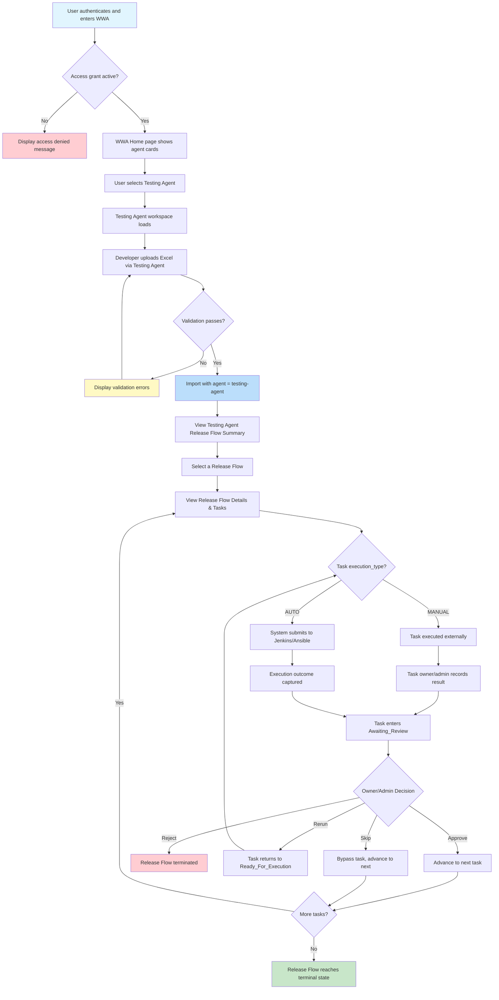

# Feature Specification: Testing Agent MVP

> **Source stories:** TA-01 through TA-06
> **Spec status:** Draft
> **Last updated:** 2026-03-31

---

## 1. Overview

### 1.1 Feature Summary
Testing Agent is the second agent workspace under the WWA Agent Workspace Hub. It provides the same human-in-the-loop controlled execution workflow as Deployment Agent, but scoped to testing activities. Testing Agent reuses the existing domain model (Release Flow, Request, Task), shared platform capabilities (Audit Log, Configuration Management, Access Management, Template Management), and all existing backend services. Data isolation between agents is achieved through the `Request.agent` column.

### 1.2 Business Objective
Provide a dedicated testing workspace within WWA that enables testing teams to manage testing workflows separately from deployment workflows, while reusing the proven Deployment Agent execution model and shared platform infrastructure.

### 1.3 MVP Objective
Deliver a fully functional Testing Agent workspace with:

**Same workflow as Deployment Agent + Separate namespace + Data isolation via agent column**

### 1.4 In-Scope Outcome
The MVP shall support the following capabilities:

1. Access Testing Agent workspace within WWA navigation and home page
2. Upload testing requests through the same fixed Excel template with automatic `agent = "testing-agent"` tagging
3. Create or update Release Flow records from imported request data (reused from Deployment Agent)
4. Monitor Testing Agent-scoped Release Flow progress across SIT / UAT / PROD
5. View selected Release Flow details within the Testing Agent context
6. View task-level execution details, results, and take actions within Testing Agent
7. Record Testing Agent actions in the shared audit log with `agentName = "testing-agent"`
8. Access Testing Agent using existing access grants (shared access model)

### 1.5 Out of Scope
- Testing-specific domain logic (test case management, coverage tracking, test suite definitions)
- Testing-specific Excel template fields
- Testing-specific task types or execution adapters
- Testing-specific dashboards or metrics
- Integration with external testing platforms beyond Jenkins/Ansible
- Agent-specific access grants or role definitions
- AI-driven test selection or prioritization

---

## 2. Source Stories

| Story ID | Title | Capability |
|---|---|---|
| TA-01 | Access Testing Agent workspace within WWA navigation | Workspace navigation |
| TA-02 | Upload testing request via Excel file with agent tagging | Request upload with agent isolation |
| TA-03 | View Testing Agent release flow summary with agent-scoped data isolation | Agent-scoped monitoring |
| TA-04 | Record Testing Agent actions in shared audit log | Audit traceability |
| TA-05 | Access Testing Agent with existing access grants | Shared access model |
| TA-06 | View Testing Agent release flow details and manage tasks | Task management |

---

## 3. Actors

### 3.1 Primary Actors
Same as Deployment Agent — all actor definitions apply identically:

- **Developer** — uploads testing requests, views Release Flow and task status
- **Tech Lead (TL)** — reviews results, participates in release execution
- **Task Owner** — edits task input, starts tasks, records results, makes decisions
- **DevOps Admin** — maintains configuration, manages access grants, can override owner-based controls
- **Audit / Management User** — views audit logs

### 3.2 Supporting Actors
Same as Deployment Agent:

- **Authentication System** — provides enterprise identity context
- **Access Grant Store** — resolves access status, roles, and metadata
- **Execution Integrations** — Jenkins, Ansible
- **Audit Storage** — persists audit records

---

## 4. Terminology

All terms from the Deployment Agent spec apply. Additional terms:

- **Agent Identifier**: A string value (`"deployment-agent"` or `"testing-agent"`) stored on the `Request.agent` column that determines which agent workspace owns the request
- **Agent-Scoped Filtering**: The mechanism by which list and summary operations return only data matching the current agent's identifier
- **Cross-Agent Release Flow**: A Release Flow that contains requests from more than one agent (same project uploaded through both workspaces)

---

## 5. Data Model

### 5.1 No New Entities
Testing Agent uses the same entity hierarchy as Deployment Agent. No new database tables, columns, or migrations are required.

### 5.2 Entity Relationships
Same as Deployment Agent spec section 5.1. The only behavioral difference is that Testing Agent controllers enforce `agent = "testing-agent"` on all write operations and filter by `agent = "testing-agent"` on all list operations.

### 5.3 Agent Column Usage

| Operation | Deployment Agent Behavior | Testing Agent Behavior |
|---|---|---|
| Upload/Import | Sets `Request.agent = "deployment-agent"` (or null for legacy) | Sets `Request.agent = "testing-agent"` |
| List Release Flows | Shows all flows (including legacy null-agent data) | Shows only flows with at least one `agent = "testing-agent"` request |
| View Detail | No agent restriction | Validates flow contains testing-agent requests |
| Task Operations | No agent restriction (task inherits from parent request) | No agent restriction (task inherits from parent request) |
| Audit Logging | `agentName = "deployment-agent"` | `agentName = "testing-agent"` |

### 5.4 Cross-Agent Release Flow Behavior

A Release Flow is grouped by `(projectId, normalizedReleaseId)`. If the same project uploads through both agent workspaces:

- The Release Flow is shared — it contains requests from both agents
- Each agent's summary view shows the flow but derives stage status only from its own requests
- Each agent's detail view shows only its own requests within the flow
- This is by design and requires no special handling beyond the existing agent filter

---

## 6. Functional Scope

### 6.1 Capability Domains

Testing Agent introduces functional requirements in these domains:

1. **Workspace Navigation** — Testing Agent entry in home page and flyout
2. **Request Upload** — Upload with agent tagging
3. **Release Flow Summary** — Agent-scoped filtering
4. **Release Flow Details** — Agent-scoped detail view
5. **Task Management** — Full task lifecycle within Testing Agent namespace
6. **Audit Logging** — Agent-identified audit entries
7. **Access Authorization** — Shared access model

Domains reused without modification from Deployment Agent:
- Release Flow Creation/Update logic
- Task State Machine
- Decision Effects
- Configuration Management
- Template Management
- Access Management console

### 6.2 Workflow Boundaries
- **Entry point**: An authenticated and authorized user enters Testing Agent from the WWA home page or flyout navigation
- **Exit point**: Release Flow reaches a terminal state (`Completed`, `Rejected`, or `Failed`)
- **Core control rule**: Same as Deployment Agent — no flow progression without explicit human decision

---

## 7. Functional Requirements

> Requirements prefixed `TFR` are Testing Agent-specific. Requirements that reference Deployment Agent `FR-xx` are reused without modification.

### 7.1 Workspace Navigation

- **TFR-01**: The system shall display Testing Agent as an agent card on the WWA Home page. *(Source: TA-01)*
- **TFR-02**: The system shall display Testing Agent as a level-2 navigation entry in the WWA sidebar flyout alongside Deployment Agent. *(Source: TA-01)*
- **TFR-03**: When a user selects Testing Agent, the system shall load the Testing Agent workspace at route `/wwa/testing-agent`. *(Source: TA-01)*
- **TFR-04**: The Testing Agent workspace shall display "Testing Agent" as the page title. *(Source: TA-01)*
- **TFR-05**: The Testing Agent workspace shall display the same shared navigation entries (Template Management, Configuration Management, Audit Log, Access Management) as Deployment Agent. *(Source: TA-01)*
- **TFR-06**: Testing Agent visibility on the home page and flyout shall be controlled by the agent registry configuration (`agentRegistry.ts`, `enabled: true`). *(Source: TA-01)*

### 7.2 Request Upload with Agent Tagging

- **TFR-07**: The Testing Agent workspace shall provide an `Upload Excel` action identical in UI to Deployment Agent (Stage selector, file picker, Download Template, View Sample, Upload). *(Source: TA-02)*
- **TFR-08**: The upload API endpoint shall be `/api/testing-agent/upload`. *(Source: TA-02)*
- **TFR-09**: On successful import through the Testing Agent upload endpoint, the system shall set `Request.agent = "testing-agent"` on all created Request records. *(Source: TA-02)*
- **TFR-10**: The same fixed Excel template (AMH_HCC_task) shall be used for Testing Agent uploads. *(Source: TA-02)*
- **TFR-11**: All validation, import, and Release Flow creation/update logic shall be reused from the existing `ImportService` without modification. *(Source: TA-02)*
- **TFR-12**: The Download Template action shall return the same template file as Deployment Agent. *(Source: TA-02)*

### 7.3 Release Flow Summary with Agent-Scoped Filtering

- **TFR-13**: The Testing Agent summary shall display only Release Flows that contain at least one Request with `agent = "testing-agent"`. *(Source: TA-03)*
- **TFR-14**: The summary API endpoint shall be `GET /api/testing-agent/release-flows`, which defaults the `agent` filter to `"testing-agent"`. *(Source: TA-03)*
- **TFR-15**: Stage summary status values (Done, Running, Pending) shall be derived only from testing-agent requests within each Release Flow. *(Source: TA-03)*
- **TFR-16**: Legacy data (requests without an `agent` value) shall NOT appear in the Testing Agent summary. *(Source: TA-03)*
- **TFR-17**: The Deployment Agent summary shall NOT show Release Flows that contain ONLY testing-agent requests. *(Source: TA-03)*
- **TFR-18**: The Testing Agent summary shall support the same filter fields as Deployment Agent (Project, Release ID, Stage, Status). *(Source: TA-03)*
- **TFR-19**: Filters applied in Testing Agent shall remain scoped to testing-agent data only. *(Source: TA-03)*

### 7.4 Release Flow Details

- **TFR-20**: When a user selects a Release Flow in the Testing Agent summary, the system shall navigate to `/wwa/testing-agent/release-flows/:id`. *(Source: TA-06)*
- **TFR-21**: The Testing Agent detail page shall display the same structure as the Deployment Agent detail page: Release Flow details, stage tabs, rundown information panel, and task table. *(Source: TA-06)*
- **TFR-22**: The detail page header and breadcrumb shall show "Testing Agent" (not "Deployment Agent"). *(Source: TA-06)*
- **TFR-23**: The detail API endpoint shall be `GET /api/testing-agent/release-flows/{id}`. *(Source: TA-06)*

### 7.5 Task Management

- **TFR-24**: All task actions (Edit, Activity, View Result, Run, Record Result, Rerun, Review Decision) shall be available in the Testing Agent detail page with the same state-based behavior as Deployment Agent. *(Source: TA-06)*
- **TFR-25**: Task API endpoints shall use the prefix `/api/testing-agent/tasks/`. *(Source: TA-06)*
- **TFR-26**: Task-level permission checks (task owner or DevOps Admin) shall apply identically to Testing Agent. *(Source: TA-06)*
- **TFR-27**: The Testing Agent task controllers shall delegate to the same backend services (`TaskService`, `DecisionEngine`, `RecordResultService`, `AutoExecutionService`) without modification. *(Source: TA-06)*

### 7.6 Audit Logging

- **TFR-28**: All key actions performed through the Testing Agent workspace shall produce audit log entries with `agentName = "testing-agent"`. *(Source: TA-04)*
- **TFR-29**: The same action types shall be logged as Deployment Agent: `upload`, `edit`, `view_result`, `approve`, `reject`, `rerun`, `skip`. *(Source: TA-04)*
- **TFR-30**: Testing Agent audit entries shall be visible in the shared Audit Log page alongside Deployment Agent entries. *(Source: TA-04)*
- **TFR-31**: The Audit Log page shall support filtering by agent name to isolate testing-agent or deployment-agent records. *(Source: TA-04)*

### 7.7 Access Authorization

- **TFR-32**: Testing Agent shall use the same deny-by-default access control model as Deployment Agent. *(Source: TA-05)*
- **TFR-33**: An employee with an active Access Grant shall be able to access both Deployment Agent and Testing Agent workspaces. *(Source: TA-05)*
- **TFR-34**: Access grants are NOT agent-specific — the same grant applies across all agent workspaces. *(Source: TA-05)*
- **TFR-35**: Scope grants (`Application + SNOW Group`) shall apply identically within Testing Agent. *(Source: TA-05)*
- **TFR-36**: Testing Agent controllers shall use the same `SessionAuthFilter` and permission resolution as Deployment Agent. *(Source: TA-05)*

---

## 8. Workflow / System Flow

### 8.1 User Flow Diagram



### 8.2 Main Flow

1. User authenticates and enters WWA
2. System resolves Access Grant and effective permissions (same as Deployment Agent)
3. If unauthorized, system blocks entry (same as Deployment Agent)
4. WWA Home page displays Testing Agent card
5. User selects Testing Agent
6. Testing Agent workspace loads at `/wwa/testing-agent`
7. Developer uploads Excel via Testing Agent upload dialog
8. System validates and imports with `agent = "testing-agent"`
9. User views Testing Agent Release Flow Summary (filtered to testing-agent data)
10. User selects a Release Flow and views details
11. Task lifecycle proceeds identically to Deployment Agent (Run → Record/Review → Decision)
12. System records audit entries with `agentName = "testing-agent"`
13. Release Flow progresses, repeats, or terminates

### 8.3 Decision Effects
Same as Deployment Agent spec section 8.4. No changes.

---

## 9. State Model

All state models are reused from the Deployment Agent spec without modification:

- **9.1 Release Flow Model** — same `current_stage`, `flow_status`, `stage_summary_status` values
- **9.2 Request Status** — same valid values
- **9.3 Task Status** — same valid values
- **9.4 Task State Transitions** — same transition rules
- **9.5 Stage Summary Aggregation Rule** — same logic, applied only to testing-agent requests within each flow
- **9.6 Reject Handling** — same behavior

---

## 10. API Design

### 10.1 API Prefix

All Testing Agent API endpoints use the prefix `/api/testing-agent/`.

### 10.2 Endpoint Specification

| Endpoint | Method | Mirrors | Agent-Specific Behavior |
|---|---|---|---|
| `/api/testing-agent/release-flows` | GET | `/api/deployment-agent/release-flows` | Defaults `agent` filter to `"testing-agent"` |
| `/api/testing-agent/release-flows/{id}` | GET | `/api/deployment-agent/release-flows/{id}` | Returns flow; stage status derived from testing-agent requests |
| `/api/testing-agent/upload` | POST | `/api/deployment-agent/upload` | Forces `Request.agent = "testing-agent"` |
| `/api/testing-agent/upload/template` | GET | `/api/deployment-agent/upload/template` | Same template file |
| `/api/testing-agent/tasks/{id}` | PUT | `/api/deployment-agent/tasks/{id}` | Same behavior |
| `/api/testing-agent/tasks/{id}/decision` | POST | `/api/deployment-agent/tasks/{id}/decision` | Same behavior; audit tagged `testing-agent` |
| `/api/testing-agent/tasks/{id}/record-result` | POST | `/api/deployment-agent/tasks/{id}/record-result` | Same behavior; audit tagged `testing-agent` |
| `/api/testing-agent/tasks/{id}/execute` | POST | `/api/deployment-agent/tasks/{id}/execute` | Same behavior; audit tagged `testing-agent` |

### 10.3 Backend Implementation Strategy

Testing Agent controllers are **thin delegation wrappers**:

- Each controller delegates to the same existing service (`ReleaseFlowService`, `TaskService`, `ImportService`, `DecisionEngine`, `RecordResultService`, `AutoExecutionService`)
- The controller layer injects `agent = "testing-agent"` as a default parameter
- No domain service modifications are required
- No repository modifications are required

---

## 11. Frontend Architecture

### 11.1 Route Structure

| Route | View | Description |
|---|---|---|
| `/wwa/testing-agent` | `TestingAgentSummaryView` | Testing Agent summary page |
| `/wwa/testing-agent/release-flows/:id` | `TestingAgentDetailView` | Testing Agent detail page |

### 11.2 Pinia Store

A dedicated `useTestingAgentReleaseFlowStore` shall be created to avoid state collision with the deployment agent store. It is structurally identical to `useReleaseFlowStore` but uses the testing-agent API client.

### 11.3 API Client

A separate axios instance shall be created with `baseURL: '/api/testing-agent'` and the same interceptor configuration as the deployment agent client.

### 11.4 Agent Registry Entry

```typescript
{
  key: 'testing-agent',
  name: 'Testing Agent',
  description: 'Controlled, human-in-the-loop testing workflow across SIT, UAT, and PROD stages.',
  route: '/wwa/testing-agent',
  icon: '🧪',
  enabled: true,
  category: 'testing',
}
```

### 11.5 Duplication Reduction (Recommended)

To avoid maintaining two near-identical view files (~400 lines each), shared components should be extracted:

- `AgentSummaryView.vue` — accepts store, page title, route prefix, default agent value as props
- `AgentDetailView.vue` — accepts store, page title, API functions as props

Both Deployment Agent and Testing Agent views become thin wrappers around these shared components.

---

## 12. Non-Functional Requirements

All non-functional requirements from the Deployment Agent spec apply without modification:

- **Security** — same access control, scope grants, deny-by-default model
- **Reliability** — same validation, decision protection, atomicity
- **Auditability** — same logging with `agentName` differentiation
- **Observability** — same operational logging expectations
- **Performance** — same working targets

---

## 13. Integrations

Same as Deployment Agent spec section 12. Testing Agent reuses the same Jenkins, Ansible, Authentication Provider, and Audit Storage integrations.

---

## 14. Assumptions and Constraints

### 14.1 Assumptions

1. The existing `Request.agent` column provides sufficient data isolation between agents
2. No testing-specific domain logic is needed for MVP — the same workflow applies
3. Access grants are shared across agents — no agent-specific authorization in Phase 1
4. The same Excel template works for testing workflows in Day 1
5. Stage summary aggregation can be computed per-agent within a shared Release Flow
6. The agent registry pattern is sufficient for adding new agents without shell code changes

### 14.2 Constraints

1. The `agent` string value `"testing-agent"` must be consistent across backend controllers, frontend API calls, and audit log entries
2. Testing Agent must not modify any existing Deployment Agent behavior
3. Legacy data (null agent) must remain visible only in Deployment Agent
4. All existing tests must continue to pass after Testing Agent is added

---

## 15. Risks

| ID | Risk | Severity | Mitigation |
|---|---|---|---|
| R-01 | View duplication between agents leads to maintenance drift | MEDIUM | Extract shared `AgentSummaryView` / `AgentDetailView` components |
| R-02 | Agent identity string hardcoded in multiple places | LOW | Define constants: backend `AgentId.TESTING_AGENT`, frontend `AGENT_ID_TESTING` |
| R-03 | Legacy data without agent value becomes invisible | LOW | Deployment Agent does not enforce strict agent filtering; legacy data stays visible |
| R-04 | Cross-agent release flows show confusing stage status | LOW | Each agent derives stage status only from its own requests |
| R-05 | Excel template may not fit testing use cases | LOW | Out of scope for MVP; revisit if testing-specific template is needed |
| R-06 | Per-agent stage summary aggregation adds computation overhead | LOW | Existing service already supports agent filter parameter |

---

## 16. Success Criteria

- [ ] Testing Agent card appears on WWA Home page
- [ ] Testing Agent appears in sidebar flyout navigation
- [ ] `/wwa/testing-agent` shows a summary of release flows filtered to `agent = "testing-agent"`
- [ ] Upload via Testing Agent creates requests with `agent = "testing-agent"`
- [ ] Testing Agent detail page shows full task execution workflow
- [ ] Deployment Agent summary does NOT show testing-agent-only flows
- [ ] All actions in Testing Agent produce audit entries with `agentName = "testing-agent"`
- [ ] Access grants work identically for both agents
- [ ] All existing Deployment Agent tests pass (`mvn test`)
- [ ] Frontend builds without errors (`cd frontend && npm run build`)
- [ ] New backend controller tests pass with 80%+ coverage on new code

---

## 17. Traceability Matrix

| Functional Requirement | Source Story | Implementation Component |
|---|---|---|
| TFR-01 to TFR-06 | TA-01 | `agentRegistry.ts`, router, views |
| TFR-07 to TFR-12 | TA-02 | `TestingAgentUploadController`, upload API client |
| TFR-13 to TFR-19 | TA-03 | `TestingAgentReleaseFlowController`, summary store/view |
| TFR-20 to TFR-23 | TA-06 | Detail view, detail API |
| TFR-24 to TFR-27 | TA-06 | `TestingAgentTaskController`, task API client |
| TFR-28 to TFR-31 | TA-04 | Audit logging with agent name |
| TFR-32 to TFR-36 | TA-05 | Shared auth filters, access grant model |
