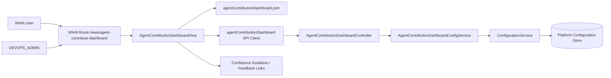

# System Architecture: Agent Contribute Dashboard

**Date:** 2026-05-26
**Status:** Backfilled / Implemented
**Source:** `docs/03-spec/agent-contribute-dashboard-spec.md`

---

## 1. Overview

Agent Contribute Dashboard is a WWA shared-control dashboard that combines static SDLC contribution baseline data with persisted stage status overrides. The architecture intentionally avoids a new business entity model: static descriptive content lives in frontend JSON, while mutable implementation status is stored through the existing platform configuration domain.

**Architectural style:** Lightweight layered dashboard with configuration-backed admin override.

---

## 2. Architectural Drivers

### Functional Drivers

- Show seven Qilianshan SDLC stages in one dashboard.
- Show ownership and contribution coverage without agent registration.
- Let `DEVOPS_ADMIN` update stage implementation status.
- Keep Confluence links data-driven.

### Non-Functional Drivers

- Avoid unclear performance scoring.
- Avoid schema churn for descriptive dashboard baseline content.
- Preserve WWA shell and shared control navigation conventions.
- Use existing platform authorization and configuration patterns.

---

## 3. System Context

| Actor / System | Role |
|---|---|
| WWA Viewer | Reads dashboard coverage and links. |
| DEVOPS_ADMIN | Updates stage status. |
| WWA Frontend | Renders dashboard from JSON plus status API. |
| Platform Configuration API | Persists mutable status override map. |
| Confluence | External target for guideline and feedback links. |

---

## 4. Architecture Diagram

---

## 5. Component Breakdown

### 5.1 Frontend Components

- **AgentContributionDashboardView**: Renders the dashboard, status summary, coverage map, matrix, selected-stage detail panel, Confluence links, and admin status control.
- **agentContributionDashboard.json**: Static baseline for stages, workstreams, owners, gates, and resource links.
- **agentContributionDashboard API client**: Calls platform status read/update endpoints.
- **Router entry**: Registers `/wwa/agent-contribute-dashboard`.
- **Agent registry entry**: Adds the dashboard under WWA shared controls.

### 5.2 Backend Components

- **AgentContributionDashboardController**: Provides status read/update API under `/api/platform/agent-contribute-dashboard`.
- **AgentContributionDashboardConfigService**: Validates allowed stage keys and status values, serializes/deserializes override payloads, and delegates persistence.
- **ConfigurationService**: Existing platform configuration service used as persistence boundary.
- **ConfigKey**: Adds `agent_contribution_dashboard_statuses`.

### 5.3 External Systems

- **Confluence**: Dashboard links point to Confluence guideline and feedback pages. The dashboard does not call Confluence APIs.

---

## 6. Data Architecture

Static baseline data is frontend-owned because it is descriptive content rather than operational transaction data.

Stored in:

`frontend/src/config/agentContributionDashboard.json`

Mutable stage statuses are backend-owned and persisted in platform configuration under:

`agent_contribution_dashboard_statuses`

Allowed stage keys:

`planning`, `estimation`, `discovery`, `build`, `testing`, `deployment`, `maintenance`

Allowed statuses:

`implemented`, `in-progress`, `backlog`, `not-implemented`

---

## 7. Request Flow

### Read Flow

1. User opens `/wwa/agent-contribute-dashboard`.
2. Frontend renders static dashboard baseline.
3. Frontend calls `GET /api/platform/agent-contribute-dashboard/statuses`.
4. Backend returns persisted overrides and metadata.
5. Frontend merges overrides with static stage definitions.

### Admin Update Flow

1. `DEVOPS_ADMIN` selects a stage.
2. User selects a new status and clicks Save.
3. Frontend sends the complete status map to `PUT /api/platform/agent-contribute-dashboard/statuses`.
4. Controller checks `DEVOPS_ADMIN`.
5. Config service validates keys and values.
6. Configuration service persists the override payload.
7. Frontend refreshes rendered status labels and notes.

---

## 8. API / Interface Boundaries

| Interface | Consumer | Purpose |
|---|---|---|
| `GET /api/platform/agent-contribute-dashboard/statuses` | Dashboard frontend | Load persisted status overrides. |
| `PUT /api/platform/agent-contribute-dashboard/statuses` | Dashboard frontend | Persist admin status changes. |
| Static JSON import | Dashboard frontend | Load stage and contribution baseline. |
| Confluence links | Browser | Open guideline/feedback pages. |

---

## 9. Architecture Decisions

### AD-1: Static Baseline in Frontend JSON

The stage model is descriptive and changes with product language, not operational transactions. Keeping it in JSON makes iteration fast and keeps backend persistence limited to mutable admin state.

### AD-2: Persist Only Status Overrides

Only stage implementation status needs admin mutation in MVP. Persisting only overrides avoids premature backend data modeling.

### AD-3: No Score Model

Scores are intentionally excluded because the product has no accepted calculation basis. The dashboard focuses on ownership and contribution coverage.

### AD-4: Confluence as Link Target, Not Integration

The MVP only stores links. It does not read, write, or validate Confluence pages.

---

## 10. Risks and Open Questions

Architectural risks are listed below. Pending decisions are tracked as tasks in `docs/06-tasks/agent-contribute-dashboard-tasks.md`.

- Placeholder Confluence URLs must be replaced with real internal pages before production release.
- If non-status content becomes admin-editable later, the static JSON decision (AD-1) should be revisited.
- If management requests quantitative metrics later, scoring requirements must be separately specified and justified via a new SDD change.
