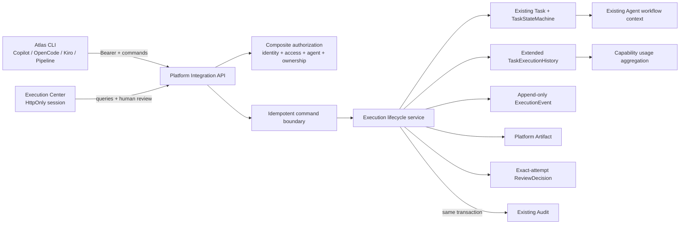

# Atlas CLI Platform Integration Architecture

**Slice:** `atlas-cli-platform-integration`
**Date:** 2026-08-07
**Status:** Generated via `spec-to-architecture`; accepted for implementation
**Decision:** `ADR-0011-atlas-integration-is-platform-control-plane.md`

## 1. Architecture Outcome

Atlas Integration is an agent-neutral Platform Core capability around the existing Task/Execution
aggregates. The server is the control plane and single lifecycle authority; CLI tools remain the local
execution plane.

## 2. Module Ownership

| Concern | Owner | Allowed dependencies |
|---|---|---|
| Task and attempt aggregate | Existing `domain.task` | request/release-flow shared domain, contracts |
| Integration lifecycle and policies | `platform.domain.integration` | shared domain/repositories/contracts; never `agents..` |
| API contracts | `contracts.integration` | Java/Jakarta validation only; no JPA entity dependency |
| Shared HTTP routes | `platform.web.shared.integration` | Platform facades/contracts/security context; no repositories |
| Bearer/client identity | `platform.web.security` | security contracts/config; no Agent implementation |
| Web | `frontend/src/platform/integration` and one Platform view | Integration API only |
| Domain workflow | Existing Agent Modules | may call Platform facade, may not own Integration persistence |

The existing `AgentModuleBoundaryTest` remains active. New architecture tests add explicit rules for
Integration packages and runtime prohibitions.

## 3. Reused Aggregates And Seams

| Existing seam | Use in this slice |
|---|---|
| `Task` / `DA_TASK` | authoritative Task; add active fence and integration binding |
| `TaskExecutionHistory` / `DA_TASK_EXECUTION_HISTORY` | authoritative numbered Execution attempt; add identity/capability/project/outcome snapshots |
| `TaskStateMachine` | sole legal Task transition validator; add cancel edge |
| `DecisionEngine` / progression | apply review outcomes; remove eager rerun attempt |
| `Request` / `ReleaseFlow` | WorkItem, project, team (`snowGroup`), Agent Module scope |
| `UserContext`, Access Grants | session identity, role/permission, project/team scope |
| `AgentBoundaryGuard` semantics | cross-Agent non-disclosing 404; composite authorizer generalizes it |
| `CorrelationIdFilter` | request ID validation/generation/echo/MDC |
| `AuditLoggerService` | existing audit storage; Integration uses atomic allowlisted writes while legacy APIs retain best-effort behavior |

## 4. New Components

### 4.1 Domain/Application

- `IntegrationAuthorizationService`: composite identity, scope, Agent, ownership, and review/telemetry authorization.
- `ExecutionLifecycleService`: Task lock, attempt allocation, fencing, legal transition, Execution Event.
- `IdempotentCommandService`: validates/canonicalizes request, executes once, and returns typed replay.
- `IntegrationArtifactService`: upload/reference policy, metadata/content persistence, safe retrieval.
- `ReviewDecisionService`: exact-attempt immutable review plus existing workflow progression.
- `CapabilityUsageService`: scoped aggregation over immutable, integration-managed Execution facts.
- `IntegrationProjectionService`: safe Task/Execution/artifact DTO mapping.

### 4.2 Persistence

- `ExecutionEvent`
- `IntegrationArtifact`
- `TaskInputArtifactApproval`
- `IntegrationReviewDecision`
- `IdempotencyRecord`

CLI credential descriptors are configuration-backed in v1; only digests exist in configuration memory.
No token administration or raw-token persistence table is introduced.

### 4.3 HTTP

- `AtlasTaskController`
- `AtlasExecutionController`
- `AtlasArtifactController`
- `AtlasReviewController`
- `CapabilityUsageController`
- integration-scoped success/error envelopes and exception advice
- `IntegrationBearerAuthFilter` and authenticated client context

Controllers use Platform services, not JPA repositories, and never accept arbitrary target status.

## 5. Consistency Boundaries

### 5.1 Lifecycle Transaction

The transaction includes Task, Execution, active fence, artifact/review mutation when applicable,
Execution Event, allowlisted existing Audit row, and idempotency completion. Integration uses the mandatory
atomic audit entry point; unrelated legacy APIs retain their existing best-effort `REQUIRES_NEW` behavior.

### 5.2 Lock Order

Lifecycle mutations acquire locks in the same hierarchy:

1. Relevant Task pessimistic write locks in stable Task-ID order. A normal lifecycle command has one Task;
   Review locks every Task in its Request because legal progression may release a sibling.
2. Execution pessimistic write lock, when an execution exists.
3. Artifact rows, when needed, in one globally sorted ID order after merging local and referenced-source IDs.
4. Review/idempotency rows as needed.

Retention cleanup uses the same Artifact-ID order and one bounded batch transaction, then rechecks the locked
row before clearing content. This avoids inconsistent fencing and cross-resource lock cycles. The Task lock
serializes attempt allocation.

### 5.3 Replay Order

Authentication and target authorization occur before replay. A completed same-fingerprint record is
returned before current state-transition validation so a legitimate retry still succeeds after the first
command moved the latest resource to a terminal state. For Execution-bound commands, replay lookup invokes an
operation guard in the same transaction; that guard holds the Task pessimistic lock, reauthorizes, and rejects
the replay once the Execution is no longer `Task.latestExecutionId`. Start/rerun uses the same lock, so no newer
attempt can commit between the replay fence and stored-response return.

## 6. Security Architecture

The Integration bearer filter is path-scoped to `/api/v1/integration/**`. It hashes the presented token,
looks up an enabled, unexpired descriptor, compares digests in constant time, and constructs server-derived
identity. It never copies the token to MDC, exception details, persistence, or response.

For employee Web sessions, `SessionAuthFilter` reloads the current Access Grant on every request even when
Spring restored a cached session SecurityContext. It rebuilds roles/permissions/scopes and immediately
invalidates a missing, suspended, historical `GUEST`, mixed `GUEST`, or otherwise invalid grant. Only the
dedicated server-set synthetic Guest marker plus an exact single-role Guest identity bypasses grant lookup;
Access Grant create/update/reactivate/bootstrap and Integration bearer-client registry reject `GUEST`.
Successful employee authentication rotates any existing anonymous/Guest Session ID before writing employee
context. For bearer calls, the presented raw credential is held only in a request-thread leak guard and compared
against client-authored persisted fields before scanners or persistence; it is cleared in `finally`.

The composite authorizer checks:

1. authenticated non-guest principal;
2. allowed Agent Module against Request context and platform registry;
3. existing Application/SNOW Group access scope;
4. operation role/permission;
5. Task assignee/owner for start/review;
6. recorded user + client application ownership for execution writes;
7. explicit delegation/admin escape hatch only where defined.

Cross-scope/Agent queries produce resource 404. Input, output, events, audit, and UI are allowlist projections.

## 7. Artifact Architecture

V1 uses a platform-owned BLOB behind `IntegrationArtifactService`, suitable for bounded evidence. Metadata
and content are never fetched together by query projections. The service validates digest, length, safe
basename/path, role, kind, media/signature, active fence, and scope. Reference mode points only at an
existing Atlas artifact ID and never dereferences caller URLs. Upload/download share a node-wide concurrency
budget with exact, reference-counted per-client keys. A security-chain upload filter takes that permit before
Servlet multipart parsing and holds it through the response; an exact Execution-key permit serializes the later
scan/persist stage. Source/reference rows are pessimistically locked when references, approved inputs, or terminal
submission establish durability. Terminal submit merges local and source IDs and locks the globally sorted set.

Unheld content receives a configurable expiry (30 days by default); reference and submit renew it. Approved
inputs set legal hold. A scheduled cleanup drains a configurable maximum number of ID-ordered batches, each in
an independent transaction, while retaining metadata and rechecking eligibility under lock. Deployed profiles
fail startup without a production-ready malware/DLP scanner implementation; the built-in EICAR/content gate
is local/test-only support, not a production scanner.

Structured evidence has media-specific byte ceilings below the transport ceiling. JSON validation consumes one
Jackson token stream under configured token/depth budgets and never builds a full object tree, bounding heap
amplification from many-field payloads.

An object-store implementation may replace BLOB storage behind the service later; IDs, digests, provenance,
authorization, and download semantics remain stable.

## 8. Telemetry Architecture

Execution snapshots make historical metrics stable even if a Task's capability or project binding changes.
V1 applies snapshot-based application/team/Agent authorization and a bounded UTC date range, then executes
database aggregate/version projections grouped by capability type/id. Artifact BLOBs, legacy input snapshots,
raw logs, and audit payloads are never involved.

## 9. Web Architecture

Execution Center is a Platform route registered once in `platformCapabilities`. A dedicated API layer and
types prevent legacy release-flow DTOs from leaking raw fields. A visibility-aware polling composable has an
in-flight guard and cleanup. Pinia state is a cache only: reads replace it, writes trigger a fresh read, and
the frontend contains no state-transition reducer.

## 10. Compatibility

- Legacy status enums remain stored; DTO mapping produces public uppercase values.
- Existing controller envelopes remain unchanged; only Integration paths use the new envelope/advice.
- Existing manual/auto/external monitor implementations are migrated incrementally to the shared lifecycle.
- Legacy incomplete Tasks are not exposed rather than receiving invented integration metadata.
- Existing Agent Module routes remain thin adapters where retained.

## 11. Fitness Functions

1. Platform Integration has no dependency on `agents..`, `AgentId`, Jenkins/Ansible adapters, LangGraph,
   local Skill runtime, repository scanners, or LLM clients.
2. Integration contracts have no JPA/domain entity dependency.
3. Shared controllers have no repository dependency and live only under `platform.web.shared`.
4. No Artifact/Telemetry/Idempotency/Review lifecycle entity or service exists in an Agent package.
5. State machine tests enumerate all Integration edges and reject arbitrary target transitions.
6. Concurrent tests prove one active attempt; security tests prove isolation and replay reauthorization.

## 12. Risks And Mitigations

| Risk | Mitigation |
|---|---|
| Oracle BLOB/DDL drift | V21 migration, greenfield schema update, migration compatibility test |
| Legacy direct state writes | route integration paths through lifecycle first; regression tests; track remaining adapters explicitly |
| Bearer misconfiguration/credential spray | fail closed, digest-only descriptors, startup validation, trusted-remote failed-authentication response limiter with valid-credential bypass, no default production credential |
| Artifact content spoofing or parser exhaustion | digest-first checks, media-specific byte/token/depth limits, streaming JSON, type/signature/source/DLP policy, production scanner readiness, no archives/URLs |
| Artifact retention race | Artifact/source row locks, renewal, legal hold, and scheduled unheld-BLOB cleanup |
| Metrics leakage | authorize and filter rows before grouping; cross-scope integration tests |
| Offline state ambiguity | expose only Atlas last-known `pendingSync`; never infer unsent local completion |
