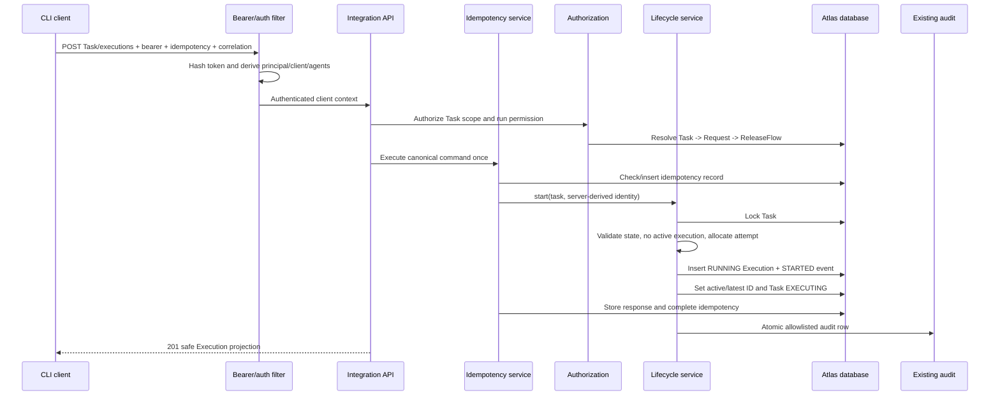
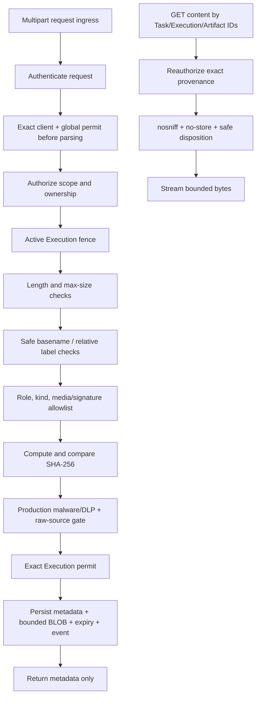
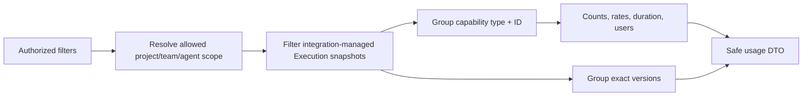

# Atlas CLI Platform Integration Data Flow

**Slice:** `atlas-cli-platform-integration`
**Date:** 2026-08-07
**Status:** Generated via `spec-to-architecture`

## 1. Start Execution

No client-supplied status, attempt, time, user, or client type is persisted.

## 2. Progress, Artifact, And Terminal Commands

1. Authenticate and derive identity.
2. Resolve Execution to Task and reauthorize Agent/project/team scope.
3. Resolve idempotency replay; a completed replay takes the Task lock and checks current authorization/latest
   attempt in the replay lookup transaction.
4. Lock Task then Execution.
5. Assert active/latest ID, Task `Executing`, Execution `Running`, and execution ownership.
6. Apply exactly one bounded mutation:
   - progress: validate safe prose and append a unique sequence event only;
   - artifact: validate/store immutable artifact and increment server-derived count;
   - submit/fail/cancel: set terminal Execution, duration/outcome, transition Task, clear active ID.
7. Append lifecycle event and complete idempotency transaction.
8. Persist the safe Audit row in the same transaction.

An old Execution fails at step 5 and cannot mutate artifacts, events, Task state, or telemetry facts.

## 3. Artifact Upload And Download

Reference mode locks and revalidates an existing immutable Atlas artifact ID, renews its content retention,
and never follows a URL. Submission globally sorts and locks the union of local and source Artifact IDs.
Approved input creates legal hold. Cleanup drains a configurable maximum number of ID-ordered batches, runs
each in its own transaction, uses the same row-lock order, rechecks eligibility, and clears only expired,
unheld BLOBs while metadata remains.

## 4. Human Review

1. Web session submits exact Execution ID, decision, bounded safe-prose comment, and idempotency key.
2. Atlas rejects bearer-only client review, authorizes human scope/review permission, locks every Request Task
   in stable ID order, then locks the exact Execution.
3. Atlas verifies latest `SUCCEEDED` Execution and Task `Awaiting_Review`.
4. Unsafe rationale rejects the whole command; otherwise Atlas persists one immutable Review Decision,
   invokes legal decision/progression behavior, and appends
   `REVIEWED` event in the same transaction.
5. Audit is emitted; UI discards no local truth but re-fetches Task/Execution/decision from Atlas.

Rerun is separate: it changes a rejected/failed Task to ready and creates no Execution.

## 5. Capability Usage Query

Artifact bytes, input snapshots, raw result logs, repository URLs, and audit details never enter the query.

## 6. Web Polling

The Execution Center begins one immediate refresh, then a 10-second interval. If a request is in flight,
the next tick is skipped. When `document.hidden` becomes true, the interval pauses; visibility restoration
triggers one refresh before resuming. Unmount aborts/cleans up. A transient failure records a safe message and
request ID but preserves the last successful data. Review and artifact actions always re-fetch from Atlas.

## 7. Failure Boundaries

| Failure | Durable result |
|---|---|
| Authentication/authorization/validation | no mutation, no idempotency completion |
| Lifecycle DB failure | Task, Execution, event, artifact/review, idempotency all roll back |
| Audit failure | Integration lifecycle/event/audit transaction rolls back; legacy APIs retain best-effort audit |
| Duplicate progress sequence | conflict; no second event |
| Idempotent replay | original response only; no duplicate event/audit/artifact |
| Web network failure | server state unchanged; last safe cache retained |
