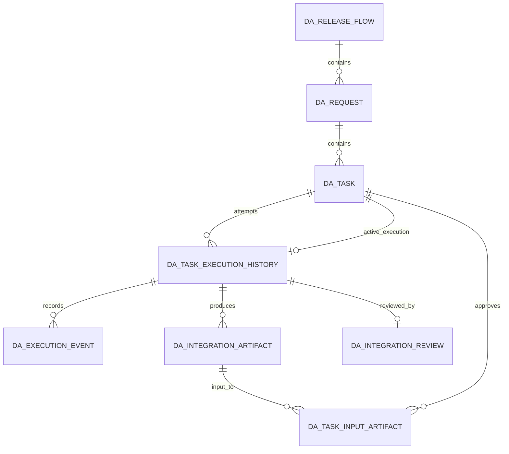

# Atlas CLI Platform Integration Data Model

**Slice:** `atlas-cli-platform-integration`
**Date:** 2026-08-07
**Status:** Generated via `spec-to-architecture`
**Migration:** `V21__add_atlas_integration_platform.sql`

## 1. Aggregate Reuse

No new Task or Execution aggregate is introduced.

- `DA_TASK` is the authoritative Task.
- `DA_TASK_EXECUTION_HISTORY` is the authoritative Execution attempt.
- `DA_REQUEST` and `DA_RELEASE_FLOW` provide Agent/team/project WorkItem context.

## 2. `DA_TASK` Additions

| Column | Type | Rule |
|---|---|---|
| `active_execution_id` | VARCHAR2(36) | nullable fencing token; one active attempt |
| `assignee_user_id` | VARCHAR2(255) | stable execution/review identity; owner remains display-only |
| `capability_id` | VARCHAR2(255) | server-owned stable ID |
| `capability_type` | VARCHAR2(30) | `SKILL`, `SCRIPT`, `PIPELINE`, `MANUAL` |
| `capability_version` | VARCHAR2(100) | exact version, default prohibited for visible non-legacy rows |
| `repository_id` | VARCHAR2(255) | server-owned repository identity |
| `repository_provider` | VARCHAR2(50) | provider label |
| `repository_url` | VARCHAR2(2000) | server-owned; never exposed in Execution Center |
| `repository_branch` | VARCHAR2(255) | asserted branch |
| `repository_commit` | VARCHAR2(255) | asserted immutable revision where required |
| `created_at` | TIMESTAMP WITH TIME ZONE | server time; backfilled from best available Task timing |

Indexes support active execution and integration-ready/capability queries. Fields are nullable for legacy
compatibility; Integration visibility requires a complete valid binding.

## 3. `DA_TASK_EXECUTION_HISTORY` Additions

| Column group | Columns |
|---|---|
| concurrency | `version` |
| ownership | `integration_managed`, `user_id`, `user_display_name`, `client_application_id` |
| client | `client_type`, `client_version` |
| capability | `capability_type`, `capability_id`, `capability_version` |
| scope snapshot | `project_id`, `project_name`, existing `config_application`, `config_snow_group`, `config_agent` |
| repository assertion | `repository_id`, `repository_provider`, `repository_branch`, `repository_commit` |
| outcome | `duration_ms`, `artifact_count`, `failure_code`, `failure_message`, `failure_retryable`, `cancellation_reason` |
| trace | `correlation_id`, `last_event_at` |

`ExecutionStatus.Cancelled` is added. Existing status rows remain valid and public mapping is performed in DTOs.
Indexes cover integration/time, capability, client, project/team/Agent, and user filtering.

## 4. New Tables

### 4.1 `DA_EXECUTION_EVENT`

| Column | Rule |
|---|---|
| `id` | UUID primary key |
| `execution_id`, `task_id` | required provenance foreign keys |
| `event_type` | lifecycle allowlist |
| `sequence_number` | optional for server events; positive client progress sequence |
| `percentage` | optional 0-100 |
| `message` | optional bounded safe text |
| `details_json` | bounded allowlist JSON; no arbitrary payload |
| `actor_kind`, `actor_id`, `client_application_id` | server-derived identity |
| `correlation_id` | request trace |
| `client_timestamp`, `received_at` | client assertion plus server authority |

Unique `(execution_id, sequence_number)` when sequence is non-null. Append-only at application level.

### 4.2 `DA_INTEGRATION_ARTIFACT`

| Column | Rule |
|---|---|
| `id`, `task_id`, `execution_id` | exact provenance |
| `role`, `kind`, `name`, `media_type` | validated allowlist metadata |
| `size_bytes`, `sha256` | server-verified |
| `source_path` | optional safe relative label; never exposed to Web |
| `storage_mode` | `UPLOAD` or `REFERENCE` |
| `content_blob` | bounded upload bytes, null for reference |
| `reference_artifact_id` | authorized immutable Atlas artifact only |
| `created_by`, `client_application_id`, `correlation_id`, `created_at` | provenance |
| `content_expires_at`, `content_purged_at`, `legal_hold` | renewable retention window, cleanup evidence, approved-input hold |
| `version` | optimistic protection; content otherwise immutable |

Indexes cover execution/task and digest. A check/business rule requires exactly one of content or reference.

### 4.3 `DA_TASK_INPUT_ARTIFACT`

Task-specific input approval: UUID, Task ID, Artifact ID, approver, approval time, unique `(task_id, artifact_id)`.

### 4.4 `DA_INTEGRATION_REVIEW`

One immutable row per exact Execution: UUID, Task/Execution IDs, decision, reviewer ID/display name, bounded
comment, correlation ID, decided time. Unique `execution_id`.

### 4.5 `DA_INTEGRATION_IDEMPOTENCY`

| Column | Rule |
|---|---|
| identity | principal ID, owning client application ID, method, canonical path, SHA-256 idempotency key hash |
| request | canonical SHA-256 fingerprint |
| state | `IN_PROGRESS` or `COMPLETED` |
| response | HTTP status, safe JSON body CLOB, optional resource location |
| timing | created, completed, expiry timestamps |
| concurrency | optimistic version and unique identity tuple |

No binary bodies or secrets are stored.

## 5. Relationships

Idempotency records reference resources by canonical path/response rather than ownership foreign keys, allowing
replay across operation types while authorization still resolves the target before replay. Execution-bound
completed replay lookup joins an operation guard that holds the Task row lock and validates the current latest
attempt before the stored response can be returned.

## 6. Retention And Privacy

- Execution Event, review, and artifact metadata are audit-grade and retained with their Execution.
- Unheld BLOB content expires after the configured period (30 days default); references/submission renew the
  window, approved inputs set legal hold, cleanup retains metadata and records purge time, and v1 exposes no delete.
- Stale `IN_PROGRESS` idempotency reservations expire after 30 minutes by default. Completed records are retained
  for the associated resource lifetime (indefinite while Execution/Artifact metadata is retained).
- Raw bearer tokens, prompts, environment, complete source, repository archives, and arbitrary full logs are
  not columns in new tables.
- Existing legacy `input_snapshot`/`result_logs` remain for compatibility but are excluded from Integration
  projections and telemetry.

## 7. Migration Compatibility

V21 adds nullable columns/default-safe values and new tables without rewriting existing status data. It
backfills `created_at` conservatively and initializes execution `version`/`artifact_count` where necessary.
The same end state is reflected in `docs/sql/ORACLE_CURRENT_SCHEMA.sql`. JPA tests use H2 auto-DDL; a dedicated
migration contract test checks required Oracle objects, constraints, indexes, and absence of secret columns. An
environment-gated Oracle test refuses empty/already-current schemas, requires Flyway current version 20, and then
asserts that exactly V21 executes successfully.
