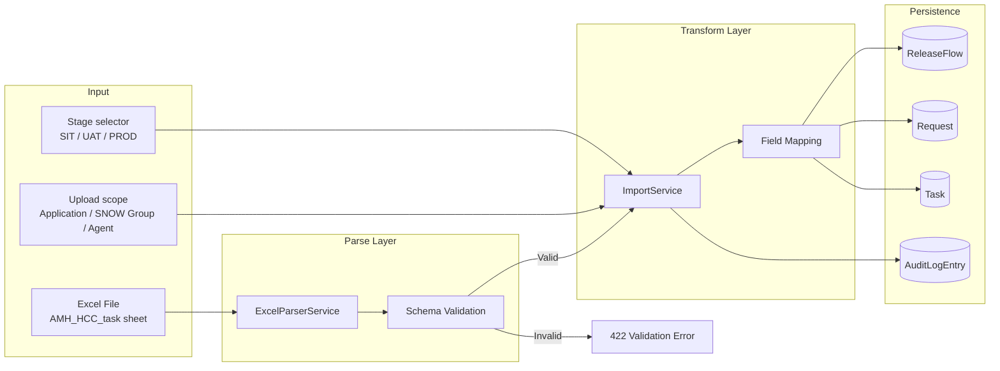
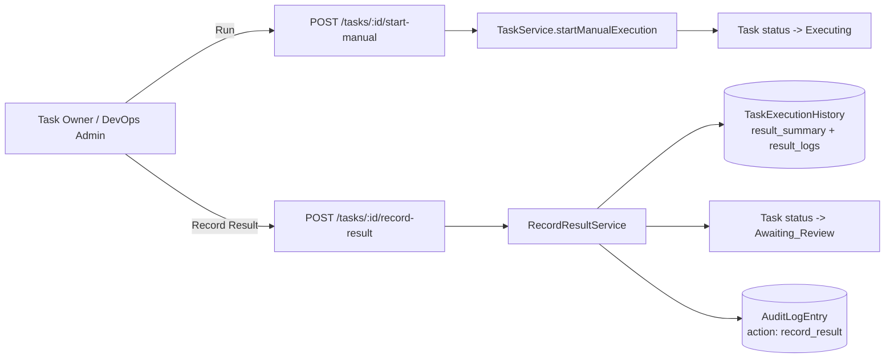
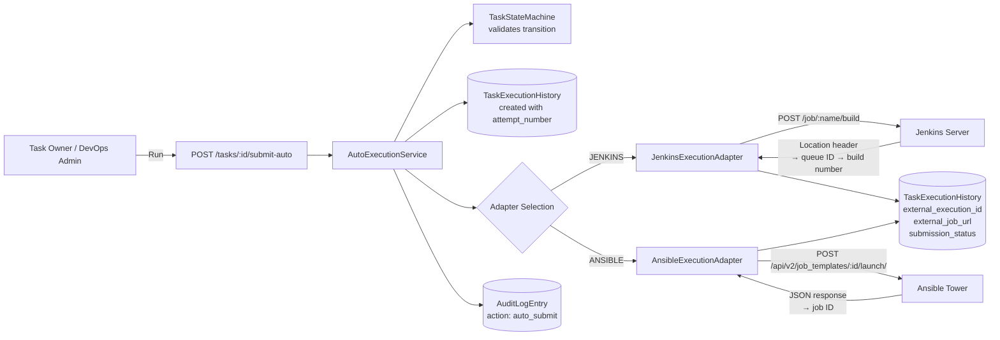
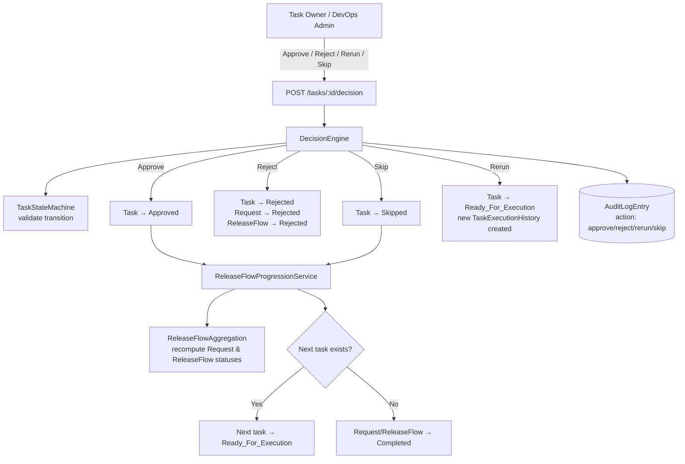
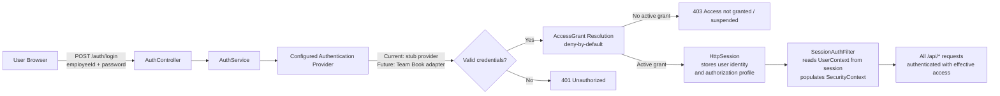
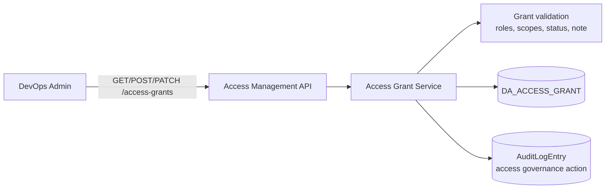
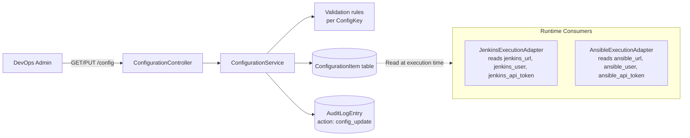
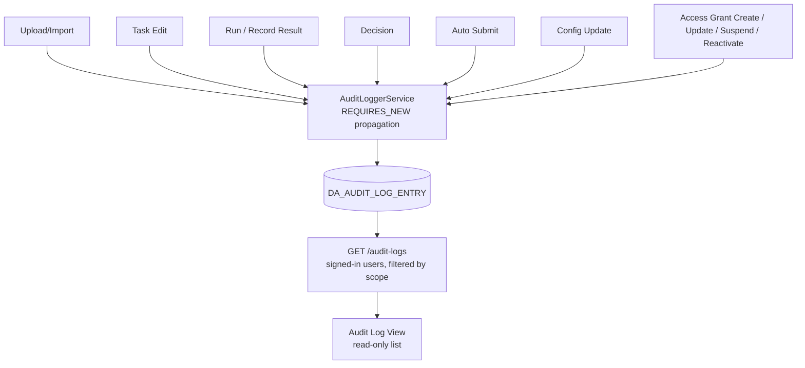
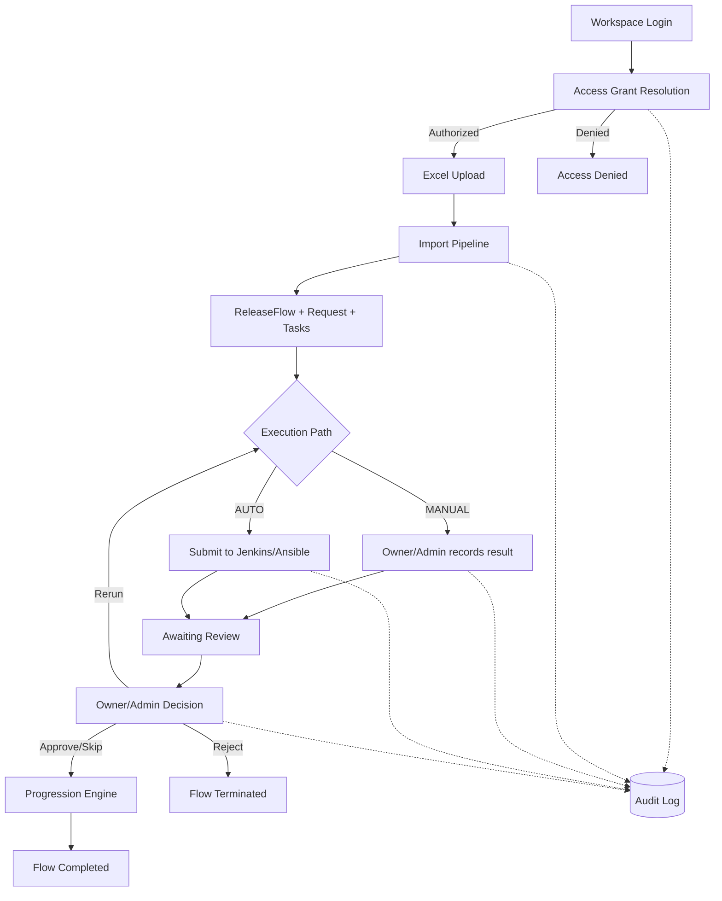

# Data Flow: Deployment Agent

> **Source**: architecture.md, spec.md, design.md
> **Last updated**: 2026-03-28

---

## Overview

This document describes how data flows through the Deployment Agent system, from external inputs (authentication, access-management actions, Excel upload, task actions) through processing layers to persistence and external systems.

---

## 1. Excel Import Data Flow

### Field Mapping Summary

| Excel Field | Target Entity | Target Attribute | Classification |
|---|---|---|---|
| Project ID | ReleaseFlow | project_id | Core - grouping key |
| Project Name | ReleaseFlow | project_name | Display |
| Task ID | Task | task_group_id | Display grouping |
| Task Name | Task | task_group_name | Display |
| Step seq# | Task | step_seq | Core - ordering |
| Step | Task | task_name | Core - identity |
| Execution Type | Task | execution_type | Core - MANUAL/AUTO |
| Script to be executed | Task | input_parameters.script | Core - payload |
| Parameter (input) | Task | input_parameters.parameters | Core - payload |
| Parameter (Expected Output) | Task | expected_output | Core - verification |
| Owner | Task | owner | Display |
| Planned Start/End | Task | planned_start_time/end_time | Display only |
| Activity category, Common, Dependencies, Validation | Task | import_metadata (JSON) | Metadata blob |
| Status, Start/End date/time | -- | Not stored | Dropped |
| *(from UI)* Stage | Request | stage | Core |
| *(from UI)* Application | Request | application | Runtime scope |
| *(from UI)* SNOW Group | Request | snow_group | Runtime scope |
| *(from UI)* Agent | Request | agent | Runtime scope |
| *(system-derived)* Rundown owner | Request | owner | Derived from a single imported task owner, otherwise uploader |
| *(system-generated)* Release ID | ReleaseFlow | release_id | Core |

---

## 2. Task Execution Data Flow

### 2.1 MANUAL Execution

### 2.2 AUTO Execution

### 2.3 External Execution Data Stored

| Field | Source | Example |
|---|---|---|
| external_system_type | Adapter selection | JENKINS, ANSIBLE |
| external_execution_id | Response from external system | Build #42, Job #789 |
| external_job_url | Constructed from response | `https://jenkins/job/deploy/42/console` |
| submitted_at | System clock | 2026-03-19T10:00:00Z |
| submission_status | Adapter result | SUBMITTED, FAILED |
| submission_message | Adapter result | "Build queued successfully" |

---

## 3. Decision Data Flow

### Status Aggregation Rules

Statuses bubble up from Task → Request → ReleaseFlow using pure functions in `ReleaseFlowAggregation`:

| Level | Computed From | Rule |
|---|---|---|
| Request status | All child Task statuses | All terminal → Completed/Failed/Rejected; Any active → Running; All Pending → Pending |
| ReleaseFlow flow_status | All child Request statuses | Same aggregation logic |
| Stage summary | Tasks in that stage | Done (all terminal), Running (any active), Pending (all pending) |

---

## 4. Authentication and Authorization Data Flow

### Auth Data Objects

| Object | Content | Lifecycle |
|---|---|---|
| LoginRequestDto | employeeId, password | Request-scoped |
| UserContext | employeeId, displayName, identity context | Stored in HttpSession |
| Authorization Profile `[Phase 1]` | access status, assigned roles, effective permissions, applicable scopes | Resolved during login / session restore |
| SecurityContext | Authentication with UserContext | Per-request from session |

### 4.1 Access Management Admin Flow

### 4.2 Authorization Resolution Notes

- Authentication confirms login identity through the configured provider abstraction
- Authorization then resolves local product access and `Application + SNOW Group` visibility through Access Grants
- Users without an active Access Grant are blocked before entering the Deployment Agent workspace
- Frontend route visibility and backend endpoint access are expected to use the same effective permission set and scope evaluation in Phase 1

---

## 5. Configuration Data Flow

### Configuration Keys

| Key | Consumer | Purpose |
|---|---|---|
| jenkins_url | JenkinsExecutionAdapter | Jenkins server base URL |
| jenkins_user | JenkinsExecutionAdapter | Basic auth username |
| jenkins_api_token | JenkinsExecutionAdapter | Basic auth API token |
| ansible_url | AnsibleExecutionAdapter | Ansible Tower base URL |
| ansible_user | AnsibleExecutionAdapter | Display/audit only |
| ansible_api_token | AnsibleExecutionAdapter | Bearer token auth |

---

## 6. Audit Data Flow

### Audit Entry Structure

| Field | Description |
|---|---|
| audit_log_id | System-generated UUID |
| operator_id | From authenticated UserContext |
| operator_role | From authenticated UserContext |
| action_type | upload, edit, view_result, approve, reject, rerun, skip, auto_submit, config_update, access-governance actions |
| timestamp | System clock at event time |
| release_flow_id | Nullable context reference |
| request_id | Nullable context reference |
| task_id | Nullable context reference |
| application | Nullable scope field for filtering and traceability |
| snow_group | Nullable scope field for filtering and traceability |
| agent | Nullable scope field for filtering and traceability |
| context_payload | JSON with action-specific details |

### Audit Isolation

`AuditLoggerService` uses `Propagation.REQUIRES_NEW` to ensure audit log writes succeed independently of the business transaction. If the business operation rolls back, the audit entry is still persisted.

---

## 7. Summary: End-to-End Data Path

