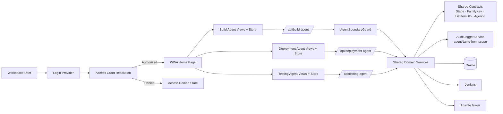

# Detailed Design: Build Agent

**Date:** 2026-04-11
**Status:** Draft (v2, post-review)
**Source:** `docs/04-architecture/build-agent-architecture.md` (primary), `docs/03-spec/build-agent-spec.md`, `docs/05-design/testing-agent-design.md` (baseline), `docs/05-design/design.md` (platform baseline)

---

## Overview

This document translates the Build Agent architecture (v2) into implementation-facing design guidance. Build Agent reuses the existing domain services, repositories, and shared capabilities. Unlike Testing Agent, Build Agent requires:

1. **Five surgical additive changes** to the shared contract / service layer
2. **One new controller-layer component** (`AgentBoundaryGuard`)
3. **Four new Build Agent controllers** (release-flow, upload, task, decision)
4. **One parallel frontend workspace** (client, API modules, store, two views)

All existing Deployment Agent and Testing Agent backend code remains untouched except for the additive shared-contract updates and the one-line shared `AuditLoggerService` fix.



### Design Objective

- Add Build Agent as the third agent workspace with minimal impact on existing agents
- Achieve data isolation through `Request.agent` filtering plus a new `AgentBoundaryGuard` on task and flow operations
- Introduce `DEV` as a first-class terminal stage without changing any progression logic
- Fix the pre-existing `AuditLoggerService` `agentName` hardcoding as a shared side effect

### Relationship to Existing Design Documents

- `design.md` (Deployment Agent) defines all module designs, state models, validation rules, and integration patterns. Where this document is silent, those designs apply unchanged
- `testing-agent-design.md` defines the thin-controller-delegation pattern. Build Agent follows the same pattern plus the guard and the audit fix
- This document covers only Build Agent-specific additions and the enumerated shared-contract/service changes

---

## Design Assumptions

- All Deployment Agent and Testing Agent design assumptions carry forward unchanged
- `Request.agent` column plus a controller-layer boundary guard is sufficient for data isolation
- `Stage` enum additive change does not break any existing test (no external code does `Stage.ordinal()` math; `Stage.values()` iterations are filter-based)
- `ReleaseFlowListItemDto` is a positional record constructed at two call sites (the `from` factory in `ReleaseFlowListItemDto.java:52` and `ReleaseFlowService.buildStitchedSummary` at `ReleaseFlowService.java:675`). Both call sites will be updated to pass the two new appended arguments
- `AuditLoggerService` is the single writer of audit rows (all call sites go through its `log(...)` overloads); a one-line change inside its `log` method takes effect for every caller
- `ReleaseFlowService.listStitchedSummaries` pre-filters by agent, so Build Agent summary stitching is **within-agent only**. Cross-agent stitching is out of scope
- Deployment Agent summary continues its "global view" semantics unchanged

---

## Design Scope

### In Scope

1. Shared contract modifications: `Stage`, `ReleaseFlowFamilyKey`, `ReleaseFlowListItemDto`, `AgentId`
2. Shared service fix: `AuditLoggerService.log` dynamic `agentName`
3. New `AgentBoundaryGuard` component with task / request / flow assertion methods
4. Four Build Agent backend controllers (release-flow, upload, task, decision)
5. Frontend API client, API modules, Pinia store, and two views
6. `agentRegistry.ts` and router updates
7. Test coverage for shared contracts, audit fix, guard, and Build Agent endpoints

### Out of Scope

- All items listed as out of scope in the Deployment Agent and Testing Agent designs
- Build-specific domain logic, task types, or execution adapters
- Back-patching Testing Agent task-mutation agent boundary (still tracked as R-08)
- Extracting shared `AgentSummaryView` / `AgentDetailView` components (R-03)
- Stitched linked detail in Build Agent (AD-10)
- Cross-agent stitching at the summary layer (R-14)
- Changing Deployment Agent summary visibility to exclude build-only flows (AD-12)
- Backfilling historical Testing Agent audit rows whose `agentName` was previously hardcoded (R-12)

### Design Boundaries

- Build Agent controllers delegate to shared services — no business logic in controllers
- Agent boundary is enforced at the controller layer, not inside domain services
- Shared contract changes are all additive — no removal, no rename, no signature break
- `AuditLoggerService` fix is a single one-line change inside an existing method; no caller signatures change

---

## Module Design

### Module 1: Shared Contract Modifications

#### 1.1 Stage Enum

**File:** `src/main/java/com/wwa/deploymentagent/contracts/enums/Stage.java`

**Change:** Add `DEV` as the first enum value. Replace the ordinal-based `next()` with an explicit switch so DEV does not auto-advance to SIT.

```java
package com.wwa.deploymentagent.contracts.enums;

public enum Stage {
    DEV,
    SIT,
    UAT,
    PROD;

    public Stage next() {
        return switch (this) {
            case DEV -> null;
            case SIT -> UAT;
            case UAT -> PROD;
            case PROD -> null;
        };
    }
}
```

**Test expectations (new cases in `StageTest`):**

| Input | Expected |
|---|---|
| `Stage.DEV.next()` | `null` |
| `Stage.SIT.next()` | `Stage.UAT` |
| `Stage.UAT.next()` | `Stage.PROD` |
| `Stage.PROD.next()` | `null` |
| `Stage.values().length` | `4` |
| `Stage.valueOf("DEV")` | `Stage.DEV` |

#### 1.2 ReleaseFlowFamilyKey — Conservative DEV Recognition

**File:** `src/main/java/com/wwa/deploymentagent/domain/releaseflow/ReleaseFlowFamilyKey.java`

**Design rule (binding):** `dev` is recognized as a stage token only in narrow cases. It is NOT added to the existing aggressive `STAGE_PREFIX_WITH_SEPARATOR` regex, because that would strip legitimate project identifiers like `dev-tools`.

**Specific changes:**

1. **Extend `STAGE_PREFIX_WITH_DIGITS`** to include `dev` — handles `dev1234`:
   ```java
   private static final Pattern STAGE_PREFIX_WITH_DIGITS = Pattern.compile(
           "^(dev|sit|uat|prod)(\\d.+)$",
           Pattern.CASE_INSENSITIVE);
   ```

2. **Add a new `DEV_PREFIX_WITH_DIGIT_SEPARATOR`** pattern — handles `DEV-1234` but not `dev-tools`:
   ```java
   private static final Pattern DEV_PREFIX_WITH_DIGIT_SEPARATOR = Pattern.compile(
           "^(dev)([^a-z0-9]+)(\\d.+)$",
           Pattern.CASE_INSENSITIVE);
   ```

3. **Extend `isStageToken`** to recognize `dev` (used by `stripInfixStageToken`):
   ```java
   private static boolean isStageToken(String token) {
       return "dev".equals(token)
               || "sit".equals(token)
               || "uat".equals(token)
               || "prod".equals(token);
   }
   ```

4. **Update `stripStageToken` method body** to try the new DEV-specific pattern in addition to the existing two. Order of attempts:
   - `stripInfixStageToken` (unchanged; now recognizes `dev` via the extended `isStageToken`)
   - `STAGE_PREFIX_WITH_SEPARATOR` (unchanged — sit/uat/prod only)
   - `DEV_PREFIX_WITH_DIGIT_SEPARATOR` (NEW — DEV + separator + digits only)
   - `STAGE_PREFIX_WITH_DIGITS` (extended — now also matches dev-prefix-digits)

5. **`stripStagePrefixFromNormalized`** does NOT need a DEV branch. The only callers are paths where the normalized form has already been alpha-numerically stripped; adding a `dev` branch there could strip `devtools` → `tools`, which is the exact regression we want to avoid.

6. **Do NOT modify** `STAGE_PREFIX_WITH_SEPARATOR`. This preserves the asymmetry: SIT/UAT/PROD strip aggressively (existing behavior), DEV strips conservatively.

**Test expectations (new/updated cases in `ReleaseFlowFamilyKeyTest`):**

| Input | Expected family key | Rationale |
|---|---|---|
| `"DEV-1234"` | `"1234"` | DEV + separator + digits → match `DEV_PREFIX_WITH_DIGIT_SEPARATOR` |
| `"dev1234"` | `"1234"` | DEV + digits → match `STAGE_PREFIX_WITH_DIGITS` |
| `"DEV_HCC_AMH_1234"` | identical to `"SIT_HCC_AMH_1234"` after normalization | Infix stage token path via `stripInfixStageToken` |
| `"dev-tools"` | `"devtools"` | Falls through all patterns; returns normalized input unchanged |
| `"dev-portal"` | `"devportal"` | Same as above |
| `"dev-kit-v2"` | `"devkitv2"` | Same as above |
| `"DEV-1234"` and `"dev1234"` | same key (`"1234"`) | Two Build Agent uploads with different punctuation stitch within-agent |
| `"SIT-builder"` | `"builder"` | Unchanged existing behavior — SIT still strips aggressively |

**Within-agent stitching only:** Because `ReleaseFlowService.listStitchedSummaries` pre-filters by agent, a Build Agent `DEV-1234` upload and a Deployment Agent `SIT-1234` upload will never be stitched into the same summary row. They appear as separate rows in their respective agent summaries. This is tracked as R-14.

#### 1.3 ReleaseFlowListItemDto — Appended Fields

**File:** `src/main/java/com/wwa/deploymentagent/contracts/dto/ReleaseFlowListItemDto.java`

**Change:** Append `devStatus` and `devPresent` to the end of the existing stage groups. Two positional call sites must be updated in lockstep.

**Record signature change (append-only):**

```java
public record ReleaseFlowListItemDto(
        // ... existing fields through prodStatus ...
        RequestStatus sitStatus,
        RequestStatus uatStatus,
        RequestStatus prodStatus,
        RequestStatus devStatus,      // ← NEW (appended after prodStatus)
        boolean sitPresent,
        boolean uatPresent,
        boolean prodPresent,
        boolean devPresent,           // ← NEW (appended after prodPresent)
        boolean stitched,
        int linkedReleaseCount,
        List<String> linkedReleaseIds,
        List<String> linkedReleaseFlowIds
) {
    // ...
}
```

**Call site 1:** `ReleaseFlowListItemDto.from(...)` factory at `ReleaseFlowListItemDto.java:52` — add two arguments after the existing stage populators:

```java
return new ReleaseFlowListItemDto(
        // ... unchanged arguments ...
        requestStatusFor(requests, Stage.SIT, attemptView),
        requestStatusFor(requests, Stage.UAT, attemptView),
        requestStatusFor(requests, Stage.PROD, attemptView),
        requestStatusFor(requests, Stage.DEV, attemptView),   // ← NEW
        hasStage(requests, Stage.SIT),
        hasStage(requests, Stage.UAT),
        hasStage(requests, Stage.PROD),
        hasStage(requests, Stage.DEV),                         // ← NEW
        // ... unchanged arguments ...
);
```

**Call site 2:** `ReleaseFlowService.buildStitchedSummary(...)` at `ReleaseFlowService.java:675` — same pattern: append two new arguments after the existing `stageStatusFor(...Stage.PROD...)` / `hasStage(...Stage.PROD)` lines.

**Why append, not prepend:** Appending is the minimal-delta change. Prepending to match enum declaration order would shift every existing positional argument and increases the risk of silent miswiring.

**Test expectations (new cases in `ReleaseFlowListItemDtoTest`):**

| Scenario | Assertions |
|---|---|
| Flow with only DEV requests | `devStatus != null`, `devPresent == true`, `sitPresent == false`, `sitStatus == Pending` |
| Flow with DEV + SIT requests | Both `devPresent` and `sitPresent` are true; statuses derived per stage |
| Flow with only SIT/UAT/PROD (legacy) | `devPresent == false`, `devStatus == Pending` |

#### 1.4 AgentId

**File:** `src/main/java/com/wwa/deploymentagent/contracts/AgentId.java`

**Change:** Add `BUILD_AGENT` constant.

```java
public final class AgentId {
    public static final String DEPLOYMENT_AGENT = "deployment-agent";
    public static final String TESTING_AGENT = "testing-agent";
    public static final String BUILD_AGENT = "build-agent";   // ← NEW

    private AgentId() {}
}
```

#### 1.5 AuditLoggerService — Dynamic agentName (Shared Fix)

**File:** `src/main/java/com/wwa/deploymentagent/domain/audit/AuditLoggerService.java`

**Current state (`AuditLoggerService.java:59-62`):**
```java
entry.setAgent(scope.agent());
// Platform audit standard fields (WWA-009)
entry.setAgentName("deployment-agent");  // ← hardcoded defect
entry.setSourceSystem("wwa-api");
```

**Required change:** Replace the hardcoded literal with a derivation from `scope.agent()` with a legacy fallback.

```java
entry.setAgent(scope.agent());
// Platform audit standard fields (WWA-009)
entry.setAgentName(scope.agent() != null ? scope.agent() : AgentId.DEPLOYMENT_AGENT);
entry.setSourceSystem("wwa-api");
```

**Justification:**
- Single-line diff inside the existing `log` method
- Zero caller signature changes — every existing Deployment Agent, Testing Agent, and new Build Agent call site benefits automatically
- `scope.agent()` is already populated correctly from `ScopeSnapshot.from(request)` and the context resolution path
- Legacy rows (null agent) continue to produce `"deployment-agent"`, matching historical behavior

**Side effect (intended):** Testing Agent audit entries created after this change will have `agentName = "testing-agent"` instead of the incorrect `"deployment-agent"` they have today. This is a forward-only fix tracked as R-12. Historical rows are not backfilled.

**Test expectations:**

| Scenario | `agentName` value |
|---|---|
| Build Agent request → `log(...)` with scope containing `agent = "build-agent"` | `"build-agent"` |
| Testing Agent request → `log(...)` with scope containing `agent = "testing-agent"` | `"testing-agent"` |
| Deployment Agent request → `log(...)` with scope containing `agent = "deployment-agent"` | `"deployment-agent"` |
| Legacy request with `agent = null` | `"deployment-agent"` (fallback) |

Add these assertions to the existing `AuditLoggerServiceTest` class. Also add a regression assertion that existing Deployment Agent tests continue to see `agentName = "deployment-agent"`.

---

### Module 2: AgentBoundaryGuard

**Responsibilities**
- Validate that a task-level operation targets a task whose parent request belongs to the expected agent
- Validate that a request-level operation targets a request that belongs to the expected agent
- Validate that a flow-level operation targets a Persisted Release Flow with at least one request from the expected agent
- Reject violations with HTTP 404 to avoid leaking namespace membership

**File:** `src/main/java/com/wwa/deploymentagent/web/security/AgentBoundaryGuard.java`

**Component contract:**

```java
package com.wwa.deploymentagent.web.security;

import com.wwa.deploymentagent.domain.releaseflow.ReleaseFlowRepository;
import com.wwa.deploymentagent.domain.releaseflow.Request;
import com.wwa.deploymentagent.domain.releaseflow.RequestRepository;
import com.wwa.deploymentagent.domain.task.Task;
import com.wwa.deploymentagent.domain.task.TaskRepository;
import com.wwa.deploymentagent.errors.NotFoundAppException;
import lombok.RequiredArgsConstructor;
import org.springframework.stereotype.Component;
import org.springframework.transaction.annotation.Transactional;

import java.util.List;

@Component
@RequiredArgsConstructor
public class AgentBoundaryGuard {

    private final TaskRepository taskRepository;
    private final RequestRepository requestRepository;
    private final ReleaseFlowRepository releaseFlowRepository;

    @Transactional(readOnly = true)
    public void assertTaskBelongsToAgent(String taskId, String expectedAgent) {
        Task task = taskRepository.findById(taskId)
                .orElseThrow(() -> new NotFoundAppException("Task", taskId));
        Request request = task.getRequest();
        if (request == null || !expectedAgent.equals(request.getAgent())) {
            throw new NotFoundAppException("Task", taskId);
        }
    }

    @Transactional(readOnly = true)
    public void assertRequestBelongsToAgent(String requestId, String expectedAgent) {
        Request request = requestRepository.findById(requestId)
                .orElseThrow(() -> new NotFoundAppException("Request", requestId));
        if (!expectedAgent.equals(request.getAgent())) {
            throw new NotFoundAppException("Request", requestId);
        }
    }

    @Transactional(readOnly = true)
    public void assertFlowBelongsToAgent(String flowId, String expectedAgent) {
        // Ensure the flow exists; 404 if not
        releaseFlowRepository.findById(flowId)
                .orElseThrow(() -> new NotFoundAppException("ReleaseFlow", flowId));
        // Check that at least one request under this flow carries the expected agent
        List<Request> requests = requestRepository.findByReleaseFlowIds(List.of(flowId), true);
        boolean hasAgentRequest = requests.stream()
                .anyMatch(r -> expectedAgent.equals(r.getAgent()));
        if (!hasAgentRequest) {
            throw new NotFoundAppException("ReleaseFlow", flowId);
        }
    }
}
```

**Design notes (binding):**

- **Exception type:** Reuse `NotFoundAppException` (already maps to HTTP 404 via `GlobalExceptionHandler`). No new exception type.
- **Repository method for flow check:** Use the existing `requestRepository.findByReleaseFlowIds(List.of(flowId), includeArchived=true)`, which is known to exist from `ReleaseFlowService.findRequestsByReleaseFlowIds`. Passing `includeArchived=true` ensures we do not miss archived build-agent requests when checking agent ownership.
- **Why independent lookup for flow:** The guard performs an independent flow + request lookup rather than sharing the subsequent `releaseFlowService.getById(...)` call in the controller. Both lookups happen within the same transaction, so the Hibernate first-level cache absorbs the cost. Keeping the guard self-contained makes it safe to invoke from any handler.
- **Why `includeArchived=true` in the guard:** A Build Agent user trying to access an archived Build Agent flow should get the correct 404-or-not decision based on agent ownership, not accidentally pass because archived requests were filtered out. Visibility and archived-viewer checks happen separately in the controller's existing helpers.

**Test expectations (new `AgentBoundaryGuardTest`):**

| Scenario | Expected |
|---|---|
| Task exists, parent request `agent == expectedAgent` | Returns normally |
| Task exists, parent request `agent != expectedAgent` | `NotFoundAppException` |
| Task exists, parent request `agent == null` (legacy) | `NotFoundAppException` |
| Task does not exist | `NotFoundAppException` |
| Request exists, `agent == expectedAgent` | Returns normally |
| Request exists, `agent != expectedAgent` | `NotFoundAppException` |
| Request does not exist | `NotFoundAppException` |
| Flow exists with one or more matching-agent requests | Returns normally |
| Flow exists with zero matching-agent requests | `NotFoundAppException` |
| Flow exists with only archived matching-agent requests | Returns normally (guard passes, archived-visibility is enforced elsewhere) |
| Flow does not exist | `NotFoundAppException` |

---

### Module 3: Build Agent Backend Controllers

**Responsibilities**
- Expose REST endpoints under `/api/build-agent/`
- Force `agent = "build-agent"` on writes and list filters server-side
- Force `stage = "DEV"` on uploads server-side
- Invoke `AgentBoundaryGuard` before delegating any task/request/flow operation
- Apply the same imperative authorization helpers as Deployment and Testing Agent (no `@PreAuthorize`)
- Do not support `?linked=` (AD-10)

All four controllers follow the thin-wrapper pattern. Each holds references to domain services and the `AgentBoundaryGuard`. Each method calls the guard before delegating.

#### 3.1 BuildAgentReleaseFlowController

**File:** `src/main/java/com/wwa/deploymentagent/web/controller/BuildAgentReleaseFlowController.java`

**Class mapping:** `@RestController` + `@RequestMapping("/api/build-agent/release-flows")`

| HTTP | Path | Delegates To | Guard / Notes |
|---|---|---|---|
| GET | `""` | `releaseFlowService.listStitchedSummaries(..., effectiveAgent = BUILD_AGENT, ...)` | `effectiveAgent` forced server-side via `final String effectiveAgent = AgentId.BUILD_AGENT;` (mirroring the Testing Agent controller pattern). Client `agent` query param is ignored |
| GET | `/{id}` | `releaseFlowService.getById(id, includeArchived)` + `findRequestsForFlow(...)` + same DTO assembly as Deployment/Testing Agent | Call `agentBoundaryGuard.assertFlowBelongsToAgent(id, BUILD_AGENT)` before loading. **Ignore `?linked=` per AD-10** — the controller method does not declare a `linked` parameter |

**Method skeleton for `getById`:**

```java
@GetMapping("/{id}")
public ResponseEntity<ReleaseFlowDetailDto> getById(
        @PathVariable String id,
        @RequestParam(defaultValue = "false") boolean includeArchived,
        @AuthenticationPrincipal UserContext user) {
    validateArchivedViewer(includeArchived, user);
    agentBoundaryGuard.assertFlowBelongsToAgent(id, AgentId.BUILD_AGENT);

    ReleaseFlow rf = releaseFlowService.getById(id, includeArchived);
    List<Request> visibleRequests = filterVisibleRequests(
            releaseFlowService.findRequestsForFlow(id, includeArchived),
            user);
    if (visibleRequests.isEmpty()) {
        throw new ForbiddenAppException("view_release_flow");
    }
    // DTO assembly identical to Deployment/Testing Agent controllers
}
```

**Intentional omission of `linked`:** The controller method does not declare `@RequestParam linked`. A client passing `?linked=1,2` is silently ignored. If a future requirement wants explicit rejection with 400, add a parameter and throw `ValidationAppException`.

#### 3.2 BuildAgentUploadController

**File:** `src/main/java/com/wwa/deploymentagent/web/controller/BuildAgentUploadController.java`

**Class mapping:** `@RestController` + `@RequestMapping("/api/build-agent/upload")`

| HTTP | Path | Delegates To | Guard / Notes |
|---|---|---|---|
| POST | `""` | `importService.importFile(fileBytes, Stage.DEV, user, ..., AgentId.BUILD_AGENT)` | Client-supplied stage and agent parameters are discarded; the controller passes `Stage.DEV` and `AgentId.BUILD_AGENT` explicitly to the existing `importFile` overload |
| GET | `/template` | Invokes the shared `uploadTemplateService.generateTemplate()` backend generator (same content as Deployment/Testing Agent) and returns it with `Content-Disposition: attachment; filename="build-request-template.xlsx"`, following the per-agent naming pattern already used by Testing Agent (`testing-request-template.xlsx`). | — |

**Binding decision:** No new `ImportService` overload is needed. The existing `importFile(byte[], Stage, UserContext, ..., String agent)` signature already accepts both the stage and the agent as explicit parameters (ref: `ImportService.java:60`). The Build Agent upload controller passes `Stage.DEV` and `AgentId.BUILD_AGENT` directly.

#### 3.3 BuildAgentTaskController

**File:** `src/main/java/com/wwa/deploymentagent/web/controller/BuildAgentTaskController.java`

**Class mapping:** `@RestController` + `@RequestMapping("/api/build-agent/tasks")`

| HTTP | Path | Delegates To | Guard |
|---|---|---|---|
| GET | `""?requestId=X` | `TaskService.listByRequestId(requestId)` | `assertRequestBelongsToAgent(requestId, BUILD_AGENT)` |
| GET | `/{id}` | `TaskService.getById(id)` | `assertTaskBelongsToAgent(id, BUILD_AGENT)` |
| PUT | `/{id}/input` | `TaskService.editInput(id, newInput, user)` | `assertTaskBelongsToAgent(id, BUILD_AGENT)` |
| GET | `/{id}/executions` | `TaskExecutionHistoryService.findByTaskId(id)` | `assertTaskBelongsToAgent(id, BUILD_AGENT)` |
| POST | `/{id}/start-manual` | `TaskService.startManualExecution(id, user)` | `assertTaskBelongsToAgent(id, BUILD_AGENT)` |
| POST | `/{id}/record-result` | `RecordResultService.recordResult(id, summary, logs, user)` | `assertTaskBelongsToAgent(id, BUILD_AGENT)` |
| POST | `/{id}/submit-auto` | `AutoExecutionService.submitAutoExecution(id, user)` | `assertTaskBelongsToAgent(id, BUILD_AGENT)` |

**List-by-request guard note:** `GET /tasks?requestId=X` may return zero tasks for a valid but empty request. The guard loads the parent request (not a task) and checks its `agent`. This is why `AgentBoundaryGuard` exposes `assertRequestBelongsToAgent` as a distinct method.

#### 3.4 BuildAgentDecisionController

**File:** `src/main/java/com/wwa/deploymentagent/web/controller/BuildAgentDecisionController.java`

**Class mapping:** `@RestController` + `@RequestMapping("/api/build-agent/tasks")`

| HTTP | Path | Delegates To | Guard |
|---|---|---|---|
| POST | `/{id}/decision` | `DecisionEngine.applyDecision(id, decision, user, comment)` then `ReleaseFlowProgressionService.progressAfterDecision(id)` | `assertTaskBelongsToAgent(id, BUILD_AGENT)` before either call |

Mirror of `DecisionController` exactly: call the guard first, then apply the decision, then progress the flow. Both domain calls execute in the same request handler.

**Internal Design Concerns for all Build Agent controllers**
- No business logic inside controllers — pure delegation with the guard wrapping each protected call
- Authorization follows the existing imperative-validation pattern: reuse `validateArchivedViewer`, `validateRequestScope`, `validateRundownOperator`, `validateAdmin`, etc. as helpers
- `UserContext` resolution via `@AuthenticationPrincipal` matches Deployment Agent
- Optimistic locking (`@Version`) applies transparently through the shared entities
- Error responses (400, 403, 404, 409, 422) follow the same patterns via `GlobalExceptionHandler`
- Audit entries are produced by the domain services; because of the `AuditLoggerService` fix (Module 1.5), audit entries for Build Agent actions carry `agentName = "build-agent"` automatically without any controller-level audit plumbing

---

### Module 4: Frontend API Client and Modules

**File:** `frontend/src/api/buildAgentClient.ts`

```typescript
import axios from 'axios'

const buildAgentClient = axios.create({
  baseURL: '/api/build-agent',
  withCredentials: true,
})

buildAgentClient.interceptors.response.use(
  response => response,
  error => {
    if (error.response?.status === 401) {
      window.location.href = '/login'
    }
    return Promise.reject(error)
  }
)

export default buildAgentClient
```

**Duplicated API modules** (duplicate-first, extract-later):

| New File | Duplicated From | Changes |
|---|---|---|
| `frontend/src/api/buildAgentReleaseFlows.ts` | `testingAgentReleaseFlows.ts` | `import client from './buildAgentClient'`; **remove** any `linked` parameter from `getById` |
| `frontend/src/api/buildAgentUpload.ts` | `testingAgentUpload.ts` | `import client from './buildAgentClient'`; upload function does not send `stage` (server forces DEV) |
| `frontend/src/api/buildAgentTasks.ts` | `testingAgentTasks.ts` | `import client from './buildAgentClient'` |

**Agent ID constants file:** `frontend/src/config/agentId.ts` (create if not present); extend with `BUILD: 'build-agent'`.

---

### Module 5: Frontend Store

**File:** `frontend/src/stores/buildAgentReleaseFlow.ts`

Duplicate `testingAgentReleaseFlow.ts` with:

- Store ID: `'buildAgentReleaseFlow'`
- API imports: `buildAgentReleaseFlows`, `buildAgentUpload`, `buildAgentTasks`
- **Remove** any code path that handles a `linked` query parameter

---

### Module 6: Frontend Views

#### 6.1 BuildAgentSummaryView.vue

Duplicate `TestingAgentSummaryView.vue` with:

- Store: `useBuildAgentReleaseFlowStore`
- API imports: `buildAgentReleaseFlows`, `buildAgentUpload`
- Page title: `"Build Agent"`; description references DEV phase only
- `const stages = ['DEV']`
- `UploadDialog` prop: `:allowed-stages="['DEV']"`
- Stage filter: disabled input showing `DEV`
- Summary row renderer reads `row.devStatus` / `row.devPresent` for the single DEV stage column
- Detail route path: `/wwa/build-agent/release-flows/`

#### 6.2 BuildAgentDetailView.vue

Duplicate `TestingAgentDetailView.vue` with:

- Store: `useBuildAgentReleaseFlowStore`
- API imports: `buildAgentReleaseFlows`, `buildAgentTasks`
- Page title / breadcrumb: `"Build Agent"`
- Summary route path: `/wwa/build-agent`
- Stage tabs: only the `DEV` tab
- **Remove** the `linkedFlowQuery` computed and any `route.query.linked` usage (AD-10)

**Deployment/Testing Agent views remain untouched.**

---

### Module 7: Agent Registry and Router

**File:** `frontend/src/config/agentRegistry.ts`

- Extend `AgentCategory` type: `'deployment' | 'testing' | 'build' | 'platform' | 'other'`
- Add Build Agent entry with icon `🔨`, description referencing the DEV phase, `enabled: true`, `category: 'build'`

**File:** `frontend/src/router/index.ts`

- Add two child routes under `/wwa`:
  - `build-agent` → `BuildAgentSummaryView`
  - `build-agent/release-flows/:id` → `BuildAgentDetailView`

---

## API / Interface Design

### Build Agent API Contracts

All Build Agent endpoints mirror the actual Deployment Agent routes. Request/response shapes are identical. The only differences are:

1. **URL prefix** `/api/build-agent/`
2. **Server-side forcing** of `agent = "build-agent"` and (on upload only) `stage = "DEV"`
3. **Agent boundary guard** applied before any delegation to domain services
4. **No `?linked=` support** on the detail endpoint (AD-10)

### Full Endpoint List

| Method | Endpoint | Guard |
|---|---|---|
| GET | `/api/build-agent/release-flows` | agent filter in query forced to `BUILD_AGENT` |
| GET | `/api/build-agent/release-flows/{id}` | `assertFlowBelongsToAgent` |
| POST | `/api/build-agent/upload` | stage + agent forced server-side |
| GET | `/api/build-agent/upload/template` | — |
| GET | `/api/build-agent/tasks?requestId=X` | `assertRequestBelongsToAgent` |
| GET | `/api/build-agent/tasks/{id}` | `assertTaskBelongsToAgent` |
| PUT | `/api/build-agent/tasks/{id}/input` | `assertTaskBelongsToAgent` |
| GET | `/api/build-agent/tasks/{id}/executions` | `assertTaskBelongsToAgent` |
| POST | `/api/build-agent/tasks/{id}/start-manual` | `assertTaskBelongsToAgent` |
| POST | `/api/build-agent/tasks/{id}/record-result` | `assertTaskBelongsToAgent` |
| POST | `/api/build-agent/tasks/{id}/submit-auto` | `assertTaskBelongsToAgent` |
| POST | `/api/build-agent/tasks/{id}/decision` | `assertTaskBelongsToAgent` |

### Error Behavior

Same HTTP codes as Deployment Agent (400, 401, 403, 404, 409, 422). Agent boundary violations return HTTP 404 with the standard `NotFoundAppException` body to avoid leaking task/flow IDs across namespaces.

---

## Data Design

### No Schema Changes

No new tables, columns, or Flyway migrations. The `stage` column accepts the new `'DEV'` string value because both H2 and Oracle store enum values as VARCHAR without enumerated-type constraints.

### Agent Column and Visibility

| Agent Workspace | Upload Behavior | List Visibility | Detail Behavior |
|---|---|---|---|
| Deployment Agent | `agent = "deployment-agent"` | **Global view** — shows all persisted flows regardless of agent (build-only rows appear with empty SIT/UAT/PROD columns) | Supports stitched linked view (existing behavior) |
| Testing Agent | `agent = "testing-agent"` | Agent-scoped — shows only flows with at least one testing-agent request | Supports stitched linked view (existing behavior; R-08 limitation) |
| Build Agent | `agent = "build-agent"`, `stage = "DEV"` forced | Agent-scoped — shows only flows with at least one build-agent request | Single-flow only; `?linked=` ignored; `assertFlowBelongsToAgent` enforced |

### Stitched Summary with DEV (Within-Agent Only)

Because `ReleaseFlowService.listStitchedSummaries` pre-filters by agent:

- Two Build Agent uploads of `DEV-1234` → one stitched summary row in Build Agent
- A Build Agent `DEV-1234` and a Deployment Agent `SIT-1234` → **separate** summary rows in their respective agents (no cross-agent stitching, tracked as R-14)
- `linkedReleaseFlowIds` on a Build Agent summary row only contains build-agent flow IDs

The `ReleaseFlowFamilyKey` DEV extension is still required for within-agent deduplication of DEV uploads and for the conservative stripping behavior (never strip `dev-tools`).

### State Models

All Deployment Agent state models apply unchanged. For Build Agent flows, `currentStage = DEV` and `DEV.next() == null` means the progression service's terminal branch marks the flow `Completed` without advancing.

---

## UI / User Flow Design

### 1. WWA Home Page

- Build Agent card appears alongside Deployment Agent and Testing Agent cards
- Card icon: `🔨`; driven by `agentRegistry.ts`

### 2. Sidebar Flyout

- Build Agent as level-2 entry under WWA; driven by `agentRegistry.ts`

### 3. Build Agent Summary

- Page title: "Build Agent"; description references the DEV phase
- Stage filter: disabled input showing `DEV`
- Table: single DEV column per row
- Upload dialog: `:allowed-stages="['DEV']"`; stage selector disabled

### 4. Build Agent Detail

- Single DEV stage tab
- `?linked=` query parameter is not read
- Breadcrumb: `WWA > Build Agent > Release Flow`

### 5. Deployment Agent Summary (Observed Change)

Deployment Agent visibility is unchanged by this MVP, but build-only flows uploaded via Build Agent will appear in the Deployment Agent summary as rows with empty SIT/UAT/PROD columns (per AD-12 and R-13). No code change in Deployment Agent frontend; this is the natural consequence of Deployment Agent's existing global-view behavior.

---

## Workflow / Execution Design

Build Agent workflow is identical to Deployment/Testing Agent workflows except:

1. Upload forces `stage = DEV`
2. Flows terminate at the end of DEV (no auto-advance)
3. Task and flow operations enforce the agent boundary

All flows defined in `design.md` sections 1–7 apply without modification otherwise.

---

## Security / Audit / Reliability Design

### Access Control

- Same session-based authentication
- Same deny-by-default Access Grants
- Same scope-based visibility (`Application + SNOW Group`)
- Build Agent controllers use imperative validation helpers, consistent with Deployment/Testing Agent (no `@PreAuthorize`)

### Agent Isolation Security

- Build Agent list forces `effectiveAgent = BUILD_AGENT`
- Build Agent upload forces `agent` and `stage` server-side
- Task-level endpoints invoke `assertTaskBelongsToAgent` before any domain call
- Request-scoped task listing invokes `assertRequestBelongsToAgent`
- Flow detail endpoint invokes `assertFlowBelongsToAgent`
- Boundary violations return HTTP 404

### Audit Design (Shared Fix)

`AuditLoggerService.log` derives `agentName` from `scope.agent()` with a fallback to `"deployment-agent"` for null. This is a single one-line change inside the existing `log` method. It benefits Build Agent, Testing Agent, and Deployment Agent simultaneously:

- New Build Agent audit entries: `agentName = "build-agent"`
- New Testing Agent audit entries: `agentName = "testing-agent"` (corrects pre-existing hardcoding defect)
- Deployment Agent audit entries: `agentName = "deployment-agent"` (unchanged)
- Legacy null-agent rows: `agentName = "deployment-agent"` (fallback)

No controller-level audit plumbing changes. Historical Testing Agent rows with the old hardcoded value are not backfilled (R-12).

### Reliability

- Same optimistic locking, atomic import, bounded network timeouts
- Guard's extra lookups share the transaction with subsequent domain calls; Hibernate L1 cache absorbs the cost

---

## Validation and Error Handling

All existing validation and error handling applies. Build Agent adds:

1. Upload override — `agent` and `stage` forced server-side
2. Task/request/flow boundary — 404 on cross-agent access
3. `?linked=` silently ignored on Build Agent detail endpoint

---

## Testing Considerations

### Shared-Contract Regression

| Test File | Additions |
|---|---|
| `StageTest` | DEV terminal behavior and the new switch implementation |
| `ReleaseFlowFamilyKeyTest` | `DEV-1234` stripping, `dev-tools` preservation, infix stripping, asymmetric DEV-vs-SIT behavior |
| `ReleaseFlowListItemDtoTest` | Populating `devStatus`/`devPresent` under DEV-only, cross-stage, and legacy inputs |
| `ReleaseFlowServiceTest` | `listStitchedSummaries` with `agent = BUILD_AGENT`; `buildStitchedSummary` populates DEV fields; stitched row has correct DEV column and no cross-agent linked IDs |
| `ReleaseFlowProgressionServiceTest` | Last DEV task approved → flow Completed, no `advanceStage` call |
| `AuditLoggerServiceTest` | `agentName` derived from scope; Build Agent / Testing Agent / Deployment Agent / legacy null cases |

### Regression Gate: Existing Deployment Agent and Testing Agent Tests

All existing tests must continue to pass. Specific regression checks:

- Deployment Agent summary renders only SIT/UAT/PROD columns
- Testing Agent summary renders only SIT/UAT/PROD columns (existing behavior; TA has its own stage scoping)
- Deployment Agent progression for SIT→UAT→PROD unchanged
- Deployment Agent summary tests that asserted Testing Agent flows are filtered out should be re-verified against the new global-view behavior

### AgentBoundaryGuard Unit Tests

New file: `AgentBoundaryGuardTest`. Coverage per Module 2 matrix.

### Build Agent Controller Integration Tests

| File | Coverage |
|---|---|
| `BuildAgentReleaseFlowControllerTest` | List filters by agent; detail rejects non-build-agent flows with 404; detail ignores `?linked=`; happy path DTO |
| `BuildAgentUploadControllerTest` | Upload forces `agent=build-agent`, `stage=DEV`; template download returns shared template; validation errors → 422 |
| `BuildAgentTaskControllerTest` | Each task endpoint returns 404 on cross-agent task; happy path delegates; legacy null-agent tasks → 404 |
| `BuildAgentDecisionControllerTest` | Decision endpoint 404 on cross-agent task; happy path applies decision and calls progression |
| `BuildAgentDataIsolationTest` | End-to-end: upload via Build Agent → only Build Agent summary shows it; Testing Agent does not show it; Deployment Agent (global view) does show it with empty SIT/UAT/PROD columns |
| `BuildAgentProgressionTest` | Complete all tasks in a DEV flow → flow transitions to Completed without advancing |

### Frontend Tests

- `BuildAgentSummaryView` snapshot: only DEV column; disabled stage filter
- `BuildAgentDetailView`: only DEV stage tab; `route.query.linked` not read
- Deployment Agent summary renderer regression: does not render `devStatus`/`devPresent`
- Testing Agent summary renderer regression: does not render `devStatus`/`devPresent`

### Critical Integration Test Scenarios

1. Upload via Build Agent → Build Agent summary shows the flow with DEV column
2. Upload via Build Agent → Deployment Agent summary shows the flow (global view) with empty SIT/UAT/PROD columns
3. Upload via Build Agent → Testing Agent summary does NOT show the flow
4. Two uploads of `DEV-1234` via Build Agent → single stitched row within Build Agent
5. Build Agent `DEV-1234` + Deployment Agent `SIT-1234` → two separate rows in Build Agent (within-agent only)
6. Cross-agent task probe: `GET /api/build-agent/tasks/{deployment-agent-task-id}` → 404
7. Cross-agent decision probe: `POST /api/build-agent/tasks/{testing-agent-task-id}/decision` → 404; task not modified
8. DEV flow completion: approve all tasks → Completed, no advance
9. `?linked=` on Build Agent detail: returns single-flow response; does not call `getStitchedDetail`
10. Audit: Build Agent action writes `agentName = "build-agent"`; Testing Agent action writes `agentName = "testing-agent"` (forward-only correction)

---

## Implementation Sequence (High-Level)

Recommended ordering — detailed phases and gates belong in the tasks document.

1. **Shared contracts and audit fix** first — `Stage`, `ReleaseFlowFamilyKey`, `ReleaseFlowListItemDto`, `AgentId`, `AuditLoggerService`. Verify existing test suite remains green
2. **`AgentBoundaryGuard`** — new component + unit tests
3. **Build Agent backend controllers** — four controllers + integration tests + data isolation test
4. **Frontend infrastructure** — client, API modules, store, agent ID constants
5. **Build Agent views and routing** — two views, registry, router
6. **Full verification** — `mvn test` + `cd frontend && npm run build` + manual smoke

Rollout details, PR decomposition, follow-up refactors, and R-08 back-patch of Testing Agent are tracked in the tasks document.
