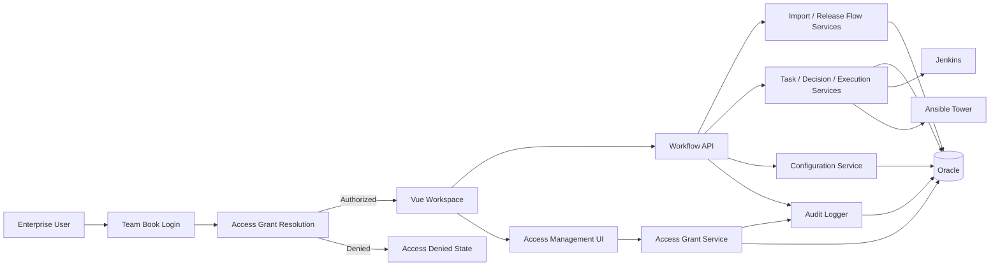

# Detailed Design: Deployment Agent

**Date:** 2026-03-24
**Status:** Implemented (current MVP + partial Phase 1 access governance)
**Source:** `docs/04-architecture/architecture.md`, `docs/03-spec/spec.md`, repository validation

---

## Overview

This document translates the current Deployment Agent architecture into implementation-facing design guidance for backend services, frontend behavior, data structures, integrations, and operational rules. It covers the current MVP workflow plus the now-implemented Phase 1 access-governance foundation through Access Grants, scoped visibility, and Access Management.



### Design Objective

- Preserve the current controlled deployment workflow model: upload, execute, review, and progress.
- Make state handling, validation, and audit behavior explicit enough for implementation and test planning.
- Extend the design to cover deny-by-default product access and DevOps-admin-managed authorization without turning Deployment Agent into a separate account system.

### Relationship to Source Architecture

- The architecture defines major modules, data entities, integrations, and security boundaries.
- This design adds implementation-level behavior for module responsibilities, state handling, UI behavior, validation, and interface contracts.
- Where the design goes beyond explicit architecture statements, the detail is marked as `[Assumption]`.

---

## Source Architecture

**System name:** Deployment Agent (WWA embedded workspace)

**Architecture summary carried forward:**
- Vue 3 SPA frontend inside the WWA workspace shell
- Spring Boot REST backend with session-based authentication
- Oracle persistence for workflow, configuration, audit, and implemented Access Grant data
- Human-gated task progression with explicit review decisions
- Fire-and-forget AUTO submission to Jenkins / Ansible
- Product entry authorization and `Application + SNOW Group` scoped visibility through local Access Grants in Phase 1

**Key architectural constraints carried forward:**
- Fixed Excel import schema for MVP
- Import remains atomic at file level
- Task reruns reuse the same `task_id` and create new execution history attempts
- Product entry becomes deny-by-default in Phase 1
- Access enforcement must align across menus, routes, and APIs

---

## Design Assumptions

- [Resolved] AUTO execution in MVP is submission-only. The system records submission outcome and external job links but does not rely on a callback pipeline in the current design baseline.
- [Resolved] Jenkins and Ansible credentials are stored in Deployment Agent configuration records for MVP.
- Access Grant multi-role assignment is stored as a JSON array in Oracle for parity with existing structured attributes.
- `auth/login` and `auth/me` return a compatibility `role` plus `roles[]`, effective `permissions[]`, and applicable `scopes[]`.
- [Assumption] Task dependency data remains informational in MVP and does not gate execution order beyond current progression rules.
- [Resolved] Access Management currently operates on product-entry grants plus optional `Application + SNOW Group` scope grants; `Agent` is not the primary authorization boundary.

---

## Design Scope

### In Scope

1. Session-based authentication and local product authorization
2. Access Grant resolution and Access Management administration
3. Excel upload and Release Flow / Request / Task import
4. Release Flow monitoring, stage-level rundown management, and archive lifecycle
5. Task input editing, execution history, manual result recording, AUTO submission, and review decisions
6. Configuration management for Jenkins / Ansible integration
7. Audit logging for workflow and access-governance actions
8. Frontend workspace views for summary, detail, task actions, config, audit, and Access Management

### Out of Scope

- Agent-scoped authorization and finer-grained environment-scoped authorization
- Self-service access requests or approval workflows
- Real Team Book directory-backed search, unless confirmed later
- Callback-based AUTO completion ingestion
- Dynamic import schemas or template customization
- Parallel or DAG-based execution control from dependencies

### Design Boundaries

- Frontend communicates with backend via REST/JSON and session cookies
- Backend owns workflow state, authorization resolution, and audit persistence
- Team Book authenticates enterprise identity only; Deployment Agent owns product authorization
- Jenkins and Ansible are synchronous submission integrations with externally hosted execution detail

---

## Module Design

### 1. Identity and Session Module

**Responsibilities**
- Authenticate users through `TeamBookAuthenticationProvider`
- Create and restore authenticated session state
- Populate request-scoped security context from session data
- Distinguish enterprise identity from product authorization

**Key Interactions**
- `AuthController` accepts login / logout / current-user requests
- `AuthService` validates credentials via Team Book provider
- `SessionAuthFilter` reconstructs authenticated user context on each request
- `HeaderAuthFilter` remains a controlled fallback for tests

**Internal Design Concerns**
- Authentication success does not automatically imply product access
- Session state must be stable enough to support page refresh, navigation, and repeated API calls
- Session payload carries a compatibility `role` plus `roles[]`, effective `permissions[]`, and `scopes[]`

### 2. Access Grant Resolution Module

**Responsibilities**
- Resolve whether an authenticated employee may enter Deployment Agent
- Load the employee's Access Grant record
- Reject entry when no grant exists or when the grant is suspended
- Compute effective roles and permissions from assigned product roles
- Resolve which `Application + SNOW Group` records are visible/manageable for the authenticated user

**Key Interactions**
- Runs immediately after Team Book authentication succeeds
- Reads Access Grant data from Oracle
- Returns authorization profile to session creation and `auth/me`

**Internal Design Concerns**
- Deny-by-default behavior is mandatory
- One employee should map to one Access Grant record with optional scope grants
- Response contract must remain explicit about access-denied reasons:
  - `Access not granted`
  - `Access suspended`

### 3. Access Management Module

**Responsibilities**
- Provide admin-only creation, update, suspension, and reactivation of Access Grants
- Support search by employee ID or display name
- Support assignment of scoped visibility through `Application + SNOW Group`
- Record access-governance audit events
- Expose a clean administrative view without introducing account/password management

**Key Interactions**
- Access Management UI calls Access Grant endpoints
- Access Grant Service validates role assignment and grant lifecycle
- Audit Logger records create / update / suspend / reactivate actions

**Internal Design Concerns**
- Grant records are suspended/reactivated, not physically deleted
- Role assignment supports one or more product roles
- Scope grants constrain visibility and admin delegation for non-global admins
- Current implementation searches existing grants only
- Enterprise directory lookup remains a follow-up expansion, not part of the current admin workflow

### 4. Upload and Import Module

**Responsibilities**
- Accept Excel upload plus selected stage and optional runtime scope fields
- Parse the fixed `AMH_HCC_task` worksheet
- Validate required data and map rows into Release Flow, Request, and Task records
- Preserve selected non-core columns as import metadata
- Default rundown owner from a single imported task owner or the uploader
- Produce a single audit event for the upload action

**Key Interactions**
- `UploadController` accepts multipart input
- Import logic creates or updates Release Flow and Request records
- First eligible task is promoted into executable state after import

**Internal Design Concerns**
- Stage and runtime scope come from the upload UI, not from spreadsheet rows
- Import is atomic for the whole file
- Release Flow grouping and release ID generation must remain deterministic
- Dependency fields are imported and preserved but do not yet drive execution gating

### 5. Release Flow and Rundown Module

**Responsibilities**
- Aggregate child status into Request and Release Flow summaries
- Expose summary and detail views for each Release Flow
- Manage stage-level rundown fields and stage lifecycle operations
- Surface runtime scope (`Application`, `SNOW Group`, `Agent`) and rundown owner
- Handle archive / restore / purge of stage rundowns

**Key Interactions**
- Consumed by summary and detail views
- Triggered by import, task transitions, decision processing, and admin rundown actions
- Coordinates with audit logging for stage archive lifecycle changes

**Internal Design Concerns**
- Archived rundowns are hidden from default views
- Archived rundowns become read-only
- Restoring a previously archived last-active rundown must reactivate its parent Release Flow
- Purge is irreversible and must remain admin-only
- `Start Deployment` and `Mark as Failed` are rundown-control actions and are limited to the rundown owner or `DEVOPS_ADMIN`

### 6. Task Management Module

**Responsibilities**
- Store task inputs, display data, metadata, and status
- Support task input editing in eligible states
- Manage manual result capture and execution history
- Surface dependency relationships (`Blocked By` / `Blocks`) as display-oriented context

**Key Interactions**
- Receives imported task data from Upload / Import
- Works with Decision and Progression logic
- Returns execution history and current result data to UI modals

**Internal Design Concerns**
- Editable states remain constrained to pre-execution states
- Execution history must preserve every rerun attempt
- Dependency visualization should tolerate missing references without breaking task rendering
- Archived parent rundown should block task mutation

### 7. Decision and Progression Module

**Responsibilities**
- Apply human review decisions: `Approve`, `Reject`, `Rerun`, `Skip`
- Update task, request, and flow state
- Promote the next eligible task when progression rules allow
- Preserve rerun history and review traceability

**Key Interactions**
- Invoked by task decision endpoints
- Uses task state validation and aggregation rules
- Writes audit entries for every decision

**Internal Design Concerns**
- `Run` / `Rerun` are execution actions; `Approve` / `Reject` / `Skip` are review actions
- Rerun only becomes valid after `Failed` or `Rejected`
- Critical-path and dependency behavior must not silently bypass explicit review requirements

### 8. Auto Execution Module

**Responsibilities**
- Submit eligible AUTO tasks to Jenkins or Ansible
- Create execution history for each submission attempt
- Capture external execution identifiers, submission outcome, and job URLs

**Key Interactions**
- Uses configuration values to determine integration targets and credentials
- Writes execution metadata into task execution history
- Writes audit events for submission actions

**Internal Design Concerns**
- Submission is synchronous; remote execution is not
- No callback contract is relied upon in the current design baseline
- AUTO tasks may remain in `Executing` until future completion-ingestion capability is introduced
- Submission failures must transition tasks to `Failed`

### 9. Configuration Module

**Responsibilities**
- Store and update runtime configuration used by AUTO integrations
- Validate configuration values at write time
- Expose configuration read APIs and admin-only update APIs

**Key Interactions**
- Used by AUTO execution adapters
- Surfaced through Configuration Management UI
- Audited on every update

**Internal Design Concerns**
- Current config set covers Jenkins and Ansible connectivity
- Changes apply to future executions, not retroactively to stored history
- Sensitive values must be redacted in audit and UI contexts where appropriate

### 10. Audit Module

**Responsibilities**
- Record immutable audit entries for workflow and access-governance actions
- Support read-only retrieval for authorized viewers
- Preserve traceability across archive / restore / purge lifecycle changes

**Key Interactions**
- Called from workflow, configuration, and access services
- Exposed to Audit Log UI

**Internal Design Concerns**
- Audit writes should not be lost when surrounding business operations fail after the audit call boundary
- Access-governance actions need their own action types
- Audit records must survive physical purge of business entities where possible through soft references
- Audit entries should persist request scope fields so multi-scope filtering remains possible after later lifecycle changes

### 11. Vue UI Modules

**Responsibilities**
- Present workflow state clearly across summary, detail, task, config, audit, and access-management experiences
- Keep action discoverability high through visible-but-disabled controls where appropriate
- Explain blocked states instead of hiding system capability

**Primary Views**
- Login / access-denied states
- Release Flow Summary
- Release Flow Detail with stage tabs and rundown panel
- Task table with action controls and execution history
- Template and dependency maintenance views `[existing related capability]`
- Configuration Management
- Audit Log
- Access Management

**Internal Design Concerns**
- Current task actions are state-driven and intentionally visible even when disabled
- Admin-facing views must expose archived content safely
- Access-denied states must clearly distinguish authentication failure from missing / suspended product access

---

## API / Interface Design

This section describes logical API behavior. Endpoint-level payload examples live in the companion API guide.

### Authentication Interfaces

**Purpose**
- Authenticate enterprise identity
- Resolve local product access
- Return current authenticated context

**Main Interfaces**
- `POST /auth/login`
- `GET /auth/me`
- `POST /auth/logout`

**Validation Expectations**
- `employeeId` and password required on login
- Invalid enterprise credentials return `401`
- Valid enterprise credentials without active product access return `403`

**Error Behavior**
- `401 Unauthorized` for invalid credentials
- `403 Forbidden` with explicit access-state messaging for missing or suspended Access Grant

### Access Management Interfaces

**Purpose**
- List and manage Access Grants for Deployment Agent

**Main Interfaces**
- `GET /access-grants`
- `POST /access-grants`
- `PATCH /access-grants/{employeeId}`
- `POST /access-grants/{employeeId}/suspend`
- `POST /access-grants/{employeeId}/reactivate`

**Validation Expectations**
- Only DevOps Admin users may access these interfaces
- Active grants require at least one assigned role
- Scope grants are optional but must be valid `Application + SNOW Group` pairs when supplied
- Scoped admins may manage only grants within their visible scopes; empty scopes on a `DEVOPS_ADMIN` grant represent global-admin access
- Employee identity fields must be present and stable enough for display and audit

**Error Behavior**
- `403` for unauthorized role
- `404` when target grant does not exist
- `409` when lifecycle operation is invalid for current grant status

### Workflow Interfaces

**Purpose**
- Import requests, view release state, mutate eligible tasks, and apply review decisions

**Main Interfaces**
- Upload: `POST /upload`
- Release Flow list/detail and stage actions
- Task detail, input update, execution history, manual result capture, AUTO submit
- Decision endpoint

**Validation Expectations**
- Import validates stage and fixed worksheet schema
- Upload and list/detail views validate runtime scope where applicable
- Task mutations validate ownership/permission, current task state, and parent rundown lifecycle
- Rundown-control actions validate scope plus rundown owner/admin rules
- Decision submission validates allowed decision for the current status

**Error Behavior**
- `400` for bad request shape
- `409` for invalid state transitions or optimistic locking conflicts
- `404` for missing flow, request, or task

### Configuration Interfaces

**Purpose**
- Read and update Jenkins / Ansible runtime configuration

**Main Interfaces**
- `GET /config`
- `POST /config`

**Validation Expectations**
- Keys must be from the supported configuration catalog
- URL values must match expected URI rules
- Sensitive values must never be echoed back in unsafe contexts

### Audit Interfaces

**Purpose**
- Provide read-only audit search and inspection

**Main Interface**
- `GET /audit-logs`

**Validation Expectations**
- Any signed-in user may read audit history in the current MVP implementation, but returned rows are limited by scoped visibility unless the user is a global admin
- Filtering inputs must be validated to avoid malformed queries

---

## Data Design

### Logical Entities

| Entity | Purpose | Key Attributes |
|--------|---------|----------------|
| Release Flow | Top-level deployment journey | `project_id`, `project_name`, `release_id`, `current_stage`, `flow_status`, `review_status` |
| Request | Stage-level rundown inside a Release Flow | `stage`, `request_status`, `snow_group`, `application`, `agent`, `owner`, archive markers |
| Task | Atomic execution step | `task_group_id`, `step_seq`, `task_name`, `execution_type`, `task_status`, `input_parameters`, `expected_output`, `import_metadata` |
| Task Execution History | Per-attempt execution record | `attempt_number`, `execution_status`, `result_summary`, `result_logs`, external job fields |
| Configuration Item | Runtime integration config | `config_key`, `config_value`, `updated_by`, `updated_at` |
| Audit Log Entry | Immutable operator audit record | `operator_id`, `action_type`, `timestamp`, `application`, `snow_group`, `agent`, `context_payload` |
| Access Grant | Product authorization record | `employee_id`, `display_name_snapshot`, `grant_status`, `assigned_roles`, `scope_grants`, `note`, `last_login_at` |

### Relationships

```text
Release Flow 1:N Request
Request 1:N Task
Task 1:N Task Execution History

Configuration Item - independent
Audit Log Entry - independent, soft-referenced with scope fields
Access Grant - independent, product entry + scoped visibility
```

### Release Flow and Request Design Notes

- A Release Flow groups related stage requests for the same deployment journey.
- A Request represents a single stage rundown and owns its tasks.
- Requests and Release Flows may be archived from default views.
- Archive metadata is operational lifecycle state, not a separate business entity.

### Task Design Notes

**Core fields**
- `execution_type`: `MANUAL` or `AUTO`
- `task_status`: workflow state
- `input_parameters`: structured task input
- `expected_output`: human comparison reference
- `import_metadata`: imported metadata such as activity category, dependency hints, and validation notes

**Imported dependency semantics**
- `Dependencies` are preserved from import/template maintenance
- Runtime UI derives:
  - `Blocked By`
  - `Blocks`
- MVP progression remains rule-driven and does not yet use dependency links as authoritative gating logic

### Access Grant Design

**Fields**
- `employee_id`
- `display_name_snapshot`
- `grant_status` = `ACTIVE | SUSPENDED`
- `assigned_roles`
- `scope_grants`
- `note`
- `last_login_at`
- `created_by`, `created_at`, `updated_by`, `updated_at`

**Rules**
- one Access Grant per employee
- no physical delete in Phase 1
- active grant requires at least one assigned role
- scope grants are optional
- empty scope grants on a `DEVOPS_ADMIN` record represent global-admin visibility
- suspend/reactivate retains history

### Configuration Keys

- `jenkins_url`
- `jenkins_user`
- `jenkins_api_token`
- `ansible_url`
- `ansible_user`
- `ansible_api_token`

`execution_callback_endpoint` is not part of the current design baseline because callback ingestion is deferred.

### State Models

#### Task Status

```text
Pending -> Ready_For_Execution -> Executing -> Awaiting_Review -> Approved
Pending -> Skipped
Ready_For_Execution -> Skipped
Executing -> Failed
Awaiting_Review -> Rejected
Rejected -> Ready_For_Execution
Failed -> Ready_For_Execution
```

#### Request Status

```text
Pending -> Running -> Completed
Pending/Running -> Failed
Pending/Running -> Rejected
Pending/Running -> Skipped
```

#### Flow Status

```text
Pending -> Running -> Completed
Pending/Running -> Failed
Pending/Running -> Rejected
```

#### Access Grant Status

```text
ACTIVE <-> SUSPENDED
```

### Aggregation Rules

- Request status is derived from child task statuses
- Release Flow status is derived from child request statuses
- Archive lifecycle overlays visibility and mutability, not the base workflow status

Priority guidance:
1. `Running` if any active execution exists
2. `Failed` if any child has failed and no higher-priority running state applies
3. `Rejected` if any child is rejected and no running / failed state applies
4. `Completed` when all children are terminal-success or skipped
5. `Pending` otherwise

---

## UI / User Flow Design

### 1. Product Entry

- User authenticates with enterprise credentials
- System resolves Access Grant
- Entry states:
  - authenticated + active grant -> workspace
  - authenticated + no grant -> access denied (`Access not granted`)
  - authenticated + suspended grant -> access denied (`Access suspended`)

### 2. Release Flow Summary

- Displays Release Flows with stage-level SIT / UAT / PROD visibility
- Shows active runtime scope and `Rundown Owner` in the summary table
- Default list excludes archived flows
- `[Implemented]` admin can enable archived visibility in management contexts
- Upload entry remains visible according to permission model

### 3. Release Flow Detail and Rundown Panel

- Stage tabs provide per-request context
- Rundown Information panel shows current stage summary, runtime scope, rundown owner, and stage-level actions
- Dependency summary is intentionally lighter and sits with the task area so `Blocked By` / `Blocks` troubleshooting stays near the actionable task table
- Lifecycle actions:
  - `Archive Rundown`
  - `Restore Rundown` (admin)
  - `Delete Permanently` (admin, archived only)
- Rundown-control actions:
  - `Start Deployment` (rundown owner or admin)
  - `Mark as Failed` (rundown owner or admin)
- Archived rundowns should display a clear read-only state

### 4. Task Table and Action Model

Expected columns include:
- category / task identity
- step information
- execution type
- critical flag
- status
- owner
- `Blocked By`
- `Blocks`
- action cluster

**Action behavior**
- `Run` is always visible; enabled when execution is allowed
- `Rerun` is always visible; enabled only for `Failed` / `Rejected`
- `Review Decision` remains visible; enabled only when review actions are valid
- Disabled actions should communicate the reason through tooltip or adjacent helper text

**Manual vs AUTO behavior**
- MANUAL run opens a run-oriented input/result dialog
- AUTO run submits directly to external execution

### 5. Execution History and Result Viewing

- Task result UI should show latest execution summary and allow history review
- AUTO attempts should surface external job URL
- MANUAL attempts should display operator-entered result summary and logs

### 6. Access Management View

- Admin-only page
- List fields:
  - employee ID
  - display name
  - status
  - assigned roles
  - scope grants
  - last login
  - updated by / updated at
- Actions:
  - grant access
  - edit roles
  - suspend
  - reactivate
  - inspect audit context

### 7. Configuration and Audit Views

- Configuration is operational data with read-only or admin-edit behavior depending on permission
- Audit is a read-only trace surface for authorized users
- Access-governance actions should appear naturally in the same audit experience

---

## Workflow / Execution Design

### 1. Product Entry Authorization

1. User submits login credentials
2. Team Book authenticates enterprise identity
3. Deployment Agent resolves local Access Grant
4. System either:
   - denies entry with access-state message, or
   - creates session with authorization profile
5. Session context includes effective permissions and applicable scope grants
6. Frontend menus, routes, and API access use effective permissions from that profile

### 2. Upload and Import Flow

1. User selects stage and optional `Application / SNOW Group / Agent` scope, then uploads Excel file
2. System validates worksheet, schema, and row data
3. Import service groups rows into Release Flow / Request / Task structures
4. Import service derives rundown owner from the imported task owner set or uploader
5. System persists data atomically
6. First eligible task is promoted to `Ready_For_Execution`
7. Audit event is recorded

### 3. MANUAL Task Execution Flow

1. User opens a runnable MANUAL task
2. System shows task input and expected output context
3. User performs the manual activity externally
4. User records result in the UI
5. System creates execution history
6. Task moves to `Awaiting_Review`
7. Reviewer applies decision

### 4. AUTO Task Execution Flow

1. User triggers `Run` on an AUTO task
2. System validates task state and execution type
3. System creates execution history attempt
4. System reads configuration and submits to Jenkins or Ansible
5. System stores:
   - submission outcome
   - external execution identifier
   - external job URL
6. On submission failure, task becomes `Failed`
7. On successful submission, task remains `Executing`

**Current design note**
- External completion ingestion is deferred; the system does not rely on callback handling in the current design baseline.

### 5. Review and Progression Flow

1. Reviewer opens task in a reviewable state
2. Reviewer chooses `Approve`, `Reject`, `Rerun`, or `Skip`
3. System validates transition rules
4. Decision engine updates task state
5. Aggregation recomputes Request and Release Flow status
6. Next eligible task is promoted when progression rules allow
7. Audit event is recorded

### 6. Archive / Restore / Purge Flow

1. User archives a stage rundown
2. Archived request disappears from default views and becomes read-only
3. If no active requests remain, the parent Release Flow is effectively archived from default views
4. Admin may restore the archived request
5. Admin may permanently purge an already archived request

### 7. Dependency Handling

- Template maintenance and imported metadata may define predecessor relationships
- Release detail derives `Blocked By` and `Blocks` for visibility
- Missing references should be shown as informational gaps, not fatal runtime errors
- Execution order is still primarily governed by workflow progression rules in MVP

---

## Integration Design

### Team Book

**Purpose**
- Authenticate enterprise identity

**Pattern**
- Interface-based provider with stub implementation for dev/test

**Failure Behavior**
- Invalid credentials return `401`
- Provider-level failures should surface as authentication failure with server-side diagnostics

### Jenkins

**Purpose**
- Execute AUTO tasks

**Pattern**
- Synchronous POST submission, fire-and-forget

**Credentials**
- Basic Auth values loaded from configuration

**Failure / Retry Behavior**
- Submission failures are handled inside Deployment Agent and mark task submission failed
- Downstream remote-job retries are out of scope for Deployment Agent

### Ansible Tower

**Purpose**
- Execute AUTO tasks

**Pattern**
- Synchronous POST submission, fire-and-forget

**Credentials**
- Bearer token loaded from configuration

**Failure / Retry Behavior**
- Same as Jenkins

### Access-Management Directory Search `[Open]`

**Purpose**
- Optionally allow admins to search enterprise users who do not yet have a grant

**Pattern**
- Not finalized

**Design Note**
- If introduced, this remains an identity lookup integration, not a second authorization source of truth

---

## Security / Audit / Reliability Design

### Access Control

- Team Book authenticates identity
- Access Grants authorize product entry
- Effective permissions drive menus, routes, and API access
- Admin management actions are explicit and auditable
- Archive and purge operations require stronger permission than standard workflow navigation

### Secrets Handling

- Current MVP stores Jenkins / Ansible credentials in configuration records
- Sensitive values must be masked in UI and excluded from audit payloads where necessary
- This is an MVP tradeoff rather than a long-term secrets strategy

### Audit Design

Audit should record at least:
- upload / import
- task edit
- manual result record
- AUTO submit
- approve / reject / rerun / skip
- rundown archive / restore / purge
- config update
- access grant create / update / suspend / reactivate

### Reliability and Observability

- Optimistic locking protects concurrent task / request / flow mutation
- Import remains all-or-nothing
- Submission adapters use bounded network timeouts
- Structured logs should capture submission target, execution identifiers, and failure context
- Audit trail is part of operational observability, not just compliance history

---

## Validation and Error Handling

### Input Validation

- Login requires non-blank enterprise credentials
- Upload requires stage and valid Excel file
- Access Grant writes require valid role assignment and legal status transitions
- Task mutation requires valid current state and permitted actor
- Configuration writes require per-key validation

### Workflow-Level Validation

- No task edits on archived rundowns
- No rerun unless task is `Failed` or `Rejected`
- No review decision unless task is in a reviewable state
- No purge unless the target rundown is already archived

### Integration Failure Handling

- Jenkins / Ansible submission failure marks the attempt and task as failed
- Missing required configuration blocks AUTO submission with a clear validation / configuration error
- Team Book provider failures block login

### User-Facing Error Messaging Expectations

- Separate authentication failure from authorization failure
- Explain disabled actions where possible
- Return actionable validation feedback for upload, configuration, and admin grant edits
- Avoid generic error messages when the system knows the exact blocked condition

---

## Testing Considerations

### Key Test Areas

1. Enterprise login and session restore
2. Access Grant create / update / suspend / reactivate
3. Deny-by-default entry behavior
4. Upload validation and atomic import
5. Release Flow aggregation and archive lifecycle
6. Task edit, run, manual result recording, and execution history behavior
7. Decision transitions and progression
8. AUTO submission integration error handling
9. Configuration validation and masking
10. Audit record creation and retrieval

### Critical Test Scenarios

- Login succeeds but product access is denied because no grant exists
- Suspended user cannot enter Deployment Agent
- Access grant is created and takes effect on next login
- Upload creates a new Release Flow and first executable task
- MANUAL task run -> result record -> review decision -> progression
- AUTO task submission succeeds and stores external job link
- Failed task rerun creates a new execution history attempt
- Archived rundown is hidden by default, restorable by admin, and purgeable only after archive

### State Transition Coverage

- All allowed task transitions
- All invalid decision / rerun combinations
- Access Grant lifecycle transitions
- Archive -> restore -> purge restrictions

---

## Risks / Design Tradeoffs

### Design Risks

1. **Auth contract drift**
   - Phase 1 needs a stable contract for `roles` vs `permissions`
   - Without it, frontend and backend authorization logic can diverge

2. **Directory search scope ambiguity**
   - Access Management UX changes significantly depending on whether admins can search only grants or also enterprise users without grants

3. **MVP secret storage tradeoff**
   - Storing integration credentials in configuration records is operationally simple but not ideal for long-term secret hygiene

4. **AUTO completion gap**
   - Without callback/polling, AUTO tasks may remain in `Executing` after successful submission

5. **Dependency semantics**
   - Showing dependency links without making them authoritative may confuse users who expect hard gating

### Notable Tradeoffs

| Tradeoff | Choice | Rationale |
|----------|--------|-----------|
| Product access model | External identity + local authorization | Avoids building a new account system while preserving product control |
| Access Grant lifecycle | Suspend/reactivate, not delete | Preserves authorization history and supports restore |
| AUTO execution | Fire-and-forget submission | Keeps MVP integration simple and auditable |
| Dependency handling | Informational first | Improves visibility now without forcing DAG execution redesign |
| Action visibility | Visible-but-disabled controls | Improves discoverability and reduces hidden-state confusion |

---

## Open Questions

1. Should a later phase expand Access Management beyond the current existing-grants-only search model to include enterprise users without grants?
2. Should Access Grant role edits require a mandatory admin note?
3. Should a later phase extend authorization beyond the current product-entry grant plus `Application + SNOW Group` scopes into agent- or environment-scoped control?
4. Should AUTO completion ingestion be addressed by callback, polling, or explicit manual completion in the next phase?

---

## Summary

The current Deployment Agent design centers on controlled workflow execution, explicit human review, strong auditability, and operational clarity. Phase 1 extends that foundation by introducing local Access Grants, deny-by-default product entry, and an admin-managed Access Management capability, while preserving the existing separation between enterprise identity and product authorization. The design is intentionally explicit about current MVP tradeoffs, especially around AUTO execution completion and dependency handling, so follow-on implementation work can proceed with fewer hidden assumptions.
