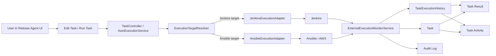

# Detailed Design: Multi-Tool External Execution and Completion Sync

**Date:** 2026-03-27
**Status:** Proposed
**Source:** `docs/04-architecture/architecture.md`, `docs/05-design/design.md`, repository validation, and user-provided execution UI samples

---

## Overview

This document extends Release Agent's current AUTO execution model from submission-only integration into a multi-tool execution orchestration flow. The target outcome is that each AUTO task can route to the correct external platform, surface tool-specific job and log links in the UI, expose external approval handoff when required, and synchronize terminal execution outcomes back into Release Agent task state.

### Design Objective

- Support per-task routing to different external tools such as Jenkins and Ansible.
- Accept tool targets from the task `script` field without forcing the user to maintain separate tool-specific screens.
- Surface external job, log, and approval links in Task Result and Task Activity views.
- Prevent successful AUTO submissions from remaining indefinitely in `Executing` after the remote job has already finished.
- Preserve the existing Release Agent review gate before release-flow progression.

### Relationship to Source Architecture

- This design keeps the existing layered architecture, Task / TaskExecutionHistory model, and review-driven progression rules.
- This design supersedes the current MVP baseline that treats AUTO execution as fire-and-forget and leaves successfully submitted tasks in `Executing` until a later manual workaround.
- This design preserves the current ownership boundary:
  - Release Agent owns routing, state normalization, auditability, and UI presentation.
  - Jenkins and Ansible own actual remote execution and remote approval UX.



---

## Source Architecture

**System name:** Release Agent

**Architecture summary carried forward:**

- Spring Boot backend, Vue 3 frontend, Oracle persistence.
- AUTO tasks already submit to Jenkins and Ansible through adapter classes.
- Task lifecycle and release-flow progression are still controlled by explicit human review.
- Task execution history is already the per-attempt source of truth for execution records.
- Configuration records remain the source of runtime integration settings.

**Relevant constraints carried forward:**

- No release-flow progression after execution without explicit human decision.
- Same logical task keeps the same `task_id`; reruns create new execution-history attempts.
- Task input editing remains limited to pre-execution states.
- Dependency fields remain informational and do not introduce DAG execution in this phase.

---

## Design Assumptions

- [Resolved] The top-level `TaskStatus` model remains unchanged:
  - `Pending -> Ready_For_Execution -> Executing -> Awaiting_Review -> Approved/Rejected`
  - `Executing -> Failed`
  - `Rejected/Failed -> Ready_For_Execution`
- [Resolved] External approval inside Jenkins or Ansible does not replace Release Agent review. External approval is treated as part of remote execution; after remote execution finishes, the task still moves to `Awaiting_Review` in Release Agent.
- [Resolved] The `script` input should accept a full tool URL whenever available. The optional `system` input remains supported as an explicit override for legacy tasks and Excel imports.
- [Resolved] Polling is the required synchronization path for the first implementation phase. Callback ingestion is optional future work, not a prerequisite for shipping this feature.
- [Assumption] Jenkins jobs expose enough queue/build metadata to derive a stable build URL and console/log URL.
- [Assumption] Ansible approval support applies only to workflow-oriented executions that expose approval or workflow-job endpoints; plain job templates may not expose approval links.
- [Assumption] Existing legacy tasks that store a plain non-URL `script` value should continue to default to Jenkins unless an explicit `system` override is supplied.

---

## Design Scope

### In Scope

1. Per-task external tool resolution for AUTO tasks.
2. Normalized external execution metadata for job, log, approval, and status display.
3. Polling-based synchronization of remote execution state back into Release Agent.
4. Task Result and Task Activity UX updates for external execution visibility.
5. Audit and observability behavior for submission and status synchronization.
6. Backend and frontend test coverage for the new execution lifecycle.

### Out of Scope

- Replacing Jenkins or Ansible approval UIs with an in-product approval experience.
- Adding new execution platforms beyond Jenkins and Ansible in the first implementation pass.
- Introducing DAG or parallel execution semantics based on dependency metadata.
- Real-time push updates via WebSocket or SSE.
- Moving secrets out of the current configuration store.
- Reworking the Excel template beyond the existing `script`, `parameters`, and optional `system` model.

### Design Boundaries

- Frontend continues to call the existing task APIs and execution-history API.
- Backend owns tool resolution, submission, polling, normalization, and state transitions.
- External systems remain the source of raw job state and raw logs.
- Release Agent stores normalized state plus URLs needed for click-through workflows.

---

## Module Design

### 1. Execution Target Resolution Module

**Responsibilities**

- Resolve the correct execution tool for an AUTO task.
- Normalize the user-supplied `script` into a tool-specific target descriptor.
- Detect conflicts between explicit `system` input and `script` URL patterns.

**Key Interactions**

- Called from task-input validation and `AutoExecutionService`.
- Used by both submit-time orchestration and adapter polling.

**Internal Design Concerns**

- Must support both:
  - explicit override: `system = JENKINS | ANSIBLE`
  - inferred routing from full URLs in `script`
- Must preserve legacy compatibility for plain Jenkins job names.
- Must fail fast when `system` and `script` clearly disagree.

**Resolution precedence**

| Case | Example | Resolution |
|---|---|---|
| Explicit system override | `system=ANSIBLE`, `script=42` | Route to Ansible |
| Jenkins URL | full Jenkins job URL in `script` | Route to Jenkins |
| Ansible URL | full AWX/Tower job template or workflow URL in `script` | Route to Ansible |
| Legacy plain target, no system | `script=deploy-job` | Route to Jenkins for backward compatibility |
| Explicit system conflicts with URL | `system=JENKINS`, Ansible URL in `script` | Validation error |

### 2. Auto Submission Orchestrator

**Responsibilities**

- Validate AUTO task eligibility.
- Resolve the target tool and normalized target metadata.
- Submit the task through the correct adapter.
- Create and update the execution-history attempt.
- Persist initial external references immediately after submission.

**Key Interactions**

- `TaskController -> AutoExecutionService -> ExecutionTargetResolver -> AutoExecutionAdapter`
- Writes `TaskExecutionHistory`, updates `Task`, emits audit entry.

**Internal Design Concerns**

- Submission success and remote execution success are different lifecycle moments.
- Initial submission should record enough data for the UI to show a useful external link immediately.
- Submission must remain idempotent at the task-status level: only `Ready_For_Execution` tasks may be submitted.

### 3. External Status Sync Module

**Responsibilities**

- Periodically scan active AUTO executions still in progress.
- Poll the correct external adapter for the latest remote state.
- Normalize raw tool-specific states into Release Agent execution semantics.
- Update execution history and task state when the remote job reaches a terminal state.

**Key Interactions**

- Scheduled service reads active `TaskExecutionHistory` rows with non-terminal execution state.
- Calls adapter-specific status polling.
- Updates `TaskExecutionHistory`, `Task.currentResultSummary`, `Task.endTime`, and task status.

**Internal Design Concerns**

- Polling must be safe to rerun; repeated polling of the same execution must be idempotent.
- Polling errors should not immediately fail the task unless the remote job itself is terminally failed.
- The system must avoid leaving tasks indefinitely stale without operational visibility.

**Polling design**

- Scheduling model:
  - use Spring `@Scheduled` with `fixedDelay`, not `fixedRate`
  - default delay: `30000 ms`
  - configurable via application property
  - supported operating range: `15000-60000 ms`
- Reason for `fixedDelay`:
  - no self-overlap inside one application instance
  - the next poll cycle starts only after the previous cycle finishes
- Batch model:
  - each cycle processes a bounded batch of active executions
  - default batch size: `50`
  - order by `last_synced_at` ascending with nulls first so stale rows are refreshed first
- Concurrency safety:
  - active rows must be claimed inside the poll transaction before adapter calls are made
  - use database-backed row claiming for the selected `TaskExecutionHistory` rows
  - preferred first implementation: pessimistic row lock or Oracle-compatible `SKIP LOCKED` selection semantics
  - no separate `poll_lock` column is required in the first implementation pass
- Failure behavior:
  - if one batch item fails polling, the rest of the batch should continue
  - a row that fails polling remains eligible for the next cycle unless the remote execution is known terminal
- Operational safety:
  - polling enablement should be controllable by configuration so the scheduler can be turned on first in non-prod, then progressively in production

### 4. Tool Adapter Capability Module

**Responsibilities**

- Submit jobs to the remote tool.
- Poll current remote state.
- Normalize raw tool data into a common response model for the monitor service.

**Key Interactions**

- `JenkinsExecutionAdapter`
- `AnsibleExecutionAdapter`

**Internal Design Concerns**

- The adapter contract should represent both submit-time and poll-time results.
- Tool-specific details should remain inside the adapter, while normalized state is exposed to the service layer.

### 5. Result and Activity Presentation Module

**Responsibilities**

- Surface external execution metadata in a consistent UI shape.
- Show users where to view logs and where to approve in the external tool when approval is pending.
- Distinguish submission state, external execution state, and Release Agent review state.

**Key Interactions**

- `GET /tasks/{id}/executions`
- `ReleaseFlowDetailView.vue`
- `TaskActivityDialog.vue`
- `TaskEditDialog.vue`

**Internal Design Concerns**

- UI must make it obvious when a task is:
  - still running remotely
  - waiting for approval in the external tool
  - completed remotely and waiting for review in Release Agent
  - failed remotely

### 6. Audit and Observability Module

**Responsibilities**

- Keep operator actions auditable.
- Record meaningful system-originated execution lifecycle changes.
- Provide enough operational data to detect stuck or unsynchronized executions.

**Key Interactions**

- Existing `auto_submit` audit event remains.
- System-originated sync events may emit audit rows or structured logs for terminal status changes and monitor failures.

**Internal Design Concerns**

- Audit should focus on high-value lifecycle moments rather than every poll tick.
- Observability must not leak secrets or raw credential values.

---

## API / Interface Design

### Public Task APIs

#### `PUT /tasks/{id}/input`

**Purpose**

- Save task execution input before the task is executed.

**Logical inputs**

- `script`
  - full Jenkins or Ansible URL when available
  - or legacy plain job/template identifier
- `parameters`
  - plain text or structured JSON depending on tool needs
- `system` (optional)
  - explicit override for `JENKINS` or `ANSIBLE`

**Validation expectations**

- AUTO tasks still require a non-blank `script`.
- If `system` is present and conflicts with the inferred tool from the `script` URL, reject the input.
- If `script` is a supported URL, use it as the canonical source for routing and click-through display.

#### `POST /tasks/{id}/submit-auto`

**Purpose**

- Submit an AUTO task to the resolved external tool.

**Behavior changes from current baseline**

- Persists resolved target metadata, not only submission success/failure.
- Stores job/build/log/approval links when available at submit time.
- Writes normalized external status seed data for later polling.

#### `GET /tasks/{id}/executions`

**Purpose**

- Return execution history with enough normalized data for Task Result and Task Activity views.

**Additional logical outputs**

| Field | Type | Nullable | Meaning |
|---|---|---|---|
| `externalStatus` | String enum | Yes | Normalized remote state such as `RUNNING`, `WAITING_APPROVAL`, or `SUCCEEDED` |
| `externalStatusMessage` | String | Yes | Human-readable explanation for the current remote state |
| `externalLogUrl` | URL-shaped String | Yes | Direct link to the remote console/output page |
| `externalApprovalUrl` | URL-shaped String | Yes | Direct link to the remote approval page when applicable |
| `lastSyncedAt` | Timestamp / ISO-8601 String | Yes | Time of the last successful poll-state refresh |

### Internal Service Interfaces

#### `ExecutionTargetResolver`

**Purpose**

- Convert task input into a normalized target descriptor.

**Logical outputs**

- resolved tool type
- normalized submission target
- display URL
- target kind if relevant
  - Jenkins job path
  - Ansible job template
  - Ansible workflow job template

**Normalized target structure**

| Field | Type | Meaning |
|---|---|---|
| `systemType` | String enum | `JENKINS` or `ANSIBLE` |
| `targetKind` | String enum | Tool-specific target classification such as Jenkins job path or AWX workflow template |
| `rawScript` | String | Original `script` input from the task |
| `normalizedTarget` | String | Canonical target identifier used by the adapter |
| `displayUrl` | URL-shaped String | Preferred external click-through URL if already derivable |
| `explicitOverride` | Boolean | Whether `system` forced the resolution instead of URL inference |

#### `AutoExecutionAdapter`

**Extended responsibilities**

- expose one stable submit contract and one stable poll contract
- hide tool-specific API details from `AutoExecutionService`
- normalize raw tool data into a common poll payload used by the monitor service

**Contract**

| Method | Parameters | Returns |
|---|---|---|
| `systemType()` | None | `String` system identifier |
| `submit(target, inputParameters)` | `ExecutionTarget`, `Map<String, Object>` | `AutoSubmissionResult` |
| `pollStatus(executionHistory)` | `TaskExecutionHistory` | `AutoPollResult` |

**`AutoSubmissionResult` minimum fields**

| Field | Type | Meaning |
|---|---|---|
| `success` | Boolean | Whether submission was accepted |
| `executionId` | String | Tool-native queue/build/job ID when known |
| `jobUrl` | URL-shaped String | Primary external job/build URL |
| `logUrl` | URL-shaped String | Optional direct log URL |
| `approvalUrl` | URL-shaped String | Optional direct approval URL |
| `message` | String | Submission outcome message |

**`AutoPollResult` minimum fields**

| Field | Type | Meaning |
|---|---|---|
| `externalStatus` | String enum | Normalized remote state |
| `terminal` | Boolean | Whether the remote execution is terminal |
| `executionStatus` | `ExecutionStatus` enum | Release Agent execution status to persist |
| `statusMessage` | String | Human-readable status explanation |
| `externalExecutionId` | String | Latest tool-native execution ID if updated |
| `jobUrl` | URL-shaped String | Primary external job/build URL |
| `logUrl` | URL-shaped String | Direct log URL when available |
| `approvalUrl` | URL-shaped String | Direct approval URL when available |
| `resultSummary` | `Map<String, Object>` | Normalized structured summary |
| `resultLogs` | String | Raw or normalized log excerpt when stored locally |
| `observedAt` | Timestamp | Time the adapter observed the remote state |

#### Optional Future Callback Interface

**Purpose**

- Accept tool-originated execution updates when infrastructure permits external callbacks.

**First-phase rule**

- Callback ingestion is explicitly optional and not required to complete the implementation described here.

---

## Data Design

### Logical Entity Updates

#### Task

No new mandatory top-level task fields are required. The current `input_parameters` JSON remains the task-side source of execution input.

**Canonical task input model**

| Field | Meaning |
|---|---|
| `script` | Full external tool URL when available, otherwise legacy identifier |
| `parameters` | Free-form text or structured JSON |
| `system` | Optional routing override for legacy data and disambiguation |

#### Task Execution History

The execution-history record remains the source of truth for one AUTO execution attempt, but it now needs additional normalized external metadata beyond the current MVP fields.

**Existing fields retained**

- `execution_status`
- `external_system_type`
- `external_execution_id`
- `external_job_url`
- `submission_status`
- `submission_message`
- `result_summary`
- `result_logs`

**Proposed additional logical fields**

| Field | Purpose |
|---|---|
| `external_status` | Normalized remote state for UI and monitor decisions |
| `external_status_message` | Human-readable explanation such as approval wait or failure summary |
| `external_log_url` | Direct click-through to remote logs or console |
| `external_approval_url` | Direct click-through to the remote approval page when applicable |
| `last_synced_at` | Timestamp of the latest poll-based state refresh |

`result_summary` remains the place for extended platform-specific payloads that do not need first-class columns.

**Field semantics clarification**

- `execution_status` remains the Release Agent lifecycle field on `TaskExecutionHistory`:
  - `Running`
  - `Completed`
  - `Failed`
  - `Timed_Out`
- `submission_status` remains submit-time outcome only:
  - for example `SUBMITTED` or `FAILED`
- `external_status` is the new normalized remote-state field used by polling-time synchronization and UI display.
- `submission_status` is not renamed and is not reused to represent ongoing remote execution state.

### Normalized External Status Model

| Normalized status | Terminal | Meaning | Release Agent effect |
|---|---|---|---|
| `QUEUED` | No | Accepted by remote tool but not yet executing | Task stays `Executing`; execution stays `Running` |
| `RUNNING` | No | Remote job currently executing | Task stays `Executing`; execution stays `Running` |
| `WAITING_APPROVAL` | No | Remote execution is paused for external approval | Task stays `Executing`; execution stays `Running`; UI surfaces approval link |
| `SUCCEEDED` | Yes | Remote execution completed successfully | Execution becomes `Completed`; task becomes `Awaiting_Review` |
| `FAILED` | Yes | Remote execution failed | Execution becomes `Failed`; task becomes `Failed` |
| `ABORTED` | Yes | Remote execution was canceled or aborted | Execution becomes `Failed`; task becomes `Failed` |
| `TIMED_OUT` | Yes | Monitor or remote job timed out | Execution becomes `Timed_Out`; task becomes `Failed` |
| `UNKNOWN` | No | Remote state could not be normalized safely | Keep previous state; emit observability signal |

### Task State Rules

The top-level task state machine is intentionally preserved.

**AUTO-task transition rules with synchronization**

- `Ready_For_Execution -> Executing`
  - occurs on successful submission
- `Executing -> Awaiting_Review`
  - occurs when remote execution reaches normalized `SUCCEEDED`
- `Executing -> Failed`
  - occurs when remote execution reaches normalized `FAILED`, `ABORTED`, or `TIMED_OUT`
- `Awaiting_Review -> Approved/Rejected`
  - remains a Release Agent decision, not an external tool callback

---

## UI / User Flow Design

### Edit Task / Run Task

**Primary UX changes**

- Keep the existing `Script` and `Parameters` fields.
- Add a compact `Tool` selector with three values:
  - `Auto Detect` (default)
  - `Jenkins`
  - `Ansible`
- Add tool-awareness guidance near `Script`:
  - users should paste the full tool URL whenever possible
  - this becomes the most reliable routing format across Jenkins and Ansible
- When `Auto Detect` is selected and the `script` matches a supported URL, the UI should show helper text confirming the inferred route.
- The selector is the authoritative control; a standalone chip-only pattern is not used in this phase.

**Behavior**

- If the user pastes a Jenkins URL, the UI shows that the task will route to Jenkins.
- If the user pastes an Ansible/AWX URL, the UI shows that the task will route to Ansible.
- If the user enters a legacy plain value, the UI keeps compatibility behavior and may prompt for an explicit tool override when needed.

### Task Result Modal

**Required presentation**

- Result summary
- Expected output
- Raw logs when locally stored
- External execution card with:
  - tool badge
  - normalized external status badge
  - primary job/build link
  - `Open Log` action when `externalLogUrl` exists
  - `Open Approval` action when `externalApprovalUrl` exists
  - submission message or failure explanation
  - last synced time

**Status semantics**

- `WAITING_APPROVAL` must be visually distinct from plain `RUNNING`.
- `SUCCEEDED` in the external tool must still allow the task to show `Awaiting_Review` as the next Release Agent step.

### Task Activity Modal

**Required presentation**

- Existing definition row remains.
- Execution rows should show:
  - resolved external system
  - attempt number
  - normalized external status
  - external URLs if available
  - final terminal outcome
- Audit rows continue to show operator actions such as edit, auto submit, approve, reject, rerun, and skip.

---

## Workflow / Execution Design

```mermaid
sequenceDiagram
    participant U as User
    participant DA as Release Agent
    participant XT as External Tool
    participant MON as Monitor

    U->>DA: Edit task input (script, parameters, optional system)
    U->>DA: Submit AUTO task
    DA->>DA: Resolve target system and normalized target
    DA->>XT: Submit remote job
    XT-->>DA: Submission accepted + remote reference
    DA->>DA: Task -> Executing; create execution history

    loop Until remote execution is terminal
        MON->>XT: Poll remote status
        XT-->>MON: Current raw state + URLs
        MON->>DA: Persist normalized external status
    end

    XT-->>MON: Remote execution succeeded
    MON->>DA: Execution -> Completed
    MON->>DA: Task -> Awaiting_Review

    U->>DA: Approve or Reject in Release Agent
```

### Submission Flow

1. User edits task input.
2. Release Agent validates the AUTO task input.
3. `ExecutionTargetResolver` determines the target system and normalized target details.
4. `AutoExecutionService` creates a new execution-history attempt.
5. Adapter submits the job to the external tool.
6. On successful submission:
   - task moves to `Executing`
   - execution history remains `Running`
   - initial job/build URL is stored
7. On failed submission:
   - task moves to `Failed`
   - execution history becomes `Failed`
   - audit captures submission failure

### Synchronization Flow

1. Monitor service selects execution-history rows where:
   - `execution_status = Running`
   - `external_system_type` is set
2. Monitor calls the correct adapter's poll method.
3. Adapter returns a normalized status payload.
4. Release Agent updates execution history:
   - `external_status`
   - `external_status_message`
   - `external_job_url`
   - `external_log_url`
   - `external_approval_url`
   - `result_summary`
   - `last_synced_at`
5. Terminal-state mapping:
   - `SUCCEEDED`
     - `execution_status -> Completed`
     - `task_status -> Awaiting_Review`
     - `task.currentResultSummary` updated from normalized summary
   - `FAILED | ABORTED`
     - `execution_status -> Failed`
     - `task_status -> Failed`
   - `TIMED_OUT`
     - `execution_status -> Timed_Out`
     - `task_status -> Failed`
6. Release-flow progression remains unchanged after sync:
   - task success does not auto-approve
   - flow does not advance until Release Agent review occurs
   - terminal sync must update release-flow aggregates through the existing recomputation path, but must not treat remote completion as a human decision

### External Approval Handling

- If a remote execution pauses for approval, the monitor normalizes that state to `WAITING_APPROVAL`.
- Release Agent keeps the task in `Executing`.
- Task Result surfaces the approval link and log link.
- User performs the approval in Jenkins or Ansible.
- After the remote job resumes and reaches a terminal outcome, the monitor performs the terminal-state transition inside Release Agent.

### Retry / Rerun Behavior

- Existing rerun behavior is preserved:
  - `Rejected -> Ready_For_Execution`
  - `Failed -> Ready_For_Execution`
- Each rerun creates a new execution-history attempt.
- Prior execution history remains visible in Task Activity.

---

## Integration Design

### Jenkins

**Integration purpose**

- Trigger Jenkins jobs and follow them through queue, build, approval wait, and terminal completion.

**Interaction pattern**

- Submit: synchronous REST POST
- Completion sync: scheduled polling

**Target support**

- Full Jenkins job URL in `script`
- Legacy Jenkins job path or name in `script`

**Polling expectations**

- Resolve queue item into executable build when necessary.
- Normalize queue/build states into the shared external-status model.
- Derive:
  - primary build URL
  - console/log URL
  - approval URL when approval wait is detectable

**Failure handling**

- Remote API errors during polling do not immediately fail the task.
- Repeated polling failures should emit logs and metrics for operator follow-up.

### Ansible / AWX

**Integration purpose**

- Launch Ansible job or workflow executions and follow them to terminal completion.

**Interaction pattern**

- Submit: synchronous REST POST
- Completion sync: scheduled polling

**Target support**

- Full AWX/Tower template or workflow URL in `script`
- Legacy numeric template identifier in `script`

**Polling expectations**

- Normalize AWX/Tower statuses into the shared external-status model.
- Derive:
  - primary job/workflow URL
  - output/log URL
  - approval URL when workflow approval is available

**Failure handling**

- Unsupported approval scenarios for plain job templates should not block ordinary job execution support.
- Approval URL remains optional because not all Ansible executions are approval-based.

---

## Security / Audit / Reliability Design

### Access Control Assumptions

- Existing owner-or-admin rules for task execution and decisions remain unchanged.
- Polling is system-originated and does not run under an end-user identity.

### Secrets Handling

- Jenkins and Ansible credentials continue to come from configuration records.
- No secret values are exposed through result DTOs, audit payloads, or structured logs.

### Audit Design

**Continue existing events**

- `auto_submit`
- user decisions
- task input edit

**Add or extend execution lifecycle traceability**

- terminal sync events should be auditable or at minimum operationally logged with:
  - task ID
  - execution ID
  - external system
  - normalized external status
  - primary external URL

### Reliability Expectations

- Polling must be idempotent.
- Stale executions should be observable.
- A transient polling failure must not automatically convert a remote running job into a failed Release Agent task.

### Observability Expectations

- Count of active remote executions
- Count of stale executions not updated within threshold
- Polling failure count by tool
- Submission failure count by tool
- Average sync latency from remote terminal state to Release Agent task update

---

## Validation and Error Handling

### Input Validation Rules

- AUTO task `script` must not be blank.
- If `script` is a URL, it must match a supported Jenkins or Ansible pattern.
- If `system` is supplied, it must either:
  - match the inferred tool, or
  - be used with a legacy non-URL target.
- Structured `parameters` must remain valid JSON when the UI claims JSON mode.

### Workflow-Level Validation

- Only `Ready_For_Execution` AUTO tasks can be submitted.
- Only non-terminal execution attempts are polled.
- Terminal sync updates must not create duplicate task transitions.

### Integration Failure Handling

- Submission failure:
  - task becomes `Failed`
  - execution-history attempt becomes `Failed`
- Polling failure:
  - keep prior task state
  - log operational error
  - retry on next monitor cycle
- Unknown remote state:
  - keep execution as `Running`
  - write normalized warning payload
  - surface in observability

### User-Facing Error Messaging Expectations

- Invalid or conflicting tool target input should explain whether the issue is:
  - unsupported URL
  - system/URL mismatch
  - missing execution target
- Result UI should explain when the remote job is:
  - still running
  - waiting for external approval
  - failed remotely
  - temporarily out of sync

---

## Testing Considerations

- Unit tests:
  - tool-resolution coverage for explicit override, URL inference, compatibility fallback, and mismatch rejection
  - adapter payload normalization helpers for Jenkins and Ansible
  - state-mapping coverage from raw tool states into normalized external status
- Integration / slice tests:
  - AUTO submission orchestration using the resolved adapter contract
  - monitor polling of terminal and non-terminal execution rows
  - `TaskExecutionHistory` persistence for new external metadata fields
  - execution-history API contract coverage for the new response fields used by Task Result and Task Activity
- Workflow integration tests:
  - `Executing -> Awaiting_Review`
  - `Executing -> Failed`
  - repeated polling of the same execution
  - release-flow aggregate recomputation after remote terminal sync without accidental auto-approval
- Frontend integration / E2E tests:
  - tool-aware task editing
  - external status badges
  - `Open Log` and `Open Approval` actions
  - activity timeline rendering for synced execution states

---

## Risks / Design Tradeoffs

- Preserving the Release Agent review gate after external approval introduces a second human checkpoint, but it keeps the current controlled workflow model intact.
- Jenkins queue-to-build correlation can be tool-version-sensitive and may require careful adapter normalization.
- Ansible approval behavior depends on whether the environment uses workflow approvals rather than plain job templates.
- Polling is simpler to ship than callbacks but adds recurring load on external APIs.
- Legacy plain-script tasks remain compatible through Jenkins fallback, but that fallback can hide ambiguous data if not surfaced clearly in the UI.

---

## Open Questions

1. Should external approval in Jenkins or Ansible ever replace the Release Agent `Approve` decision, or must Release Agent always remain the final review gate?
2. In the target Ansible environment, are approval flows based on workflow job templates, workflow approvals, or a separate process outside AWX/Tower?
3. Is the production environment able to support callback/webhook delivery later, or should polling remain the long-term default?
4. Should the UI expose a manual `Refresh External Status` action for owners/admins in addition to background polling?
