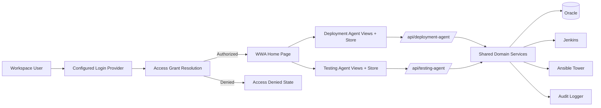

# Detailed Design: Testing Agent

**Date:** 2026-03-31
**Status:** Draft
**Source:** `docs/04-architecture/testing-agent-architecture.md`, `docs/03-spec/testing-agent-spec.md`, `docs/05-design/design.md` (baseline)

---

## Overview

This document translates the Testing Agent architecture into implementation-facing design guidance. Testing Agent adds a thin controller delegation layer on the backend and parameterized frontend components — all existing domain services, entities, repositories, and shared capabilities remain unchanged.



### Design Objective

- Add Testing Agent as the second agent workspace with zero impact on existing Deployment Agent code
- Achieve data isolation through the `Request.agent` column at the controller layer
- Minimize code duplication through shared component extraction and factory patterns
- Validate the multi-agent integration standard with a real second agent

### Relationship to Deployment Agent Design

- The Deployment Agent design document (`design.md`) defines all module designs, state models, validation rules, and integration patterns
- This document covers ONLY the Testing Agent-specific additions
- Where this document is silent, the Deployment Agent design applies unchanged

---

## Design Assumptions

- All Deployment Agent design assumptions carry forward unchanged
- The `Request.agent` column is sufficient for data isolation between agents
- No testing-specific domain logic is required for MVP
- Shared components can be extracted from existing Deployment Agent views without changing their behavior
- Agent identity constants eliminate string literal inconsistencies

---

## Design Scope

### In Scope

1. Backend controller delegation layer for Testing Agent API prefix
2. Agent identity constants
3. Frontend API client, store, and views for Testing Agent
4. Shared component extraction from existing Deployment Agent views
5. Agent registry and router updates
6. Audit logging with agent identification

### Out of Scope

- All items listed as out of scope in the Deployment Agent design
- Testing-specific domain logic, task types, or execution adapters
- Agent-specific access grants or role definitions
- Testing-specific Excel template fields

### Design Boundaries

- Testing Agent controllers delegate to shared services — no domain logic in controllers
- Frontend Testing Agent views delegate to shared components — no duplicated view logic
- Data isolation is a query-time concern at the controller/API layer, not a persistence-layer concern

---

## Module Design

### Module 1: Agent Identity Constants

**Responsibilities**
- Define agent identity strings as constants for both backend and frontend
- Prevent typos and inconsistencies across codebase

**Backend Design**

File: `src/main/java/com/wwa/deploymentagent/contracts/AgentId.java`

```java
public final class AgentId {
    public static final String DEPLOYMENT_AGENT = "deployment-agent";
    public static final String TESTING_AGENT = "testing-agent";

    private AgentId() {}
}
```

**Frontend Design**

File: `frontend/src/config/agentId.ts`

```typescript
export const AGENT_ID = {
  DEPLOYMENT: 'deployment-agent',
  TESTING: 'testing-agent',
} as const

export type AgentIdValue = typeof AGENT_ID[keyof typeof AGENT_ID]
```

**Internal Design Concerns**
- All controller annotations, service calls, and frontend API calls must reference these constants
- String literals for agent identity should not appear outside these constant files

---

### Module 2: Testing Agent Controllers (Backend)

**Responsibilities**
- Expose REST endpoints under `/api/testing-agent/`
- Inject `agent = "testing-agent"` on all write operations and list filters
- Delegate all domain logic to existing services
- Apply the same security annotations as Deployment Agent controllers

**Controller Design**

#### TestingAgentReleaseFlowController

File: `src/main/java/com/wwa/deploymentagent/web/controller/TestingAgentReleaseFlowController.java`

```
@RestController
@RequestMapping("/api/testing-agent/release-flows")
```

| Method | Path | Behavior |
|---|---|---|
| GET | `/` | Delegates to `ReleaseFlowService.listStitchedSummaries()` with `agent = TESTING_AGENT`. If caller provides an `agent` filter, it is overridden to `TESTING_AGENT`. |
| GET | `/{id}` | Delegates to `ReleaseFlowService.findByIdWithFullHierarchy()`. Response includes all requests but frontend displays only testing-agent requests. |

**Design Note:** The list endpoint MUST always enforce `agent = TESTING_AGENT` regardless of query parameters. This prevents data leakage from one agent to another through parameter manipulation.

#### TestingAgentUploadController

File: `src/main/java/com/wwa/deploymentagent/web/controller/TestingAgentUploadController.java`

```
@RestController
@RequestMapping("/api/testing-agent/upload")
```

| Method | Path | Behavior |
|---|---|---|
| POST | `/` | Delegates to `ImportService.importExcel()` with `agent = TESTING_AGENT` injected into the import context. The agent value is set on the created `Request` entity, not passed to the Excel parser. |
| GET | `/template` | Returns the same static template file as the deployment agent upload controller. |

**Design Note:** The upload endpoint overrides any `agent` value provided by the client to ensure data integrity. The `ImportService` already accepts agent as a parameter.

#### TestingAgentTaskController

File: `src/main/java/com/wwa/deploymentagent/web/controller/TestingAgentTaskController.java`

```
@RestController
@RequestMapping("/api/testing-agent/tasks")
```

| Method | Path | Behavior |
|---|---|---|
| PUT | `/{id}/input` | Delegates to `TaskService.updateInput()`. No agent scoping needed — task inherits agent from parent request. |
| GET | `/{id}/executions` | Delegates to `TaskExecutionHistoryService.findByTaskId()`. |
| POST | `/{id}/start-manual` | Delegates to `TaskService.startManual()`. |
| POST | `/{id}/record-result` | Delegates to `RecordResultService.recordResult()`. Audit entry tagged with `agentName = TESTING_AGENT`. |
| POST | `/{id}/submit-auto` | Delegates to `AutoExecutionService.submitAuto()`. Audit entry tagged with `agentName = TESTING_AGENT`. |
| POST | `/{id}/decision` | Delegates to `DecisionEngine.applyDecision()`. Audit entry tagged with `agentName = TESTING_AGENT`. |

**Design Note:** Task-level endpoints do not need agent filtering because tasks are always accessed by ID and inherit their agent context from their parent request. The audit logger receives the agent name from the controller context.

**Internal Design Concerns**
- Controllers must NOT contain any business logic — pure delegation only
- Security annotations (`@PreAuthorize`) must match the corresponding Deployment Agent controllers exactly
- `UserContext` is resolved from the session the same way as Deployment Agent
- Optimistic locking (`@Version`) applies unchanged through the shared entities
- Error responses (400, 403, 404, 409) follow the same patterns as Deployment Agent

---

### Module 3: Audit Agent Identification

**Responsibilities**
- Ensure all audit log entries created through Testing Agent include `agentName = "testing-agent"`

**Design**

The existing `AuditLoggerService` accepts context parameters including agent identification. Testing Agent controllers pass `AgentId.TESTING_AGENT` as the agent context when calling audit-related service methods.

**Audit Entry Fields**

| Field | Value for Testing Agent |
|---|---|
| `operator_id` | From `UserContext` (same as Deployment Agent) |
| `action_type` | Same action types as Deployment Agent |
| `agent` | `"testing-agent"` |
| `application` | From request scope (same as Deployment Agent) |
| `snow_group` | From request scope (same as Deployment Agent) |
| `context_payload` | Same structure as Deployment Agent |

**Audit Log Filtering**

The existing `GET /audit-logs` endpoint already supports filtering. To enable agent-based filtering:

- The `agent` field on `AuditLogEntry` is already populated by the existing audit service
- No changes to the audit query interface are required
- Frontend Audit Log view can add an agent filter dropdown if desired (optional enhancement)

---

### Module 4: Frontend API Client

**Responsibilities**
- Provide axios instances configured for `/api/testing-agent`
- Create API function modules that mirror the deployment agent API

**Design**

#### API Client

File: `frontend/src/api/testingAgentClient.ts`

```typescript
import axios from 'axios'

const testingAgentClient = axios.create({
  baseURL: '/api/testing-agent',
  withCredentials: true,
})

// Same 401 redirect interceptor as deployment agent client
testingAgentClient.interceptors.response.use(
  response => response,
  error => {
    if (error.response?.status === 401) {
      window.location.href = '/login'
    }
    return Promise.reject(error)
  }
)

export default testingAgentClient
```

#### API Factory Pattern (Recommended)

File: `frontend/src/api/agentApiFactory.ts`

To avoid duplicating API function modules, extract a factory that accepts an axios client:

```typescript
import type { AxiosInstance } from 'axios'

export function createReleaseFlowApi(client: AxiosInstance) {
  return {
    list: (params?: Record<string, string>) =>
      client.get('/release-flows', { params }),
    getById: (id: string) =>
      client.get(`/release-flows/${id}`),
  }
}

export function createUploadApi(client: AxiosInstance) {
  return {
    upload: (formData: FormData) =>
      client.post('/upload', formData),
    downloadTemplate: () =>
      client.get('/upload/template', { responseType: 'blob' }),
  }
}

export function createTaskApi(client: AxiosInstance) {
  return {
    updateInput: (id: string, input: unknown) =>
      client.put(`/tasks/${id}/input`, input),
    getExecutions: (id: string) =>
      client.get(`/tasks/${id}/executions`),
    startManual: (id: string) =>
      client.post(`/tasks/${id}/start-manual`),
    recordResult: (id: string, result: unknown) =>
      client.post(`/tasks/${id}/record-result`, result),
    submitAuto: (id: string) =>
      client.post(`/tasks/${id}/submit-auto`),
    applyDecision: (id: string, decision: unknown) =>
      client.post(`/tasks/${id}/decision`, decision),
  }
}
```

Both agents then instantiate the same factory with their own client:

```typescript
// Deployment Agent
import client from './client'
export const releaseFlowApi = createReleaseFlowApi(client)

// Testing Agent
import testingAgentClient from './testingAgentClient'
export const testingAgentReleaseFlowApi = createReleaseFlowApi(testingAgentClient)
```

---

### Module 5: Frontend Store

**Responsibilities**
- Provide a dedicated Pinia store for Testing Agent release flow state
- Prevent state collision between agent workspaces

**Design**

#### Store Factory Pattern

File: `frontend/src/stores/agentReleaseFlowFactory.ts`

```typescript
import { defineStore } from 'pinia'
import type { ReleaseFlowApi, UploadApi, TaskApi } from '@/api/agentApiFactory'

export function createAgentReleaseFlowStore(
  storeId: string,
  api: { releaseFlow: ReleaseFlowApi; upload: UploadApi; task: TaskApi }
) {
  return defineStore(storeId, {
    // Same state, getters, and actions as useReleaseFlowStore
    // but using the injected API functions
  })
}
```

#### Store Instances

File: `frontend/src/stores/testingAgentReleaseFlow.ts`

```typescript
import { createAgentReleaseFlowStore } from './agentReleaseFlowFactory'
import { testingAgentReleaseFlowApi, testingAgentUploadApi, testingAgentTaskApi } from '@/api/testingAgent'

export const useTestingAgentReleaseFlowStore = createAgentReleaseFlowStore(
  'testingAgentReleaseFlow',
  {
    releaseFlow: testingAgentReleaseFlowApi,
    upload: testingAgentUploadApi,
    task: testingAgentTaskApi,
  }
)
```

**Internal Design Concerns**
- Each store instance manages its own loading, error, pagination, and selected release flow state
- Navigating between agents does not reset the other agent's store (unless explicitly cleared)
- The store factory must support all state, getters, and actions currently in `useReleaseFlowStore`

---

### Module 6: Frontend Views and Shared Components

**Responsibilities**
- Display Testing Agent workspace with the same UI as Deployment Agent
- Extract shared components to eliminate view duplication

**Design**

#### Shared Component Extraction

The existing `ReleaseFlowSummaryView.vue` and `ReleaseFlowDetailView.vue` are refactored into shared components that accept agent-specific configuration as props.

**AgentSummaryView.vue**

File: `frontend/src/components/AgentSummaryView.vue`

Props:
```typescript
{
  agentId: string           // 'deployment-agent' | 'testing-agent'
  agentName: string         // 'Deployment Agent' | 'Testing Agent'
  agentDescription: string  // Page introduction text
  store: StoreInstance      // The agent's Pinia store
  detailRouteName: string   // 'wwa-deployment-agent-detail' | 'wwa-testing-agent-detail'
}
```

Responsibilities:
- Page header with agent name and description
- Filter area (Project, Release ID, Stage, Status)
- Release Flow summary table
- Upload dialog (passes `agentId` to the upload API)
- Row click navigates to `detailRouteName` with the selected flow ID

**AgentDetailView.vue**

File: `frontend/src/components/AgentDetailView.vue`

Props:
```typescript
{
  agentId: string           // 'deployment-agent' | 'testing-agent'
  agentName: string         // 'Deployment Agent' | 'Testing Agent'
  store: StoreInstance      // The agent's Pinia store
  summaryRouteName: string  // 'wwa-deployment-agent' | 'wwa-testing-agent'
}
```

Responsibilities:
- Release Flow detail header with breadcrumb showing agent name
- Stage tabs and rundown information panel
- Task table with all action controls
- All dialog components (RecordResultDialog, TaskEditDialog, DecisionDialog)

#### Thin View Wrappers

After shared component extraction, each agent's view becomes a thin wrapper:

**TestingAgentSummaryView.vue** (~20 lines)

```vue
<template>
  <AgentSummaryView
    :agent-id="AGENT_ID.TESTING"
    agent-name="Testing Agent"
    agent-description="Controlled, human-in-the-loop testing workflow across SIT, UAT, and PROD stages."
    :store="store"
    detail-route-name="wwa-testing-agent-detail"
  />
</template>

<script setup lang="ts">
import AgentSummaryView from '@/components/AgentSummaryView.vue'
import { useTestingAgentReleaseFlowStore } from '@/stores/testingAgentReleaseFlow'
import { AGENT_ID } from '@/config/agentId'

const store = useTestingAgentReleaseFlowStore()
</script>
```

**TestingAgentDetailView.vue** (~20 lines)

```vue
<template>
  <AgentDetailView
    :agent-id="AGENT_ID.TESTING"
    agent-name="Testing Agent"
    :store="store"
    summary-route-name="wwa-testing-agent"
  />
</template>

<script setup lang="ts">
import AgentDetailView from '@/components/AgentDetailView.vue'
import { useTestingAgentReleaseFlowStore } from '@/stores/testingAgentReleaseFlow'
import { AGENT_ID } from '@/config/agentId'

const store = useTestingAgentReleaseFlowStore()
</script>
```

**Refactored Deployment Agent Views** (same pattern)

`ReleaseFlowSummaryView.vue` and `ReleaseFlowDetailView.vue` are refactored to the same thin wrapper pattern, using `useReleaseFlowStore` and Deployment Agent configuration.

**Internal Design Concerns**
- Shared components must not contain agent-specific logic — all differentiation is through props
- Dialog components (`UploadDialog`, `RecordResultDialog`, `TaskEditDialog`, `DecisionDialog`) receive the API client or functions through provide/inject or props
- The extraction must preserve all existing Deployment Agent behavior exactly

---

### Module 7: Agent Registry and Router

**Responsibilities**
- Register Testing Agent in the agent registry
- Add Testing Agent routes to the Vue Router

**Agent Registry Update**

File: `frontend/src/config/agentRegistry.ts`

Add the Testing Agent entry (replacing the existing commented placeholder):

```typescript
{
  key: 'testing-agent',
  name: 'Testing Agent',
  description: 'Controlled, human-in-the-loop testing workflow across SIT, UAT, and PROD stages.',
  route: '/wwa/testing-agent',
  icon: '🧪',
  enabled: true,
  category: 'testing',
}
```

**Router Update**

File: `frontend/src/router/index.ts`

Add two child routes under the `/wwa` parent:

```typescript
{
  path: 'testing-agent',
  name: 'wwa-testing-agent',
  component: () => import('@/views/TestingAgentSummaryView.vue'),
  meta: { section: 'testing-agent', sectionTitle: 'Testing Agent' },
},
{
  path: 'testing-agent/release-flows/:id',
  name: 'wwa-testing-agent-detail',
  component: () => import('@/views/TestingAgentDetailView.vue'),
  meta: { section: 'testing-agent', sectionTitle: 'Testing Agent' },
}
```

---

## API / Interface Design

### Testing Agent API Contracts

All Testing Agent endpoints mirror Deployment Agent contracts. The only differences are:

1. **URL prefix:** `/api/testing-agent/` instead of `/api/deployment-agent/`
2. **Agent injection:** `agent = "testing-agent"` is injected server-side
3. **Agent filtering:** List endpoints enforce `agent = "testing-agent"`

#### Request / Response Shapes

All request and response shapes are identical to Deployment Agent. No new DTOs are needed.

#### Error Behavior

Same error codes and messages as Deployment Agent:
- `400` — bad request shape
- `401` — unauthenticated
- `403` — unauthorized (permission or access grant)
- `404` — entity not found
- `409` — invalid state transition or optimistic locking conflict
- `422` — import validation failure

---

## Data Design

### No New Entities

Testing Agent uses the same 7 entities. No schema changes, no new tables, no migrations.

### Agent Column Behavior

| Agent Workspace | Upload Behavior | List Behavior | Detail Behavior |
|---|---|---|---|
| Deployment Agent | Sets `Request.agent = "deployment-agent"` | Shows all flows (including null agent legacy data) | No agent restriction |
| Testing Agent | Sets `Request.agent = "testing-agent"` | Shows only flows with testing-agent requests | No agent restriction on detail |

### Cross-Agent Release Flow

When the same project is uploaded through both agents:
- One `ReleaseFlow` entity exists (grouped by `projectId`)
- Two or more `Request` entities exist with different `agent` values
- Each agent's summary shows the flow but derives stage status only from its own requests
- The detail view includes all requests but the frontend filters display by agent

### State Models

All state models from the Deployment Agent design apply unchanged:
- Task status transitions
- Request status aggregation
- Flow status aggregation
- Access Grant status lifecycle

---

## UI / User Flow Design

### 1. WWA Home Page

- Testing Agent card appears alongside Deployment Agent card
- Card displays: icon (🧪), name ("Testing Agent"), description, click-to-enter
- Card rendering is driven by `agentRegistry.ts` — no shell code changes

### 2. Sidebar Flyout

- Testing Agent appears as a level-2 entry under WWA
- Flyout rendering is driven by `agentRegistry.ts` — no shell code changes

### 3. Testing Agent Summary

- Same layout as Deployment Agent summary
- Page title: "Testing Agent"
- Page description: testing-specific introductory text
- Summary table shows only release flows with `agent = "testing-agent"` requests
- Upload dialog defaults `agent` to `"testing-agent"`

### 4. Testing Agent Detail

- Same layout as Deployment Agent detail
- Breadcrumb: WWA > Testing Agent > Release Flow
- Stage tabs, rundown panel, task table — all identical to Deployment Agent
- All task actions available with same state-based behavior

### 5. Navigation Between Agents

- User can switch between Deployment Agent and Testing Agent via sidebar flyout or WWA Home
- Each agent maintains its own store state independently
- Switching agents does not clear the other agent's state

---

## Workflow / Execution Design

### Testing Agent Workflow

The Testing Agent workflow is identical to the Deployment Agent workflow. All flows defined in `design.md` sections 1–7 apply without modification:

1. **Product Entry Authorization** — same deny-by-default flow
2. **Upload and Import** — same flow with `agent = "testing-agent"` injected
3. **MANUAL Task Execution** — same flow
4. **AUTO Task Execution** — same flow
5. **Review and Progression** — same flow
6. **Archive / Restore / Purge** — same flow
7. **Dependency Handling** — same flow

The only difference is that audit entries include `agentName = "testing-agent"`.

---

## Security / Audit / Reliability Design

### Access Control

- Same session-based authentication
- Same deny-by-default Access Grants
- Same scope-based visibility (`Application + SNOW Group`)
- Testing Agent controllers use the same `@PreAuthorize` annotations

### Agent Isolation Security

- Testing Agent list endpoints MUST override any client-supplied `agent` parameter to `"testing-agent"`
- This prevents cross-agent data leakage through parameter manipulation
- Task-level endpoints do not need agent validation because tasks are accessed by ID and inherit agent from parent request

### Audit Design

- All Testing Agent actions produce audit entries with `agent = "testing-agent"`
- Audit entries are stored in the same `DA_AUDIT_LOG_ENTRY` table
- The shared Audit Log view shows entries from both agents
- Agent-based filtering is supported through the existing `agent` field

### Reliability

- Same optimistic locking protection
- Same atomic import behavior
- Same bounded network timeouts for Jenkins/Ansible

---

## Validation and Error Handling

All validation and error handling from the Deployment Agent design applies unchanged:
- Login and access grant validation
- Upload and import validation
- Task state transition validation
- Configuration validation
- Integration failure handling

Testing Agent controllers add one validation concern:
- The `agent` parameter on upload is always overridden to `"testing-agent"` server-side, regardless of client input

---

## Testing Considerations

### Key Test Areas

1. **Testing Agent controller delegation** — verify each endpoint correctly delegates to the underlying service
2. **Agent tagging on upload** — verify `Request.agent = "testing-agent"` after upload through Testing Agent
3. **Agent-scoped filtering** — verify Testing Agent list returns only testing-agent data
4. **Data isolation** — verify Deployment Agent list does NOT show testing-agent-only flows
5. **Cross-agent release flows** — verify both agents see the same flow but show agent-specific stage status
6. **Legacy data visibility** — verify null-agent data is NOT visible in Testing Agent
7. **Audit agent identification** — verify audit entries include `agentName = "testing-agent"`
8. **Security** — verify agent parameter override prevents cross-agent data leakage
9. **Frontend routing** — verify `/wwa/testing-agent` loads the correct view
10. **Frontend store isolation** — verify navigating between agents does not corrupt state

### Test File Structure

```
src/test/java/com/wwa/deploymentagent/web/controller/
├── TestingAgentReleaseFlowControllerTest.java  ← NEW
├── TestingAgentUploadControllerTest.java       ← NEW
├── TestingAgentTaskControllerTest.java         ← NEW
└── TestingAgentDataIsolationTest.java          ← NEW (cross-agent integration test)
```

### Critical Integration Test Scenarios

1. Upload via Testing Agent → list via Testing Agent → flow appears
2. Upload via Testing Agent → list via Deployment Agent → flow does NOT appear (unless Deployment Agent data also exists)
3. Upload same project via both agents → each agent sees only its own requests
4. Decision via Testing Agent → audit entry has `agentName = "testing-agent"`

---

## Implementation Sequence

### Phase 1: Backend Foundation (No Frontend Changes)

1. Create `AgentId.java` constants
2. Create `TestingAgentReleaseFlowController`
3. Create `TestingAgentUploadController`
4. Create `TestingAgentTaskController`
5. Write controller tests and data isolation tests

### Phase 2: Frontend Foundation

6. Create `agentId.ts` constants
7. Create `testingAgentClient.ts`
8. Create `agentApiFactory.ts` and Testing Agent API modules
9. Create `agentReleaseFlowFactory.ts` and Testing Agent store

### Phase 3: Shared Component Extraction

10. Extract `AgentSummaryView.vue` from `ReleaseFlowSummaryView.vue`
11. Extract `AgentDetailView.vue` from `ReleaseFlowDetailView.vue`
12. Refactor Deployment Agent views to thin wrappers
13. Verify Deployment Agent behavior is unchanged

### Phase 4: Testing Agent Views and Routing

14. Create `TestingAgentSummaryView.vue` (thin wrapper)
15. Create `TestingAgentDetailView.vue` (thin wrapper)
16. Update `agentRegistry.ts` — enable Testing Agent
17. Update `router/index.ts` — add Testing Agent routes
18. End-to-end verification

### Verification Gates

After each phase:
- `mvn test` — all existing + new tests pass
- `cd frontend && npm run build` — frontend compiles without errors
- Manual smoke test of Deployment Agent — no regression
